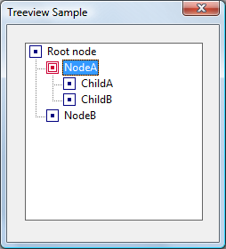
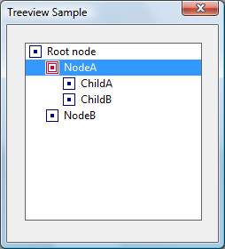

# About Tree-View Controls

A tree-view control is a window that displays a hierarchical list of items, such as the headings in a document, the entries in an index, or the files and directories on a disk. Each item consists of a label and an optional bitmapped image, and each item can have a list of subitems associated with it. By clicking an item, the user can expand or collapse the associated list of subitems.

The following illustration shows a simple tree-view control with a root node, an expanded node, and a collapsed node. The control uses one bitmap for the selected item and another bitmap for other items.

After creating a tree-view control, you add, remove, arrange, or otherwise manipulate items by sending messages to the control. Each message has one or more corresponding macros that you can use instead of sending the message explicitly.

The following topics are discussed in this section.

-   [Tree-View Styles](#tree-view-styles)
-   [Parent and Child Items](#parent-and-child-items)
-   [Item Labels](#item-labels)
-   [Tree-View Label Editing](#tree-view-label-editing)
-   [Tree-View Item Position](#tree-view-item-position)
-   [Tree-View Item States Overview](#tree-view-item-states-overview)
-   [Item Selection](#item-selection)
-   [Item Information](#item-information)
-   [Tree-View Image Lists](#tree-view-image-lists)
-   [Drag-and-Drop Operations](#drag-and-drop-operations)
-   [Tree-View Control Notification Messages](#tree-view-control-notification-messages)
-   [Default Tree-View Control Message Processing](#default-tree-view-control-message-processing)
-   [Related topics](#related-topics)

## Tree-View Styles

Tree-view styles govern aspects of a tree-view control's appearance. You set the initial styles when you create the tree-view control. You can retrieve and change the styles after creating the tree-view control by using the [**GetWindowLong**](/windows/desktop/api/winuser/nf-winuser-getwindowlonga) and [**SetWindowLong**](/windows/desktop/api/winuser/nf-winuser-setwindowlonga) functions.

The [**TVS\_HASLINES**](tree-view-control-window-styles.md) style enhances the graphic representation of a tree-view control's hierarchy by drawing lines that link child items to their parent item, as shown in the following illustration.

By itself, this style does not draw lines at the root of the hierarchy. To do so, you need to combine the [**TVS\_HASLINES**](tree-view-control-window-styles.md) and [**TVS\_LINESATROOT**](tree-view-control-window-styles.md) styles. The result is shown in the following illustration.

The user can expand or collapse a parent item's list of child items by double-clicking the parent item. A tree-view control that has the [**TVS\_HASBUTTONS**](tree-view-control-window-styles.md) style adds a button to the left side of each parent item. The user can click the button once instead of double-clicking the parent item to expand or collapse the child. **TVS\_HASBUTTONS** does not add buttons to items at the root of the hierarchy. To do so, you must combine [**TVS\_HASLINES**](tree-view-control-window-styles.md), [**TVS\_LINESATROOT**](tree-view-control-window-styles.md), and **TVS\_HASBUTTONS**. This combination of styles is shown in the following illustration.

The [**TVS\_CHECKBOXES**](tree-view-control-window-styles.md) style creates checkboxes next to each item. If you want to use the checkbox style, you must set the **TVS\_CHECKBOXES** style (with [**SetWindowLong**](/windows/desktop/api/winuser/nf-winuser-setwindowlonga)) after you create the tree-view control and before you populate the tree. Otherwise, the checkboxes might appear unchecked, depending on timing issues. The following illustration shows the checkbox style.

The [**TVS\_FULLROWSELECT**](tree-view-control-window-styles.md) style causes the selection highlight to extend over the full width of the control, not just over the item itself. The following illustration shows this style.

The [**TVS\_EDITLABELS**](tree-view-control-window-styles.md) style makes it possible for the user to edit the labels of tree-view items. For more information about editing labels, see [Tree-View Label Editing](#tree-view-label-editing).

For more information on these and other styles, see [Tree-View Control Window Styles](tree-view-control-window-styles.md).

## Parent and Child Items

Any item in a tree-view control can have a list of subitems—called *child items*—associated with it. An item that has one or more child items is called a *parent item*. A child item is displayed below its parent item and is indented to indicate that it is subordinate to the parent. An item that has no parent appears at the top of the hierarchy and is called a *root item*.

To add an item to a tree-view control, send the [**TVM\_INSERTITEM**](tvm-insertitem.md) message to the control. The message returns a handle to the HTREEITEM type, which uniquely identifies the item. When adding an item, you must specify the handle to the new item's parent item. If you specify **NULL** or the TVI\_ROOT value instead of a parent item handle in the [**TVINSERTSTRUCT**](/windows/win32/api/commctrl/ns-commctrl-tvinsertstructa) structure, the item is added as a root item.

At any given time, the state of a parent item's list of child items can be either expanded or collapsed. When the state is expanded, the child items are displayed below the parent item. When it is collapsed, the child items are not displayed. The list automatically toggles between the expanded and collapsed states when the user double-clicks the parent item or, if the parent has the [**TVS\_HASBUTTONS**](tree-view-control-window-styles.md) style, when the user clicks the button associated with the parent item. An application can expand or collapse the child items by using the [**TVM\_EXPAND**](tvm-expand.md) message.

A tree-view control sends the parent window a [TVN\_ITEMEXPANDING](tvn-itemexpanding.md) notification message when a parent item's list of child items is about to be expanded or collapsed. The notification gives an application the opportunity to prevent the change or to set any attributes of the parent item that depend on the state of the list of child items. After changing the state of the list, the tree-view control sends the parent window a [TVN\_ITEMEXPANDED](tvn-itemexpanded.md) notification message.

When a list of child items is expanded, it is indented relative to the parent item. You can set the amount of indentation by using the [**TVM\_SETINDENT**](tvm-setindent.md) message or retrieve the current amount by using the [**TVM\_GETINDENT**](tvm-getindent.md) message.

A tree-view control uses memory allocated from the heap of the process that creates the tree-view control. The maximum number of items in a tree view is based on the amount of memory available in the heap.

## Item Labels

You typically specify the text of an item's label when adding the item to the tree-view control. The [**TVM\_INSERTITEM**](tvm-insertitem.md) message includes a [**TVITEM**](/windows/win32/api/commctrl/ns-commctrl-tvitema) structure that defines the item's properties, including a string containing the text of the label.

A tree-view control allocates memory for storing each item; the text of the item labels takes up a significant portion of this memory. If your application maintains a copy of the strings in the tree-view control, you can decrease the memory requirements of the control by specifying the LPSTR\_TEXTCALLBACK value in the **pszText** member of [**TVITEM**](/windows/win32/api/commctrl/ns-commctrl-tvitema) instead of passing actual strings to the tree view. Using LPSTR\_TEXTCALLBACK causes the tree-view control to retrieve the text of an item's label from the parent window whenever the item needs to be redrawn. To retrieve the text, the tree-view control sends a [TVN\_GETDISPINFO](tvn-getdispinfo.md) notification message, which includes the address of an [**NMTVDISPINFO**](/windows/win32/api/commctrl/ns-commctrl-nmtvdispinfoa) structure. The parent window must fill the appropriate members of the included structure.

## Tree-View Label Editing

The user can directly edit the labels of items in a tree-view control that has the [**TVS\_EDITLABELS**](tree-view-control-window-styles.md) style. The user begins editing by clicking the label of the item that has the focus. An application begins editing by using the [**TVM\_EDITLABEL**](tvm-editlabel.md) message. The tree-view control notifies the parent window when editing begins and when it is canceled or completed. When editing is completed, the parent window is responsible for updating the item's label, if appropriate.

When label editing begins, a tree-view control sends its parent window a [TVN\_BEGINLABELEDIT](tvn-beginlabeledit.md) notification message. By processing this notification, an application can allow editing of some labels and prevent editing of others. Returning zero allows editing, and returning nonzero prevents it.

When label editing is canceled or completed, a tree-view control sends its parent window a [TVN\_ENDLABELEDIT](tvn-endlabeledit.md) notification message. The *lParam* parameter is the address of an [**NMTVDISPINFO**](/windows/win32/api/commctrl/ns-commctrl-nmtvdispinfoa) structure. The *item* parameter is a [**TVITEM**](/windows/win32/api/commctrl/ns-commctrl-tvitema) structure that identifies the item and includes the edited text. The parent window is responsible for updating the item's label if it wishes to keep the new label. The **pszText** member of **TVITEM** is zero if editing is canceled.

During label editing, typically in response to the [TVN\_BEGINLABELEDIT](tvn-beginlabeledit.md) notification message, you can retrieve the handle to the edit control used for label editing by using the [**TVM\_GETEDITCONTROL**](tvm-geteditcontrol.md) message. You can send the edit control an [**EM\_SETLIMITTEXT**](em-setlimittext.md) message to limit the amount of text a user can enter or subclass the edit control to intercept and discard invalid characters. Note, however, that the edit control is displayed only *after* TVN\_BEGINLABELEDIT is sent.

## Tree-View Item Position

An item's initial position is set when the item is added to the tree-view control by using the [**TVM\_INSERTITEM**](tvm-insertitem.md) message. The message includes a [**TVINSERTSTRUCT**](/windows/win32/api/commctrl/ns-commctrl-tvinsertstructa) structure that specifies the handle to the parent item and the handle to the item after which the new item is to be inserted. The second handle must identify either a child item of the given parent or one of these values: TVI\_FIRST, TVI\_LAST, or TVI\_SORT.

When TVI\_FIRST or TVI\_LAST is specified, the tree-view control places the new item at the beginning or end of the given parent item's list of child items. When TVI\_SORT is specified, the tree-view control inserts the new item into the list of child items in alphabetical order based on the text of the item labels.

You can put a parent item's list of child items in alphabetical order by using the [**TVM\_SORTCHILDREN**](tvm-sortchildren.md) message. The message includes a parameter that specifies whether all levels of child items descending from the given parent item are also sorted in alphabetical order.

The [**TVM\_SORTCHILDRENCB**](tvm-sortchildrencb.md) message allows you to sort child items based on criteria that you define. When you use this message, you specify an application-defined callback function that the tree-view control can call whenever the relative order of two child items needs to be decided. The callback function receives two 32-bit application-defined values for the items being compared and a third 32-bit value that you specify when sending **TVM\_SORTCHILDRENCB**.

## Tree-View Item States Overview

Each item in a tree-view control has a current state. The state information for each item includes a set of bit flags as well as image list indexes that indicate the item's state image and overlay image. The bit flags indicate whether the item is selected, disabled, expanded, and so on. For the most part, a tree-view control automatically sets an item's state to reflect user actions, such as selection of an item. However, you can also set an item's state by using the [**TVM\_SETITEM**](tvm-setitem.md) message, and you can retrieve the current state of an item by using the [**TVM\_GETITEM**](tvm-getitem.md) message. For a complete list of item states, see [Tree-View Control Item States](tree-view-control-item-states.md).

An item's current state is specified by the **state** member of the [**TVITEM**](/windows/win32/api/commctrl/ns-commctrl-tvitema) structure. A tree-view control might change an item's state to reflect a user action, such as selecting the item or setting the focus to the item. In addition, an application might change an item's state to disable or hide the item or to specify an overlay image or state image.

When you specify or change an item's state, the **statemask** member of [**TVITEM**](/windows/win32/api/commctrl/ns-commctrl-tvitema) specifies which state bits to set, and the **state** member contains the new values for those bits.

To set an item's overlay image, **statemask** must include the [**TVIS\_OVERLAYMASK**](tree-view-control-item-states.md) value, and **state** must include the one-based index of the overlay image shifted left 8 bits by using the [**INDEXTOOVERLAYMASK**](/windows/desktop/api/Commctrl/nf-commctrl-indextooverlaymask) macro. The index can be zero to specify no overlay image.

A state image is displayed next to an item's icon to indicate an application-defined state. State images are contained in a *state image list* that is specified by sending a [**TVM\_SETIMAGELIST**](tvm-setimagelist.md) message. To set an item's state image, include the [**TVIS\_STATEIMAGEMASK**](tree-view-control-item-states.md) value in the **statemask** member of the [**TVITEM**](/windows/win32/api/commctrl/ns-commctrl-tvitema) structure. Bits 12 through 15 of the structure's **state** member specify the index in the state image list of the image to be drawn.

To set the state image index, use [**INDEXTOSTATEIMAGEMASK**](/windows/desktop/api/Commctrl/nf-commctrl-indextostateimagemask). This macro takes an index, and sets bits 12 through 15 appropriately. To indicate that the item has no state image, set the index to zero. This convention means that image zero in the state image list cannot be used as a state image. To isolate bits 12 through 15 of the **state** member, use the [**TVIS\_STATEIMAGEMASK**](tree-view-control-item-states.md) mask. For more information about overlay and state images, see [Tree-View Image Lists](#tree-view-image-lists).

## Item Selection

A tree-view control notifies the parent window when the selection changes from one item to another by sending the [TVN\_SELCHANGING](tvn-selchanging.md) and [TVN\_SELCHANGED](tvn-selchanged.md) notification messages. Both notifications include a value that specifies whether the change is the result of a mouse click or a keystroke. The notifications also include information about the item that is gaining the selection and the item that is losing the selection. You can use this information to set item attributes that depend on the selection state of the item. Returning **TRUE** in response to TVN\_SELCHANGING prevents the selection from changing, and returning **FALSE** allows the change.

An application can change the selection by sending the [**TVM\_SELECTITEM**](tvm-selectitem.md) message.

## Item Information

Tree-view controls support a number of messages that retrieve information about items in the control.

The [**TVM\_GETITEM**](tvm-getitem.md) message can retrieve an item's handle and attributes. An item's attributes include its current state, the indexes in the control's image list of the item's selected and nonselected bitmapped images, a flag that indicates whether the item has child items, the address of the item's label string, and the item's application-defined 32-bit value.

The [**TVM\_GETNEXTITEM**](tvm-getnextitem.md) message retrieves the tree-view item that bears the specified relationship to the current item. The message can retrieve an item's parent, the next or previous visible item, the first child item, and so on.

The [**TVM\_GETITEMRECT**](tvm-getitemrect.md) message retrieves the bounding rectangle for a tree-view item. The [**TVM\_GETCOUNT**](tvm-getcount.md) and [**TVM\_GETVISIBLECOUNT**](tvm-getvisiblecount.md) messages retrieve a count of the items in a tree-view control and a count of the items that can be fully visible in the tree-view control's window, respectively. You can ensure that a particular item is visible by using the [**TVM\_ENSUREVISIBLE**](tvm-ensurevisible.md) message.

## Tree-View Image Lists

Each item in a tree-view control can have four bitmapped images associated with it.

-   An image, such as an open folder, displayed when the item is selected.
-   An image, such as a closed folder, displayed when the item is not selected.
-   An overlay image that is drawn transparently over the selected or nonselected image.
-   A state image, which is an additional image displayed to the left of the selected or nonselected image. You can use state images, such as checked and cleared check boxes, to indicate application-defined item states.

By default, a tree-view control does not display item images. To display item images, you must create image lists and associate them with the control. For more information about image lists, see [Image Lists](image-lists.md).

A tree-view control can have two image lists: a normal image list and a state image list. A normal image list stores the selected, nonselected, and overlay images. A state image list stores state images. Use the [**ImageList\_Create**](/windows/desktop/api/Commctrl/nf-commctrl-imagelist_create) function to create an image list, and use other image list functions to add bitmaps to the image list. Then, to associate the image list with the tree-view control, use the [**TVM\_SETIMAGELIST**](tvm-setimagelist.md) message. The [**TVM\_GETIMAGELIST**](tvm-getimagelist.md) message retrieves a handle to one of a tree-view control's image lists. This message is useful if you need to add more images to the list.

In addition to the selected and nonselected images, a tree-view control's normal image list can contain up to four overlay images. Overlay images are identified by a one-based index and are designed to be drawn transparently over the selected and nonselected images. To assign an overlay mask index to an image in the normal image list, call the [**ImageList\_SetOverlayImage**](/windows/desktop/api/Commctrl/nf-commctrl-imagelist_setoverlayimage) function.

By default, all items display the first image in the normal image list for both the selected and nonselected states. Also, by default, items do not display overlay images or state images. You can change these default behaviors for an item by sending the [**TVM\_INSERTITEM**](tvm-insertitem.md) or [**TVM\_SETITEM**](tvm-setitem.md) message. These messages use the [**TVITEM**](/windows/win32/api/commctrl/ns-commctrl-tvitema) structure to specify image list indexes for an item.

To specify an item's selected and nonselected images, set the TVIF\_SELECTEDIMAGE and TVIF\_IMAGE bits in the **mask** member of the [**TVITEM**](/windows/win32/api/commctrl/ns-commctrl-tvitema) structure and specify indexes from the control's normal image list in the **iSelectImage** and **iImage** members. Alternatively, you can specify the I\_IMAGECALLBACK value in **iSelectImage** and **iImage** instead of specifying indexes. This causes the control to query its parent window for an image list index each time the item is about to be redrawn. The control sends the [TVN\_GETDISPINFO](tvn-getdispinfo.md) notification message to retrieve the index.

To associate an overlay image with an item, use the [**INDEXTOOVERLAYMASK**](/windows/desktop/api/Commctrl/nf-commctrl-indextooverlaymask) macro to specify an overlay mask index in the **state** member of the item's [**TVITEM**](/windows/win32/api/commctrl/ns-commctrl-tvitema) structure. You must also set the [**TVIS\_OVERLAYMASK**](tree-view-control-item-states.md) bits in the **stateMask** member. Overlay mask indexes are one-based; an index of zero indicates that no overlay image was specified.

State images are stored in a separate state image list and identified by their index. To specify the state image list, send a [**TVM\_SETIMAGELIST**](tvm-setimagelist.md) message. Unlike the list-view control, which uses a one-based index to identify state images, tree-view control state images are identified by a zero-based index. However, an index of zero indicates that the item does not have a state image. Consequently, image zero cannot be used as a state image. For further discussion of item states and state images, see [Tree-View Item States Overview](#tree-view-item-states-overview).

## Drag-and-Drop Operations

A tree-view control notifies the parent window when the user starts to drag an item. The parent window receives a [TVN\_BEGINDRAG](tvn-begindrag.md) notification message when the user begins dragging an item with the left mouse button and a [TVN\_BEGINRDRAG](tvn-beginrdrag.md) notification message when the user begins dragging with the right button. You can prevent a tree-view control from sending these notifications by giving the tree-view control the [**TVS\_DISABLEDRAGDROP**](tree-view-control-window-styles.md) style.

You obtain an image to display during a drag operation by using the [**TVM\_CREATEDRAGIMAGE**](tvm-createdragimage.md) message. The tree-view control creates a dragging bitmap based on the label of the item being dragged. Then the tree-view control creates an image list, adds the bitmap to it, and returns the handle to the image list.

You must provide the code that actually drags the item. This typically involves using the dragging capabilities of the image list functions and processing the [**WM\_MOUSEMOVE**](/windows/desktop/inputdev/wm-mousemove) and [**WM\_LBUTTONUP**](/windows/desktop/inputdev/wm-lbuttonup) (or [**WM\_RBUTTONUP**](/windows/desktop/inputdev/wm-rbuttonup)) messages sent to the parent window after the drag operation has begun.

If items in a tree-view control are to be the targets of drag-and-drop operations, you need to know when the mouse pointer is on a target item. You can find out by using the [**TVM\_HITTEST**](tvm-hittest.md) message. You specify the address of a [**TVHITTESTINFO**](/windows/win32/api/commctrl/ns-commctrl-tvhittestinfo) structure that contains the current coordinates of the mouse pointer. When the [**SendMessage**](/windows/desktop/api/winuser/nf-winuser-sendmessage) function returns, the structure contains a flag indicating the location of the mouse pointer relative to the tree-view control. If the pointer is over an item in the tree-view control, the structure contains the handle to the item as well.

You can indicate that an item is the target of a drag-and-drop operation by using the [**TVM\_SETITEM**](tvm-setitem.md) message to set the state to the [**TVIS\_DROPHILITED**](tree-view-control-item-states.md) value. An item that has this state is drawn in the style used to indicate a drag-and-drop target.

## Tree-View Control Notification Messages

A tree-view control sends the following notification messages to its parent window in the form of [**WM\_NOTIFY**](wm-notify.md) messages.

| Notification                                    | Description                                                                            |
|-------------------------------------------------|----------------------------------------------------------------------------------------|
| [TVN\_BEGINDRAG](tvn-begindrag.md)             | Signals the start of a drag-and-drop operation.                                        |
| [TVN\_BEGINLABELEDIT](tvn-beginlabeledit.md)   | Signals the start of in-place label editing.                                           |
| [TVN\_BEGINRDRAG](tvn-beginrdrag.md)           | Signals that the right mouse button has started a drag-and-drop operation.             |
| [TVN\_DELETEITEM](tvn-deleteitem.md)           | Signals the deletion of a specific item.                                               |
| [TVN\_ENDLABELEDIT](tvn-endlabeledit.md)       | Signals the end of label editing.                                                      |
| [TVN\_GETDISPINFO](tvn-getdispinfo.md)         | Requests information that the tree-view control requires to display an item.           |
| [TVN\_ITEMEXPANDED](tvn-itemexpanded.md)       | Signals that a parent item's list of child items was expanded or collapsed.            |
| [TVN\_ITEMEXPANDING](tvn-itemexpanding.md)     | Signals that a parent item's list of child items is about to be expanded or collapsed. |
| [TVN\_KEYDOWN](tvn-keydown.md)                 | Signals a keyboard event.                                                              |
| [TVN\_SELCHANGED](tvn-selchanged.md)           | Signals that the selection has changed from one item to another.                       |
| [TVN\_SELCHANGING](tvn-selchanging.md)         | Signals that the selection is about to be changed from one item to another.            |
| [TVN\_SETDISPINFO](tvn-setdispinfo.md)         | Notifies a parent window that it must update the information it maintains for an item. |

 

## Default Tree-View Control Message Processing

This section describes the window message processing performed by a tree-view control. Messages specific to tree-view controls are discussed in other sections of this document, so they are not included here.

| Message                                            | Processing performed                                                                                                                                                                                                                                                                                                                                                                                                                                                                                                |
|----------------------------------------------------|---------------------------------------------------------------------------------------------------------------------------------------------------------------------------------------------------------------------------------------------------------------------------------------------------------------------------------------------------------------------------------------------------------------------------------------------------------------------------------------------------------------------|
| [**WM\_COMMAND**](/windows/desktop/menurc/wm-command)               | Processes the [EN\_UPDATE](en-update.md) and [EN\_KILLFOCUS](en-killfocus.md) edit control notification messages and forwards all other edit control notifications to the parent window. There is no return value.                                                                                                                                                                                                                                                                                                |
| [**WM\_CREATE**](/windows/desktop/winmsg/wm-create)                 | Allocates memory and initializes internal data structures. It returns zero if successful, or -1 otherwise.                                                                                                                                                                                                                                                                                                                                                                                                          |
| [**WM\_DESTROY**](/windows/desktop/winmsg/wm-destroy)               | Frees all system resources associated with the control. It returns zero.                                                                                                                                                                                                                                                                                                                                                                                                                                            |
| [**WM\_ENABLE**](/windows/desktop/winmsg/wm-enable)                 | Enables or disables the control.                                                                                                                                                                                                                                                                                                                                                                                                                                                                                    |
| [**WM\_ERASEBKGND**](/windows/desktop/winmsg/wm-erasebkgnd)         | Erases the window background using the current background color for the tree-view control. It returns **TRUE**.                                                                                                                                                                                                                                                                                                                                                                                                     |
| [**WM\_GETDLGCODE**](/windows/desktop/dlgbox/wm-getdlgcode)         | Returns a combination of the DLGC\_WANTARROWS and DLGC\_WANTCHARS values.                                                                                                                                                                                                                                                                                                                                                                                                                                           |
| [**WM\_GETFONT**](/windows/desktop/winmsg/wm-getfont)               | Returns the handle to the current label font.                                                                                                                                                                                                                                                                                                                                                                                                                                                                       |
| [**WM\_HSCROLL**](wm-hscroll.md)                  | Scrolls the tree-view control. It returns **TRUE** if scrolling occurs, or **FALSE** otherwise.                                                                                                                                                                                                                                                                                                                                                                                                                     |
| [**WM\_KEYDOWN**](/windows/desktop/inputdev/wm-keydown)             | Sends the [TVN\_KEYDOWN](tvn-keydown.md) notification message to the parent window for all keys. Sends the [NM\_RETURN (tree view)](nm-return-tree-view-.md) notification message when the user presses the ENTER key. It moves the caret when the user presses the direction keys or the PAGE UP, PAGE DOWN, HOME, END, or BACKSPACE key. It scrolls the tree-view control when the user presses the CTRL key in combination with those keys. It returns **TRUE** if a key is processed, or **FALSE** otherwise. |
| [**WM\_KILLFOCUS**](/windows/desktop/inputdev/wm-killfocus)         | Repaints the focused item, if any, and sends an [NM\_KILLFOCUS (tree view)](nm-killfocus-tree-view.md) notification message to the parent window.                                                                                                                                                                                                                                                                                                                                                                  |
| [**WM\_LBUTTONDBLCLK**](/windows/desktop/inputdev/wm-lbuttondblclk) | Cancels label editing and, if an item was double-clicked, sends the [NM\_DBLCLK (tree view)](nm-dblclk-tree-view.md) notification message to the parent window. If the parent window returns 0, the tree-view control toggles the expanded state of the item, sending the parent window the [TVN\_ITEMEXPANDING](tvn-itemexpanding.md) and [TVN\_ITEMEXPANDED](tvn-itemexpanded.md) notification messages. There is no return value.                                                                             |
| [**WM\_LBUTTONDOWN**](/windows/desktop/inputdev/wm-lbuttondown)     | Toggles the expanded state if the user clicked the button associated with a parent item. If the user clicked an item label, the tree-view control selects and sets the focus to the item. If the user moves the mouse before releasing the mouse button, the tree-view control begins a drag-and-drop operation. There is no return value.                                                                                                                                                                          |
| [**WM\_PAINT**](/windows/desktop/gdi/wm-paint)                      | Paints the invalid region of the tree-view control. It returns zero. If the *wParam* parameter is non-**NULL**, the control assumes that the value is a handle to a device context (HDC) and paints using that device context.                                                                                                                                                                                                                                                                                      |
| [**WM\_RBUTTONDOWN**](/windows/desktop/inputdev/wm-rbuttondown)     | Checks to see if an item was clicked and a drag operation was begun. If the operation has begun, it sends a [TVN\_BEGINRDRAG](tvn-beginrdrag.md) notification message to the parent window and highlights the drop target. Otherwise, it sends an [NM\_RCLICK (tree view)](nm-rclick-tree-view.md) notification message to the parent window. There is no return value.                                                                                                                                           |
| [**WM\_SETFOCUS**](/windows/desktop/inputdev/wm-setfocus)           | Repaints the focused item, if any, and sends an [NM\_SETFOCUS](nm-setfocus.md) notification message to the parent window.                                                                                                                                                                                                                                                                                                                                                                                          |
| [**WM\_SETFONT**](/windows/desktop/winmsg/wm-setfont)               | Saves the specified font handle and repaints the tree-view control using the new font.                                                                                                                                                                                                                                                                                                                                                                                                                              |
| [**WM\_SETREDRAW**](/windows/desktop/gdi/wm-setredraw)              | Sets or clears the redraw flag. The tree-view control is redrawn after the redraw flag is set. It returns zero.                                                                                                                                                                                                                                                                                                                                                                                                     |
| [**WM\_SIZE**](/windows/desktop/winmsg/wm-size)                     | Recomputes internal variables that depend on the size of the tree-view control's client area. It returns **TRUE**.                                                                                                                                                                                                                                                                                                                                                                                                  |
| [**WM\_STYLECHANGED**](/windows/desktop/winmsg/wm-stylechanged)     | Cancels label editing and redraws the tree-view control using the new styles. It returns zero.                                                                                                                                                                                                                                                                                                                                                                                                                      |
| [**WM\_SYSCOLORCHANGE**](/windows/desktop/gdi/wm-syscolorchange)    | Redraws the tree-view control using the new color if the redraw flag is set. There is no return value.                                                                                                                                                                                                                                                                                                                                                                                                              |
| [**WM\_TIMER**](/windows/desktop/winmsg/wm-timer)                   | Begins editing an item label. If the user clicks the label of the focused item, the tree-view control sets a timer instead of entering edit mode immediately. The timer makes it possible for the tree view to avoid entering edit mode if the user double-clicks the label. It returns zero.                                                                                                                                                                                                                       |
| [**WM\_VSCROLL**](wm-vscroll.md)                  | Scrolls the tree-view control. It returns **TRUE** if scrolling occurs, or **FALSE** otherwise.                                                                                                                                                                                                                                                                                                                                                                                                                     |

 

## Related topics

<dl> <dt>

[SAMPLE: CustDTv Illustrates Custom Draw in a TreeView (Q248496)](https://support.microsoft.com/default.aspx?scid=kb;EN-US;q248496)
</dt> </dl>

 

 