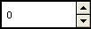

# About Up-Down Controls

An up-down control is a pair of arrow buttons that the user can click to increment or decrement a value, such as a scroll position or a number displayed in a companion control (called a buddy window).

To the user, an up-down control and its buddy window often look like a single control. You can specify that an up-down control automatically position itself next to its buddy window and that it automatically set the caption of the buddy window to its current position. For example, you can use an up-down control with an edit control to prompt the user for numeric input. The following illustration shows an up-down control with an edit control as its buddy window, a combination that is sometimes referred to as a spinner control.

The following topics are discussed in this section.

-   [Up-Down Control Styles](#up-down-control-styles)
-   [Position and Acceleration](#position-and-acceleration)
-   [Default Up-Down Controls Message Processing](#default-up-down-controls-message-processing)

## Up-Down Control Styles

Using window styles, you can manipulate characteristics of an up-down control, such as how it positions itself relative to its buddy window, whether it sets the text of its buddy window, and whether it processes the UP ARROW and DOWN ARROW keys.

An up-down control with the [**UDS\_ALIGNLEFT**](up-down-control-styles.md) or [**UDS\_ALIGNRIGHT**](up-down-control-styles.md) style aligns with the left or right edge of its buddy window. The width of the buddy window is decreased to accommodate the width of the up-down control.

An up-down control with the [**UDS\_SETBUDDYINT**](up-down-control-styles.md) style sets the caption of its buddy window whenever the current position changes. The control inserts a thousands separator between every three digits of a decimal string unless the [**UDS\_NOTHOUSANDS**](up-down-control-styles.md) style is specified. If the buddy window is a list box, an up-down control sets its current selection instead of its caption.

You can specify the [**UDS\_ARROWKEYS**](up-down-control-styles.md) style to provide a keyboard interface for an up-down control. If this style is specified, the control processes the up and down arrow keys. The control also subclasses the buddy window so that it can process these keys when the buddy window has the focus.

If you use an up-down control for horizontal scrolling, you can specify the [**UDS\_HORZ**](up-down-control-styles.md) style. This style causes the up-down control's arrows to point left and right instead of up and down.

By default, the current position does not change if the user attempts to increment it or decrement it beyond the maximum or minimum value. You can change this behavior by using the [**UDS\_WRAP**](up-down-control-styles.md) style, so the position "wraps" to the opposite extreme. For example, incrementing past the upper limit wraps the position back to the lower limit.

## Position and Acceleration

After an up-down control is created, you can change the control's current position, minimum position, and maximum position by sending messages. You can also change the radix base used to display the current position in the buddy window and the rate at which the current position changes when the up or down arrow is clicked.

To retrieve the current position of an up-down control, use the [**UDM\_GETPOS**](udm-getpos.md) message. For an up-down control with a buddy window, the current position is the number in the buddy window's caption. Because the caption may have changed (for example, the user may have edited the text of an edit control), the up-down control retrieves the current caption and updates its current position accordingly.

The buddy window's caption may be either a decimal or hexadecimal string, depending on the radix base (that is, either base 10 or 16) of the up-down control. You can set the radix base by using the [**UDM\_SETBASE**](udm-setbase.md) message and retrieve the radix base by using the [**UDM\_GETBASE**](udm-getbase.md) message.

The [**UDM\_SETPOS**](udm-setpos.md) message sets the current position of a buddy window. Note that unlike a scroll bar, an up-down control automatically changes its current position when the up and down arrows are clicked. An application, therefore, does not need to set the current position when processing the [**WM\_VSCROLL**](wm-vscroll.md) or [**WM\_HSCROLL**](wm-hscroll.md) message.

You can change the minimum and maximum positions of an up-down control by using the [**UDM\_SETRANGE**](udm-setrange.md) message. The maximum position may be less than the minimum, and in that case clicking the up arrow button decreases the current position. To put it another way, up means moving toward the maximum position. To retrieve the minimum and maximum positions for an up-down control, use the [**UDM\_GETRANGE**](udm-getrange.md) message.

You can control the rate at which the position changes when the user holds down an arrow button by setting the up-down control's acceleration. The acceleration is defined by an array of [**UDACCEL**](/windows/desktop/api/Commctrl/ns-commctrl-udaccel) structures. Each structure specifies a time interval and the number of units by which to increment or decrement at the end of that interval. To set the acceleration, use the [**UDM\_SETACCEL**](udm-setaccel.md) message. To retrieve acceleration information, use the [**UDM\_GETACCEL**](udm-getaccel.md) message.

## Default Up-Down Controls Message Processing

This section describes the standard Windows messages processed by an up-down control.

| Message                                        | Processing performed                                                                                                                                                                                         |
|------------------------------------------------|--------------------------------------------------------------------------------------------------------------------------------------------------------------------------------------------------------------|
| [**WM\_CREATE**](/windows/desktop/winmsg/wm-create)             | Allocates and initializes a private data structure and saves its address as window data.                                                                                                                     |
| [**WM\_DESTROY**](/windows/desktop/winmsg/wm-destroy)           | Frees data allocated during [**WM\_CREATE**](/windows/desktop/winmsg/wm-create) processing.                                                                                                                                   |
| [**WM\_ENABLE**](/windows/desktop/winmsg/wm-enable)             | Invalidates the window.                                                                                                                                                                                      |
| [**WM\_KEYDOWN**](/windows/desktop/inputdev/wm-keydown)         | Changes the current position in the case of an UP ARROW or DOWN ARROW key.                                                                                                                                   |
| [**WM\_KEYUP**](/windows/desktop/inputdev/wm-keyup)             | Completes the position change.                                                                                                                                                                               |
| [**WM\_LBUTTONDOWN**](/windows/desktop/inputdev/wm-lbuttondown) | Captures the mouse. If the buddy window is an edit control or list box, it sets the focus to the buddy window. If the mouse is over the up or down button, it begins changing the position and sets a timer. |
| [**WM\_LBUTTONUP**](/windows/desktop/inputdev/wm-lbuttonup)     | Completes the position change and releases the mouse capture if the up-down control has captured the mouse. If the buddy window is an edit control, it selects all the text in the edit control.             |
| [**WM\_PAINT**](/windows/desktop/gdi/wm-paint)                  | Paints the up-down control. If the *wParam* parameter is non-NULL, the control assumes that the value is an **HDC** and paints using that device context.                                                    |
| [**WM\_TIMER**](/windows/desktop/winmsg/wm-timer)               | Changes the current position if the mouse is being held down over a button and a sufficient interval has elapsed.                                                                                            |

 

 

 