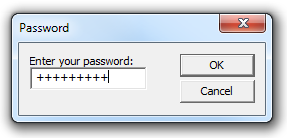

# How to Create a Single Line Edit Control

This topic demonstrates how to create a dialog box that contains a single-line edit control.

The single-line edit control has the [**ES\_PASSWORD**](edit-control-styles.md) style. By default, edit controls with this style display an asterisk for each character that is typed by the user. This example, however, uses the [**EM\_SETPASSWORDCHAR**](em-setpasswordchar.md) message to change the default character from an asterisk to a plus sign (+). The following screen shot shows the dialog box after the user has entered a password.



> [!Note]  
> Comctl32.dll version 6 is not redistributable. To use Comctl32.dll version 6, specify it in a manifest. For more information on manifests, see [Enabling Visual Styles](cookbook-overview.md).

 

## What you need to know

### Technologies

-   [Windows Controls](window-controls.md)

### Prerequisites

-   C/C++
-   Windows User Interface Programming

## Instructions

### Step 1: Create an instance of the password dialog box.

The following C++ code example uses the DialogBox function to create a modal dialog box. The dialog box template **IDD\_PASSWORD** is passed as a parameter. It defines, among other things, the window styles, buttons, and dimensions of the password dialog box.


```C++
DialogBox(hInst,                   // application instance
    MAKEINTRESOURCE(IDD_PASSWORD), // dialog box resource
    hWnd,                          // owner window
    PasswordProc                    // dialog box window procedure
    );
```


### Step 2: Initialize the dialog box and process user input.

The window procedure in the following example initializes the password dialog box and processes notification messages and user input.

During initialization, the window procedure changes the default password character to a **+** sign and sets the default pushbutton to **Cancel**.

During user input processing, the window procedure changes the default push button from **CANCEL** to **OK** as soon as the user enters text in the edit control. If the user presses the **OK** button, the window procedure uses the [**EM\_LINELENGTH**](em-linelength.md) and [**EM\_GETLINE**](em-getline.md) messages to retrieve the text.


```C++
INT_PTR CALLBACK PasswordProc(HWND hDlg, UINT message, WPARAM wParam, LPARAM lParam) 
{ 
    TCHAR lpszPassword[16]; 
    WORD cchPassword; 

    switch (message) 
    { 
        case WM_INITDIALOG: 
            // Set password character to a plus sign (+) 
            SendDlgItemMessage(hDlg, 
                               IDE_PASSWORDEDIT, 
                               EM_SETPASSWORDCHAR, 
                               (WPARAM) '+', 
                               (LPARAM) 0); 

            // Set the default push button to "Cancel." 
            SendMessage(hDlg, 
                        DM_SETDEFID, 
                        (WPARAM) IDCANCEL, 
                        (LPARAM) 0); 

            return TRUE; 

        case WM_COMMAND: 
            // Set the default push button to "OK" when the user enters text. 
            if(HIWORD (wParam) == EN_CHANGE && 
                                LOWORD(wParam) == IDE_PASSWORDEDIT) 
            {
                SendMessage(hDlg, 
                            DM_SETDEFID, 
                            (WPARAM) IDOK, 
                            (LPARAM) 0); 
            }
            switch(wParam) 
            { 
                case IDOK: 
                    // Get number of characters. 
                    cchPassword = (WORD) SendDlgItemMessage(hDlg, 
                                                            IDE_PASSWORDEDIT, 
                                                            EM_LINELENGTH, 
                                                            (WPARAM) 0, 
                                                            (LPARAM) 0); 
                    if (cchPassword >= 16) 
                    { 
                        MessageBox(hDlg, 
                                   L"Too many characters.", 
                                   L"Error", 
                                   MB_OK); 

                        EndDialog(hDlg, TRUE); 
                        return FALSE; 
                    } 
                    else if (cchPassword == 0) 
                    { 
                        MessageBox(hDlg, 
                                   L"No characters entered.", 
                                   L"Error", 
                                   MB_OK); 

                        EndDialog(hDlg, TRUE); 
                        return FALSE; 
                    } 

                    // Put the number of characters into first word of buffer. 
                    *((LPWORD)lpszPassword) = cchPassword; 

                    // Get the characters. 
                    SendDlgItemMessage(hDlg, 
                                       IDE_PASSWORDEDIT, 
                                       EM_GETLINE, 
                                       (WPARAM) 0,       // line 0 
                                       (LPARAM) lpszPassword); 

                    // Null-terminate the string. 
                    lpszPassword[cchPassword] = 0; 

                    MessageBox(hDlg, 
                               lpszPassword, 
                               L"Did it work?", 
                               MB_OK); 

                    // Call a local password-parsing function. 
                    ParsePassword(lpszPassword); 

                    EndDialog(hDlg, TRUE); 
                    return TRUE; 

                case IDCANCEL: 
                    EndDialog(hDlg, TRUE); 
                    return TRUE; 
            } 
            return 0; 
    } 
    return FALSE; 
    
    UNREFERENCED_PARAMETER(lParam); 
}
```


## Related topics

<dl> <dt>

[About Edit Controls](about-edit-controls.md)
</dt> <dt>

[Edit Control Reference](bumper-edit-control-edit-control-reference.md)
</dt> <dt>

[Using Edit Controls](/windows/desktop/Controls/using-edit-controls)
</dt> <dt>

[Edit Control](edit-controls.md)
</dt> </dl>

 

 