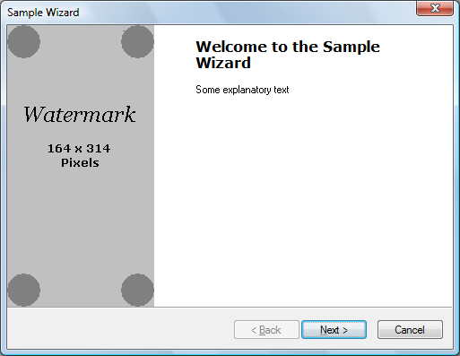
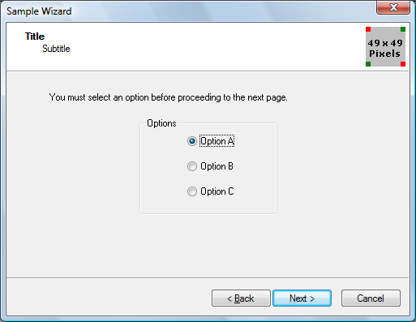
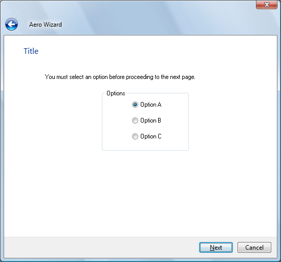

# How to Create Wizards

A wizard is a type of property sheet that provides a simple and powerful way to guide users through a procedure.

Wizards are one of the keys to simplifying the user experience. They allow you to take a complex operation, such as configuration of an application, and break it into a series of simple steps. At each point in the process, you can provide an explanation of what is needed, and display controls that allow the user to make selections and enter text.

A wizard is actually a type of property sheet. A property sheet is essentially a container for a collection of *pages*, where each page is a separate dialog box. Whereas regular property sheets allow the user to access any page at any time, wizards present pages in sequence. Instead of tabs, buttons are used to navigate forward and backward. The order in which pages are displayed is controlled by the application and can be modified based on user input.

There are two main styles of wizard: the older Wizard97 style, and the Aero style introduced in Windows Vista. For illustrations, see [About Property Sheets](property-sheets.md). (A third style, using just the PSH\_WIZARD or PSH\_WIZARD\_LITE flag, presents a simple sequence of property sheets with no headers or watermarks.)

> [!Note]  
> A "watermark" in the context of wizards is a bitmap that appears in the left margin of some pages.

 

The discussion in most of this document assumes that you are implementing a wizard for a system with [version 5.80](common-control-versions.md) or later of the common controls. If you attempt to use the Wizard97 style with earlier versions of the common controls, your application may compile but it will not display properly. For a discussion about how to create a Wizard97-compatible wizard on earlier systems, see Backward Compatible Wizards later in this topic.

## What you need to know

### Technologies

-   [Windows Controls](window-controls.md)

### Prerequisites

-   C/C++
-   Windows User Interface Programming

## Instructions

### Wizard Implementation

Implementing a wizard is similar to implementing a regular property sheet. At the most basic level, it is a matter of setting one of the following flags or combinations of flags in the [**PROPSHEETHEADER**](pss-propsheetheader.md) structure that defines the property sheet.


| Flag                           | Style                                                                                                                                                 |
|--------------------------------|-------------------------------------------------------------------------------------------------------------------------------------------------------|
| PSH\_WIZARD                    | A simple wizard with no headers or bitmaps.                                                                                                           |
| PSH\_WIZARD\_LITE              | Similar to PSH\_WIZARD, with some minor differences in appearance; for example, the divider above the buttons is set to the full width of the window. |
| PSH\_WIZARD97                  | A Wizard97 wizard with (optional) headers, header bitmaps, and watermarks.                                                                            |
| PSH\_WIZARD \| PSH\_AEROWIZARD | An Aero Wizard. Aero Wizards do not use watermarks or header bitmaps. They require the single-threaded apartment (STA) model.                         |


 

The basic procedure for implementing a wizard is as follows:

1.  Create a dialog box template for each page.
2.  Define the pages by creating a [**PROPSHEETPAGE**](pss-propsheetpage.md) structure for each page. This structure defines the page, and contains pointers to the dialog box template and any bitmaps or other resources.
3.  Pass the [**PROPSHEETPAGE**](pss-propsheetpage.md) structure that was created in the previous step to the [**CreatePropertySheetPage**](/windows/desktop/api/Prsht/nf-prsht-createpropertysheetpagea) function to create the page's HPROPSHEETPAGE handle.
4.  Define the wizard by creating a [**PROPSHEETHEADER**](pss-propsheetheader.md) structure for it.
5.  Pass the [**PROPSHEETHEADER**](pss-propsheetheader.md) structure to the [**PropertySheet**](/windows/desktop/api/Prsht/nf-prsht-propertysheeta) function to display the wizard.
6.  Implement dialog box procedures for each page to handle notification messages from the page's controls and the wizard's buttons and to process other Windows messaging.

### Create the Dialog Box Templates

There are two basic types of wizard page: exterior and interior. Exterior pages are the introduction (welcome) and completion pages. All others are interior pages.

**Exterior Page Dialog Box Templates**

The basic layout of the introduction and completion pages is identical. The following illustration shows a sample Wizard97 introduction page, with a placeholder watermark.



For Wizard97 exterior pages, the dialog box template is 317x193 dialog units. It fills all of the wizard, except for the caption and the band at the bottom that contains the **Back**, **Next**, and **Cancel** buttons. The left side of the template, which is reserved for a "watermark" bitmap, should not contain any controls. The watermark is specified in the wizard's [**PROPSHEETHEADER**](pss-propsheetheader.md) structure and is added to the page automatically. You must allow space for it when designing the resource template.

When you create the watermark bitmap, keep in mind that the dialog box may increase in size if, for example, the user chooses a large system font. Different languages also tend to have different font metrics. When the page grows, the area reserved for the watermark gets proportionately larger. However, you cannot change the watermark bitmap, nor is the bitmap stretched to fill the larger area. Instead, the bitmap is left in its original size in the upper-left portion of the reserved area. The part of the larger reserved area that is not covered by the watermark is automatically filled with the color of the bitmap's upper-left pixel.

If you need to have different-sized watermark bitmaps for different font metrics, two possible solutions are:

-   Get the font metrics before creating the wizard, and specify an appropriately sized watermark bitmap.
-   Do not specify a watermark bitmap when you create the wizard. Wizard97 will leave the watermark area blank. Then draw an appropriately sized bitmap on the area reserved for the watermark.

You can place controls in the area to the right of the watermark as you would for a regular dialog box. The background color of this area is determined by the system, and requires no action on your part. You typically put two static controls in this area. The upper one holds the title and uses a large bold font (12 point Verdana Bold for Wizard97). The other one, which is for explanatory text, uses the standard dialog box font.

The main difference between the introduction and completion pages is the wizard buttons and the text in the static controls. Introduction pages normally have a **Next** and a **Back** button, with only the **Next** button enabled. Completion pages have the **Back** button enabled, and the **Next** button is replaced by a **Finish** button.

> [!Note]  
> In Aero Wizards, the **Back** button is replaced by an arrow button in the caption bar.

 

You can modify the text on the **Finish** button by sending the wizard a [**PSM\_SETFINISHTEXT**](psm-setfinishtext.md) message. By default, the **Finish** button does not include a keyboard accelerator. To define a keyboard accelerator, include an ampersand in the text string that you pass to PSM\_SETFINISHTEXT. For instance, "&Finish" defines 'F' as the keyboard accelerator.

**Interior Page Dialog Box Templates**

Interior pages have a somewhat different appearance than exterior pages. The following illustration shows a sample Wizard97 interior page, with a placeholder header bitmap.



The header area at the top of the page is handled by the property sheet, so it is not included in the template. The contents of the header are specified in the page's [**PROPSHEETPAGE**](pss-propsheetpage.md) structure and the wizard's [**PROPSHEETHEADER**](pss-propsheetheader.md) structure. Because the interior page needs to fit between the header and the buttons, the Wizard97 dialog box template is 317x143 dialog units, somewhat smaller than the template for exterior pages.

The following illustration shows an Aero Wizard that was created from the same template.



### Define the Wizard Pages

After you have created the dialog box templates and related resources such as bitmaps and string tables, you can create the property sheet pages. The procedure is similar to that for standard property sheets. First, fill in the appropriate members of a [**PROPSHEETPAGE**](pss-propsheetpage.md) structure. (Some members are specific to wizards.) Then call the [**CreatePropertySheetPage**](/windows/desktop/api/Prsht/nf-prsht-createpropertysheetpagea) function to create the page's HPROPSHEETPAGE handle.

The following wizard-related flags can be set in the **dwFlags** member of the [**PROPSHEETPAGE**](pss-propsheetpage.md) structure.


| Flag                   | Description                                                                                                                         |
|------------------------|-------------------------------------------------------------------------------------------------------------------------------------|
| PSP\_HIDEHEADER        | Set this flag for exterior pages in Wizard97. The header is not shown, and a watermark can be shown.                                |
| PSP\_USEHEADERTITLE    | Set this flag for interior pages to put a title in the header area in Wizard97, or at the top of the client area in an Aero Wizard. |
| PSP\_USEHEADERSUBTITLE | Set this flag for interior pages to put a subtitle in the header area in Wizard97.                                                  |


 

If you have set PSP\_USEHEADERTITLE or PSP\_USEHEADERSUBTITLE, assign the title and subtitle text to the **pszHeaderTitle** and **pszHeaderSubtitle** members, respectively. When you assign text strings to members of the [**PROPSHEETPAGE**](pss-propsheetpage.md) and [**PROPSHEETHEADER**](pss-propsheetheader.md) structures, you can either assign a string pointer or use the **MAKEINTRESOURCE** macro to assign a value from a string resource. The string resource is loaded from the module specified in the **hInstance** member of the wizard's **PROPSHEETHEADER** structure.

When you call [**CreatePropertySheetPage**](/windows/desktop/api/Prsht/nf-prsht-createpropertysheetpagea) to create a page, assign the result to an element of an array of HPROPSHEETPAGE handles. This array is used when creating the property sheet. The array index of a page's handle determines the default order in which it is displayed. After you have created a page's HPROPSHEETPAGE handle, you can reuse the same [**PROPSHEETPAGE**](pss-propsheetpage.md) structure to create the next page by assigning new values to the relevant members.

An alternative way to create pages is to use separate [**PROPSHEETPAGE**](pss-propsheetpage.md) structures for each page, and create an array of structures. This array is used instead of an array of HPROPSHEETPAGE handles when creating the property sheet. Using separate **PROPSHEETPAGE** structures eliminates the need to call [**CreatePropertySheetPage**](/windows/desktop/api/Prsht/nf-prsht-createpropertysheetpagea) but uses more memory. Otherwise, there is no significant difference between the two approaches.

The following example defines an interior Wizard97 page by assigning values to a [**PROPSHEETPAGE**](pss-propsheetpage.md) structure. In this example, the page's title, subtitle, and dialog box template are all identified by their resource IDs. The [**CreatePropertySheetPage**](/windows/desktop/api/Prsht/nf-prsht-createpropertysheetpagea) function is then called to create the page's HPROPSHEETPAGE handle. Because it will be the second page to appear, the handle is assigned to the array of handles, *ahpsp*, with an index of 1.


```C++
// g_hInstance is the global HINSTANCE of the application.
// IntPage1DlgProc is the dialog procedure for this page.
// ahpsp is an array of HPROPSHEETPAGE handles.

PROPSHEETPAGE psp = { sizeof(psp) };

psp.hInstance         = g_hInstance;
psp.dwFlags           = PSP_USEHEADERTITLE | PSP_USEHEADERSUBTITLE;
psp.lParam            = (LPARAM) &wizdata;
psp.pszHeaderTitle    = MAKEINTRESOURCE(IDS_TITLE1);
psp.pszHeaderSubTitle = MAKEINTRESOURCE(IDS_SUBTITLE1);
psp.pszTemplate       = MAKEINTRESOURCE(IDD_INTERIOR1);
psp.pfnDlgProc        = IntPage1DlgProc;

ahpsp[1] = CreatePropertySheetPage(&psp);
```


### Custom Page Data

When you create a page, you can assign custom data to it by using the **lParam** member of the [**PROPSHEETPAGE**](pss-propsheetpage.md) structure, typically by assigning it a pointer to a user-defined structure.

When the page is first selected, its dialog box procedure receives a [**WM\_INITDIALOG**](/windows/desktop/dlgbox/wm-initdialog) message. The message's *lParam* value points to a copy of of the page's [**PROPSHEETPAGE**](pss-propsheetpage.md) structure, from which you can retrieve the custom data. You can then store this data for use in subsequent messages by using [**SetWindowLongPtr**](/windows/desktop/api/winuser/nf-winuser-setwindowlongptra) with GWL\_USERDATA as the index parameter. Multiple pages can have a pointer to the same data, and any change to the data made by one page is available to the other pages in their dialog procedures.

### Define the Wizard Property Sheet

As with ordinary property sheets, you define the wizard's property sheet by filling in members of a [**PROPSHEETHEADER**](pss-propsheetheader.md) structure. This structure allows you to specify the pages that make up the wizard and the default order in which they are displayed, along with several related parameters. You then launch the wizard by calling the [**PropertySheet**](/windows/desktop/api/Prsht/nf-prsht-propertysheeta) function.

In the Wizard97 style, the **pszCaption** member of the [**PROPSHEETHEADER**](pss-propsheetheader.md) structure is ignored. Instead, the wizard displays the caption that is specified in the current page's dialog box template. If the template lacks a caption, the caption from the previous page is displayed. Thus, to display the same caption on all pages, specify the caption in the template for the introductory page.

In the Aero Wizard style, the dialog box caption is taken from **pszCaption**.

If you have created an array of HPROPSHEETPAGE handles for your pages, assign the array to the **phpage** member. If you have instead created an array of [**PROPSHEETPAGE**](pss-propsheetpage.md) structures, assign the array to the **ppsp** member and set the PSH\_PROPSHEETPAGE flag in the **dwFlags** member.

The following example assigns values to *psh*, a [**PROPSHEETHEADER**](pss-propsheetheader.md) structure, and calls the [**PropertySheet**](/windows/desktop/api/Prsht/nf-prsht-propertysheeta) function to launch the wizard. The Wizard97-style wizard has both watermark and header graphics, specified by their resource IDs. The *ahpsp* array contains all the HPROPSHEETPAGE handles and defines the default order in which they are displayed.


```C++
// g_hInstance is the global HINSTANCE of the application.
// ahpsp is an array of HPROPSHEETPAGE handles.

PROPSHEETHEADER psh = { sizeof(psh) };

psh.hInstance      = g_hInstance;
psh.hwndParent     = NULL;
psh.phpage         = ahpsp;
psh.dwFlags        = PSH_WIZARD97 | PSH_WATERMARK | PSH_HEADER;
psh.pszbmWatermark = MAKEINTRESOURCE(IDB_WATERMARK);
psh.pszbmHeader    = MAKEINTRESOURCE(IDB_BANNER);
psh.nStartPage     = 0;
psh.nPages         = 4;

PropertySheet(&psh);
```


### The Dialog Box Procedure

Each page of the wizard needs a dialog box procedure to process Windows messages, particularly notifications from its controls and the wizard. The three messages that almost all wizards must be able to handle are [**WM\_INITDIALOG**](/windows/desktop/dlgbox/wm-initdialog), [**WM\_DESTROY**](/windows/desktop/winmsg/wm-destroy), and [**WM\_NOTIFY**](wm-notify.md).

The [**WM\_NOTIFY**](wm-notify.md) message is received before the page is displayed and when any of the wizard's buttons are clicked. The *lParam* parameter of the message is a pointer to a [**NMHDR**](/windows/desktop/api/richedit/ns-richedit-nmhdr) header structure. The notification's ID is contained in the structure's **code** member. The four notifications that most wizards need to handle are the following.


| Code                                | Description                                 |
|-------------------------------------|---------------------------------------------|
| [PSN\_SETACTIVE](psn-setactive.md) | Sent before the page is displayed.          |
| [PSN\_WIZBACK](psn-wizback.md)     | Sent when the **Back** button is clicked.   |
| [PSN\_WIZNEXT](psn-wiznext.md)     | Sent when the **Next** button is clicked.   |
| [PSN\_WIZFINISH](psn-wizfinish.md) | Sent when the **Finish** button is clicked. |


 

### Handle WM\_INITDIALOG and WM\_DESTROY

When a page is about to be displayed for the first time, its dialog box procedure receives a [**WM\_INITDIALOG**](/windows/desktop/dlgbox/wm-initdialog) message. Handling this message allows the wizard to do any needed initialization tasks, such as storing custom data or setting fonts.

When the property sheet is destroyed, you receive a [**WM\_DESTROY**](/windows/desktop/winmsg/wm-destroy) message. The wizard is automatically destroyed by the system, but handling this message allows you to do any needed cleanup.

### Handle PSN\_SETACTIVE

The [PSN\_SETACTIVE](psn-setactive.md) notification code is sent each time a page is about to be made visible. The first time a page is visited, PSN\_SETACTIVE follows the [**WM\_INITDIALOG**](/windows/desktop/dlgbox/wm-initdialog) message. If the page is subsequently revisited, it receives only a PSN\_SETACTIVE notification. This notification is usually handled to initialize data for the page and enable the appropriate buttons.

By default, the wizard displays **Back**, **Next**, and **Cancel** buttons, with all buttons enabled. To disable a button or display **Finish** instead of **Next**, you must send a [**PSM\_SETWIZBUTTONS**](psm-setwizbuttons.md) message. After this message has been sent, the state of the buttons is preserved until it is modified by another **PSM\_SETWIZBUTTONS** message, even if a new page is selected. Typically, all [PSN\_SETACTIVE](psn-setactive.md) handlers send this message to ensure that each page has the correct button state.

You can change the button state with this message at any time. For example, you may want the **Next** button to be initially disabled. After a user has entered all the necessary information, you can send another [**PSM\_SETWIZBUTTONS**](psm-setwizbuttons.md) message to enable the **Next** button and let the user proceed to the next page.

The following code fragment uses the [**PropSheet\_SetWizButtons**](/windows/desktop/api/Prsht/nf-prsht-propsheet_setwizbuttons) macro to enable the **Back** and **Next** buttons on an interior page before it is displayed.


```C++
case WM_NOTIFY :
    {
        LPNMHDR pnmh = (LPNMHDR)lParam;
        
        switch(pnmh->code)
        {
        
        ...
        
        case PSN_SETACTIVE :
        
            ...
            
            // This is an interior page.
            PropSheet_SetWizButtons(hwnd, PSWIZB_NEXT | PSWIZB_BACK);
            
            ...
        }
    ...
    
    }
```


### Handle PSN\_WIZNEXT, PSNWIZBACK, and PSN\_WIZFINISH

When a **Next** or **Back** button is clicked, you receive a [PSN\_WIZNEXT](psn-wiznext.md) or [PSN\_WIZBACK](psn-wizback.md) notification code. By default, the wizard automatically goes to either the next or previous page in the order that is defined when the property sheet is created. A common reason to handle these notifications is to prevent the user from switching pages, or to override the default page order.

To prevent the user from switching pages, handle the button notification, call the [**SetWindowLong**](/windows/desktop/api/winuser/nf-winuser-setwindowlonga) function with the DWL\_MSGRESULT value set to –1, and return **TRUE**. For example:


```C++
case PSN_WIZNEXT :

        ...
        
        // Do not go to the next page yet.
        SetWindowLong(hwnd, DWL_MSGRESULT, -1);
        
        return TRUE;
        
        ...
```


To override the standard order and go to a particular page, call [**SetWindowLong**](/windows/desktop/api/winuser/nf-winuser-setwindowlonga) with the DWL\_MSGRESULT value set to the page's dialog box resource ID, and return **TRUE**. For example:


```C++
case PSN_WIZNEXT :

        ...
        
        // Go straight to the completion page.
        SetWindowLong(hwnd, DWL_MSGRESULT, IDD_FINISH);
        
        return TRUE;
        
        ...
```


When the **Finish** or **Cancel** button is clicked, you receive a [PSN\_WIZFINISH](psn-wizfinish.md) or [PSN\_RESET](psn-reset.md) notification code, respectively. When either of these buttons is clicked, the wizard is automatically destroyed by the system. However, you can handle these notifications if you need to perform cleanup tasks before the wizard is destroyed. To prevent the wizard from being destroyed when you receive a PSN\_WIZFINISH notification, call [**SetWindowLong**](/windows/desktop/api/winuser/nf-winuser-setwindowlonga) with the DWL\_MSGRESULT value set to **TRUE**, and return **TRUE**. For example:


```C++
case PSN_WIZFINISH :

        ...
        
        // Not finished yet.
        SetWindowLong(hwnd, DWL_MSGRESULT, TRUE);
        
        return TRUE;
        
        ...
```


### Backward Compatible Wizards

The preceding section assumes that you are implementing a wizard for a system with [version 5](common-control-versions.md) or later of the common controls.

If you are writing a wizard for systems with earlier versions of the common controls, many of the features discussed in the preceding section will not be available. A number of the members of the [**PROPSHEETHEADER**](pss-propsheetheader.md) and [**PROPSHEETPAGE**](pss-propsheetpage.md) structures that are used by the Wizard97 style are supported only by common controls version 5 and later. However, it is still possible to implement a *backward compatible* wizard with an appearance similar to that of the Wizard97 style. To do so, you must explicitly implement the following:

-   Add the watermark graphic to the dialog box template for your introduction and completion pages.
-   Make all your templates the same size. There is no separate system-defined header area for interior pages.
-   Create the interior page's header area explicitly on your templates.
-   Do not use a header graphic because it may conflict with the title or subtitle if the wizard changes size.

For further discussion of backward-compatible wizards, see [Backward Compatible Wizard 97](/previous-versions//ms737910(v=vs.85)).

## Remarks

For a complete discussion of design issues for Wizard97, see the [Wizard97 Specification](/previous-versions//ms738248(v=vs.85)), elsewhere in the Windows SDK. This document has guidelines for such things as the dimensions for the dialog boxes, bitmap dimensions and colors, and the placement of controls.

## Related topics

<dl> <dt>

[Using Property Sheets](using-property-sheets.md)
</dt> <dt>

[Windows common controls demo (CppWindowsCommonControls)](https://github.com/microsoftarchive/msdn-code-gallery-microsoft/tree/master/OneCodeTeam/Windows%20common%20controls%20demo%20(CppWindowsCommonControls)/%5BC++%5D-Windows%20common%20controls%20demo%20(CppWindowsCommonControls)/C++/CppWindowsCommonControls)
</dt> </dl>

 

 