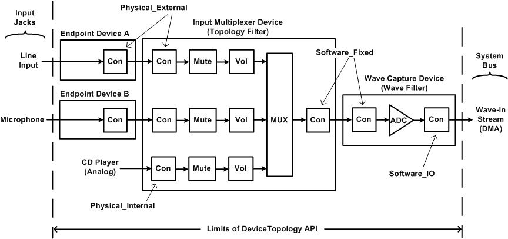

# Device Topologies

The [DeviceTopology API](devicetopology-api.md) gives clients control over a variety of internal functions of audio adapters that they cannot access through the [MMDevice API](mmdevice-api.md), [WASAPI](wasapi.md), or the [EndpointVolume API](endpointvolume-api.md).

As explained previously, the [MMDevice API](mmdevice-api.md), [WASAPI](wasapi.md), and the [EndpointVolume API](endpointvolume-api.md) present microphones, speakers, headphones, and other audio input and output devices to clients as [audio endpoint devices](audio-endpoint-devices.md). The endpoint device model provides clients with convenient access to volume and mute controls in audio devices. Clients that require only these simple controls can avoid traversing the internal topologies of hardware devices in audio adapters.

In Windows Vista, the audio engine automatically configures the topologies of audio devices for use by audio applications. Thus, applications rarely, if ever, need to use the DeviceTopology API for this purpose. For example, assume that an audio adapter contains an input multiplexer that can capture a stream from either a line input or a microphone, but that cannot capture streams from both endpoint devices at the same time. Assume that the user has enabled exclusive-mode applications to preempt the use of an audio endpoint device by shared-mode applications, as described in [Exclusive-Mode Streams](exclusive-mode-streams.md). If a shared-mode application is recording a stream from the line input at the time that an exclusive-mode application begins recording a stream from the microphone, the audio engine automatically switches the multiplexer from the line input to the microphone. In contrast, in earlier versions of Windows, including Windows XP, the exclusive-mode application in this example would use the **mixerXxx** functions in the Windows multimedia API to traverse the topologies of the adapter devices, discover the multiplexer, and configure the multiplexer to select the microphone input. In Windows Vista, these steps are no longer required.

However, some clients might require explicit control over types of audio hardware controls that cannot be accessed through the MMDevice API, WASAPI, or the EndpointVolume API. For these clients, the DeviceTopology API provides the ability to traverse the topologies of adapter devices to discover and manage the audio controls in the devices. Applications that use the DeviceTopology API must be designed with care to avoid interfering with Windows audio policy and disturbing the internal configurations of audio devices that are shared with other applications. For more information about Windows audio policy, see [User-Mode Audio Components](user-mode-audio-components.md).

The DeviceTopology API provides interfaces for discovering and managing the following types of audio controls in a device topology:

-   Automatic gain control
-   Bass control
-   Input selector (multiplexer)
-   Loudness control
-   Midrange control
-   Mute control
-   Output selector (demultiplexer)
-   Peak meter
-   Treble control
-   Volume control

In addition, the DeviceTopology API enables clients to query adapter devices for information about the stream formats that they support. The header file Devicetopology.h defines the interfaces in the DeviceTopology API.

The following diagram shows an example of several connected device topologies for the portion of a PCI adapter that captures audio from a microphone, line input, and CD player.



The preceding diagram shows the data paths that lead from the analog inputs to the system bus. Each of the following devices is represented as a device-topology object with an [**IDeviceTopology**](/windows/desktop/api/Devicetopology/nn-devicetopology-idevicetopology) interface:

-   Wave capture device
-   Input multiplexer device
-   Endpoint device A
-   Endpoint device B

Note that the topology diagram combines adapter devices (the wave capture and input multiplexer devices) with endpoint devices. Through the connections between devices, audio data passes from one device to the next. On each side of a connection is a connector (labeled Con in the diagram) through which data enters or leaves a device.

On the left edge of the diagram, signals from the line-input and microphone jacks enter the endpoint devices.

Inside the wave capture device and input multiplexer device are stream-processing functions, which, in the terminology of the DeviceTopology API, are called subunits. The following types of subunits appear in the preceding diagram:

-   Volume control (labeled Vol)
-   Mute control (labeled Mute)
-   Multiplexer (or input selector; labeled MUX)
-   Analog-to-digital converter (labeled ADC)

The settings in the volume, mute, and multiplexer subunits can be controlled by clients, and the DeviceTopology API provides control interfaces to clients for controlling them. In this example, the ADC subunit has no control settings. Thus, the DeviceTopology API provides no control interface for the ADC.

In the terminology of the DeviceTopology API, connectors and subunits belong to the same general category—parts. All parts, regardless of whether they are connectors or subunits, provide a common set of functions. The DeviceTopology API implements an [**IPart**](/windows/desktop/api/Devicetopology/nn-devicetopology-ipart) interface to represent the generic functions that are common to connectors and subunits. The API implements the [**IConnector**](/windows/desktop/api/Devicetopology/nn-devicetopology-iconnector) and [**ISubunit**](/windows/win32/api/devicetopology/nn-devicetopology-isubunit) interfaces to represent the specific aspects of connectors and subunits.

The DeviceTopology API constructs the topologies of the wave capture device and input multiplexer device from the kernel-streaming (KS) filters that the audio driver exposes to the operating system to represent these devices. (The audio adapter driver implements **IMiniportWaveXxx** and **IMiniportTopology** interfaces to represent the hardware-dependent portions of these filters; for more information about these interfaces and about KS filters, see the Windows DDK documentation.)

The DeviceTopology API constructs trivial topologies to represent endpoint devices A and B in the preceding diagram. The device topology of an endpoint device consists of a single connector. This topology is merely a placeholder for the endpoint device and contains no subunits for processing audio data. In fact, adapter devices contain all of the subunits that client applications use to control audio processing. The device topology of an endpoint device serves primarily as a starting point for exploring the device topologies of adapter devices.

Internal connections between two parts in a device topology are called links. The DeviceTopology API provides methods for traversing links from one part to the next in a device topology. The API also provides methods for traversing the connections between device topologies.

To begin exploration of a set of connected device topologies, a client application activates the **IDeviceTopology** interface of an audio endpoint device. The connector in an endpoint device connects either to a connector in an audio adapter or to a network. If the endpoint connects to a device on an audio adapter, then the methods in the DeviceTopology API enable the application to step across the connection from the endpoint to the adapter by obtaining a reference to the **IDeviceTopology** interface of the adapter device on the other side of the connection. A network, on the other hand, has no device topology. A network connection pipes an audio stream to a client that is accessing the system remotely.

The DeviceTopology API provides access only to the topologies of the hardware devices in an audio adapter. The external devices on the left edge of the diagram and the software components on the right edge are beyond the scope of the API. The dashed lines on either side of the diagram represent the limits of the DeviceTopology API. The client can use the API to explore a data path that stretches from the input jack to the system bus, but the API cannot penetrate beyond these boundaries.

Each connector in the preceding diagram has an associated connection type that indicates the type of connection that the connector makes. Thus, the connectors on the two sides of a connection always have identical connection types. The connection type is indicated by a [**ConnectorType**](/windows/win32/api/devicetopology/ne-devicetopology-connectortype) enumeration value—Physical\_External, Physical\_Internal, Software\_Fixed, Software\_IO, or Network. The connections between the input multiplexer device and endpoint devices A and B are of type Physical\_External, which means that the connection represents a physical connection to an external device (in other words, a user-accessible audio jack). The connection to the analog signal from the internal CD player is of type Physical\_Internal, which indicates a physical connection to an auxiliary device that is installed inside the system chassis. The connection between the wave capture device and input multiplexer device is of type Software\_Fixed, which indicates a permanent connection that is fixed and cannot be configured under software control. Finally, the connection to the system bus on the right side of the diagram is of type Software\_IO, which indicates that the data I/O for the connection is implemented by a DMA engine under software control. (The diagram does not include an example of a Network connection type.)

The client begins traversing a data path at the endpoint device. First, the client obtains an [**IMMDevice**](/windows/desktop/api/Mmdeviceapi/nn-mmdeviceapi-immdevice) interface that represents the endpoint device, as explained in [Enumerating Audio Devices](enumerating-audio-devices.md). To obtain the **IDeviceTopology** interface for the endpoint device, the client calls the [**IMMDevice::Activate**](/windows/desktop/api/Mmdeviceapi/nf-mmdeviceapi-immdevice-activate) method with parameter *iid* set to REFIID IID\_IDeviceTopology.

In the example in the preceding diagram, the input multiplexer device contains all the hardware controls (volume, mute, and multiplexer) for the capture streams from the line-input and microphone jacks. The following code example shows how to obtain the **IDeviceTopology** interface for the input multiplexer device from the **IMMDevice** interface for the endpoint device for the line input or microphone:


```C++
//-----------------------------------------------------------
// The input argument to this function is a pointer to the
// IMMDevice interface of an endpoint device. The function
// outputs a pointer (counted reference) to the
// IDeviceTopology interface of the adapter device that
// connects to the endpoint device.
//-----------------------------------------------------------
#define EXIT_ON_ERROR(hres)  \
              if (FAILED(hres)) { goto Exit; }
#define SAFE_RELEASE(punk)  \
              if ((punk) != NULL)  \
                { (punk)->Release(); (punk) = NULL; }

const IID IID_IDeviceTopology = __uuidof(IDeviceTopology);
const IID IID_IPart = __uuidof(IPart);

HRESULT GetHardwareDeviceTopology(
            IMMDevice *pEndptDev,
            IDeviceTopology **ppDevTopo)
{
    HRESULT hr = S_OK;
    IDeviceTopology *pDevTopoEndpt = NULL;
    IConnector *pConnEndpt = NULL;
    IConnector *pConnHWDev = NULL;
    IPart *pPartConn = NULL;

    // Get the endpoint device's IDeviceTopology interface.

    hr = pEndptDev->Activate(
                      IID_IDeviceTopology, CLSCTX_ALL,
                      NULL, (void**)&pDevTopoEndpt);
    EXIT_ON_ERROR(hr)

    // The device topology for an endpoint device always
    // contains just one connector (connector number 0).

    hr = pDevTopoEndpt->GetConnector(0, &pConnEndpt);
    EXIT_ON_ERROR(hr)

    // Use the connector in the endpoint device to get the
    // connector in the adapter device.

    hr = pConnEndpt->GetConnectedTo(&pConnHWDev);
    EXIT_ON_ERROR(hr)

    // Query the connector in the adapter device for
    // its IPart interface.

    hr = pConnHWDev->QueryInterface(
                         IID_IPart, (void**)&pPartConn);
    EXIT_ON_ERROR(hr)

    // Use the connector's IPart interface to get the
    // IDeviceTopology interface for the adapter device.

    hr = pPartConn->GetTopologyObject(ppDevTopo);

Exit:
    SAFE_RELEASE(pDevTopoEndpt)
    SAFE_RELEASE(pConnEndpt)
    SAFE_RELEASE(pConnHWDev)
    SAFE_RELEASE(pPartConn)

    return hr;
}
```


The GetHardwareDeviceTopology function in the previous code example performs the following steps to obtain the **IDeviceTopology** interface for the input multiplexer device:

1.  Call the **IMMDevice::Activate** method to get the **IDeviceTopology** interface for the endpoint device.
2.  With the **IDeviceTopology** interface obtained in the preceding step, call the [**IDeviceTopology::GetConnector**](/windows/desktop/api/Devicetopology/nf-devicetopology-idevicetopology-getconnector) method to get the **IConnector** interface of the single connector (connector number 0) in the endpoint device.
3.  With the **IConnector** interface obtained in the preceding step, call the [**IConnector::GetConnectedTo**](/windows/desktop/api/Devicetopology/nf-devicetopology-iconnector-getconnectedto) method to get the **IConnector** interface of the connector in the input multiplexer device.
4.  Query the **IConnector** interface obtained in the preceding step for its **IPart** interface.
5.  With the **IPart** interface obtained in the preceding step, call the [**IPart::GetTopologyObject**](/windows/desktop/api/Devicetopology/nf-devicetopology-ipart-gettopologyobject) method to get the **IDeviceTopology** interface for the input multiplexer device.

Before the user can record from the microphone in the preceding diagram, the client application must make certain that the multiplexer selects the microphone input. The following code example shows how a client can traverse the data path from the microphone until it finds the multiplexer, which it then programs to select the microphone input:


```C++
//-----------------------------------------------------------
// The input argument to this function is a pointer to the
// IMMDevice interface for a capture endpoint device. The
// function traverses the data path that extends from the
// endpoint device to the system bus (for example, PCI)
// or external bus (USB). If the function discovers a MUX
// (input selector) in the path, it selects the MUX input
// that connects to the stream from the endpoint device.
//-----------------------------------------------------------
#define EXIT_ON_ERROR(hres)  \
              if (FAILED(hres)) { goto Exit; }
#define SAFE_RELEASE(punk)  \
              if ((punk) != NULL)  \
                { (punk)->Release(); (punk) = NULL; }

const IID IID_IDeviceTopology = __uuidof(IDeviceTopology);
const IID IID_IPart = __uuidof(IPart);
const IID IID_IConnector = __uuidof(IConnector);
const IID IID_IAudioInputSelector = __uuidof(IAudioInputSelector);

HRESULT SelectCaptureDevice(IMMDevice *pEndptDev)
{
    HRESULT hr = S_OK;
    DataFlow flow;
    IDeviceTopology *pDeviceTopology = NULL;
    IConnector *pConnFrom = NULL;
    IConnector *pConnTo = NULL;
    IPart *pPartPrev = NULL;
    IPart *pPartNext = NULL;
    IAudioInputSelector *pSelector = NULL;

    if (pEndptDev == NULL)
    {
        EXIT_ON_ERROR(hr = E_POINTER)
    }

    // Get the endpoint device's IDeviceTopology interface.
    hr = pEndptDev->Activate(
                      IID_IDeviceTopology, CLSCTX_ALL, NULL,
                      (void**)&pDeviceTopology);
    EXIT_ON_ERROR(hr)

    // The device topology for an endpoint device always
    // contains just one connector (connector number 0).
    hr = pDeviceTopology->GetConnector(0, &pConnFrom);
    SAFE_RELEASE(pDeviceTopology)
    EXIT_ON_ERROR(hr)

    // Make sure that this is a capture device.
    hr = pConnFrom->GetDataFlow(&flow);
    EXIT_ON_ERROR(hr)

    if (flow != Out)
    {
        // Error -- this is a rendering device.
        EXIT_ON_ERROR(hr = AUDCLNT_E_WRONG_ENDPOINT_TYPE)
    }

    // Outer loop: Each iteration traverses the data path
    // through a device topology starting at the input
    // connector and ending at the output connector.
    while (TRUE)
    {
        BOOL bConnected;
        hr = pConnFrom->IsConnected(&bConnected);
        EXIT_ON_ERROR(hr)

        // Does this connector connect to another device?
        if (bConnected == FALSE)
        {
            // This is the end of the data path that
            // stretches from the endpoint device to the
            // system bus or external bus. Verify that
            // the connection type is Software_IO.
            ConnectorType  connType;
            hr = pConnFrom->GetType(&connType);
            EXIT_ON_ERROR(hr)

            if (connType == Software_IO)
            {
                break;  // finished
            }
            EXIT_ON_ERROR(hr = E_FAIL)
        }

        // Get the connector in the next device topology,
        // which lies on the other side of the connection.
        hr = pConnFrom->GetConnectedTo(&pConnTo);
        EXIT_ON_ERROR(hr)
        SAFE_RELEASE(pConnFrom)

        // Get the connector's IPart interface.
        hr = pConnTo->QueryInterface(
                        IID_IPart, (void**)&pPartPrev);
        EXIT_ON_ERROR(hr)
        SAFE_RELEASE(pConnTo)

        // Inner loop: Each iteration traverses one link in a
        // device topology and looks for input multiplexers.
        while (TRUE)
        {
            PartType parttype;
            UINT localId;
            IPartsList *pParts;

            // Follow downstream link to next part.
            hr = pPartPrev->EnumPartsOutgoing(&pParts);
            EXIT_ON_ERROR(hr)

            hr = pParts->GetPart(0, &pPartNext);
            pParts->Release();
            EXIT_ON_ERROR(hr)

            hr = pPartNext->GetPartType(&parttype);
            EXIT_ON_ERROR(hr)

            if (parttype == Connector)
            {
                // We've reached the output connector that
                // lies at the end of this device topology.
                hr = pPartNext->QueryInterface(
                                  IID_IConnector,
                                  (void**)&pConnFrom);
                EXIT_ON_ERROR(hr)

                SAFE_RELEASE(pPartPrev)
                SAFE_RELEASE(pPartNext)
                break;
            }

            // Failure of the following call means only that
            // the part is not a MUX (input selector).
            hr = pPartNext->Activate(
                              CLSCTX_ALL,
                              IID_IAudioInputSelector,
                              (void**)&pSelector);
            if (hr == S_OK)
            {
                // We found a MUX (input selector), so select
                // the input from our endpoint device.
                hr = pPartPrev->GetLocalId(&localId);
                EXIT_ON_ERROR(hr)

                hr = pSelector->SetSelection(localId, NULL);
                EXIT_ON_ERROR(hr)

                SAFE_RELEASE(pSelector)
            }

            SAFE_RELEASE(pPartPrev)
            pPartPrev = pPartNext;
            pPartNext = NULL;
        }
    }

Exit:
    SAFE_RELEASE(pConnFrom)
    SAFE_RELEASE(pConnTo)
    SAFE_RELEASE(pPartPrev)
    SAFE_RELEASE(pPartNext)
    SAFE_RELEASE(pSelector)
    return hr;
}
```


The DeviceTopology API implements an [**IAudioInputSelector**](/windows/desktop/api/Devicetopology/nn-devicetopology-iaudioinputselector) interface to encapsulate a multiplexer, such as the one in the preceding diagram. (An [**IAudioOutputSelector**](/windows/desktop/api/Devicetopology/nn-devicetopology-iaudiooutputselector) interface encapsulates a demultiplexer.) In the preceding code example, the inner loop of the SelectCaptureDevice function queries each subunit that it finds to discover whether the subunit is a multiplexer. If the subunit is a multiplexer, then the function calls the [**IAudioInputSelector::SetSelection**](/windows/desktop/api/Devicetopology/nf-devicetopology-iaudioinputselector-setselection) method to select the input that connects to the stream from the endpoint device.

In the preceding code example, each iteration of the outer loop traverses one device topology. When traversing the device topologies in the preceding diagram, the first iteration traverses the input multiplexer device and the second iteration traverses the wave capture device. The function will terminate when it reaches the connector at the right edge of the diagram. Termination occurs when the function detects a connector with a Software\_IO connection type. This connection type identifies the point at which the adapter device connects to the system bus.

The call to the [**IPart::GetPartType**](/windows/desktop/api/Devicetopology/nf-devicetopology-ipart-getparttype) method in the preceding code example obtains an **IPartType** enumeration value that indicates whether the current part is a connector or an audio-processing subunit.

The inner loop in the preceding code example steps across the link from one part to the next by calling the [**IPart::EnumPartsOutgoing**](/windows/desktop/api/Devicetopology/nf-devicetopology-ipart-enumpartsoutgoing) method. (There's also an [**IPart::EnumPartsIncoming**](/windows/desktop/api/Devicetopology/nf-devicetopology-ipart-enumpartsincoming) method for stepping in the opposite direction.) This method retrieves an [**IPartsList**](/windows/desktop/api/Devicetopology/nn-devicetopology-ipartslist) object that contains a list of all the outgoing parts. However, any part that the SelectCaptureDevice function expects to encounter in a capture device will always have exactly one outgoing part. Thus, the subsequent call to [**IPartsList::GetPart**](/windows/desktop/api/Devicetopology/nf-devicetopology-ipartslist-getpart) always requests the first part in the list, part number 0, because the function assumes that this is the only part in the list.

If the SelectCaptureDevice function encounters a topology for which that assumption is not valid, the function might fail to configure the device correctly. To avoid such a failure, a more general-purpose version of the function might do the following:

-   Call the [**IPartsList::GetCount**](/windows/desktop/api/Devicetopology/nf-devicetopology-ipartslist-getcount) method to determine the number of outgoing parts.
-   For each outgoing part, call **IPartsList::GetPart** to begin to traverse the data path that leads from the part.

Some, but not necessarily all, parts have associated hardware controls that clients can set or get. A particular part might have zero, one, or more hardware controls. A hardware control is represented by the following pair of interfaces:

-   A generic control interface, [**IControlInterface**](/windows/desktop/api/Devicetopology/nn-devicetopology-icontrolinterface), which has methods that are common to all hardware controls.
-   A function-specific interface (for example, [**IAudioVolumeLevel**](/windows/win32/api/devicetopology/nn-devicetopology-iaudiovolumelevel)) that exposes the control parameters for a particular type of hardware control (for example, a volume control).

To enumerate the hardware controls for a part, the client first calls the [**IPart::GetControlInterfaceCount**](/windows/desktop/api/Devicetopology/nf-devicetopology-ipart-getcontrolinterfacecount) method to determine the number of hardware controls that are associated with the part. Next, the client makes a series of calls to the [**IPart::GetControlInterface**](/windows/desktop/api/Devicetopology/nf-devicetopology-ipart-getcontrolinterface) method to obtain the **IControlInterface** interface for each hardware control. Finally, the client obtains the function-specific interface for each hardware control by calling the [**IControlInterface::GetIID**](/windows/desktop/api/Devicetopology/nf-devicetopology-icontrolinterface-getiid) method to obtain the interface ID. The client calls the [**IPart::Activate**](/windows/desktop/api/Devicetopology/nf-devicetopology-ipart-activate) method with this ID to obtain the function-specific interface.

A part that is a connector might support one of the following function-specific control interfaces:

-   [**IKsFormatSupport**](/windows/desktop/api/Devicetopology/nn-devicetopology-iksformatsupport)
-   [**IKsJackDescription**](/windows/desktop/api/Devicetopology/nn-devicetopology-iksjackdescription)

A part that is a subunit might support one or more of the following function-specific control interfaces:

-   [**IAudioAutoGainControl**](/windows/desktop/api/Devicetopology/nn-devicetopology-iaudioautogaincontrol)
-   [**IAudioBass**](/windows/win32/api/devicetopology/nn-devicetopology-iaudiobass)
-   [**IAudioChannelConfig**](/windows/desktop/api/Devicetopology/nn-devicetopology-iaudiochannelconfig)
-   [**IAudioInputSelector**](/windows/desktop/api/Devicetopology/nn-devicetopology-iaudioinputselector)
-   [**IAudioLoudness**](/windows/desktop/api/Devicetopology/nn-devicetopology-iaudioloudness)
-   [**IAudioMidrange**](/windows/win32/api/devicetopology/nn-devicetopology-iaudiomidrange)
-   [**IAudioMute**](/windows/desktop/api/Devicetopology/nn-devicetopology-iaudiomute)
-   [**IAudioOutputSelector**](/windows/desktop/api/Devicetopology/nn-devicetopology-iaudiooutputselector)
-   [**IAudioPeakMeter**](/windows/desktop/api/Devicetopology/nn-devicetopology-iaudiopeakmeter)
-   [**IAudioTreble**](/windows/win32/api/devicetopology/nn-devicetopology-iaudiotreble)
-   [**IAudioVolumeLevel**](/windows/win32/api/devicetopology/nn-devicetopology-iaudiovolumelevel)
-   [**IDeviceSpecificProperty**](/windows/desktop/api/Devicetopology/nn-devicetopology-idevicespecificproperty)

A part supports the **IDeviceSpecificProperty** interface only if the underlying hardware control has a device-specific control value and the control cannot be adequately represented by any other function-specific interface in the preceding list. Typically, a device-specific property is useful only to a client that can infer the meaning of the property value from information such as the part type, part subtype, and part name. The client can obtain this information by calling the [**IPart::GetPartType**](/windows/desktop/api/Devicetopology/nf-devicetopology-ipart-getparttype), [**IPart::GetSubType**](/windows/desktop/api/Devicetopology/nf-devicetopology-ipart-getsubtype), and [**IPart::GetName**](/windows/desktop/api/Devicetopology/nf-devicetopology-ipart-getname) methods.

## Related topics

<dl> <dt>

[Programming Guide](programming-guide.md)
</dt> </dl>

 

 
