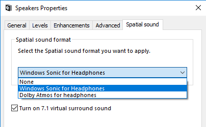
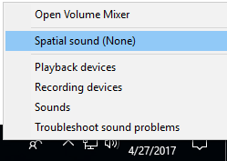
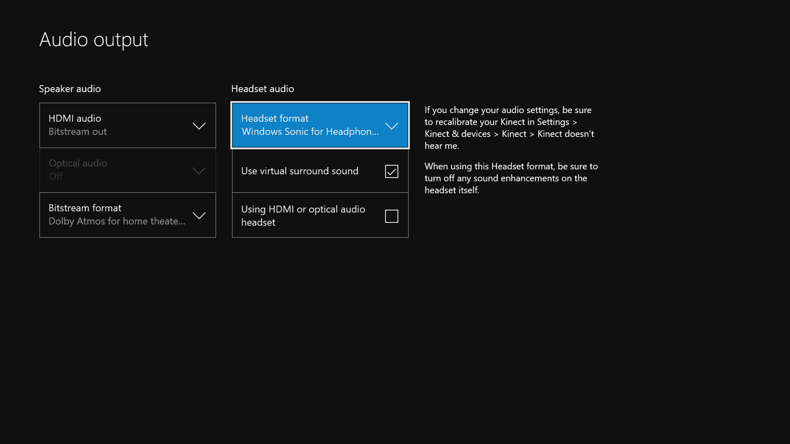

# Spatial Sound

Windows Sonic is Microsoft’s platform-level solution for spatial sound support on Xbox, Windows and HoloLens 2, enabling both surround and elevation (above or below the listener) audio cues. Spatial sound can be leveraged by Windows desktop (Win32) apps as well as Universal Windows Platform (UWP) apps on the supported platforms. The spatial sound APIs allow developers to create audio objects that emit audio from positions in 3D space. Dynamic audio objects allow you to emit audio from an arbitrary position in space, which can change over time. You can also specify that audio objects emit sound from one of 17 pre-defined static channels (8.1.4.4) that can represent real or virtualized speakers. The actual output format is selected by the user, and can be abstracted from Windows Sonic implementations; audio will be presented to existing speakers, headphones, and home theater receivers without needing any code or content changes. The platform fully supports real-time Dolby Atmos encoding for both HDMI and stereo headphone output, as well as Windows Sonic for Headphones encoding for stereo headphones. Finally, Windows Sonic apps abide by the system mixing policy, and their audio will also be mixed with non-spatially aware apps. Windows Sonic support is also integrated into Media Foundation; apps that use media foundation can successfully play Dolby Atmos content with no additional implementation.

Spatial sound with Windows Sonic supports TVs, home theaters, and sound bars that support Dolby Atmos. Spatial sound can also be used with any pair of headphones the consumer may own, with audio rendered by the platform using Windows Sonic for Headphones or Dolby Atmos for Headphones.

## Enabling Windows Sonic on Windows and Xbox One

Whether as a developer or a consumer, a user must enable Windows Sonic on their device in order to hear spatialized sound.

On Windows PCs, this is done via the properties page for a given sound output device. From the **Sound** control panel, select a playback device and click **Properties**. In the page that opens, starting with Windows 10, version 1703, there is a **Spatial sound** tab. If the device supports spatial sound, you can select one of the available formats from the dropdown.

You can also enable Windows Sonic by right-clicking the **Volume** icon in the taskbar.

On Xbox One, Windows Sonic capabilities are always available for the consumer, and are enabled via the Settings App -> Audio.

Dolby Atmos for home theater is listed as a “Bitstream format” option only when connected to devices that report support for this format via HDMI Extended Display Identification Data (EDID). Note that selecting this option the first time requires the user download the Dolby Access app.

The “Turn on 7.1 virtual surround sound” (Windows) or “Use virtual surround in apps” (Xbox) checkbox allows all existing applications that were capable of rendering to 5.1 or 7.1 channel formats to now treat headphones as a virtual 7.1 device. Content that previously would have only been heard in multichannel via a multichannel home theater, and which would have utilized a linear downmix over headphones, can now be virtualized (using the format specified in the dropdown) and heard over any pair of stereo headphones.

When Windows Sonic is not available (for instance, when playing to embedded laptop stereo speakers, or if the user has not explicitly enabled Windows Sonic per above), the number of available dynamic objects returned by [**ISpatialAudioClient::GetMaxDynamicObjectCount**](/windows/desktop/api/spatialaudioclient/nf-spatialaudioclient-ispatialaudioclient-getmaxdynamicobjectcount) to an application will be 0.

## Windows Sonic on HoloLens 2

On HoloLens 2 Windows Sonic is enabled by default and uses hardware DSP offload designed specifically for Windows Sonic for Headphones.

## Windows Sonic and Audio Middleware

Many app and game developers use third party audio rendering engine solutions, which often include sophisticated authoring and auditioning tools. Microsoft has partnered with several of these solution providers to implement Windows Sonic in their existing authoring environments. This will frequently mean the APIs discussed here are abstracted from the app’s view; they are wrapped as digital signal processing (DSP) plug-ins that the app can instantiate, and which the app’s audio implementer can use to mix to a Windows Sonic channel bed, submix, or send individual voices to dynamic object instance plug-ins as desired. Consult with your audio middleware solution provider for their level of support for Windows Sonic.

## Windows Sonic for Audio Renderers

Many audio renderers target a Windows Audio Session API (WASAPI) [**IAudioClient**](/windows/desktop/api/Audioclient/nn-audioclient-iaudioclient) endpoint, where the application feeds buffers of mixed and format-conformed audio data to a WASAPI audio sink; the delivered buffers are then consumed for mixing with other clients, final system-level processing, and rendering.

Windows Sonic spatial endpoints are implemented as [**ISpatialAudioClient**](/windows/desktop/api/spatialaudioclient/nn-spatialaudioclient-ispatialaudioclient), which has many similarities to **IAudioClient**. It supports *static* sound objects forming a channel bed, with support for up to 8.1.4.4 channels (8 channels around the listener – Left, Right, Center, Side Left, Side Right, Back Left, Back Right, and Back Center; 1 low frequency effects channel; 4 channels above the listener; 4 channels below the listener). And it supports *dynamic* sound objects, which can be arbitrarily positioned in 3D space.

The general implementation coding pattern for **ISpatialAudioClient** is:

-   Create static and/or dynamic audio objects.
-   Feed each object’s audio buffer each frame so the system can render it.
-   Update dynamic objects’ 3D positions on demand – as frequently (or infrequently) as the app desires.

Note that the current output format (speakers or headphones; Windows Sonic or Dolby Atmos) is abstracted from the above implementation – the app developer can focus on spatial sound without needing to pivot based on format. Apps that do want their behavior to diverge based on output format can query the format in use, but the abstraction means an app is not required to handle these formats.

## Windows Sonic Integration with Audio Renderers

Because [**ISpatialAudioClient**](/windows/desktop/api/spatialaudioclient/nn-spatialaudioclient-ispatialaudioclient) is an audio sink that consumes data, an audio renderer has several options for how to interact with and deliver audio data to it. There are three commonly used integration techniques (and for titles using audio middleware, you may see equivalent plug-ins made available based on these options):

-   **7.1.4 panners and mastering voice**: Renderers that already support 7.1 endpoints may opt to simply add support for the four additional height channels that the **ISpatialAudioClient** static channel bed supports. Any channel panning they previously did (likely already leveraging x,y, z coordinates) can be updated to now include these height channels. This often offers the least disruption to renderer and app audio workflows, signal, flow, and mix control. Over headphones, note that the full app mix will be spatialized – so even stereo music may be perceived as “externalized” from the listener.
-   **Maintain existing endpoint, plus add a 7.1.4 bus (and panners)**: Some titles may choose to maintain two endpoints: their existing stereo WASAPI endpoint (for “direct to ears” content not meant to be spatialized) alongside an **ISpatialAudioClient** static channel bed supporting 7.1.4 (or even up to 8.1.4.4). Of course, managing interactions between two mixes presents additional challenges to content creators, though synchronization is maintained, as both WASAPI and ISAC instances active at a given time do use the same buffer size and clock for processing.
-   **Use dynamic sound objects for certain voices or submixes**: Offering perhaps the most detailed/accurate positioning, but potentially creating mix opacity, this technique involves using **ISpatialAudioClient** dynamic sound objects. Note that the metadata plus audio buffer is delivered to the renderer, so these sounds will be opaque to the rest of the app mix. Additionally, since there are a limited number of available dynamic sound objects, the renderer will need to consider implementing prioritization techniques – culling, sound co-location, blending to the static channel bed, and so on. Games have frequently used this technique for individual “hero” sounds, such as a helicopter that will move around above the listener.

Renderers can also mix and match between these approaches.

## Windows Sonic Runtime Resource Implications

##### Windows (Software) and Xbox One (Hardware)

On Windows and Xbox, the number of available voices varies based on the format in use. Dolby Atmos formats support 32 total active objects (so if a 7.1.4 channel bed is in use, 20 additional dynamic sound objects can be active). Windows Sonic for Headphones supports 128 total active objects, with the Low Frequency Effects (LFE) channel not actually being counted as an object -- so when an 8.1.4.4 channel bed is in use, 112 dynamic sound objects can be active.

For Universal Windows Platform apps running on Xbox One game consoles, realtime encode (for Dolby Atmos for home theater, Dolby Atmos for Headphones, and Windows Sonic for Headphones) is performed in hardware at no CPU cost.
| Format | Max Static Objects (Channel Bed) | Max Dynamic Objects |
|:------:|:------:|:------:|:------:|
| Dolby Atmos (HDMI) | 12 (7.1.4) | 20 |
| Dolby Atmos for Headphones | 16 (7.1.4.4) | 16 |
| Windows Sonic for Headphones | 16\*(8.1.4.4) | 112 |

##### HoloLens 2 (Hardware)

HoloLens 2 only supports Windows Sonic for Headphones.

| Format | Max Static Objects (Channel Bed) | Max Dynamic Objects |
|:------:|:------:|:------:|:------:|
| Windows Sonic for Headphones | 16\*(8.1.4.4) | 31 |

\* The LFE channel is not counted as a dynamic object for processing purposes.

Apps should also consider the following resource implications:

-   **Storage/disc bandwidth**: Linear content pre-authored to 7.1.4 will typically be larger than 7.1 linear content (though perceptual codecs already often take advantage of channel correlation to make this far less than the 50% more actual channels of audio data)
-   **Other digital signal processing costs**: Some previously global effects may now become instanced per dynamic sound object. Additionally, some content creators may wish to update some DSP effects to support additional channels or use them uniquely.

## Windows Sonic and Sound Spatialization Cues

Windows Sonic is focused on sound positioning simulation on an idealized sphere around the listener. Windows Sonic for Headphones and Dolby Atmos implement speaker mapping and virtualization to headphones, but note that many other aspects of sound spatial simulation, already typically implemented in content creator-enabled ways, are left to existing engines. Content creators continue to use the existing game tools and processes they’ve previously had for such spatial cues as Doppler, distance-based attenuation and filtering, occlusion and obstruction, and environmental reverberation.

## Additional Resources

-   [Microsoft Spatial Sound samples github repository](https://aka.ms/MSSpatialSamples)
-   Dolby offers a number of support resources relating to Dolby Atmos and the Dolby Access app at <https://developer.dolby.com>.

## Spatial Sound Interfaces

| Interface                                                                              | Description                                                                                                                    |
|----------------------------------------------------------------------------------------|--------------------------------------------------------------------------------------------------------------------------------|
| [**ISpatialAudioClient**](/windows/desktop/api/spatialaudioclient/nn-spatialaudioclient-ispatialaudioclient)                                     | Enables a client to create audio streams that emit audio from a position in 3D space.                                          |
| [**ISpatialAudioObject**](/windows/desktop/api/spatialaudioclient/nn-spatialaudioclient-ispatialaudioobject)                                     | Represents an object that provides audio data to be rendered from a position in 3D space, relative to the user.                |
| [**ISpatialAudioObjectRenderStream**](/windows/desktop/api/spatialaudioclient/nn-spatialaudioclient-ispatialaudioobjectrenderstream)             | Provides methods for controlling a spatial audio object render stream, including starting, stopping, and resetting the stream. |
| [**ISpatialAudioObjectRenderStreamNotify**](/windows/desktop/api/spatialaudioclient/nn-spatialaudioclient-ispatialaudioobjectrenderstreamnotify) | Provides notifications for spatial audio clients to respond to changes in the state of an ISpatialAudioObjectRenderStream.     |

 

> [!Note]  
> When using the [**ISpatialAudioClient**](/windows/desktop/api/spatialaudioclient/nn-spatialaudioclient-ispatialaudioclient) interfaces on an Xbox One Development Kit (XDK) title, you must first call **EnableSpatialAudio** before calling [**IMMDeviceEnumerator::EnumAudioEndpoints**](/windows/desktop/api/Mmdeviceapi/nf-mmdeviceapi-immdeviceenumerator-enumaudioendpoints) or [**IMMDeviceEnumerator::GetDefaultAudioEndpoint**](/windows/desktop/api/Mmdeviceapi/nf-mmdeviceapi-immdeviceenumerator-getdefaultaudioendpoint). Failure to do so will result in an E\_NOINTERFACE error being returned from the call to Activate. **EnableSpatialAudio** is only available for XDK titles, and does not need to be called for Universal Windows Platform apps running on Xbox One, nor for any non-Xbox One devices.

 

## Spatial Sound Structures

| Structure                                                                                                 | Description                                                                  |
|-----------------------------------------------------------------------------------------------------------|------------------------------------------------------------------------------|
| [**SpatialAudioObjectRenderStreamActivationParams**](/windows/desktop/api/spatialaudioclient/ns-spatialaudioclient-spatialaudioobjectrenderstreamactivationparams) | Represents activation parameters for a spatial audio render stream.          |
| [**SpatialAudioClientActivationParams**](/windows/desktop/api/spatialaudioclient/ns-spatialaudioclient-spatialaudioclientactivationparams)                          | Represents optional activation parameters for a spatial audio render stream. |

 

## Spatial Sound Enumerations

| Enumeration                                | Description                                   |
|--------------------------------------------|-----------------------------------------------|
| [**AudioObjectType**](/windows/desktop/api/spatialaudioclient/ne-spatialaudioclient-audioobjecttype) | Specifies the type of an ISpatialAudioObject. |

 

 

 

