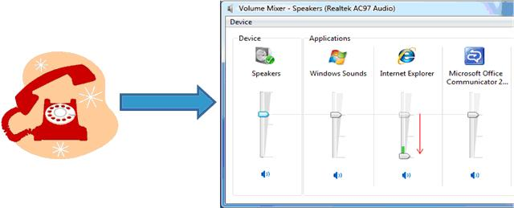

# Default Ducking Experience

Consider a scenario where a user receives a phone call while listening to music on the computer. During the phone call, the user wants to reduce the volume level of the music while attending to the phone call, and resume the original volume after the phone call has ended. Depending on the options specified by the user in the **Sounds** control panel, the operating system automatically provides this functionality through *ducking* or *stream attenuation*—reduction in the intensity of an audio stream.

The default attenuation experience depends on the user's preference, as specified in the control panel's **Sound** option. On the **Communications** tab, the user can choose an attenuation level (default value is 80%), mute all non-communication streams, or disable the default stream attenuation experience. The system allows new non-communication streams (except for new system sounds) to be opened during the communication session but the new streams are not automatically attenuated. When all of the communication streams are closed, the system ends the communication session and restores the volume of the streams that were attenuated during the communication session.

To indicate stream attenuation visually, the system changes the volume mixer settings depending on the user's preference. For example, if the user specifies an attenuation level, the volume mixer lowers the slider, displays the new attenuated volume, and displays the original volume level. The following image illustrates this process.

An application can override stream attenuation and implement a custom ducking experience if it knows when the communication session starts and ends. For more information, see [Providing a Custom Ducking Behavior](providing-a-custom-ducking-experience.md).

## Related topics

<dl> <dt>

[Using a Communication Device](using-the-communication-device.md)
</dt> <dt>

[Disabling the Default Ducking Experience](disabling-the-ducking-experience.md)
</dt> <dt>

[Providing a Custom Ducking Behavior](providing-a-custom-ducking-experience.md)
</dt> <dt>

[Implementation Considerations for Ducking Notifications](handling-audio-ducking-events-from-communication-devices.md)
</dt> <dt>

[Getting Ducking Events](getting-ducking-events-from-a-communication-device.md)
</dt> </dl>

 

 

