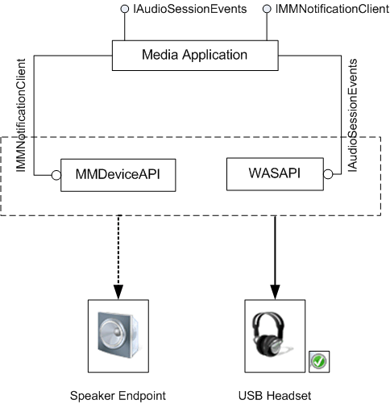

# Stream Routing Implementation Considerations

In Windows 7, high-level platform APIs that use Core Audio APIs, such as Media Foundation, DirectSound, and Wave APIs, implement the stream routing feature by handling stream switching from an existing device to a new default audio endpoint. Media applications that use these APIs use the stream routing behavior without any modifications to the source. Direct WASAPI clients can use the notifications sent by Core Audio components and implement the stream routing feature.

Direct WASAPI clients (media applications that use WASAPI directly) receive new device and audio session notifications sent by Core Audio components. The behavior of the stream routing feature is defined by how the application handles these notifications.

MMDevice API and the audio session send notifications about device state changes and session changes to WASAPI clients in the form of callbacks. To get these notifications, the client must register its implementation of [**IMMNotificationClient**](/windows/desktop/api/Mmdeviceapi/nn-mmdeviceapi-immnotificationclient) and [**IAudioSessionEvents**](/windows/desktop/api/Audiopolicy/nn-audiopolicy-iaudiosessionevents). For more information, see [Relevant Notifications for Stream Routing](relevant-device-notifications-for-stream-routing.md).

In the USB headset scenario described in [Stream Routing](stream-routing.md), an application is playing an audio stream and uses MMDeviceAPI and WASAPI to render the stream on the default rendering device, **Speaker**. When the default device is changed, the application receives an [**IMMNotificationClient**](/windows/desktop/api/Mmdeviceapi/nn-mmdeviceapi-immnotificationclient) notification. The application also receives [**IAudioSessionEvents**](/windows/desktop/api/Audiopolicy/nn-audiopolicy-iaudiosessionevents) notifications indicating that the user removed the audio endpoint device or that the stream format changed for the device that the audio session is connected to. Upon receiving the notifications, the application stops streaming to the speaker endpoint and reopens the stream for rendering on the current default endpoint, the headset.

In response to such notifications, the client might reopen the stream on the new default device in the new format selected by the user.

## Stream Managment

The following list summarizes the steps that a WASAPI client must perform to provide the stream switching functionality.

1.  Wait for the relevant [**IMMNotificationClient**](/windows/desktop/api/Mmdeviceapi/nn-mmdeviceapi-immnotificationclient) notification. If the device is the default device, the [**IMMNotificationClient::OnDefaultDeviceChanged**](/windows/desktop/api/Mmdeviceapi/nf-mmdeviceapi-immnotificationclient-ondefaultdevicechanged) notification is received.
2.  If a new device is available, get a reference to the endpoint of the new device. Call [**IMMDeviceEnumerator::GetDefaultAudioEndpoint**](/windows/desktop/api/Mmdeviceapi/nf-mmdeviceapi-immdeviceenumerator-getdefaultaudioendpoint) for the new default device. If the new device is not the default device, you can retrieve the device by calling [**IMMDeviceEnumerator::GetDevice**](/windows/desktop/api/Mmdeviceapi/nf-mmdeviceapi-immdeviceenumerator-getdevice). For more information, see [Getting the Device Endpoint for Stream Routing](getting-the-default-device-endpoint-for-stream-routing.md).
3.  Wait for the [**IAudioSessionEvents::OnSessionDisconnected**](/windows/desktop/api/Audiopolicy/nf-audiopolicy-iaudiosessionevents-onsessiondisconnected) with the reason value.
    > [!Note]  
    > Because all of these operations are asychronous, the order in which the application receives device-change and session-disconnect notifications cannnot be predicted. The application must implement notification handling to receive these notifications in any order. However, typically, the application receives **AudioSessionDisconnect** value before the default device change notification.

     

4.  Evaluate the reason value and determine whether the stream needs to be transferred to another audio endpoint or the stream needs to be reinitialized with a new format.
5.  Stop streaming to the old default device if the reason indicates that the stream should be re-routed to the new default device.
6.  Perform position mapping calculations.
7.  Open the stream on the new device and transfer all state information.
8.  Resume streaming on the new default device.
9.  Handle the departure of the old default device.

To make the stream switching operation appear seamless, it must be done as quickly as possible. This depends on the performance of the components involved in re-initiation of the stream on the new device.

## Position Mapping Considerations

When the application gets [**IMMNotificationClient**](/windows/desktop/api/Mmdeviceapi/nn-mmdeviceapi-immnotificationclient) and [**IAudioSessionEvents**](/windows/desktop/api/Audiopolicy/nn-audiopolicy-iaudiosessionevents) notifications, it can route the existing streams to the new default device. When an existing audio stream is interrupted and opened on the new device, rendering on the new device must start at the position at which the stream was stopped on the old device. To do this, the application must have the last known device position, to calculate the start position on the new device. For example, this position can be used as the delta offset for subsequent position mapping. When the stream starts rendering, the new device position can be remapped to the cached device position.

The following steps summarize the process of making a seamless stream transition.

1.  Cache the last device position of the stream on the old device.
2.  Stop the stream on the old device.
3.  Perform remapping calculations to get the new position.
4.  Start rendering the stream on the new device.
5.  Release the old stream.

During the transition, the application must ensure that the clock does not get out of synchronization, resulting in out-of-sync audio and video streams. This can occur if the video samples continue to render while the audio stream is routed to the new device. The application must cache the clock position for the remapping calculation and make sure that the video samples are not rendered until the audio stream is reopened on the new device, so that when the clip resumes rendering, the audio and the video streams are synchronized. In some cases, where the presentation time for rendering the video frames is based on the audio clock, it is sufficient to stop the audio stream until stream switching is complete and no other position mapping implementation for the video stream is necessary for audio video synchronization.

If while rendering, [**IAudioRenderClient::GetBuffer**](/windows/desktop/api/Audioclient/nf-audioclient-iaudiorenderclient-getbuffer) returns an error because the old device is lost, the application need not stop the old stream because the streaming operation has already terminated. For information about handling this error, see [Recovering from an Invalid-Device Error](recovering-from-an-invalid-device-error.md).

## Related topics

<dl> <dt>

[About MMDevice API](mmdevice-api.md)
</dt> <dt>

[About WASAPI](wasapi.md)
</dt> <dt>

[Stream Routing](stream-routing.md)
</dt> </dl>

 

 

