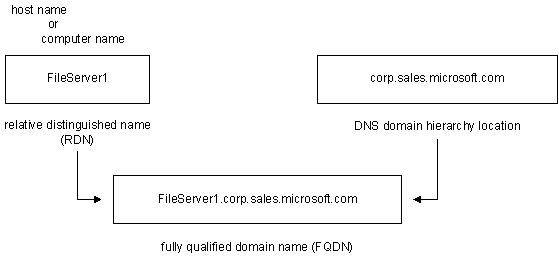

# Naming Conventions

Naming conventions share a common goal: to unambiguously resolve a name to a network address, generally an IP address. The difference between naming conventions lies in each convention's distinct approach to resolving names.

The following naming conventions are used to identify computers in various system name-resolution methods, including the Windows 2000 method:

-   [Computer name](#computer-name)
-   [Host name](#host-name)
-   [Fully qualified domain name (FQDN)](#fully-qualified-domain-name)
-   [Relative distinguished name](#relative-distinguished-name)

## Computer Name

In the flat NetBIOS name space, a single name unambiguously resolves a computer name to a network address. This is the name that previous Windows versions stored in browser and master browser lists, enabling peer Windows networks to browse resources on networked Windows computers. In this scenario, the term associated with the computer was *computer name*. Registration of the computer name depended on network broadcasts (and a master browser, determined by elections won by later Windows version numbers or Windows NT usage, or a combination). This was useful for small, peer-based Windows networks, but networks soon grew beyond what the use of broadcasts and simple flat-file master browser lists could service.

## Host Name

Next came the Windows Internet Naming Service (WINS), which enabled a dynamic and centralized repository of NetBIOS-based computer names stored on WINS servers. These repositories could service a larger network. With this development, name-resolution queries could be directed to a WINS server (rather than being broadcast) and conflicts could be centrally arbitrated. With WINS, the term computer name was retained, but the term *host name* also appeared and was used interchangeably with computer name. At the time, WINS was the default name-resolver for Windows platforms, but DNS was gaining with the popularity and proliferation of larger and larger networks.

Networks grew, and WINS became less capable of handling the growing volume of names. The decreasing capability of WINS to handle the name-resolution load was not due to the processing power required for resolution, but instead, to the fact that generating unique names for lots of computers became an ever-increasing management burden.

## Fully Qualified Domain Name

DNS is a better solution; with its hierarchical name space, the need for unique computer names is isolated to a given domain, enabling a computer name such as *server1* to exist in different domain locations in the same hierarchy. With the capability to have the same host name in different domains, the necessity arose for a name that properly addressed the DNS hierarchy. The name had to include not only the computer name or host name, but also a name that could unambiguously identify, or fully qualify, that computer within the entire DNS hierarchy. That name is the [*fully qualified domain name*](f-gly.md) (FQDN) — for example, server1.widgets.microsoft.com.

However, in certain situations, the domain-hierarchy part of the FQDN is cumbersome and a local name for a given computer (or any other DNS host) that is relative to the DNS domain in which the host resides is needed. That name is the [*relative distinguished name*](r-gly.md). The relative distinguished name is simply the single host name to the left of the leftmost dot in the FQDN, such that an FQDN of server1.widgets.microsoft.com has server1 as its relative distinguished name.

## Relative Distinguished Name

Rather than imposing new names or new naming conventions on users of NetBIOS names, DNS simply uses the computer name (host name) as the relative distinguished name and appends the DNS domain hierarchy to that name to create the FQDN. The following figure illustrates how to identify the computer-name (or host-name, or relative distinguished name) part of the FQDN:

 

 

