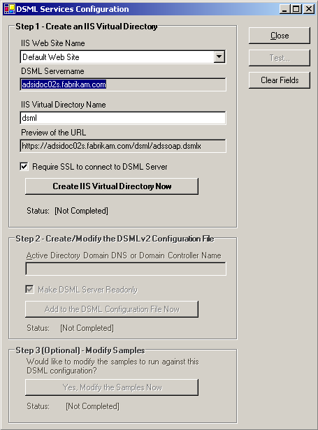

# Configuring DSML Services for Windows

The following procedure shows how to configure DSML Services for Windows by using the DSML Services Configuration application.

**To Configure DSML Services for Windows**

1.  Click the **Start** button, and then point to **All Programs**. Point to **Microsoft DSML**, and then click **Configuring DSML Services**. This will start the **DSML Services Configuration** application.

    

2.  The **IIS Web Site Name** will default to **Default Web Site**. The **IIS Virtual Directory Name** will default to **dsml**. The **Require SSL to connect to DSML Server** check box will be selected. Click **Create IIS Virtual Directory Now**.
3.  The **Active Directory Domain DNS** or **Domain Controller Name** defaults to the name of the Active Directory domain, which in this example is **fabrikam.com**. Click **Add to the DSML Configuration File Now**.

    This can be changed to the DNS name of an Active Directory server if you want all DSML requests to be handled by a specific computer. For example, if the Active Directory server name is **testnet01** and the domain name is **fabrikam.com**, then typing **testnet01.fabrikam.com** in the text box will direct all DSML requests to this Active Directory server.

4.  DSML Services for Windows includes several sample HTML pages that demonstrate various DSML V2 commands. Click **Yes, Modify the Samples Now** to modify the sample pages to match the current configuration.
5.  A **Launch the samples Now?** dialog box will appear. Click **Yes** to open the samples webpage. Click **No** if you do not want to run the samples webpage at the current time.
6.  Click **Test** to test the DSML Services for Windows configuration. This opens an HTTP connection to the IIS server, sends a SOAP message with an empty DSML payload, and checks the response to confirm that the connection is working properly. If the SOAP/DSML connection is not working properly, an error message will display.
7.  Click **Close** to exit the configuration application.

 

 

