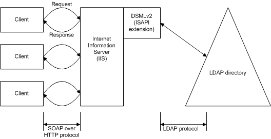

# SOAP Request and Response Binding

The SOAP Request and Response binding method uses SOAP to bind to a server. SOAP is a lightweight protocol for data exchange in a distributed environment and consists of:

-   An envelope that defines a framework for describing what is in a message and how to process it.
-   A set of encoding rules for expressing instances of application-defined data types.
-   A convention for representing remote procedure calls and responses.

SOAP therefore defines the XML format for messages. For example, if you have a well-formed XML fragment consisting of a DSML V2 document enclosed in a pair of SOAP elements, you have a SOAP message.

This implementation of SOAP request/response binding uses HTTP 1.1 and HTTPS 1.1 as a transport for DSML V2 requests and responses. The version of SOAP used for this binding is SOAP 1.1.

The following illustration shows the data flow for a DSML V2 request and response.



In the preceding illustration, a client makes a request using the SOAP (XML) over HTTP protocol. That request goes to a server running IIS, where it is routed to a DSML V2 ISAPI extension. There, it is converted to LDAP commands, which are sent on to the directory services. The response occurs in a reverse fashion, with the response returning to the client through the SOAP over HTTP protocol.

Every SOAP request and response must have an envelope element that contains a body element, and a body element that contains the DSML V2 payload. The following code example shows the general form of a SOAP message:

``` syntax
<Envelope>
    <Header>
        All SOAP header elements go here
    </Header>
    <Body>
        The DSML 2.0 payload (document) goes here
    </Body>
</Envelope>
```

The &lt;Envelope&gt; and &lt;Body&gt; elements are required, but the &lt;Header&gt; element is optional. For more information about the SOAP specification, see [http://www.w3.org/TR/SOAP](http://go.microsoft.com/fwlink/p/?linkid=84162) and [Using DSML Services for Windows](using-dsml-services-for-windows.md).

The following code example shows a request/response message sequence:

``` syntax
<!--  **** DSMLv2 Request ****** --> 
<se:Envelope xmlns:se="http://schemas.xmlsoap.org/soap/envelope/">
   <se:Body xmlns:dsml="urn:oasis:names:tc:DSML:2:0:core">
      <batchRequest> 
         <modifyRequest> <entity type="hellip"/> </modifyRequest>
         <addRequest> <entity type="hellip"/> </addRequest>
          <entity type="hellip"/>
      </batchRequest>
   </se:Body> 
</se:Envelope>


<!--  **** DSMLv2 Response ****** -->
<soap:Envelope xmlns:soap="http://schemas.xmlsoap.org/soap/envelope/"
               xmlns:xsi="http://www.w3.org/2001/XMLSchema-instance" 
               xmlns:xsd="http://www.w3.org/2001/XMLSchema" 
               xmlns:soapenc="http://schemas.xmlsoap.org/soap/encoding/">
   <soap:Body> 
      <batchResponse xmlns="urn:oasis:names:tc:DSML:2:0:core"
                     xmlns:xsd="http://www.w3.org/2001/XMLSchema"
                     xmlns:xsi="http://www.w3.org/2001/XMLSchema-instance">
         <modifyResponse> <entity type="hellip"/> </modifyResponse>
         <addResponse> <entity type="hellip"/> </addResponse>
         <entity type="hellip"/>
      </batchResponse>
   </soap:Body>
</soap:Envelope> 
```

In the preceding example, be aware of the following:

-   The namespace for DSML V2 is "urn:oasis:names:tc:DSML:2:0:core". This namespace is used at the top-level element of the &lt;Body&gt; of each SOAP request and is returned in the DSML V2 payload response. Default namespace designations may be used.
-   All SOAP requests and responses in this binding must use UTF-8 encoding.
-   Each SOAP request body contains a single DSML **batchRequest**.
-   Each SOAP response body contains a single DSML **batchResponse**.

 

 


