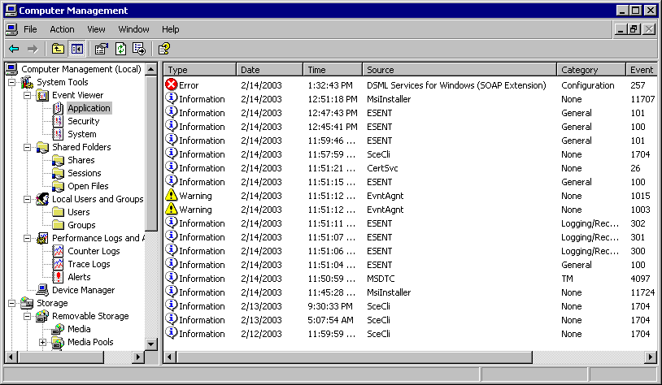
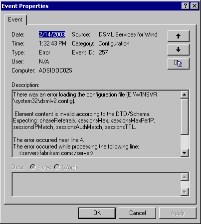

# Troubleshooting DSML Services for Windows

Most problems in DSML Services for Windows are reported in the Event Viewer, in the **Application** node. When you attempt to diagnose a problem with DSML Services for Windows, check the Event Viewer first.

**To open the Event Viewer**

1.  Right-click **My Computer**.
2.  Click **Manage**.
3.  Click **Event Viewer**.
4.  Click **Application**.
5.  Look at the events where the **Source** is **DSML Services for Windows (SOAP Extension)**.

    

6.  To get detailed **Event Properties** data, double-click the event listed in the Event Viewer pane. Here is an example of a configuration file error event.

    

Events generated by the DSML Services for Windows

-   Message: There was an error loading the configuration file.

    Explanation: A problem occurred while DSML Services for Windows was reading the dsmlv2.config configuration file. This typically indicates that the configuration file does not contain well-formed XML, or that the contents of the configuration file have a syntax error in them. The logged event contains a brief description of the error that was encountered.

    Action: Review the contents of the dsmlv2.config file to make sure that the file contains well-formed XML that conforms to the configuration file schema.

-   Message: The configuration file cannot be loaded. It is either missing or inaccessible.

    Explanation: The first time DSML Services for Windows receives an incoming DSML request after it has been started, it attempts to read its dsmlv2.config file (at the location described in the event log message). This event indicates that it was unable to read the file. The file might be missing, or the user that DSML Services for Windows is impersonating while processing the request may not have access rights to read it.

    Action: Check that the file exists and is in the right location. To ensure that the user DSML Services for Windows is impersonating has access rights to read the file, immediately after starting DSML Services for Windows you can send it a request (for example, an empty &lt;batchRequest/&gt;) using an account you know has the necessary access rights to read the file. DSML Services for Windows caches the contents of the file for use in processing future requests.

-   Message: A request was received for the unknown URL. This likely indicates a missing virtualDirectory entry in the configuration file.

    Explanation: DSML Services for Windows received a DSML request on the virtual directory named in the event log message, but there is no corresponding virtualDirectory entry in the dsmlv2.config file.

    Action: Either remove the named virtual directory from IIS, change the IIS configuration so that the named virtual directory does not point to DSML Services for Windows, or add the necessary virtualDirectory entry to the dsmlv2.config file so that DSML Services for Windows may process requests received on that virtual directory.

-   Message: Unable to verify the version of MSXML installed.

    Explanation: The first time DSML Services for Windows receives an incoming DSML request after it has been started, it verifies that the necessary versions of MSXML are installed. This event indicates the correct versions are not installed.

    Action: You must have Service Pack 1 or later of Microsoft XML Core Services (MSXML) version 4.0 installed.

 

 

