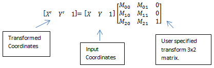

# 2D affine transform effect

The 2D affine transform effect applies a spatial transform to a image based on a 3X2 matrix using the Direct2D matrix [transform](direct2d-transforms-overview.md) and any of six interpolation modes. You can use this effect to rotate, scale, skew, or translate an image. Or, you can combine these operations. Affine transfers preserve parallel lines and the ratio of distances between any three points in an image.

The CLSID for this effect is CLSID\_D2D12DAffineTransform.

-   [Example image](#example-image)
-   [Effect properties](#effect-properties)
-   [Border modes](#border-modes)
-   [Interpolation modes](#interpolation-modes)
-   [Output bitmap](#output-bitmap)
-   [Requirements](#requirements)
-   [Related topics](#related-topics)

## Example image


| Before                                                             |
|--------------------------------------------------------------------|
|          |
| After                                                              |
|  |


 


```C++
ComPtr<ID2D1Effect> affineTransformEffect;
m_d2dContext->CreateEffect(CLSID_D2D12DAffineTransform, &affineTransformEffect);

affineTransformEffect->SetInput(0, bitmap);

D2D1_MATRIX_3X2_F matrix = D2D1::Matrix3x2F(0.9f, -0.1f,   0.1f, 0.9f,   8.0f, 45.0f);

affineTransformEffect->SetValue(D2D1_2DAFFINETRANSFORM_PROP_TRANSFORM_MATRIX, matrix);

m_d2dContext->BeginDraw();
m_d2dContext->DrawImage(affineTransformEffect.Get());
m_d2dContext->EndDraw();
```


This effect performs this matrix operation:



Although the input matrix is defined as a 3x2 matrix, the last column is padded with 0, 0 and 1 to produce a square matrix. This allows for matrix multiplication, so that transforms can be concatenated into a single matrix.

## Effect properties


| Display name and index enumeration | Description | 
|------------------------------------|-------------|
| InterpolationMode<br /> D2D1_2DAFFINETRANSFORM_PROP_INTERPOLATION_MODE<br /> | The interpolation mode used to scale the image. There are 6 scale modes that range in quality and speed.<br /> Type is D2D1_2DAFFINETRANSFORM_INTERPOLATION_MODE.<br /> Default value is D2D1_2DAFFINETRANSFORM_INTERPOLATION_MODE_LINEAR.<br /> | 
| BorderMode<br /> D2D1_2DAFFINETRANSFORM_PROP_BORDER_MODE<br /> | The mode used to calculate the border of the image, soft or hard. See <a href="https://www.bing.com/search?q=Border+modes">Border modes</a> for more info. <br /> Type is D2D1_BORDER_MODE.<br /> Default value is D2D1_BORDER_MODE_SOFT.<br /> | 
| TransformMatrix<br /> D2D1_2DAFFINETRANSFORM_PROP_TRANSFORM_MATRIX<br /> | The 3x2 matrix to transform the image using the Direct2D matrix <a href="direct2d-transforms-overview.md">transform</a>. <br /> Type is D2D1_MATRIX_3X2_F.<br /> Default value is Matrix3x2F::Identity().<br /> | 
| Sharpness<br /> D2D1_2DAFFINETRANSFORM_PROP_SHARPNESS<br /> | In the high quality cubic interpolation mode, the sharpness level of the scaling filter as a float between 0 and 1. The values are unitless. You can use sharpness to adjust the quality of an image when you scale the image.<br /> The sharpness factor affects the shape of the kernel. The higher the sharpness factor, the smaller the kernel. <br /><blockquote>[!Note]<br />This property affects only the high quality cubic interpolation mode.</blockquote><br /> Type is FLOAT.<br /> Default value is 1.0f.<br /> | 


 

## Border modes


| Name                     | Description                                                                                                      |
|--------------------------|------------------------------------------------------------------------------------------------------------------|
| D2D1\_BORDER\_MODE\_SOFT | The effect pads the image with transparent black pixels as it interpolates, resulting in a soft edge.<br/> |
| D2D1\_BORDER\_MODE\_HARD | The effect clamps the output to the size of the input image. <br/>                                         |


 

## Interpolation modes


| Enumeration                                                         | Description                                                                                                                                                                                          |
|---------------------------------------------------------------------|------------------------------------------------------------------------------------------------------------------------------------------------------------------------------------------------------|
| D2D1\_2DAFFINETRANSFORM\_INTERPOLATION\_MODE\_NEAREST\_NEIGHBOR     | Samples the nearest single point and uses that. This mode uses less processing time, but outputs the lowest quality image.                                                                           |
| D2D1\_2DAFFINETRANSFORM\_INTERPOLATION\_MODE\_LINEAR                | Uses a four point sample and linear interpolation. This mode uses more processing time than the nearest neighbor mode, but outputs a higher quality image.                                           |
| D2D1\_2DAFFINETRANSFORM\_INTERPOLATION\_MODE\_CUBIC                 | Uses a 16 sample cubic kernel for interpolation. This mode uses the most processing time, but outputs a higher quality image.                                                                        |
| D2D1\_2DAFFINETRANSFORM\_INTERPOLATION\_MODE\_MULTI\_SAMPLE\_LINEAR | Uses 4 linear samples within a single pixel for good edge anti-aliasing. This mode is good for scaling down by small amounts on images with few pixels.                                              |
| D2D1\_2DAFFINETRANSFORM\_INTERPOLATION\_MODE\_ANISOTROPIC           | Uses anisotropic filtering to sample a pattern according to the transformed shape of the bitmap.                                                                                                     |
| D2D1\_2DAFFINETRANSFORM\_INTERPOLATION\_MODE\_HIGH\_QUALITY\_CUBIC  | Uses a variable size high quality cubic kernel to perform a pre-downscale the image if downscaling is involved in the transform matrix. Then uses the cubic interpolation mode for the final output. |


 

> [!Note]  
> If you don't select a mode, the effect defaults to D2D1\_2DAFFINETRANSFORM\_INTERPOLATION\_MODE\_LINEAR.

 

> [!Note]  
> Anisotropic mode generates mipmaps when scaling, however, if you set the **Cached** property to true on the effects that are input to this effect, the mipmaps won't be generated every time for sufficiently small images.

 

## Output bitmap

The size of the output bitmap depends on the transform matrix that is applied to the image.

The effect performs the transform operation and then applies a bounding box around the result. The output bitmap is the size of the bounding box.

## Requirements


| Requirement | Value |
|--------------------------|------------------------------------------------------------------------------------|
| Minimum supported client | Windows 8 and Platform Update for Windows 7 \[desktop apps \| Windows Store apps\] |
| Minimum supported server | Windows 8 and Platform Update for Windows 7 \[desktop apps \| Windows Store apps\] |
| Header                   | d2d1effects.h                                                                      |
| Library                  | d2d1.lib, dxguid.lib                                                               |


 

## Related topics

<dl> <dt>

[**ID2D1Effect**](/windows/win32/api/d2d1_1/nn-d2d1_1-id2d1effect)
</dt> </dl>

 

