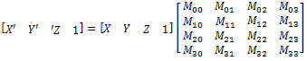
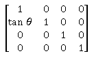
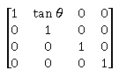
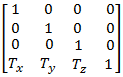
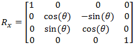
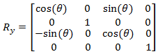
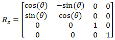
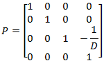

# 3D transform effect

Use the 3D transform effect to apply an arbitrary 4x4 transform matrix to an image.

This effect applies the matrix (M?) you provide to the corner vertices of the source image (\[ x y z 1 \]) using this calculation:

\[ x<sub>r</sub> y<sub>r</sub> z<sub>r</sub> 1 \]=\[ x y z 1 \]\*M?

The CLSID for this effect is CLSID\_D2D13DTransform.

-   [Example image](#example-image)
-   [Effect properties](#effect-properties)
    -   [Interpolation modes](#interpolation-modes)
    -   [Border modes](#border-modes)
-   [4x4 Transform Matrix Class](#4x4-transform-matrix-class)
-   [Requirements](#requirements)
-   [Related topics](#related-topics)

## Example image


| Before                                                        |
|---------------------------------------------------------------|
|  |
| After                                                         |
|   |


 


```C++
ComPtr<ID2D1Effect> D2D13DTransformEffect;
m_d2dContext->CreateEffect(CLSID_D2D13DTransform, &D2D13DTransformEffect);

D2D13DTransformEffect->SetInput(0, bitmap);

// You can use the helper methods in D2D1::Matrix4x4F to create common matrix transformations.
D2D1_MATRIX_4X4_F matrix = 
    D2D1::Matrix4x4F::Translation(0.0f, -192.0f, 0.0f) *
    D2D1::Matrix4x4F::RotationY(30.0f) *
    D2D1::Matrix4x4F::Translation(0.0f, 192.0f, 0.0f);

D2D13DTransformEffect->SetValue(D2D1_3DTRANSFORM_PROP_TRANSFORM_MATRIX, matrix);

m_d2dContext->BeginDraw();
m_d2dContext->DrawImage(D2D13DTransformEffect.Get());
m_d2dContext->EndDraw();
```


## Effect properties


<table>
<thead>
<tr class="header">
<th>Display name and index enumeration</th>
<th>Description</th>
</tr>
</thead>
<tbody>
<tr class="odd">
<td>InterpolationMode<br/> D2D1_3DTRANSFORM_PROP_INTERPOLATION_MODE<br/></td>
<td>The interpolation mode the effect uses on the image. There are 5 scale modes that range in quality and speed.<br/> Type is D2D1_3DTRANSFORM_INTERPOLATION_MODE.<br/> Default value is D2D1_3DTRANSFORM_INTERPOLATION_MODE_LINEAR.<br/></td>
</tr>
<tr class="even">
<td>BorderMode<br/> D2D1_3DTRANSFORM_PROP_BORDER_MODE<br/></td>
<td>The mode used to calculate the border of the image, soft or hard. See <a href="https://www.bing.com/search?q=Border+modes">Border modes</a> for more info.<br/> Type is D2D1_BORDER_MODE.<br/> Default value is D2D1_BORDER_MODE_SOFT.<br/></td>
</tr>
<tr class="odd">
<td>TransformMatrix<br/> D2D1_3DTRANSFORM_PROP_TRANSFORM_MATRIX<br/></td>
<td>A 4x4 transform matrix applied to the projection plane. The following matrix calculation is used to map points from one 3D coordinate system to the transformed 2D coordinate system. <br/>Where:<dl> X, Y, Z = Input projection plane coordinates<br />
M<sub>x,y</sub> = Transform Matrix elements<br />
X , Y , Z  =Output projection plane coordinates<br />
</dl> <br/> The individual matrix elements are not bounded and are unitless. <br/> Type is D2D1_MATRIX_4X4_F.<br/> Default value is Matrix4x4F(1, 0, 0, 0, 0, 1, 0, 0, 0, 0, 1, 0, 0, 0, 0, 1).<br/></td>
</tr>
</tbody>
</table>


 

### Interpolation modes


| Enumeration                                                   | Description                                                                                                                                                |
|---------------------------------------------------------------|------------------------------------------------------------------------------------------------------------------------------------------------------------|
| D2D1\_3DTRANSFORM\_INTERPOLATION\_MODE\_NEAREST\_NEIGHBOR     | Samples the nearest single point and uses that. This mode uses less processing time, but outputs the lowest quality image.                                 |
| D2D1\_3DTRANSFORM\_INTERPOLATION\_MODE\_LINEAR                | Uses a four point sample and linear interpolation. This mode uses more processing time than the nearest neighbor mode, but outputs a higher quality image. |
| D2D1\_3DTRANSFORM\_INTERPOLATION\_MODE\_CUBIC                 | Uses a 16 sample cubic kernel for interpolation. This mode uses the most processing time, but outputs a higher quality image.                              |
| D2D1\_3DTRANSFORM\_INTERPOLATION\_MODE\_MULTI\_SAMPLE\_LINEAR | Uses 4 linear samples within a single pixel for good edge anti-aliasing. This mode is good for scaling down by small amounts on images with few pixels.    |
| D2D1\_3DTRANSFORM\_INTERPOLATION\_MODE\_ANISOTROPIC           | Uses anisotropic filtering to sample a pattern according to the transformed shape of the bitmap.                                                           |


 

> [!Note]  
> If you don't select a mode, the effect defaults to D2D1\_3DTRANSFORM\_INTERPOLATION\_MODE\_LINEAR.

 

> [!Note]  
> Anisotropic mode generates mipmaps when scaling, however, if you set the **Cached** property to true on the effects that are input to this effect, the mipmaps won't be generated every time for sufficiently small images.

 

### Border modes


| Name                     | Description                                                                                                      |
|--------------------------|------------------------------------------------------------------------------------------------------------------|
| D2D1\_BORDER\_MODE\_SOFT | The effect pads the image with transparent black pixels as it interpolates, resulting in a soft edge.<br/> |
| D2D1\_BORDER\_MODE\_HARD | The effect clamps the output to the size of the input image. <br/>                                         |


 

## 4x4 Transform Matrix Class

Direct2D provides a 4x4 matrix class to provide helper functions for transforming the image in 3 dimensions. See the [**Matrix4x4F**](/windows/desktop/api/d2d1_1helper/nl-d2d1_1helper-matrix4x4f) topic for more info and a description of all the class members.


| Function                                | Description                                                                                    | Matrix                                                 |
|-----------------------------------------|------------------------------------------------------------------------------------------------|--------------------------------------------------------|
| Matrix4x4F::Scale(X, Y, Z)              | Generates a transform matrix that scales the projection plane in the X, Y, and/or Z direction. |      |
| SkewX(X)                                | Generates a transform matrix that skews the projection plane in the X direction.               |              |
| SkewY(Y)                                | Generates a transform matrix that skews the projection plane in the Y direction.               |              |
| Translation(X, Y, Z)                    | Generates a transform matrix that translates the projection plane in the X, Y, or Z direction. |    |
| RotationX(X)                            | Generates a transform matrix that rotates the projection plane about the X axis.               |     |
| RotationY(Y)                            | Generates a transform matrix that rotates the projection plane about the Y axis.               |     |
| RotationZ(Z)                            | Generates a transform matrix that rotates the projection plane about the Z axis.               |     |
| PerspectiveProjection(D)                | A perspective transformation with a depth value of D.                                          |  |
| RotationArbitraryAxis(X, Y, Z, degrees) | Rotates the projection plane about the axis you specify.                                       |                                                        |


 

## Requirements


| Requirement | Value |
|--------------------------|------------------------------------------------------------------------------------|
| Minimum supported client | Windows 8 and Platform Update for Windows 7 \[desktop apps \| Windows Store apps\] |
| Minimum supported server | Windows 8 and Platform Update for Windows 7 \[desktop apps \| Windows Store apps\] |
| Header                   | d2d1effects.h                                                                      |
| Library                  | d2d1.lib, dxguid.lib                                                               |


 

## Related topics

<dl> <dt>

[**ID2D1Effect**](/windows/win32/api/d2d1_1/nn-d2d1_1-id2d1effect)
</dt> </dl>

 

