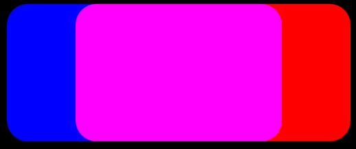

# Arithmetic composite effect

Use the arithmetic composite effect to combine 2 images using a weighted sum of pixels from the input images.

The CLSID for this effect is CLSID\_D2D1ArithmeticComposite.

-   [Formula](#formula)
-   [Example image](#example-image)
-   [Effect properties](#effect-properties)
-   [Output bitmap](#output-bitmap)
-   [Requirements](#requirements)
-   [Related topics](#related-topics)

## Formula

The formula here is used to compute this effect.

Output<sub>rgba</sub> = C1 \* Source<sub>rgba</sub> \* Destination<sub>rgba</sub> + C2 \* Source<sub>rgba</sub> + C3 \* Destination<sub>rgba</sub> + C4

Where C1, C2, C3, C4 are coefficients that you set.

The coefficients map to the values in a D2D1\_VECTOR\_4F (x, y, z, w):

-   x = C1
-   y = C2
-   z = C3
-   w = C4

## Example image

A simple example is to add the source and destination pixels. In the example, 2 rounded rectangles are composited together. The source rectangle is blue and the destination is red.

The image here is the output of the Arithmetic Composite effect with the coefficients of the equation set to the values here.

-   C1 = 0
-   C2 = 1
-   C3 = 1
-   C4 = 0



The result is that the pixel values for the source and destination are added. The regions where the rectangles don't overlap the RGBA values are all 0. Where the rectangles overlap the color is magenta because the R and B values are both at maximum.

Here's another example image with code.


| Before image 1                                                             |
|----------------------------------------------------------------------------|
|     |
| Before image 2                                                             |
|  |
| After                                                                      |
|         |


 


```C++
ComPtr<ID2D1Effect> arithmeticCompositeEffect;
m_d2dContext->CreateEffect(CLSID_D2D1ArithmeticComposite, &arithmeticCompositeEffect);

arithmeticCompositeEffect->SetInput(0, bitmap);
arithmeticCompositeEffect->SetInput(1, bitmapTwo);
arithmeticCompositeEffect->SetValue(D2D1_ARITHMETICCOMPOSITE_PROP_COEFFICIENTS, D2D1::Vector4F(0.0f, 0.5f, 0.5f, 0.0f));

m_d2dContext->BeginDraw();
m_d2dContext->DrawImage(arithmeticCompositeEffect.Get());
m_d2dContext->EndDraw();
```


## Effect properties


| Display name and index enumeration                                               | Description                                                                                                                                                                                                                                                                                                                                                                                                                                       |
|----------------------------------------------------------------------------------|---------------------------------------------------------------------------------------------------------------------------------------------------------------------------------------------------------------------------------------------------------------------------------------------------------------------------------------------------------------------------------------------------------------------------------------------------|
| Coefficients<br/> D2D1\_ARITHMETICCOMPOSITE\_PROP\_COEFFICIENTS<br/> | The coefficients for the equation used to composite the two input images. The coefficients are unitless and unbounded. Type is D2D1\_VECTOR\_4F.<br/> Default value is {1.0f, 0.0f, 0.0f, 0.0f}.<br/>                                                                                                                                                                                                                                 |
| ClampOutput<br/> D2D1\_ARITHMETICCOMPOSITE\_PROP\_CLAMP\_OUTPUT<br/> | The effect clamps color values to between 0 and 1 before the effect passes the values to the next effect in the graph. <br/> If you set this to TRUE the effect will clamp the values. If you set this to FALSE, the effect will not clamp the color values, but other effects and the output surface may clamp the values if they are not of high enough precision.<br/> Type is BOOL.<br/> Default value is FALSE.<br/> |


 

## Output bitmap

The output bitmap depends on the coefficient values. These are the possible output bitmap sizes.

-   If C1 is the only non-zero coefficient, the output size is the intersection of the input rectangles.
-   If C2 is the only non-zero coefficient, the output size is the size of the Source rectangle.
-   If C3 is the only non-zero coefficient, the output size is the size of the Destination rectangle..
-   If all coefficients are zero, the output size is an empty rectangle.
-   For all other coefficient values, the output size is the union of the input rectangles.

## Requirements


| Requirement | Value |
|--------------------------|------------------------------------------------------------------------------------|
| Minimum supported client | Windows 8 and Platform Update for Windows 7 \[desktop apps \| Windows Store apps\] |
| Minimum supported server | Windows 8 and Platform Update for Windows 7 \[desktop apps \| Windows Store apps\] |
| Header                   | d2d1effects.h                                                                      |
| Library                  | d2d1.lib, dxguid.lib                                                               |


 

## Related topics

<dl> <dt>

[**ID2D1Effect**](/windows/win32/api/d2d1_1/nn-d2d1_1-id2d1effect)
</dt> </dl>

 

