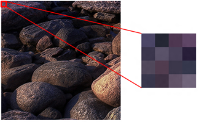
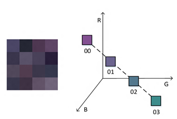
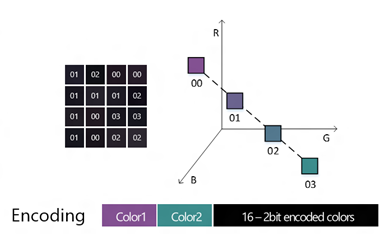

# Block compression

Starting with Windows 8.1, Direct2D supports several block compressed pixel formats. In addition, Windows 8.1 contains a new Windows Imaging Component (WIC) DDS codec to enable loading and storing block compressed images in the DDS file format. Block compression is a technique for reducing the amount of graphics memory that is consumed by bitmap content. By using block compression, your app can reduce memory consumption and load times for the same resolution images. Or, your app can use more or higher resolution images while still consuming the same GPU memory footprint.

Block compression has been used by Direct3D applications for a long time, and with Windows 8.1 is available to mainstream and Direct2D application developers as well.

This topic describes how block compression works and how to use it in WIC and Direct2D.

## About Block Compression

[Block Compression](/windows/desktop/direct3d10/d3d10-graphics-programming-guide-resources-block-compression) (BC) refers to a class of compression techniques for reducing texture sizes. Direct3D 11 supports up to 7 different BC formats depending on feature level. In Windows 8.1 Direct2D introduces support for the BC1, BC2 and BC3 formats which are available across all feature levels.

### How Block Compression works

The block compressed formats all use the same basic technique to reduce the space consumed by color data. This section summarizes the simplest algorithm, BC1. For a more detailed explanation, see [Block Compression](/windows/desktop/direct3d11/texture-block-compression-in-direct3d-11).

First, the image is divided into blocks of 4 by 4 pixels. Each block is compressed separately.

> [!Note]  
> This means an image’s width and height must each be a multiple of 4 pixel for it to be block compressed.

 

This example image shows a 4x4 pixel block within an image.

Next, within a 4 by 4 block, two “reference” colors are selected and are encoded as two 16 bit values (5 bits red, 6 bits green, 5 bits blue). The choice of these colors significantly affects image quality and is nontrivial. Two intermediate colors are calculated by linearly interpolating between the two reference colors in the RGB color space. This produces a total of 4 different possible colors; each color is assigned a two bit index value. However, note that only the two endpoint colors need to be stored as the interpolation is fixed.

In this figure, colors 0 and 3 are selected as “reference” colors for the block, while colors 1 and 2 are calculated using linear interpolation.

Finally, every pixel in the block is mapped to one of the four previously calculated colors, and each pixel is encoded using the two bit index value.

The total amount of data used to represent these 16 pixels is:

`16 bits [to define a reference color] * 2 + 2 bits * 16 [number of pixels]  = 64 bits`

This results in an average density of 4 bits per pixel. For comparison, the common DXGI\_FORMAT\_B8G8R8A8\_UNORM pixel format consumes 32 bits per pixel.

This diagram shows that each pixel is encoded as a 2 bit index. The entire block is encoded in 64 bits.

There are variations to support alpha data and varying numbers of color channels. BC6H and BC7 use significantly different algorithms in order to support high dynamic range (HDR) content and increase image quality, respectively.

### DirectDraw Surface (DDS) file format

Block compressed data is typically stored in [DirectDraw Surface (DDS)](/windows/desktop/direct3ddds/dx-graphics-dds-reference) files. You may be familiar with DDS files if you are a Direct3D developer. Note that Direct2D only supports certain DDS features; for more information see [DDS Requirements](#dds-requirements).

### Advantages of block compression

Block compressed formats differ from common industry image compression formats such as JPEG in that BC formats are natively supported by modern GPUs. This means that you can directly load a block compressed image onto the GPU without any decoding or decompression. BC formats consume from 4 to 8 bits per pixel on average; when compared to a typical uncompressed 32 bit per pixel BGRA bitmap, this results in memory savings of 75% to 87.5%. Also, because there is no decode step, the time to load a BC image is significantly reduced compared to formats like JPEG.

### When to use Block Compression

You should consider using block compressed images in your app instead of other formats such as JPEG if you want to reduce the memory consumption of bitmaps or want to reduce decode and load times.

However, block compression is not appropriate for all cases and requires some tradeoffs. First, the block compression algorithms are lossy. Block compression works well with natural photographic content but can introduce unwanted visual artifacts into images with sharp, high contrast boundaries, such as computer-generated screenshots. You should ensure that your block compressed image assets have acceptable image quality before using them.

Second, block compressed DDS files generally consume more space on disk than comparable JPEG images. This in turn will increase your app’s package size and network bandwidth requirements.

## Using Block Compression

This section explains how to generate and use block compressed assets in a Direct2D app.

### Overview

Block compressed DDS files are a runtime-optimized format, meaning that they are specifically optimized for good performance at app runtime. We recommend that you continue to use your existing asset creation and editing pipeline, and only convert to a block compressed format when you import them into your application project, or at build time.

### DDS requirements

The DDS file format was designed to support a wide range of features used in Direct3D. Direct2D only uses a subset of these features. Therefore when you are creating DDS images for use with Direct2D, you must keep in mind the following restrictions:

-   Only the following [**DXGI\_FORMAT**](/windows/desktop/api/dxgiformat/ne-dxgiformat-dxgi_format) values are allowed:
    -   DXGI\_FORMAT\_BC1\_UNORM
    -   DXGI\_FORMAT\_BC2\_UNORM
    -   DXGI\_FORMAT\_BC3\_UNORM
-   Premultiplied alpha data must be used. This includes legacy DDS files using formats that explicitly define premultiplied alpha (DXT1, DXT2, DXT4), as well as DDS files that use the DDS\_HEADER\_DX10 structure with the DDS\_ALPHA\_MODE\_OPAQUE and DDS\_ALPHA\_MODE\_PREMULTIPLIED values.
-   The X and Y dimensions must be multiples of 4 pixels.
-   Volume textures, cubemaps, mipmaps, or texture arrays are not allowed. You should only use single frame source images.

### Generating Block Compressed assets

There are a variety of DDS authoring tools available to create or convert block compressed DDS files. Note not all tools support the requirements for using DDS files with Direct2D, as detailed in the previous section.

Beginning with Visual Studio 2013, you can have Visual Studio convert existing visual assets such as JPEG and PNG to the correct DDS block compressed format as an automatic part of your build process. This is accomplished using the Image Content Task custom build step.

For information on how to set this up for your project, see: [How to: Export a Texture for Use with Direct2D or Javascipt Apps](/previous-versions/visualstudio/visual-studio-2013/dn392693(v=vs.120)).

### Direct2D APIs

Direct2D is updated in Windows 8.1 to support the following pixel formats:

-   DXGI\_FORMAT\_BC1\_UNORM
-   DXGI\_FORMAT\_BC2\_UNORM
-   DXGI\_FORMAT\_BC3\_UNORM

For the preceding formats, you must use premultiplied alpha. In addition, these formats are only valid for use as a source, not a target. For example, this means that you can create a Direct2D bitmap using BC1, but not a device context.

The following methods are updated in Windows 8.1 to support BC formats:

-   [**ID2D1DeviceContext::IsDxgiFormatSupported**](/windows/win32/api/d2d1_1/nf-d2d1_1-id2d1devicecontext-isdxgiformatsupported)
-   [**ID2D1DeviceContext::CreateBitmap**](/windows/win32/api/d2d1_1/nf-d2d1_1-id2d1devicecontext-createbitmap(d2d1_size_u_constvoid_uint32_constd2d1_bitmap_properties1__id2d1bitmap1))
-   [**ID2D1DeviceContext::CreateBitmapFromDxgiSurface**](/windows/desktop/api/d2d1_1/nf-d2d1_1-id2d1devicecontext-createbitmapfromdxgisurface(idxgisurface_constd2d1_bitmap_properties1__id2d1bitmap1))
-   [**ID2D1RenderTarget::CreateSharedBitmap**](/windows/win32/api/d2d1/nf-d2d1-id2d1rendertarget-createsharedbitmap)
-   [**ID2D1RenderTarget::CreateBitmapFromWicBitmap**](id2d1rendertarget-createbitmapfromwicbitmap.md)
-   [**ID2D1Bitmap::CopyFromMemory**](/windows/win32/api/d2d1/nf-d2d1-id2d1bitmap-copyfrommemory)
-   [**ID2D1Bitmap::CopyFromBitmap**](/windows/win32/api/d2d1/nf-d2d1-id2d1bitmap-copyfrombitmap)
-   [**ID2D1Bitmap1::GetSurface**](/windows/win32/api/d2d1_1/nf-d2d1_1-id2d1bitmap1-getsurface)

Note that [**CreateBitmapFromWicBitmap**](id2d1devicecontext-createbitmapfromwicbitmap-overload.md) takes [**IWICBitmapSource**](/windows/desktop/api/wincodec/nn-wincodec-iwicbitmapsource) as an interface; however in Windows 8.1 WIC does not support obtaining block compressed data from **IWICBitmapSource**, and there is no WIC pixel format corresponding to DXGI\_FORMAT\_BC1\_UNORM, etc. Instead, **CreateBitmapFromWicBitmap** determines if the **IWICBitmapSource** is a valid DDS [**IWICBitmapFrameDecode**](/windows/desktop/api/wincodec/nn-wincodec-iwicbitmapframedecode) and directly loads the block compressed data. You can either explicitly specify the pixel format in the [**D2D1\_BITMAP\_PROPERTIES1**](/windows/desktop/api/D2D1_1/ns-d2d1_1-d2d1_bitmap_properties1) struct, or allow Direct2D to automatically determine the correct format.

### Windows Imaging Component APIs

The Windows Imaging Component (WIC) adds a new DDS codec in Windows 8.1. In addition, it adds new interfaces that support accessing DDS-specific data, including block compressed pixel data:

-   [**IWICDdsDecoder**](/windows/desktop/api/wincodec/nn-wincodec-iwicddsdecoder)
-   [**IWICDdsEncoder**](/windows/desktop/api/wincodec/nn-wincodec-iwicddsencoder)
-   [**IWICDdsFrameDecode**](/windows/desktop/api/wincodec/nn-wincodec-iwicddsframedecode)

### Block Compressed WIC pixel formats

There are no new WIC block compressed pixel formats in Windows 8.1. Instead, if you obtain an [**IWICBitmapFrameDecode**](/windows/desktop/api/wincodec/nn-wincodec-iwicbitmapframedecode) from the DDS decoder and call [**CopyPixels**](/windows/desktop/api/wincodec/nf-wincodec-iwicbitmapsource-copypixels), you will receive standard uncompressed pixels such as WICPixelFormat32bppPBGRA. You can use [**IWICDdsFrameDecode::CopyBlocks**](/windows/desktop/api/wincodec/nf-wincodec-iwicddsframedecode-copyblocks) to obtain the raw block compressed data in the form of a memory buffer from a DDS file.

### Multi-frame DDS access

The DDS file format allows for multiple related images to be stored in a single file. For example, a DDS file may contain a cubemap, volume texture, or texture array, all of which can be mipmapped. In Direct3D, these multiple images are exposed as subresources. In WIC, multiple images are exposed as frames ([**IWICBitmapFrameDecode**](/windows/desktop/api/wincodec/nn-wincodec-iwicbitmapframedecode) and [**IWICBitmapFrameEncode**](/windows/desktop/api/wincodec/nn-wincodec-iwicbitmapframeencode)).

WIC only supports the notion of a single dimensional array of frames, while DDS supports three independent dimensions (although only two may be used in any one file). WIC provides convenience methods to assist with mapping between a DDS subresource and WIC frame. For decoding, [**IWICDdsDecoder::GetFrame**](/windows/desktop/api/wincodec/nf-wincodec-iwicddsdecoder-getframe) lets you specify the array index, mip level and slice index of the subresource, and returns the correct WIC frame.

For encoding, [**IWICDdsEncoder::CreateNewFrame**](/windows/desktop/api/wincodec/nf-wincodec-iwicddsencoder-createnewframe) computes the resulting array index, mip level and slice index when you create a new frame. You must have first called [**IWICDdsEncoder::SetParameters**](/windows/desktop/api/wincodec/nf-wincodec-iwicddsencoder-setparameters) to define the DDS-specific file parameters.

## Related topics

<dl> <dt>

[How to: Export a Texture for Use with Direct2D or Javascipt Apps](/previous-versions/visualstudio/visual-studio-2013/dn392693(v=vs.120))
</dt> <dt>

[Reference for DDS](/windows/desktop/direct3ddds/dx-graphics-dds-reference)
</dt> <dt>

[Block Compression](/windows/desktop/direct3d10/d3d10-graphics-programming-guide-resources-block-compression)
</dt> </dl>

 

 