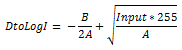
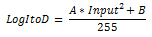

# Brightness effect

Use the brightness effect to control the brightness of the image.

The CLSID for this effect is CLSID\_D2D1Brightness.

-   [Example image](#example-image)
-   [Effect properties](#effect-properties)
-   [Output bitmap](#output-bitmap)
-   [Requirements](#requirements)
-   [Related topics](#related-topics)

## Example image


| Before                                                      |
|-------------------------------------------------------------|
|   |
| After                                                       |
|  |


 


```C++
ComPtr<ID2D1Effect> brightnessEffect;
m_d2dContext->CreateEffect(CLSID_D2D1Brightness, &brightnessEffect);

brightnessEffect->SetValue(D2D1_BRIGHTNESS_PROP_BLACK_POINT, D2D1::Vector2F(0.0f, 0.2f));

m_d2dContext->BeginDraw();
m_d2dContext->DrawImage(brightnessEffect.Get());
m_d2dContext->EndDraw();
```


## Effect properties


| Property Display Name                                                 | Type and default value                              | Description                                                                                                                                                                                                                                                                 |
|-----------------------------------------------------------------------|-----------------------------------------------------|-----------------------------------------------------------------------------------------------------------------------------------------------------------------------------------------------------------------------------------------------------------------------------|
| WhitePoint<br/> D2D1\_BRIGHTNESS\_PROP\_WHITE\_POINT<br/> | D2D1\_VECTOR\_2F<br/> {1.0f, 1.0f}<br/> | The upper portion of the brightness transfer curve. The white point adjusts the appearance of the brighter portions of the image. This property is for both the x value and the y value, in that order. Each of the values of this property are between 0 and 1, inclusive. |
| BlackPoint<br/> D2D1\_BRIGHTNESS\_PROP\_BLACK\_POINT<br/> | D2D1\_VECTOR\_2F<br/> {0.0f, 0.0f}<br/> | The lower portion of the brightness transfer curve. The black point adjusts the appearance of the darker portions of the image. This property is for both the x value and the y value, in that order. Each of the values of this property are between 0 and 1, inclusive.   |


 

This effect uses the specified white and black points to generate a transfer function used to adjust the bitmap. The next equation describes the transfer function. The input intensities are defined between 0 and 1.


The effect algorithm implements an equation that creates the transfer function. We use this function to adjust the image pixels. The x and y values of the black point and the white point are the coordinates in two dimensions that are connected to form the transform. Each part of the final output equation:

1.  Converts the image data from linear space to non-linear space using this equation:

2.  Adjusts the image according to these values:
    -   *input* is the input image pixel intensity values from 0 to 1.

    -   *White Pt. (x, y)*the location of the transform curve for brighter pixel intensities.

    -   *Black Pt. (x, y)* is the location of the transform curve for dimmer pixel intensities.

3.  Converts the image data back to linear space using this equation: 

The final output equation and the component parts are shown here.


## Output bitmap

The output bitmap size is the same as the input bitmap size.

## Requirements


| Requirement | Value |
|--------------------------|------------------------------------------------------------------------------------|
| Minimum supported client | Windows 8 and Platform Update for Windows 7 \[desktop apps \| Windows Store apps\] |
| Minimum supported server | Windows 8 and Platform Update for Windows 7 \[desktop apps \| Windows Store apps\] |
| Header                   | d2d1effects.h                                                                      |
| Library                  | d2d1.lib, dxguid.lib                                                               |


 

## Related topics

<dl> <dt>

[**ID2D1Effect**](/windows/win32/api/d2d1_1/nn-d2d1_1-id2d1effect)
</dt> </dl>

 

