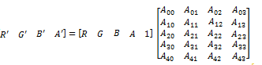

# Color matrix effect

Use the color matrix effect to alter the RGBA values of a bitmap.

You can use this effect to:

-   Remove a color channel from an image.
-   Reduce the color in an image.
-   Swap color channels.
-   Combine color channels.

Many built-in effects are specializations of color matrix that are optimized for the intended use of the effects. Examples include [saturation](saturation.md), [hue rotate](hue-rotate.md), [sepia](sepia-effect.md), and [temperature and tint](temperature-and-tint-effect.md).

The CLSID for this effect is CLSID\_D2D1ColorMatrix.

-   [Example image](#example-image)
-   [Effect properties](#effect-properties)
-   [Alpha modes](#alpha-modes)
-   [Requirements](#requirements)
-   [Related topics](#related-topics)

## Example image

The example here shows the input and output images of the color matrix effect that swaps the red and blue channels.


| Before                                                       |
|--------------------------------------------------------------|
|    |
| After                                                        |
|  |


 


```C++
ComPtr<ID2D1Effect> colorMatrixEffect;
m_d2dContext->CreateEffect(CLSID_D2D1ColorMatrix, &colorMatrixEffect);

colorMatrixEffect->SetInput(0, bitmap);
D2D1_MATRIX_5X4_F matrix = D2D1::Matrix5x4F(0, 0, 1, 0,   0, 1, 0, 0,   1, 0, 0, 0,   0, 0, 0, 1,   0, 0, 0, 0);
colorMatrixEffect->SetValue(D2D1_COLORMATRIX_PROP_COLOR_MATRIX, matrix);

m_d2dContext->BeginDraw();
m_d2dContext->DrawImage(colorMatrixEffect.Get());
m_d2dContext->EndDraw();
```


This effect multiplies the RGBA values of the image by a 5x4, column major matrix as shown in this equation.



This effect works on straight and premultiplied alpha images.

## Effect properties


| Display name and index enumeration                                       | Description                                                                                                                                                                                                                                                                                                                                                                                                                                                                                                                       |
|--------------------------------------------------------------------------|-----------------------------------------------------------------------------------------------------------------------------------------------------------------------------------------------------------------------------------------------------------------------------------------------------------------------------------------------------------------------------------------------------------------------------------------------------------------------------------------------------------------------------------|
| ColorMatrix<br/> D2D1\_COLORMATRIX\_PROP\_COLOR\_MATRIX<br/> | A 5x4 matrix of float values. The elements in the matrix are not bounded and are unitless.<br/> The default is the identity matrix.<br/> The type is D2D1\_MATRIX\_5X4\_F.<br/> The default value is Matrix5x4F(1, 0, 0, 0, 0, 1, 0, 0, 0, 0, 1, 0, 0, 0, 0, 1, 0, 0, 0, 0). <br/>                                                                                                                                                                                                                        |
| AlphaMode<br/> D2D1\_COLORMATRIX\_PROP\_ALPHA\_MODE<br/>     | The alpha mode of the output. See [Alpha modes](#alpha-modes) for more info. <br/> The type is D2D1\_COLORMATRIX\_ALPHA\_MODE.<br/> The default value is D2D1\_COLORMATRIX\_ALPHA\_MODE\_PREMULTIPLIED.<br/>                                                                                                                                                                                                                                                                                                    |
| ClampOutput<br/> D2D1\_COLORMATRIX\_PROP\_CLAMP\_OUTPUT<br/> | Whether the effect clamps color values to between 0 and 1 before the effect passes the values to the next effect in the graph. The effect clamps the values before it premultiplies the alpha .<br/> If you set this to TRUE the effect will clamp the values. If you set this to FALSE, the effect will not clamp the color values, but other effects and the output surface may clamp the values if they are not of high enough precision.<br/> The type is BOOL.<br/> The default value is FALSE.<br/> |


 

## Alpha modes


| Name                                          | Description                                                                                               |
|-----------------------------------------------|-----------------------------------------------------------------------------------------------------------|
| D2D1\_COLORMATRIX\_ALPHA\_MODE\_PREMULTIPLIED | The effect un-premultiplies the input, applies the color matrix, and premultiplies the output.<br/> |
| D2D1\_COLORMATRIX\_ALPHA\_MODE\_STRAIGHT      | The effect applies the color matrix directly to the input, and doesn't premultiply the output.<br/> |


 

## Requirements


| Requirement | Value |
|--------------------------|------------------------------------------------------------------------------------|
| Minimum supported client | Windows 8 and Platform Update for Windows 7 \[desktop apps \| Windows Store apps\] |
| Minimum supported server | Windows 8 and Platform Update for Windows 7 \[desktop apps \| Windows Store apps\] |
| Header                   | d2d1effects.h                                                                      |
| Library                  | d2d1.lib, dxguid.lib                                                               |


 

## Related topics

<dl> <dt>

[**ID2D1Effect**](/windows/win32/api/d2d1_1/nn-d2d1_1-id2d1effect)
</dt> </dl>

 

