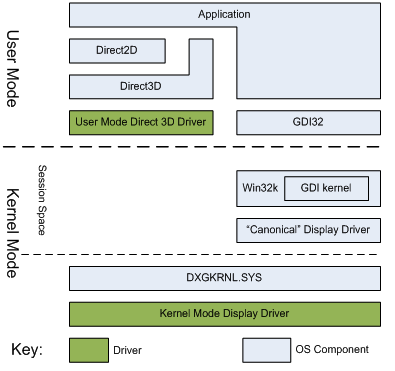
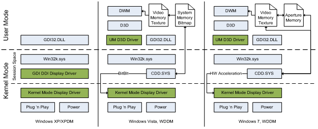

# Comparing Direct2D and GDI Hardware Acceleration

[Direct2D](./direct2d-portal.md) and [GDI](/windows/desktop/gdi/windows-gdi) are both immediate mode 2D rendering APIs and both offer some degree of hardware acceleration. This topic explores the differences between Direct2D and GDI, including past and present differences in the hardware acceleration features of both APIs.

This topic has the following parts:

-   [Differences between Direct2D and GDI](#differences-between-direct2d-and-gdi)
-   [GDI and Direct2D hardware acceleration](#gdi-and-direct2d-hardware-acceleration)
    -   [Increasing complexity and size of display drivers](#increasing-complexity-and-size-of-display-drivers)
    -   [Difficulty in synchronizing session and global kernel address spaces](#difficulty-in-synchronizing-session-and-global-kernel-address-spaces)
    -   [Composited window management](#composited-window-management)
-   [GDI rendering in Windows 7](#gdi-rendering-in-windows-7)
-   [Contrasting Direct2D and GDI acceleration in Windows 7](#contrasting-direct2d-and-gdi-acceleration-in-windows-7)
    -   [Location of resources](#location-of-resources)
    -   [Rendering method](#rendering-method)
    -   [Scalability](#scalability)
    -   [Location](#location-of-resources)
    -   [Availability of Hardware Acceleration](#availability-of-hardware-acceleration)
    -   [Presentation Model](#presentation-model)
-   [Conclusion](#conclusion)

## Differences between Direct2D and GDI

[GDI](/windows/desktop/gdi/windows-gdi) renders opaque, aliased geometries such as polygons, ellipses and lines. It renders aliased and ClearType text, and it can support transparency blending through the AlphaBlend API. However, its handling of transparency is inconsistent and most GDI APIs simply ignore the alpha channel. Few GDI APIs guarantee what the alpha channel will contain after an operation. More importantly, GDI's rendering does not map easily to 3D operations, and a modern GPU renders most efficiently on the 3D portion of its rendering engine. For example, [Direct2D](./direct2d-portal.md)'s aliased lines are designed to be implemented simply as two triangles rendered on the GPU, whereas GDI uses Bresenham's line drawing algorithm.

[Direct2D](./direct2d-portal.md) renders opaque, transparent, aliased and anti-aliased primitives. Modern UIs often make use of transparency and animation. Direct2D makes it easier to create a modern UI because it has strict guarantees on how it accepts and renders transparent content, and all of its primitives are rendered using hardware acceleration. Direct2D is not a pure superset of [GDI](/windows/desktop/gdi/windows-gdi): primitives that would have been unreasonably slow when implemented on a GPU aren't present in Direct2D. Because Direct2D is built with this emphasis on 3D acceleration it is also easy to use with Direct3D.

Since Windows NT 4, [GDI](/windows/desktop/gdi/windows-gdi) has run in kernel mode. The application calls GDI which then calls its kernel mode counterpart which passes the primitives to its own driver model. This driver then sends the results to the global kernel mode display driver.

Starting with Windows 2000, [GDI](/windows/desktop/gdi/windows-gdi) and the GDI drivers have run in an independent space in the kernel called "session space." A session address space is created for each logon session, and each instance of GDI runs independently in this distinct kernel mode address space. Direct2D, however, runs in user mode and passes drawing commands through the user mode Direct3D driver to the kernel mode driver.

## GDI and Direct2D hardware acceleration

The most important difference between [Direct2D](./direct2d-portal.md) and [GDI](/windows/desktop/gdi/windows-gdi) hardware acceleration is the underlying technology that drives them. Direct2D is layered on top Direct3D and GDI has its own driver model, the GDI Device Driver Interface (DDI), which corresponds to the GDI primitives. The Direct3D driver model corresponds to what the 3D rendering hardware in a GPU renders. When the GDI DDI was first defined, most display acceleration hardware targeted the GDI primitives. Over time, more and more emphasis was placed on 3D game acceleration and less on application acceleration. As a consequence the BitBlt API was hardware accelerated and most other GDI operations were not.

This set the stage for a sequence of changes to how [GDI](/windows/desktop/gdi/windows-gdi) renders to the display. The following illustration shows how GDI display rendering has changed from Windows XP to Windows 7.

There were also a number of additional factors that caused changes to the [GDI](/windows/desktop/gdi/windows-gdi) driver model, as explained below.

### Increasing complexity and size of display drivers

3D drivers have become more complex over time. More complex code tends to have more defects making it beneficial for the driver to exist in user-mode where a driver bug can't cause a system reboot. As can be seen in the figure above, the display driver is divided into a complex user mode component and a simpler kernel mode component.

### Difficulty in synchronizing session and global kernel address spaces

In Windows XP, a display driver exists in two different address spaces: session space and kernel space. Parts of the driver need to respond to events such as power management events. This needs to be synchronized with the driver state in the session address space. This is a difficult task and can lead to defects when display drivers attempt to deal with these distinct address spaces.

### Composited window management

The Desktop Window Manager (DWM), the compositing window manager introduced in Windows 7, renders all windows to off-screen surfaces and then composes them together to be displayed on screen. This requires [GDI](/windows/desktop/gdi/windows-gdi) to be able to render to a surface which will then be rendered by Direct3D to display. This posed a problem in the XP driver model, since GDI and Direct3D were parallel driver stacks.

As a result, in Windows Vista, the [GDI](/windows/desktop/gdi/windows-gdi) DDI display driver was implemented as the Microsoft supplied Canonical Display Driver (CDD) which rendered GDI content to a system memory bitmap to be composed to the screen.

## GDI rendering in Windows 7

The driver model used in Windows Vista required that every [GDI](/windows/desktop/gdi/windows-gdi) window be backed by both a video memory surface and a system memory surface. This resulted in system memory being used for every GDI window.

For this reason, [GDI](/windows/desktop/gdi/windows-gdi) was changed again in Windows 7. Instead of rendering to a system memory surface, GDI was modified to render to an aperture memory segment. The aperture memory can be updated from the video memory surface holding the window contents. GDI can render back to the aperture memory, and the result can then be sent back to the window surface. Since the aperture memory segment is addressable by the GPU, the GPU can accelerate these updates to the video memory surface. For example, text rendering, BitBlts, AlphaBlend, TransparentBlt, and StretchBlt are all accelerated in these cases.

## Contrasting Direct2D and GDI acceleration in Windows 7

[Direct2D](./direct2d-portal.md) and [GDI](/windows/desktop/gdi/windows-gdi) are both 2D immediate-mode rendering APIs and are hardware accelerated. However, there are a number of differences that remain in both APIs.

### Location of resources

[GDI](/windows/desktop/gdi/windows-gdi) maintains its resources, in particular bitmaps, in system memory by default. [Direct2D](./direct2d-portal.md) maintains its resources in video memory on the display adapter. When GDI needs to update video memory, this must be done over the bus, unless the resource is already in the aperture memory segment or if the operation can be expressed directly. In contrast, Direct2D can simply translate its primitives to Direct3D primitives because the resources are already in video memory.

### Rendering method

In order to maintain compatibility, [GDI](/windows/desktop/gdi/windows-gdi) performs a large part of its rendering to aperture memory using the CPU. In contrast, [Direct2D](./direct2d-portal.md) translates its APIs calls into Direct3D primitives and drawing operations. The result is then rendered on the GPU. Some of GDI?s rendering is performed on the GPU when the aperture memory is copied to the video memory surface representing the GDI window.

### Scalability

[Direct2D](./direct2d-portal.md)'s rendering calls are all independent command streams to the GPU. Each Direct2D factory represents a different Direct3D device. [GDI](/windows/desktop/gdi/windows-gdi) uses one command stream for all of the applications on the system. GDI's method can result in a buildup of GPU and CPU rendering context overhead.

### Location

[Direct2D](./direct2d-portal.md) operates entirely in user mode, including the Direct3D run time and the user mode Direct3D driver. This helps prevent system crashes caused by code defects in the kernel. [GDI](/windows/desktop/gdi/windows-gdi), however, has most of its functionality in session space in kernel mode, with its API surface in user mode.

### Availability of Hardware Acceleration

[GDI](/windows/desktop/gdi/windows-gdi) is hardware accelerated on Windows XP, and accelerated on Windows 7 when the Desktop Window Manager is running and a WDDM 1.1 driver is in use. [Direct2D](./direct2d-portal.md) is hardware accelerated on almost any WDDM driver and whether or not DWM is in use. On Vista, GDI will always render on the CPU.

### Presentation Model

When Windows was first designed, there was insufficient memory to allow every window to be stored in its own bitmap. As a result, [GDI](/windows/desktop/gdi/windows-gdi) always rendered logically directly to the screen, with various clipping regions applied to ensure that an application did not render outside of its window. In the [Direct2D](./direct2d-portal.md) model, an application renders to a back-buffer, and the result is displayed when the application is done drawing. This allows Direct2D to handle animation scenarios much more fluidly than GDI can.

## Conclusion

Existing [GDI](/windows/desktop/gdi/windows-gdi) code will continue to work well under Windows 7. However, when writing new graphics rendering code, [Direct2D](./direct2d-portal.md) should be considered, as it takes better advantage of modern GPUs.

 

 
