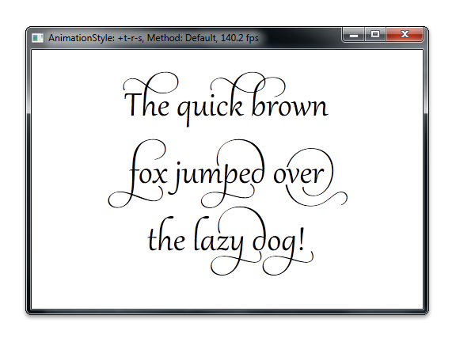

# Compatible A8 render targets overview

This topic describes the basics of a compatible A8 render target, and provides examples of how to use it.

A compatible A8 render target is a compatible render target ([**ID2D1BitmapRenderTarget**](/windows/win32/api/d2d1/nn-d2d1-id2d1bitmaprendertarget)) that uses an A8 pixel format (DXGI\_FORMAT\_A8\_UNORM). You can use a compatible A8 render target to improve the application's performance and provide smoother transitions during text animation. A compatible A8 render target is particular useful when you try to improve the following:

-   The frame rate of the application that renders text or anti-aliased geometry that includes only simple animations, such as translation, rotation, scale, or color changes.

-   The visual continuity of the application that stretches and diminshes text during an animation.

To create a compatible A8 render target, use the [**ID2D1RenderTarget::CreateCompatibleRenderTarget**](/windows/win32/api/d2d1/nf-d2d1-id2d1rendertarget-createcompatiblerendertarget(id2d1bitmaprendertarget)) method together with the DXGI\_FORMAT\_A8\_UNORM pixel format, and specify a returned compatible render target. For more information about pixel formats, see [Supported pixel formats and alpha modes](./supported-pixel-formats-and-alpha-modes.md).

For example, to efficiently animate the text that is shown in the following screen shot, use a compatible A8 render target to cache the text as an opacity mask. Then, apply transformations to the opacity mask to achieve fast rendering results.



The following code shows how to do this. It creates a compatible A8 render target, retrieves the bitmap from it, and then renders the bitmap by using [**FillOpacityMask**](id2d1rendertarget-fillopacitymask.md).

```cpp
ID2D1BitmapRenderTarget *m_pOpacityRT;

// Create the compatible render target using desiredPixelSize to avoid
// blurriness issues caused by a fractional-pixel desiredSize.

D2D1_PIXEL_FORMAT alphaOnlyFormat = D2D1::PixelFormat(
    DXGI_FORMAT_A8_UNORM, 
    D2D1_ALPHA_MODE_PREMULTIPLIED);

hr = m_pRT->CreateCompatibleRenderTarget(
    NULL,
    &maskPixelSize,
    &alphaOnlyFormat,
    D2D1_COMPATIBLE_RENDER_TARGET_OPTIONS_NONE,
    &m_pOpacityRT
    );

D2D1_RECT_F destinationRect = D2D1::RectF(
    roundedOffset.x,
    roundedOffset.y,
    roundedOffset.x + opacityRTSize.width,
    roundedOffset.y + opacityRTSize.height
    );

ID2D1Bitmap *pBitmap = NULL;
m_pOpacityRT->GetBitmap(&pBitmap);

pBitmap->GetDpi(&dpiX, &dpiY);

// The antialias mode must be set to D2D1_ANTIALIAS_MODE_ALIASED
// for this method to succeed. We've set this mode already though
// so no need to do it again.

m_pRT->FillOpacityMask(
    pBitmap,
    m_pBlackBrush,
    D2D1_OPACITY_MASK_CONTENT_TEXT_NATURAL,
    &destinationRect
    );

pBitmap->Release();
```

## Related topics

[Direct2D Reference](reference.md)