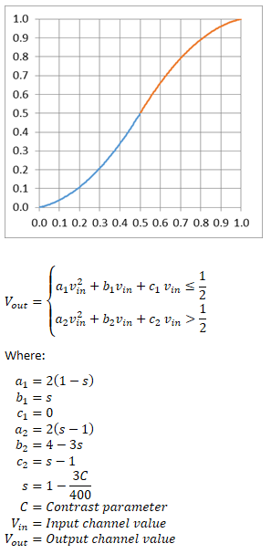

# Contrast effect

Increases or decreases the contrast of an image.

The CLSID for this effect is CLSID\_D2D1Contrast.

The contrast function modifies each color channel value using two, piecewise quadratic polynomials that meet with slope continuity at the point (0.5, 0.5).



-   [Example Images](#example-images)
-   [Sample Code](#sample-code)
-   [Effect Properties](#effect-properties)
-   [Requirements](#requirements)
-   [Related topics](#related-topics)

## Example images

This example shows the output of the effect with maximum contrast applied (Contrast = 1.0).

Before


After


## Sample code

```cpp
ComPtr<ID2D1Effect> contrastEffect;
m_d2dContext->CreateEffect(CLSID_D2D1Contrast, &contrastEffect);
 
contrastEffect->SetInput(0, bitmap);
contrastEffect->SetValue(D2D1_CONTRAST_PROP_CONTRAST, 0.5f);
contrastEffect->SetValue(D2D1_CONTRAST_PROP_CLAMP_INPUT, TRUE);
 
m_d2dContext->BeginDraw();
m_d2dContext->DrawImage(contrastEffect.Get());
m_d2dContext->EndDraw();
```

## Effect properties

The properties for the contrast effect are defined by the [**D2D1\_CONTRAST\_PROP**](/windows/desktop/api/d2d1effects_2/ne-d2d1effects_2-d2d1_contrast_prop) enumeration.

## Requirements

| Requirement | Value |
|--------------------------|---------------------------------------------------|
| Minimum supported client | Windows 10 \[desktop apps \| Windows Store apps\] |
| Minimum supported server | Windows 10 \[desktop apps \| Windows Store apps\] |
| Header                   | d2d1effects\_2.h                                  |
| Library                  | d2d1.lib, dxguid.lib                              |

## Related topics

* [ID2D1Effect interface](/windows/desktop/api/d2d1_1/nn-d2d1_1-id2d1effect)
