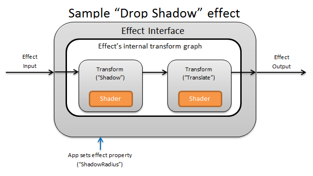
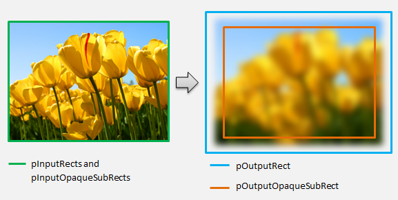
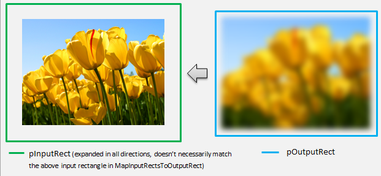

# Custom effects

[Direct2D](./direct2d-portal.md) ships with a library of effects that perform a variety of common image operations. See the [built-in effects](built-in-effects.md) topic for the complete list of effects. For functionality that cannot be achieved with the built-in effects, Direct2D allows you to write your own custom effects using standard [HLSL](/windows/desktop/direct3dhlsl/overviews-direct3d-11-hlsl). You can use these custom effects alongside the built-in effects that ship with Direct2D.

To see examples of a complete pixel, vertex, and compute shader effect, see the [D2DCustomEffects SDK sample](https://github.com/Microsoft/Windows-universal-samples/tree/master/Samples/D2DCustomEffects).

In this topic, we show you the steps and concepts you need to design and create a fully-featured custom effect.

## Introduction: What is inside an effect?



Conceptually, a [Direct2D](./direct2d-portal.md) effect performs an imaging task, like changing brightness, de-saturating an image, or as shown above, creating a drop shadow. To the app, they are simple. They can accept zero or more input images, expose multiple properties that control their operation, and generate a single output image.

There are four different parts of a custom effect that an effect author is responsible for:

1.  Effect Interface: The effect interface conceptually defines how an app interacts with a custom effect (like how many inputs the effect accepts and what properties are available). The effect interface manages a transform graph, which contains the actual imaging operations.
2.  Transform graph: Each effect creates an internal transform graph made up of individual transforms. Each transform represents a single image operation. The effect is responsible for linking these transforms together into a graph to perform the intended imaging effect. An effect can add, remove, modify, and reorder transforms in response to changes to the effect's external properties.
3.  Transform: A transform represents a single image operation. Its main purpose is to house the shaders that are executed for each output pixel. To that end, it is responsible for calculating the new size of its output image based on logic in its shaders. It also must calculate which area of its input image the shaders need to read from to render the requested output region.
4.  Shader: A shader is executed against the transform's input on the GPU (or CPU if software rendering is specified when the app creates the Direct3D device). Effect shaders are written in High Level Shading Language ([HLSL](/windows/desktop/direct3dhlsl/overviews-direct3d-11-hlsl)) and are compiled into byte code during the effect's compilation, which is then loaded by the effect during run-time. This reference document describes how to write [Direct2D](./direct2d-portal.md)-compliant HLSL. The Direct3D documentation contains a basic HLSL overview.

## Creating an effect interface

The effect interface defines how an app interacts with the custom effect. To create an effect interface, a class must implement ID2D1EffectImpl, define metadata that describes the effect (such as its name, input count and properties), and create methods that register the custom effect for use with [Direct2D](./direct2d-portal.md).

Once all of the components for an effect interface have been implemented, the class' header will appear like this:


```C++
#include <d2d1_1.h>
#include <d2d1effectauthor.h>  
#include <d2d1effecthelpers.h>

// Example GUID used to uniquely identify the effect. It is passed to Direct2D during
// effect registration, and used by the developer to identify the effect for any
// ID2D1DeviceContext::CreateEffect calls in the app. The app should create
// a unique name for the effect, as well as a unique GUID using a generation tool.
DEFINE_GUID(CLSID_SampleEffect, 0x00000000, 0x0000, 0x0000, 0x00, 0x00, 0x00, 0x00, 0x00, 0x00, 0x00, 0x00);

class SampleEffect : public ID2D1EffectImpl
{
public:
    // 2.1 Declare ID2D1EffectImpl implementation methods.
    IFACEMETHODIMP Initialize(
        _In_ ID2D1EffectContext* pContextInternal,
        _In_ ID2D1TransformGraph* pTransformGraph
        );

    IFACEMETHODIMP PrepareForRender(D2D1_CHANGE_TYPE changeType);
    IFACEMETHODIMP SetGraph(_In_ ID2D1TransformGraph* pGraph);

    // 2.2 Declare effect registration methods.
    static HRESULT Register(_In_ ID2D1Factory1* pFactory);
    static HRESULT CreateEffect(_Outptr_ IUnknown** ppEffectImpl);

    // 2.3 Declare IUnknown implementation methods.
    IFACEMETHODIMP_(ULONG) AddRef();
    IFACEMETHODIMP_(ULONG) Release();
    IFACEMETHODIMP QueryInterface(_In_ REFIID riid, _Outptr_ void** ppOutput);

private:
    // Constructor should be private since it should never be called externally.
    SampleEffect();

    LONG m_refCount; // Internal ref count used by AddRef() and Release() methods.
};
```


### Implement ID2D1EffectImpl

The [**ID2D1EffectImpl**](/windows/win32/api/d2d1effectauthor/nn-d2d1effectauthor-id2d1effectimpl) interface contains three methods that you must implement:

### Initialize(ID2D1EffectContext \*pContextInternal, ID2D1TransformGraph \*pTransformGraph)

[Direct2D](./direct2d-portal.md) calls the [**Initialize**](/windows/win32/api/d2d1effectauthor/nf-d2d1effectauthor-id2d1effectimpl-initialize) method after the [**ID2D1DeviceContext::CreateEffect**](/windows/win32/api/d2d1_1/nf-d2d1_1-id2d1devicecontext-createeffect) method has been called by the app. You can use this method to perform internal initialization or any other operations needed for the effect. Additionally, you can use it to create the effect's initial transform graph.

### SetGraph(ID2D1TransformGraph \*pTransformGraph)

[Direct2D](./direct2d-portal.md) calls the [**SetGraph**](/windows/win32/api/d2d1effectauthor/nf-d2d1effectauthor-id2d1effectimpl-setgraph) method when the number of inputs to the effect is changed. While most effects have a constant number of inputs, others like the [Composite effect](composite.md) support a variable number of inputs. This method allows these effects to update their transform graph in response to a changing input count. If an effect does not support a variable input count, this method can simply return E\_NOTIMPL.

### PrepareForRender (D2D1\_CHANGE\_TYPE changeType)

The [**PrepareForRender**](/windows/win32/api/d2d1effectauthor/nf-d2d1effectauthor-id2d1effectimpl-prepareforrender) method provides an opportunity for effects to perform any operations in response to external changes. [Direct2D](./direct2d-portal.md) calls this method just before it renders an effect if at least one of these is true:

-   The effect has been previously initialized but not yet drawn.
-   An effect property has changed since the last draw call.
-   The state of the calling [Direct2D](./direct2d-portal.md) context (like DPI) has changed since the last draw call.

### Implement the effect registration and callback methods

Apps must register effects with [Direct2D](./direct2d-portal.md) before instantiating them. This registration is scoped to an instance of a Direct2D factory, and must be repeated each time the app is run. To enable this registration, a custom effect defines a unique GUID, a public method that registers the effect, and a private callback method that returns an instance of the effect.

### Define a GUID

You must define a GUID that uniquely identifies the effect for registration with [Direct2D](./direct2d-portal.md). The app uses the same to identify the effect when it calls [**ID2D1DeviceContext::CreateEffect**](/windows/win32/api/d2d1_1/nf-d2d1_1-id2d1devicecontext-createeffect).

This code demonstrates defining such a GUID for an effect. You must create its own unique GUID using a GUID generation tool such as guidgen.exe.


```C++
// Example GUID used to uniquely identify the effect. It is passed to Direct2D during
// effect registration, and used by the developer to identify the effect for any
// ID2D1DeviceContext::CreateEffect calls in the app. The app should create
// a unique name for the effect, as well as a unique GUID using a generation tool.
DEFINE_GUID(CLSID_SampleEffect, 0x00000000, 0x0000, 0x0000, 0x00, 0x00, 0x00, 0x00, 0x00, 0x00, 0x00, 0x00);
```


### Define a public registration method

Next, define a public method for the app to call to register the effect with [Direct2D](./direct2d-portal.md). Because effect registration is specific to an instance of a Direct2D factory, the method accepts an [**ID2D1Factory1**](/windows/win32/api/d2d1_1/nn-d2d1_1-id2d1factory1) interface as a parameter. To register the effect, the method then calls the [**ID2D1Factory1::RegisterEffectFromString**](/windows/win32/api/d2d1_1/nf-d2d1_1-id2d1factory1-registereffectfromstring) API on the **ID2D1Factory1** parameter.

This API accepts an XML string that describes the metadata, inputs, and properties of the effect. The metadata for an effect is for informational purposes only, and can be queried by the app through the [**ID2D1Properties**](/windows/win32/api/d2d1_1/nn-d2d1_1-id2d1properties) interface. The input and property data, on the other hand, is used by [Direct2D](./direct2d-portal.md) and represents the effect's functionality.

An XML string for a minimal sample effect is shown here. Adding custom properties to the XML is covered in the Adding custom properties to an effect section.


```XML
#define XML(X) TEXT(#X) // This macro creates a single string from multiple lines of text.

PCWSTR pszXml =
    XML(
        <?xml version='1.0'?>
        <Effect>
            <!-- System Properties -->
            <Property name='DisplayName' type='string' value='SampleEffect'/>
            <Property name='Author' type='string' value='Contoso'/>
            <Property name='Category' type='string' value='Sample'/>
            <Property name='Description' type='string' value='This is a demo effect.'/>
            <Inputs>
                <Input name='SourceOne'/>
                <!-- <Input name='SourceTwo'/> -->
                <!-- Additional inputs go here. -->
            </Inputs>
            <!-- Custom Properties go here. -->
        </Effect>
        );
```


### Define an effect factory callback method

The effect must also provide a private callback method that returns an instance of the effect through a single IUnknown\*\* parameter. A pointer to this method is provided to [Direct2D](./direct2d-portal.md) when the effect is registered via the [**ID2D1Factory1::RegisterEffectFromString**](/windows/win32/api/d2d1_1/nf-d2d1_1-id2d1factory1-registereffectfromstring) API through the [**PD2D1\_EFFECT\_FACTORY**](/windows/desktop/api/D2D1_1/nc-d2d1_1-pd2d1_effect_factory)\\ parameter.


```C++
HRESULT __stdcall SampleEffect::CreateEffect(_Outptr_ IUnknown** ppEffectImpl)
{
    // This code assumes that the effect class initializes its reference count to 1.
    *ppEffectImpl = static_cast<ID2D1EffectImpl*>(new SampleEffect());

    if (*ppEffectImpl == nullptr)
    {
        return E_OUTOFMEMORY;
    }

    return S_OK;
}
```


### Implement the IUnknown interface

Finally, the effect must implement the IUnknown interface for compatibility with COM.

## Creating the effect's transform graph

An effect can use several different transforms (individual image operations) to create its desired imaging effect. To control the order in which these transforms are applied to the input image, the effect arranges them into a transform graph. A transform graph can make use of the effects and transforms included in [Direct2D](./direct2d-portal.md) as well as custom transforms created by the effect author.

### Using transforms included with Direct2D

These are the most commonly used transforms provided with [Direct2D](./direct2d-portal.md).

-   [**ID2D1BlendTransform**](/windows/win32/api/d2d1effectauthor/nn-d2d1effectauthor-id2d1blendtransform): This transform blends an arbitrary number of inputs together based on a blend description, see the [**D2D1\_BLEND\_DESCRIPTION**](/windows/desktop/api/D2d1effectauthor/ns-d2d1effectauthor-d2d1_blend_description) topic and the [Direct2D composite effect modes sample](https://github.com/microsoftarchive/msdn-code-gallery-microsoft/tree/master/Official%20Windows%20Platform%20Sample/Direct2D%20composite%20effect%20modes%20sample) for blending examples. This transform is returned by the [**ID2D1EffectContext::CreateBlendTransform**](/windows/win32/api/d2d1effectauthor/nf-d2d1effectauthor-id2d1effectcontext-createblendtransform) method.
-   [**ID2D1BorderTransform**](/windows/win32/api/d2d1effectauthor/nn-d2d1effectauthor-id2d1bordertransform): This transform expands an image's output size according to the [**D2D1\_EXTEND\_MODE**](/windows/desktop/api/d2d1/ne-d2d1-d2d1_extend_mode) specified. This transform is returned by the [**ID2D1EffectContext::CreateBorderTransform**](/windows/win32/api/d2d1effectauthor/nf-d2d1effectauthor-id2d1effectcontext-createbordertransform) method.
-   [**ID2D1OffsetTransform**](/windows/win32/api/d2d1effectauthor/nn-d2d1effectauthor-id2d1offsettransform): This transform offsets (translates) its input by any whole number of pixels. This transform is returned by the [**ID2D1EffectContext::CreateOffsetTransform**](/windows/win32/api/d2d1effectauthor/nf-d2d1effectauthor-id2d1effectcontext-createoffsettransform) method.
-   Any existing effect can be treated as a transform for the purposes of transform graph creation by using the [**ID2D1EffectContext::CreateTransformNodeFromEffect**](/windows/win32/api/d2d1effectauthor/nf-d2d1effectauthor-id2d1effectcontext-createtransformnodefromeffect) method.

### Creating a single-node transform graph

Once you create a transform, the effect's input needs to be connected to the transform's input, and the transform's output needs to be connected to the effect's output. When an effect only contains a single transform, you can use the [**ID2D1TransformGraph::SetSingleTransformNode**](/windows/win32/api/d2d1effectauthor/nf-d2d1effectauthor-id2d1transformgraph-setsingletransformnode) method to easily accomplish this.

You can create or modify a transform in the effect's [**Initialize**](/windows/win32/api/d2d1effectauthor/nf-d2d1effectauthor-id2d1effectimpl-initialize) or [**SetGraph**](/windows/win32/api/d2d1effectauthor/nf-d2d1effectauthor-id2d1effectimpl-setgraph) methods using the provided ID2D1TransformGraph parameter. If an effect needs to make changes to the transform graph in another method where this parameter is not available, the effect can save the [**ID2D1TransformGraph**](/windows/win32/api/d2d1effectauthor/nn-d2d1effectauthor-id2d1transformgraph) parameter as a member variable of the class and access it elsewhere, such as [**PrepareForRender**](/windows/win32/api/d2d1effectauthor/nf-d2d1effectauthor-id2d1effectimpl-prepareforrender) or a custom property callback method.

A sample [**Initialize**](/windows/win32/api/d2d1effectauthor/nf-d2d1effectauthor-id2d1effectimpl-initialize) method is shown here. This method creates a single-node transform graph that offsets the image by one hundred pixels in each axis.


```C++
IFACEMETHODIMP SampleEffect::Initialize(
    _In_ ID2D1EffectContext* pEffectContext,
    _In_ ID2D1TransformGraph* pTransformGraph
    )
{
    HRESULT hr = pEffectContext->CreateOffsetTransform(
        D2D1::Point2L(100,100),  // Offsets the input by 100px in each axis.
        &m_pOffsetTransform
        );

    if (SUCCEEDED(hr))
    {
        // Connects the effect's input to the transform's input, and connects
        // the transform's output to the effect's output.
        hr = pTransformGraph->SetSingleTransformNode(m_pOffsetTransform);
    }

    return hr;
}
```


### Creating a multi-node transform graph

Adding multiple transforms to an effect's transform graph allows effects to internally perform multiple image operations that are presented to an app as a single unified effect.

As noted above, the effect's transform graph may be edited in any effect method using the [**ID2D1TransformGraph**](/windows/win32/api/d2d1effectauthor/nn-d2d1effectauthor-id2d1transformgraph) parameter received in the effect's [**Initialize**](/windows/win32/api/d2d1effectauthor/nf-d2d1effectauthor-id2d1effectimpl-initialize) method. The following APIs on that interface can be used to create or modify an effect's transform graph:

### AddNode(ID2D1TransformNode \*pNode)

The [**AddNode**](/windows/win32/api/d2d1effectauthor/nf-d2d1effectauthor-id2d1transformgraph-addnode) method, in effect, 'registers' the transform with the effect, and must be called before the transform can be used with any of the other transform graph methods.

### ConnectToEffectInput(UINT32 toEffectInputIndex, ID2D1TransformNode \*pNode, UINT32 toNodeInputIndex)

The [**ConnectToEffectInput**](/windows/win32/api/d2d1effectauthor/nf-d2d1effectauthor-id2d1transformgraph-connecttoeffectinput) method connects the effect's image input to a transform's input. The same effect input can be connected to multiple transforms.

### ConnectNode(ID2D1TransformNode \*pFromNode, ID2D1TransformNode \*pToNode, UINT32 toNodeInputIndex)

The [**ConnectNode**](/windows/win32/api/d2d1effectauthor/nf-d2d1effectauthor-id2d1transformgraph-connectnode) method connects a transform's output to another transform's input. A transform output can be connected to multiple transforms.

### SetOutputNode(ID2D1TransformNode \*pNode)

The [**SetOutputNode**](/windows/win32/api/d2d1effectauthor/nf-d2d1effectauthor-id2d1transformgraph-setoutputnode) method connects a transform's output to the effect's output. Because an effect only has one output, only a single transform can be designated as the 'output node'.

This code uses two separate transforms to create a unified effect. In this case, the effect is a translated drop shadow.


```C++
IFACEMETHODIMP SampleEffect::Initialize(
    _In_ ID2D1EffectContext* pEffectContext, 
    _In_ ID2D1TransformGraph* pTransformGraph
    )
{   
    // Create the shadow effect.
    HRESULT hr = pEffectContext->CreateEffect(CLSID_D2D1Shadow, &m_pShadowEffect);

    // Create the shadow transform from the shadow effect.
    if (SUCCEEDED(hr))
    {
        hr = pEffectContext->CreateTransformNodeFromEffect(m_pShadowEffect, &m_pShadowTransform);
    }

    // Create the offset transform.
    if (SUCCEEDED(hr))
    {
        hr = pEffectContext->CreateOffsetTransform(
            D2D1::Point2L(0,0),
            &m_pOffsetTransform
            );
    }

    // Register both transforms with the effect graph.
    if (SUCCEEDED(hr))
    {
        hr = pTransformGraph->AddNode(m_pShadowTransform);
    }

    if (SUCCEEDED(hr))
    {
        hr = pTransformGraph->AddNode(m_pOffsetTransform);
    }

    // Connect the custom effect's input to the shadow transform's input.
    if (SUCCEEDED(hr))
    {
        hr = pTransformGraph->ConnectToEffectInput(
            0,                  // Input index of the effect.
            m_pShadowTransform, // The receiving transform.
            0                   // Input index of the receiving transform.
            );
    }

    // Connect the shadow transform's output to the offset transform's input.
    if (SUCCEEDED(hr))
    {
        hr = pTransformGraph->ConnectNode(
            m_pShadowTransform, // 'From' node.
            m_pOffsetTransform, // 'To' node.
            0                   // Input index of the 'to' node. There is only one output for the 'From' node.
            );
    }

    // Connect the offset transform's output to the custom effect's output.
    if (SUCCEEDED(hr))
    {
        hr = pTransformGraph->SetOutputNode(
            m_pOffsetTransform
            );
    }

    return hr;
}
```


## Adding custom properties to an effect

Effects can define custom properties that allow an app to change the effect's behavior during runtime. There are three steps to define a property for a custom effect:

### Add the property metadata to the effect's registration data

### Add property to registration XML

You must define a custom effect's properties during the effect's initial registration with [Direct2D](./direct2d-portal.md). First, you must update the effect's registration XML in its public registration method with the new property:


```C++
PCWSTR pszXml =
    TEXT(
        <?xml version='1.0'?>
        <Effect>
            <!-- System Properties -->
            <Property name='DisplayName' type='string' value='SampleEffect'/>
            <Property name='Author' type='string' value='Contoso'/>
            <Property name='Category' type='string' value='Sample'/>
            <Property name='Description'
                type='string'
                value='Translates an image by a user-specifiable amount.'/>
            <Inputs>
                <Input name='Source'/>
                <!-- Additional inputs go here. -->
            </Inputs>
            <!-- Custom Properties go here. -->
            <Property name='Offset' type='vector2'>
                <Property name='DisplayName' type='string' value='Image Offset'/>
                <!— Optional sub-properties -->
                <Property name='Min' type='vector2' value='(-1000.0, -1000.0)' />
                <Property name='Max' type='vector2' value='(1000.0, 1000.0)' />
                <Property name='Default' type='vector2' value='(0.0, 0.0)' />
            </Property>
        </Effect>
        );
```


When you define an effect property in XML, it needs a name, a type, and a display name. A property's display name, as well as the overall effect's category, author, and description values can and should be localized.

For each property, an effect can optionally specify default, min, and max values. These values are for informational use only. They are not enforced by [Direct2D](./direct2d-portal.md). It is up to you to implement any specified default/min/max logic in the effect class yourself.

The type value listed in the XML for the property must match the corresponding data type used by the property's getter and setter methods. Corresponding XML values for each data type are shown in this table:


| Data type                                                                                                                              | Corresponding XML value |
|----------------------------------------------------------------------------------------------------------------------------------------|-------------------------|
| PWSTR                                                                                                                                  | string                  |
| BOOL                                                                                                                                   | bool                    |
| UINT                                                                                                                                   | uint32                  |
| INT                                                                                                                                    | int32                   |
| FLOAT                                                                                                                                  | float                   |
| [**D2D\_VECTOR\_2F**](/windows/desktop/api/dcommon/ns-dcommon-d2d_vector_2f)                                                                                               | vector2                 |
| [**D2D\_VECTOR\_3F**](/windows/desktop/api/dcommon/ns-dcommon-d2d_vector_3f)                                                                                               | vector3                 |
| [**D2D\_VECTOR\_4F**](/windows/desktop/api/dcommon/ns-dcommon-d2d_vector_4f)                                                                                               | vector4                 |
| [**D2D\_MATRIX\_3X2\_F**](/windows/win32/api/d2d1/nf-d2d1-id2d1geometry-strokecontainspoint(d2d1_point_2f_float_id2d1strokestyle_constd2d1_matrix_3x2_f__bool)) | matrix3x2               |
| [**D2D\_MATRIX\_4X3\_F**](/windows/desktop/api/dcommon/ns-dcommon-d2d_matrix_4x3_f)                                                                                        | matrix4x3               |
| [**D2D\_MATRIX\_4X4\_F**](/windows/desktop/api/dcommon/ns-dcommon-d2d_matrix_4x4_f)                                                                                        | matrix4x4               |
| [**D2D\_MATRIX\_5X4\_F**](/windows/desktop/api/dcommon/ns-dcommon-d2d_matrix_5x4_f)                                                                                        | matrix5x4               |
| BYTE\[\]                                                                                                                               | blob                    |
| IUnknown\*                                                                                                                             | iunknown                |
| [**ID2D1ColorContext**](/windows/win32/api/d2d1_1/nn-d2d1_1-id2d1colorcontext)\*                                                                                       | colorcontext            |
| CLSID                                                                                                                                  | clsid                   |
| Enumeration ([**D2D1\_INTERPOLATION\_MODE**](/windows/desktop/api/d2d1_1/ne-d2d1_1-d2d1_interpolation_mode), etc.)                                                | enum                    |


 

### Map the new property to getter and setter methods

Next, the effect must map this new property to getter and setter methods. This is done through the [**D2D1\_PROPERTY\_BINDING**](/windows/desktop/api/d2d1effectauthor/ns-d2d1effectauthor-d2d1_property_binding) array that is passed into the [**ID2D1Factory1::RegisterEffectFromString**](/windows/win32/api/d2d1_1/nf-d2d1_1-id2d1factory1-registereffectfromstring) method.

The [**D2D1\_PROPERTY\_BINDING**](/windows/desktop/api/d2d1effectauthor/ns-d2d1effectauthor-d2d1_property_binding) array looks like this:


```C++
const D2D1_PROPERTY_BINDING bindings[] =
{
    D2D1_VALUE_TYPE_BINDING(
        L"Offset",      // The name of property. Must match name attribute in XML.
        &SetOffset,     // The setter method that is called on "SetValue".
        &GetOffset      // The getter method that is called on "GetValue".
        )
};
```


Once you create the XML and bindings array, pass them into the [**RegisterEffectFromString**](/windows/win32/api/d2d1_1/nf-d2d1_1-id2d1factory1-registereffectfromstring) method:


```C++
pFactory->RegisterEffectFromString(
    CLSID_SampleEffect,  // GUID defined in class header file.
    pszXml,              // Previously-defined XML that describes effect.
    bindings,            // The previously-defined property bindings array.
    ARRAYSIZE(bindings), // Number of entries in the property bindings array.    
    CreateEffect         // Static method that returns an instance of the effect's class.
    );
```


The D2D1\_VALUE\_TYPE\_BINDING macro requires the effect class to inherit from [**ID2D1EffectImpl**](/windows/win32/api/d2d1effectauthor/nn-d2d1effectauthor-id2d1effectimpl) before any other interface.

Custom properties for an effect are indexed in the order they are declared in the XML, and once created can be accessed by the app using the [**ID2D1Properties::SetValue**](id2d1properties-setvalue-overload.md) and [**ID2D1Properties::GetValue**](id2d1properties-getvalue-overload.md) methods. For convenience, you can create a public enumeration that lists each property in the effect's header file:


```C++
typedef enum SAMPLEEFFECT_PROP
{
    SAMPLEFFECT_PROP_OFFSET = 0
};
```


### Create the getter and setter methods for the property

The next step is to create the getter and setter methods for the new property. The names of the methods must match the ones specified in the [**D2D1\_PROPERTY\_BINDING**](/windows/desktop/api/d2d1effectauthor/ns-d2d1effectauthor-d2d1_property_binding) array. In addition, the property type specified in the effect's XML must match the type of the setter method's parameter and the getter method's return value.


```C++
HRESULT SampleEffect::SetOffset(D2D_VECTOR_2F offset)
{
    // Method must manually clamp to values defined in XML.
    offset.x = min(offset.x, 1000.0f); 
    offset.x = max(offset.x, -1000.0f); 

    offset.y = min(offset.y, 1000.0f); 
    offset.y = max(offset.y, -1000.0f); 

    m_offset = offset;

    return S_OK;
}

D2D_VECTOR_2F SampleEffect::GetOffset() const
{
    return m_offset;
}
```


### Update effect's transforms in response to property change

To actually update an effect's image output in response to a property change, the effect needs to change its underlying transforms. This is typically done in the effect's [**PrepareForRender**](/windows/win32/api/d2d1effectauthor/nf-d2d1effectauthor-id2d1effectimpl-prepareforrender) method which [Direct2D](./direct2d-portal.md) automatically calls when one of an effect's properties has been changed. However, transforms can be updated in any of the effect's methods: such as Initialize or the effect's property setter methods.

For example, if an effect contained an [**ID2D1OffsetTransform**](/windows/win32/api/d2d1effectauthor/nn-d2d1effectauthor-id2d1offsettransform) and wanted to modify its offset value in response to the effect's Offset property being changed, it would add the following code in [**PrepareForRender**](/windows/win32/api/d2d1effectauthor/nf-d2d1effectauthor-id2d1effectimpl-prepareforrender):


```C++
IFACEMETHODIMP SampleEffect::PrepareForRender(D2D1_CHANGE_TYPE changeType)
{
    // All effect properties are DPI independent (specified in DIPs). In this offset
    // example, the offset value provided must be scaled from DIPs to pixels to ensure
    // a consistent appearance at different DPIs (excluding minor scaling artifacts).
    // A context's DPI can be retrieved using the ID2D1EffectContext::GetDPI API.
    
    D2D1_POINT_2L pixelOffset;
    pixelOffset.x = static_cast<LONG>(m_offset.x * (m_dpiX / 96.0f));
    pixelOffset.y = static_cast<LONG>(m_offset.y * (m_dpiY / 96.0f));
    
    // Update the effect's offset transform with the new offset value.
    m_pOffsetTransform->SetOffset(pixelOffset);

    return S_OK;
}
```


## Creating a custom transform

To implement image operations beyond what is provided in [Direct2D](./direct2d-portal.md), you must implement custom transforms. Custom transforms can arbitrarily change an input image through the use of custom HLSL shaders.

Transforms implement one of two different interfaces depending on the types of shaders they use. Transforms using pixel and/or vertex shaders must implement [**ID2D1DrawTransform**](/windows/win32/api/d2d1effectauthor/nn-d2d1effectauthor-id2d1drawtransform), while transforms using compute shaders must implement [**ID2D1ComputeTransform**](/windows/win32/api/d2d1effectauthor/nn-d2d1effectauthor-id2d1computetransform). These interfaces both inherit from [**ID2D1Transform**](/windows/win32/api/d2d1effectauthor/nn-d2d1effectauthor-id2d1transform). This section focuses on implementing the functionality that is common to both.

The [**ID2D1Transform**](/windows/win32/api/d2d1effectauthor/nn-d2d1effectauthor-id2d1transform) interface has four methods to implement:

### GetInputCount

This method returns an integer representing the input count for the transform.


```C++
IFACEMETHODIMP_(UINT32) GetInputCount() const
{
    return 1;
}
```


### MapInputRectsToOutputRect

[Direct2D](./direct2d-portal.md) calls the [**MapInputRectsToOutputRect**](/windows/win32/api/d2d1effectauthor/nf-d2d1effectauthor-id2d1transform-mapinputrectstooutputrect) method each time the transform is rendered. Direct2D passes a rectangle representing the bounds of each of the inputs to the transform. The transform is then responsible for calculating the bounds of the output image. The size of the rectangles for all the methods on this interface ([**ID2D1Transform**](/windows/win32/api/d2d1effectauthor/nn-d2d1effectauthor-id2d1transform)) are defined in pixels, not DIPs.

This method is also responsible for calculating the region of the output that is opaque based on the logic of its shader and the opaque regions of each input. An opaque region of an image is defined as that where the alpha channel is '1' for the entirety of the rectangle. If it is unclear whether a transform's output is opaque, the output opaque rectangle should be set to (0, 0, 0, 0) as a safe value. [Direct2D](./direct2d-portal.md) uses this info to perform rendering optimizations with 'guaranteed opaque' content. If this value is inaccurate, it can result in incorrect rendering.

The you can modify the transform's rendering behavior (as defined in sections 6 through 8) during this method. However, the you can't modify other transforms in the transform graph, or the graph layout itself here.


```C++
IFACEMETHODIMP SampleTransform::MapInputRectsToOutputRect(
    _In_reads_(inputRectCount) const D2D1_RECT_L* pInputRects,
    _In_reads_(inputRectCount) const D2D1_RECT_L* pInputOpaqueSubRects,
    UINT32 inputRectCount,
    _Out_ D2D1_RECT_L* pOutputRect,
    _Out_ D2D1_RECT_L* pOutputOpaqueSubRect
    )
{
    // This transform is designed to only accept one input.
    if (inputRectCount != 1)
    {
        return E_INVALIDARG;
    }

    // The output of the transform will be the same size as the input.
    *pOutputRect = pInputRects[0];
    // Indicate that the image's opacity has not changed.
    *pOutputOpaqueSubRect = pInputOpaqueSubRects[0];
    // The size of the input image can be saved here for subsequent operations.
    m_inputRect = pInputRects[0];

    return S_OK;
}
```


For a more complex example, consider how a simple blur operation would be represented:

If a blur operation uses a 5 pixel radius, the size of the output rectangle must expand by 5 pixels, as shown below. When modifying rectangle coordinates, a transform must ensure that its logic does not cause any over/underflows in the rectangle coordinates.


```C++
// Expand output image by 5 pixels.

// Do not expand empty input rectangles.
if (pInputRects[0].right  > pInputRects[0].left &&
    pInputRects[0].bottom > pInputRects[0].top
    )
{
    pOutputRect->left   = ((pInputRects[0].left   - 5) < pInputRects[0].left  ) ? (pInputRects[0].left   - 5) : LONG_MIN;
    pOutputRect->top    = ((pInputRects[0].top    - 5) < pInputRects[0].top   ) ? (pInputRects[0].top    - 5) : LONG_MIN;
    pOutputRect->right  = ((pInputRects[0].right  + 5) > pInputRects[0].right ) ? (pInputRects[0].right  + 5) : LONG_MAX;
    pOutputRect->bottom = ((pInputRects[0].bottom + 5) > pInputRects[0].bottom) ? (pInputRects[0].bottom + 5) : LONG_MAX;
}
```


Because the image is blurred, a region of the image which was opaque may now be partially transparent. This is because the area outside the image defaults to transparent black and this transparency will be blended into the image around the edges. The transform must reflect this in its output opaque rectangle calculations:


```C++
// Shrink opaque region by 5 pixels.
pOutputOpaqueSubRect->left   = pInputOpaqueSubRects[0].left   + 5;
pOutputOpaqueSubRect->top    = pInputOpaqueSubRects[0].top    + 5;
pOutputOpaqueSubRect->right  = pInputOpaqueSubRects[0].right  - 5;
pOutputOpaqueSubRect->bottom = pInputOpaqueSubRects[0].bottom - 5;
```


These calculations are visualized here:



For more info about this method, see the [**MapInputRectsToOutputRect**](/windows/win32/api/d2d1effectauthor/nf-d2d1effectauthor-id2d1transform-mapinputrectstooutputrect) reference page.

### MapOutputRectToInputRects

[Direct2D](./direct2d-portal.md) calls the [**MapOutputRectToInputRects**](/windows/win32/api/d2d1effectauthor/nf-d2d1effectauthor-id2d1transform-mapoutputrecttoinputrects) method after [**MapInputRectsToOutputRect**](/windows/win32/api/d2d1effectauthor/nf-d2d1effectauthor-id2d1transform-mapinputrectstooutputrect). The transform must calculate what portion of the image it needs to read from in order to correctly render the requested output region.

As before, if an effect strictly maps pixels 1-1, it can pass the output rectangle through to the input rectangle:


```C++
IFACEMETHODIMP SampleTransform::MapOutputRectToInputRects(
    _In_ const D2D1_RECT_L* pOutputRect,
    _Out_writes_(inputRectCount) D2D1_RECT_L* pInputRects,
    UINT32 inputRectCount
    ) const
{
    // This transform is designed to only accept one input.
    if (inputRectCount != 1)
    {
        return E_INVALIDARG;
    }

    // The input needed for the transform is the same as the visible output.
    pInputRects[0] = *pOutputRect;
    return S_OK;
}
```


Likewise, if a transform shrinks or expands an image (like the blur example here), pixels often use surrounding pixels to calculate their value. With a blur, a pixel is averaged with its surrounding pixels, even if they are outside of the bounds of the input image. This behavior is reflected in the calculation. As before, the transform checks for overflows when expanding a rectangle's coordinates.


```C++
// Expand the input rectangle to reflect that more pixels need to 
// be read from than are necessarily rendered in the effect's output.
pInputRects[0].left   = ((pOutputRect->left   - 5) < pOutputRect->left  ) ? (pOutputRect->left   - 5) : LONG_MIN;
pInputRects[0].top    = ((pOutputRect->top    - 5) < pOutputRect->top   ) ? (pOutputRect->top    - 5) : LONG_MIN;
pInputRects[0].right  = ((pOutputRect->right  + 5) > pOutputRect->right ) ? (pOutputRect->right  + 5) : LONG_MAX;
pInputRects[0].bottom = ((pOutputRect->bottom + 5) > pOutputRect->bottom) ? (pOutputRect->bottom + 5) : LONG_MAX;
```


This figure visualizes the calculation. [Direct2D](./direct2d-portal.md) automatically samples transparent black pixels where the input image doesn't exist, allowing the blur to be blended gradually with the existing content on the screen.



If the mapping is non-trivial, then this method should set the input rectangle to the maximum area to guarantee correct results. To do this, set the left and top edges to INT\_MIN, and the right and bottom edges to INT\_MAX.

For more info about this method, see the [**MapOutputRectToInputRects**](/windows/win32/api/d2d1effectauthor/nf-d2d1effectauthor-id2d1transform-mapoutputrecttoinputrects) topic.

### MapInvalidRect

[Direct2D](./direct2d-portal.md) also calls the [**MapInvalidRect**](/windows/win32/api/d2d1effectauthor/nf-d2d1effectauthor-id2d1transform-mapinvalidrect) method. However, unlike the [**MapInputRectsToOutputRect**](/windows/win32/api/d2d1effectauthor/nf-d2d1effectauthor-id2d1transform-mapinputrectstooutputrect) and [**MapOutputRectToInputRects**](/windows/win32/api/d2d1effectauthor/nf-d2d1effectauthor-id2d1transform-mapoutputrecttoinputrects) methods Direct2D is not guaranteed to call it at any particular time. This method conceptually decides what part of a transform's output needs to be re-rendered in response to part or all of its input changing. There are three different scenarios for which to calculate a transform's invalid rect.

### Transforms with one-to-one pixel mapping

For transforms that map pixels 1-1, simply pass the invalid input rectangle through to the invalid output rectangle:


```C++
IFACEMETHODIMP SampleTransform::MapInvalidRect(
    UINT32 inputIndex,
    D2D1_RECT_L invalidInputRect,
    _Out_ D2D1_RECT_L* pInvalidOutputRect
    ) const
{
    // This transform is designed to only accept one input.
    if (inputIndex != 0)
    {
        return E_INVALIDARG;
    }

    // If part of the transform's input is invalid, mark the corresponding
    // output region as invalid. 
    *pInvalidOutputRect = invalidInputRect;

    return S_OK;
}
```


### Transforms with many-to-many pixel mapping

When a transform's output pixels are dependent on their surrounding area, the invalid input rectangle must correspondingly be expanded. This is to reflect that pixels surrounding the invalid input rectangle will also be affected and become invalid. For example, a five pixel blur uses the following calculation:


```C++
// Expand the input invalid rectangle by five pixels in each direction. This
// reflects that a change in part of the given input image will cause a change
// in an expanded part of the output image (five pixels in each direction).
pInvalidOutputRect->left   = ((invalidInputRect.left   - 5) < invalidInputRect.left  ) ? (invalidInputRect.left   - 5) : LONG_MIN;
pInvalidOutputRect->top    = ((invalidInputRect.top    - 5) < invalidInputRect.top   ) ? (invalidInputRect.top    - 5) : LONG_MIN;
pInvalidOutputRect->right  = ((invalidInputRect.right  + 5) > invalidInputRect.right ) ? (invalidInputRect.right  + 5) : LONG_MAX;
pInvalidOutputRect->bottom = ((invalidInputRect.bottom + 5) > invalidInputRect.bottom) ? (invalidInputRect.bottom + 5) : LONG_MAX;
```


### Transforms with complex pixel mapping

For transforms where input and output pixels do not have a simple mapping, the entire output can be marked as invalid. For example, if a transform simply outputs the average color of the input, the entire output of the transform changes if even a small part of the input is changed. In this case, the invalid output rectangle should be set to a logically infinite rectangle (shown below). [Direct2D](./direct2d-portal.md) automatically clamps this to the bounds of the output.


```C++
// If any change in the input image affects the entire output, the
// transform should set pInvalidOutputRect to a logically infinite rect.
*pInvalidOutputRect = D2D1::RectL(LONG_MIN, LONG_MIN, LONG_MAX, LONG_MAX);
```


For more info about this method, see the [**MapInvalidRect**](/windows/win32/api/d2d1effectauthor/nf-d2d1effectauthor-id2d1transform-mapinvalidrect) topic.

Once these methods have been implemented, your transform's header will contain the following:


```C++
class SampleTransform : public ID2D1Transform 
{
public:
    SampleTransform();

    // ID2D1TransformNode Methods:
    IFACEMETHODIMP_(UINT32) GetInputCount() const;
    
    // ID2D1Transform Methods:
    IFACEMETHODIMP MapInputRectsToOutputRect(
        _In_reads_(inputRectCount) const D2D1_RECT_L* pInputRects,
        _In_reads_(inputRectCount) const D2D1_RECT_L* pInputOpaqueSubRects,
        UINT32 inputRectCount,
        _Out_ D2D1_RECT_L* pOutputRect,
        _Out_ D2D1_RECT_L* pOutputOpaqueSubRect
        );    

    IFACEMETHODIMP MapOutputRectToInputRects(
        _In_ const D2D1_RECT_L* pOutputRect,
        _Out_writes_(inputRectCount) D2D1_RECT_L* pInputRects,
        UINT32 inputRectCount
        ) const;

    IFACEMETHODIMP MapInvalidRect(
        UINT32 inputIndex,
        D2D1_RECT_L invalidInputRect,
        _Out_ D2D1_RECT_L* pInvalidOutputRect 
        ) const;

    // IUnknown Methods:
    IFACEMETHODIMP_(ULONG) AddRef();
    IFACEMETHODIMP_(ULONG) Release();
    IFACEMETHODIMP QueryInterface(REFIID riid, _Outptr_ void** ppOutput);

private:
    LONG m_cRef; // Internal ref count used by AddRef() and Release() methods.
    D2D1_RECT_L m_inputRect; // Stores the size of the input image.
};
```


## Adding a pixel shader to a custom transform

Once a transform has been created, it needs to provide a shader that will manipulate the image pixels. This section covers the steps to using a pixel shader with a custom transform.

### Implementing ID2D1DrawTransform

To use a pixel shader, the transform must implement the [**ID2D1DrawTransform**](/windows/win32/api/d2d1effectauthor/nn-d2d1effectauthor-id2d1drawtransform) interface, which inherits from the [**ID2D1Transform**](/windows/win32/api/d2d1effectauthor/nn-d2d1effectauthor-id2d1transform) interface described in section 5. This interface contains one new method to implement:

### SetDrawInfo(ID2D1DrawInfo \*pDrawInfo)

[Direct2D](./direct2d-portal.md) calls the [**SetDrawInfo**](/windows/win32/api/d2d1effectauthor/nf-d2d1effectauthor-id2d1drawtransform-setdrawinfo) method when the transform is first added to an effect's transform graph. This method provides an [**ID2D1DrawInfo**](/windows/win32/api/d2d1effectauthor/nn-d2d1effectauthor-id2d1drawinfo) parameter that controls how the transform is rendered. See the **ID2D1DrawInfo** topic for the methods available here.

If the transform chooses to store this parameter as a class member variable, the *drawInfo* object can be accessed and changed from other methods such as property setters or [**MapInputRectsToOutputRect**](/windows/win32/api/d2d1effectauthor/nf-d2d1effectauthor-id2d1transform-mapinputrectstooutputrect). Notably, it cannot be called from the [**MapOutputRectToInputRects**](/windows/win32/api/d2d1effectauthor/nf-d2d1effectauthor-id2d1transform-mapoutputrecttoinputrects) or [**MapInvalidRect**](/windows/win32/api/d2d1effectauthor/nf-d2d1effectauthor-id2d1transform-mapinvalidrect) methods on [**ID2D1Transform**](/windows/win32/api/d2d1effectauthor/nn-d2d1effectauthor-id2d1transform).

### Creating a GUID for the pixel shader

Next, the transform must define a unique GUID for the pixel shader itself. This is used when [Direct2D](./direct2d-portal.md) loads the shader into memory, as well as when the transform chooses which pixel shader to use for execution. Tools such as guidgen.exe, which is included with Visual Studio, can be used to generate a random GUID.


```C++
// Example GUID used to uniquely identify HLSL shader. Passed to Direct2D during
// shader load, and used by the transform to identify the shader for the
// ID2D1DrawInfo::SetPixelShader method. The effect author should create a
// unique name for the shader as well as a unique GUID using
// a GUID generation tool.
DEFINE_GUID(GUID_SamplePixelShader, 0x00000000, 0x0000, 0x0000, 0x00, 0x00, 0x00, 0x00, 0x00, 0x00, 0x00, 0x00);
```


### Loading the pixel shader with Direct2D

A pixel shader must be loaded into memory before it can be used by the transform.

To load the pixel shader into memory, the transform should read the compiled shader byte code from the .CSO file generated by Visual Studio (see [Direct3D](/windows/desktop/direct3d11/atoc-dx-graphics-direct3d-11) documentation for details) into a byte array. This technique is demonstrated in detail in the [D2DCustomEffects SDK sample](https://github.com/Microsoft/Windows-universal-samples/tree/master/Samples/D2DCustomEffects).

Once the shader data has been loaded into a byte array, call the [**LoadPixelShader**](/windows/win32/api/d2d1effectauthor/nf-d2d1effectauthor-id2d1effectcontext-loadpixelshader) method on the effect's [**ID2D1EffectContext**](/windows/win32/api/d2d1effectauthor/nn-d2d1effectauthor-id2d1effectcontext) object. [Direct2D](./direct2d-portal.md) ignores calls to **LoadPixelShader** when a shader with the same GUID has already been loaded.

After a pixel shader has been loaded into memory, the transform needs to select it for execution by passing its GUID to the [**SetPixelShader**](/windows/win32/api/d2d1effectauthor/nf-d2d1effectauthor-id2d1drawinfo-setpixelshaderconstantbuffer) method on the [**ID2D1DrawInfo**](/windows/win32/api/d2d1effectauthor/nn-d2d1effectauthor-id2d1drawinfo) parameter provided during the [**SetDrawInfo**](/windows/win32/api/d2d1effectauthor/nf-d2d1effectauthor-id2d1drawtransform-setdrawinfo) method. The pixel shader must be already loaded into memory before being selected for execution.

### Changing shader operation with constant buffers

To change how a shader executes, a transform may pass a constant buffer to the pixel shader. To do so, a transform defines a struct that contains the desired variables in the class header:


```C++
// This struct defines the constant buffer of the pixel shader.
struct
{
    float valueOne;
    float valueTwo;
} m_constantBuffer;
```


The transform then calls the [**ID2D1DrawInfo::SetPixelShaderConstantBuffer**](/windows/win32/api/d2d1effectauthor/nf-d2d1effectauthor-id2d1drawinfo-setpixelshaderconstantbuffer) method on the [**ID2D1DrawInfo**](/windows/win32/api/d2d1effectauthor/nn-d2d1effectauthor-id2d1drawinfo) parameter provided in the [**SetDrawInfo**](/windows/win32/api/d2d1effectauthor/nf-d2d1effectauthor-id2d1drawtransform-setdrawinfo) method to pass this buffer to the shader.

The [HLSL](/windows/desktop/direct3dhlsl/dx-graphics-hlsl) also needs to define a corresponding struct that represents the constant buffer. The variables contained in the shader's struct must match those in the transform's struct.


```C++
cbuffer constants : register(b0)
{
    float valueOne : packoffset(c0.x);
    float valueTwo : packoffset(c0.y);
};
```


Once the buffer has been defined, the values contained within can be read from anywhere within the pixel shader.

### Writing a pixel shader for Direct2D

[Direct2D](./direct2d-portal.md) transforms use shaders authored using standard [HLSL](/windows/desktop/direct3dhlsl/dx-graphics-hlsl). However, there are a few key concepts to writing a pixel shader that executes from the context of a transform. For a completed example of a fully functionally pixel shader, see the [D2DCustomEffects SDK sample](https://github.com/Microsoft/Windows-universal-samples/tree/master/Samples/D2DCustomEffects).

[Direct2D](./direct2d-portal.md) automatically maps a transform's inputs to [**Texture2D**](/windows/desktop/direct3dhlsl/sm5-object-texture2d) and [**SamplerState**](/windows/desktop/api/d3d11/nn-d3d11-id3d11samplerstate) objects in the HLSL. The first **Texture2D** is located at register t0, and the first **SamplerState** is located at register s0. Each additional input is located at the next corresponding registers (t1 and s1 for example). Pixel data for a particular input can be sampled by calling Sample on the **Texture2D** object and passing in the corresponding **SamplerState** object and the texel coordinates.

A custom pixel shader is run once for each pixel that is rendered. Each time the shader is run, [Direct2D](./direct2d-portal.md) automatically provides three parameters that identify its current execution position:

-   Scene-space output: This parameter represents the current execution position in terms of the overall target surface. It is defined in pixels and its min/max values correspond to the bounds of the rectangle returned by [**MapInputRectsToOutputRect**](/windows/win32/api/d2d1effectauthor/nf-d2d1effectauthor-id2d1transform-mapinputrectstooutputrect).
-   Clip-space output: This parameter is used by Direct3D, and is must not be used in a transform's pixel shader.
-   Texel-space input: This parameter represents the current execution position in a particular input texture. A shader should not take any dependencies on how this value is calculated. It should only use it to sample the pixel shader's input, as shown in the code below:


```C++
Texture2D InputTexture : register(t0);
SamplerState InputSampler : register(s0);

float4 main(
    float4 clipSpaceOutput  : SV_POSITION,
    float4 sceneSpaceOutput : SCENE_POSITION,
    float4 texelSpaceInput0 : TEXCOORD0
    ) : SV_Target
{
    // Samples pixel from ten pixels above current position.

    float2 sampleLocation =
        texelSpaceInput0.xy    // Sample position for the current output pixel.
        + float2(0,-10)        // An offset from which to sample the input, specified in pixels.
        * texelSpaceInput0.zw; // Multiplier that converts pixel offset to sample position offset.

    float4 color = InputTexture.Sample(
        InputSampler,          // Sampler and Texture must match for a given input.
        sampleLocation
        );

    return color;
}
```


## Adding a vertex shader to a custom transform

You can use vertex shaders to accomplish different imaging scenarios than pixel shaders. In particular, vertex shaders can perform geometry-based image effects by transforming vertices that comprise an image. Vertex shaders can be used independently of or in conjunction with transform-specified pixel shaders. If a vertex shader is not specified, [Direct2D](./direct2d-portal.md) substitutes in a default vertex shader for use with the custom pixel shader.

The process for adding a vertex shader to a custom transform is similar to that of a pixel shader – the transform implements the [**ID2D1DrawTransform**](/windows/win32/api/d2d1effectauthor/nn-d2d1effectauthor-id2d1drawtransform) interface, creates a GUID, and (optionally) passes constant buffers to the shader. However, there are a few key additional steps that are unique to vertex shaders:

### Creating a vertex buffer

A vertex shader by definition executes on vertices passed to it, not individual pixels. To specify the vertices for the shader to execute on, a transform creates a vertex buffer to pass to the shader. The layout of vertex buffers is beyond the scope of this document. Please see the [Direct3D reference](/windows/desktop/direct3d11/atoc-dx-graphics-direct3d-11) for details, or the [D2DCustomEffects SDK sample](https://github.com/Microsoft/Windows-universal-samples/tree/master/Samples/D2DCustomEffects) for a sample implementation.

After creating a vertex buffer in memory, the transform uses the [**CreateVertexBuffer**](/windows/win32/api/d2d1effectauthor/nf-d2d1effectauthor-id2d1effectcontext-createvertexbuffer) method on the containing effect's [**ID2D1EffectContext**](/windows/win32/api/d2d1effectauthor/nn-d2d1effectauthor-id2d1effectcontext) object to pass that data to the GPU. Again, see the [D2DCustomEffects SDK sample](https://github.com/Microsoft/Windows-universal-samples/tree/master/Samples/D2DCustomEffects) for a sample implementation.

If no vertex buffer is specified by the transform, [Direct2D](./direct2d-portal.md) passes a default vertex buffer representing the rectangular image location.

### Changing SetDrawInfo to utilize a vertex shader

Like with pixel shaders, the transform must load and select a vertex shader for execution. To load the vertex shader, it calls the [**LoadVertexShader**](/windows/win32/api/d2d1effectauthor/nf-d2d1effectauthor-id2d1effectcontext-loadvertexshader) method on the [**ID2D1EffectContext**](/windows/win32/api/d2d1effectauthor/nn-d2d1effectauthor-id2d1effectcontext) method received in the effect's Initialize method. To select the vertex shader for execution, it calls [**SetVertexProcessing**](/windows/win32/api/d2d1effectauthor/nf-d2d1effectauthor-id2d1drawinfo-setvertexprocessing) on the [**ID2D1DrawInfo**](/windows/win32/api/d2d1effectauthor/nn-d2d1effectauthor-id2d1drawinfo) parameter received in the transform's [**SetDrawInfo**](/windows/win32/api/d2d1effectauthor/nf-d2d1effectauthor-id2d1drawtransform-setdrawinfo) method. This method accepts a GUID for a previously-loaded vertex shader as well as (optionally) a previously-created vertex buffer for the shader to execute on.

### Implementing a Direct2D vertex shader

A draw transform can contain both a pixel shader and a vertex shader. If a transform defines both a pixel shader and a vertex shader, then the output from the vertex shader is given directly to the pixel shader: the app can customize the return signature of the vertex shader / the parameters of the pixel shader as long as they are consistent.

On the other hand, if a transform only contains a vertex shader, and relies on [Direct2D](./direct2d-portal.md)'s default pass-through pixel shader, it must return the following default output:


```C++
struct VSOut
{
    float4 clipSpaceOutput  : SV_POSITION; 
    float4 sceneSpaceOutput : SCENE_POSITION;
    float4 texelSpaceInput0 : TEXCOORD0;  
};
```


A vertex shader stores the result of its vertex transformations in the shader's Scene-space output variable. To compute the Clip-space output and the Texel-space input variables, [Direct2D](./direct2d-portal.md) automatically provides conversion matrices in a constant buffer:


```C++
// Constant buffer b0 is used to store the transformation matrices from scene space
// to clip space. Depending on the number of inputs to the vertex shader, there
// may be more or fewer "sceneToInput" matrices.
cbuffer Direct2DTransforms : register(b0)
{
    float2x1 sceneToOutputX;
    float2x1 sceneToOutputY;
    float2x1 sceneToInput0X;
    float2x1 sceneToInput0Y;
};
```


Sample vertex shader code can be found below that uses the conversion matrices to calculate the correct clip and texel spaces expected by [Direct2D](./direct2d-portal.md):


```C++
// Constant buffer b0 is used to store the transformation matrices from scene space
// to clip space. Depending on the number of inputs to the vertex shader, there
// may be more or fewer "sceneToInput" matrices.
cbuffer Direct2DTransforms : register(b0)
{
    float2x1 sceneToOutputX;
    float2x1 sceneToOutputY;
    float2x1 sceneToInput0X;
    float2x1 sceneToInput0Y;
};

// Default output structure. This can be customized if transform also contains pixel shader.
struct VSOut
{
    float4 clipSpaceOutput  : SV_POSITION; 
    float4 sceneSpaceOutput : SCENE_POSITION;
    float4 texelSpaceInput0 : TEXCOORD0;  
};

// The parameter(s) passed to the vertex shader are defined by the vertex buffer's layout
// as specified by the transform. If no vertex buffer is specified, Direct2D passes two
// triangles representing the rectangular image with the following layout:
//
//    float4 outputScenePosition : OUTPUT_SCENE_POSITION;
//
//    The x and y coordinates of the outputScenePosition variable represent the image's
//    position on the screen. The z and w coordinates are used for perspective and
//    depth-buffering.

VSOut GeometryVS(float4 outputScenePosition : OUTPUT_SCENE_POSITION) 
{
    VSOut output;

    // Compute Scene-space output (vertex simply passed-through here). 
    output.sceneSpaceOutput.x = outputScenePosition.x;
    output.sceneSpaceOutput.y = outputScenePosition.y;
    output.sceneSpaceOutput.z = outputScenePosition.z;
    output.sceneSpaceOutput.w = outputScenePosition.w;

    // Generate standard Clip-space output coordinates.
    output.clipSpaceOutput.x = (output.sceneSpaceOutput.x * sceneToOutputX[0]) +
        output.sceneSpaceOutput.w * sceneToOutputX[1];

    output.clipSpaceOutput.y = (output.sceneSpaceOutput.y * sceneToOutputY[0]) + 
        output.sceneSpaceOutput.w * sceneToOutputY[1];

    output.clipSpaceOutput.z = output.sceneSpaceOutput.z;
    output.clipSpaceOutput.w = output.sceneSpaceOutput.w;

    // Generate standard Texel-space input coordinates.
    output.texelSpaceInput0.x = (outputScenePosition.x * sceneToInput0X[0]) + sceneToInput0X[1];
    output.texelSpaceInput0.y = (outputScenePosition.y * sceneToInput0Y[0]) + sceneToInput0Y[1];
    output.texelSpaceInput0.z = sceneToInput0X[0];
    output.texelSpaceInput0.w = sceneToInput0Y[0];

    return output;  
}
```


The above code can be used as a starting point for a vertex shader. It merely passes through the input image without performing any transforms. Again, see the [D2DCustomEffects SDK sample](https://github.com/Microsoft/Windows-universal-samples/tree/master/Samples/D2DCustomEffects) for a fully-implemented vertex shader-based transform.

If no vertex buffer is specified by the transform, [Direct2D](./direct2d-portal.md) substitutes in a default vertex buffer representing the rectangular image location. The parameters to the vertex shader are changed to those of the default shader output:


```C++
struct VSIn
{
    float4 clipSpaceOutput  : SV_POSITION; 
    float4 sceneSpaceOutput : SCENE_POSITION;
    float4 texelSpaceInput0 : TEXCOORD0;  
};
```


The vertex shader may not modify its *sceneSpaceOutput* and *clipSpaceOutput* parameters. It must return them unchanged. It may however modify the *texelSpaceInput* parameter(s) for each input image. If the transform also contains a custom pixel shader, the vertex shader is still able to pass additional custom parameters directly to the pixel shader. Additionally, the *sceneSpace* conversion matrices custom buffer (b0) is no longer provided.

## Adding a compute shader to a custom transform

Finally, custom transforms may utilize compute shaders for certain targeted scenarios. Compute shaders can be used to implement complex image effects that require arbitrary access to input and output image buffers. For example, a basic histogram algorithm cannot be implemented with a pixel shader due to limitations on memory access.

Because compute shaders have higher hardware feature level requirements than pixel shaders, pixel shaders should be used when possible to implement a given effect. Specifically, compute shaders only run on most DirectX 10 level cards and higher. If a transform chooses to use a compute shader, it must check for the appropriate hardware support during instantiation in addition to implementing the [**ID2D1ComputeTransform**](/windows/win32/api/d2d1effectauthor/nn-d2d1effectauthor-id2d1computetransform) interface.

### Checking for Compute Shader support

If an effect uses a compute shader, it must check for compute shader support during its creation using the [**ID2D1EffectContext::CheckFeatureSupport**](/windows/win32/api/d2d1effectauthor/nf-d2d1effectauthor-id2d1effectcontext-checkfeaturesupport) method. If the GPU does not support compute shaders, the effect must return [**D2DERR\_INSUFFICIENT\_DEVICE\_CAPABILITIES**](direct2d-error-codes.md).

There are two different types of compute shaders that a transform can use: Shader Model 4 (DirectX 10) and Shader Model 5 (DirectX 11). There are certain limitations to Shader Model 4 shaders. See the [Direct3D](/windows/desktop/direct3d11/atoc-dx-graphics-direct3d-11) documentation for details. Transforms can contain both types of shaders, and can fall back to Shader Model 4 when required: see the [D2DCustomEffects SDK sample](https://github.com/Microsoft/Windows-universal-samples/tree/master/Samples/D2DCustomEffects) for an implementation of this.

### Implement ID2D1ComputeTransform

This interface contains two new methods to implement in addition to the ones in [**ID2D1Transform**](/previous-versions/windows/desktop/legacy/dd371304(v=vs.85)):

### SetComputeInfo(ID2D1ComputeInfo \*pComputeInfo)

Like with pixel and vertex shaders, [Direct2D](./direct2d-portal.md) calls the [**SetComputeInfo**](/windows/win32/api/d2d1effectauthor/nf-d2d1effectauthor-id2d1computetransform-setcomputeinfo) method when the transform is first added to an effect's transform graph. This method provides an [**ID2D1ComputeInfo**](/windows/win32/api/d2d1effectauthor/nn-d2d1effectauthor-id2d1computeinfo) parameter that controls how the transform is rendered. This includes choosing the compute shader to execute through the [**ID2D1ComputeInfo::SetComputeShader**](/windows/win32/api/d2d1effectauthor/nf-d2d1effectauthor-id2d1computeinfo-setcomputeshaderconstantbuffer) method. If the transform chooses to store this parameter as a class member variable, it can be accessed and changed from any transform or effect method with the exception of the [**MapOutputRectToInputRects**](/windows/win32/api/d2d1effectauthor/nf-d2d1effectauthor-id2d1transform-mapoutputrecttoinputrects) and [**MapInvalidRect**](/windows/win32/api/d2d1effectauthor/nf-d2d1effectauthor-id2d1transform-mapinvalidrect) methods. See the **ID2D1ComputeInfo** topic for other methods available here.

### CalculateThreadgroups(ID2D1ComputeInfo \*pOutputRect, UINT32 \*pDimensionX, UINT32 \*pDimensionY, UINT32 \*pDimensionZ)

Whereas pixel shaders are executed on a per-pixel basis and vertex shaders are executed on a per-vertex basis, compute shaders are executed on a per-'threadgroup' basis. A threadgroup represents a number of threads that execute concurrently on the GPU. The compute shader HLSL code decides how many threads should be executed per threadgroup. The effect scales the number of threadgroups so that the shader executes the desired number of times, depending on the shader's logic.

The [**CalculateThreadgroups**](/windows/win32/api/d2d1effectauthor/nf-d2d1effectauthor-id2d1computetransform-calculatethreadgroups) method allows the transform to inform [Direct2D](./direct2d-portal.md) how many thread groups are required, based on the size of the image and the transform's own knowledge of the shader.

The number of times the compute shader is executed is a product of the threadgroup counts specified here and the 'numthreads' annotation in the compute shader [HLSL](/windows/desktop/direct3dhlsl/dx-graphics-hlsl). For example, if the transform sets the threadgroup dimensions to be (2,2,1) the shader specifies (3,3,1) threads per threadgroup, then 4 threadgroups will be executed, each with 9 threads in them, for a total of 36 thread instances.

A common scenario is to process one output pixel for each instance of the compute shader. To calculate the number of thread groups for this scenario, the transform divides the width and height of the image by the respective x and y dimensions of the 'numthreads' annotation in the compute shader [HLSL](/windows/desktop/direct3dhlsl/dx-graphics-hlsl).

Importantly, if this division is performed, then the number of thread groups requested must always be rounded up to the nearest integer, otherwise the 'remainder' pixels will not be executed upon. If a shader (for example) computes a single pixel with each thread, the method's code would appear as follows.


```C++
IFACEMETHODIMP SampleTransform::CalculateThreadgroups(
    _In_ const D2D1_RECT_L* pOutputRect,
    _Out_ UINT32* pDimensionX,
    _Out_ UINT32* pDimensionY,
    _Out_ UINT32* pDimensionZ
    )
{    
    // The input image's dimensions are divided by the corresponding number of threads in each
    // threadgroup. This is specified in the HLSL, and in this example is 24 for both the x and y
    // dimensions. Dividing the image dimensions by these values calculates the number of
    // thread groups that need to be executed.

    *pDimensionX = static_cast<UINT32>(
         ceil((m_inputRect.right - m_inputRect.left) / 24.0f);

    *pDimensionY = static_cast<UINT32>(
         ceil((m_inputRect.bottom - m_inputRect.top) / 24.0f);

    // The z dimension is set to '1' in this example because the shader will
    // only be executed once for each pixel in the two-dimensional input image.
    // This value can be increased to perform additional executions for a given
    // input position.
    *pDimensionZ = 1;

    return S_OK;
}
```


The [HLSL](/windows/desktop/direct3dhlsl/dx-graphics-hlsl) uses the following code to specify the number of threads in each thread group:


```hlsl
// numthreads(x, y, z)
// This specifies the number of threads in each dispatched threadgroup. 
// For Shader Model 4, z == 1 and x*y*z <= 768. For Shader Model 5, z <= 64 and x*y*z <= 1024.
[numthreads(24, 24, 1)]
void main(
...
```


During execution, the current threadgroup and current thread index are passed as parameters to the shader method:


```hlsl
#define NUMTHREADS_X 24
#define NUMTHREADS_Y 24

// numthreads(x, y, z)
// This specifies the number of threads in each dispatched threadgroup.
// For Shader Model 4, z == 1 and x*y*z <= 768. For Shader Model 5, z <= 64 and x*y*z <= 1024.
[numthreads(NUMTHREADS_X, NUMTHREADS_Y, 1)]
void main(
    // dispatchThreadId - Uniquely identifies a given execution of the shader, most commonly used parameter.
    // Definition: (groupId.x * NUM_THREADS_X + groupThreadId.x, groupId.y * NUMTHREADS_Y + groupThreadId.y,
    // groupId.z * NUMTHREADS_Z + groupThreadId.z)
    uint3 dispatchThreadId  : SV_DispatchThreadID,

    // groupThreadId - Identifies an individual thread within a thread group.
    // Range: (0 to NUMTHREADS_X - 1, 0 to NUMTHREADS_Y - 1, 0 to NUMTHREADS_Z - 1)
    uint3 groupThreadId     : SV_GroupThreadID,

    // groupId - Identifies which thread group the individual thread is being executed in.
    // Range defined in ID2D1ComputeTransform::CalculateThreadgroups.
    uint3 groupId           : SV_GroupID, 

    // One dimensional indentifier of a compute shader thread within a thread group.
    // Range: (0 to NUMTHREADS_X * NUMTHREADS_Y * NUMTHREADS_Z - 1)
    uint  groupIndex        : SV_GroupIndex
    )
{
...
```


### Reading image data

Compute shaders access the transform's input image as a single two-dimensional texture:


```hlsl
Texture2D<float4> InputTexture : register(t0);
SamplerState InputSampler : register(s0);
```


However, like pixel shaders, the image's data is not guaranteed to begin at (0, 0) on the texture. Instead, [Direct2D](./direct2d-portal.md) provides system constants that allow shaders to compensate for any offset:


```hlsl
// These are default constants passed by D2D.
cbuffer systemConstants : register(b0)
{
    int4 resultRect; // Represents the input rectangle to the shader in terms of pixels.
    float2 sceneToInput0X;
    float2 sceneToInput0Y;
};

// The image does not necessarily begin at (0,0) on InputTexture. The shader needs
// to use the coefficients provided by Direct2D to map the requested image data to
// where it resides on the texture.
float2 ConvertInput0SceneToTexelSpace(float2 inputScenePosition)
{
    float2 ret;
    ret.x = inputScenePosition.x * sceneToInput0X[0] + sceneToInput0X[1];
    ret.y = inputScenePosition.y * sceneToInput0Y[0] + sceneToInput0Y[1];
    
    return ret;
}
```


Once the above constant buffer and helper method have been defined, the shader can sample image data using the following:


```hlsl
float4 color = InputTexture.SampleLevel(
        InputSampler, 
        ConvertInput0SceneToTexelSpace(
            float2(xIndex + .5, yIndex + .5) + // Add 0.5 to each coordinate to hit the center of the pixel.
            resultRect.xy // Offset sampling location by input image offset.
            ),
        0
        );
```


### Writing image data

[Direct2D](./direct2d-portal.md) expects a shader to define an output buffer for the resulting image to be placed. In Shader Model 4 (DirectX 10), this must be a single-dimensional buffer due to feature constraints:


```hlsl
// Shader Model 4 does not support RWTexture2D, must use 1D buffer instead.
RWStructuredBuffer<float4> OutputTexture : register(t1);
```


The output texture is indexed row-first to allow the entire image to be stored.


```hlsl
uint imageWidth = resultRect[2] - resultRect[0];
uint imageHeight = resultRect[3] - resultRect[1];
OutputTexture[yIndex * imageWidth + xIndex] = color;
```


On the other hand, Shader Model 5 (DirectX 11) shaders can use two-dimensional output textures:


```hlsl
RWTexture2D<float4> OutputTexture : register(t1);
```


With Shader Model 5 shaders, [Direct2D](./direct2d-portal.md) provides an additional 'outputOffset' parameter in the constant buffer. The shader's output should be offsetted by this amount:


```hlsl
OutputTexture[uint2(xIndex, yIndex) + outputOffset.xy] = color;
```


A completed pass-through Shader Model 5 compute shader is shown below. In it, each of the compute shader threads reads and writes a single pixel of the input image.


```hlsl
#define NUMTHREADS_X 24
#define NUMTHREADS_Y 24

Texture2D<float4> InputTexture : register(t0);
SamplerState InputSampler : register(s0);

RWTexture2D<float4> OutputTexture : register(t1);

// These are default constants passed by D2D.
cbuffer systemConstants : register(b0)
{
    int4 resultRect; // Represents the region of the output image.
    int2 outputOffset;
    float2 sceneToInput0X;
    float2 sceneToInput0Y;
};

// The image does not necessarily begin at (0,0) on InputTexture. The shader needs
// to use the coefficients provided by Direct2D to map the requested image data to
// where it resides on the texture.
float2 ConvertInput0SceneToTexelSpace(float2 inputScenePosition)
{
    float2 ret;
    ret.x = inputScenePosition.x * sceneToInput0X[0] + sceneToInput0X[1];
    ret.y = inputScenePosition.y * sceneToInput0Y[0] + sceneToInput0Y[1];
    
    return ret;
}

// numthreads(x, y, z)
// This specifies the number of threads in each dispatched threadgroup.
// For Shader Model 5, z <= 64 and x*y*z <= 1024
[numthreads(NUMTHREADS_X, NUMTHREADS_Y, 1)]
void main(
    // dispatchThreadId - Uniquely identifies a given execution of the shader, most commonly used parameter.
    // Definition: (groupId.x * NUM_THREADS_X + groupThreadId.x, groupId.y * NUMTHREADS_Y + groupThreadId.y,
    // groupId.z * NUMTHREADS_Z + groupThreadId.z)
    uint3 dispatchThreadId  : SV_DispatchThreadID,

    // groupThreadId - Identifies an individual thread within a thread group.
    // Range: (0 to NUMTHREADS_X - 1, 0 to NUMTHREADS_Y - 1, 0 to NUMTHREADS_Z - 1)
    uint3 groupThreadId     : SV_GroupThreadID,

    // groupId - Identifies which thread group the individual thread is being executed in.
    // Range defined in DFTVerticalTransform::CalculateThreadgroups.
    uint3 groupId           : SV_GroupID, 

    // One dimensional indentifier of a compute shader thread within a thread group.
    // Range: (0 to NUMTHREADS_X * NUMTHREADS_Y * NUMTHREADS_Z - 1)
    uint  groupIndex        : SV_GroupIndex
    )
{
    uint xIndex = dispatchThreadId.x;
    uint yIndex = dispatchThreadId.y;

    uint imageWidth = resultRect.z - resultRect.x;
    uint imageHeight = resultRect.w - resultRect.y;

    // It is likely that the compute shader will execute beyond the bounds of the input image, since the shader is
    // executed in chunks sized by the threadgroup size defined in ID2D1ComputeTransform::CalculateThreadgroups.
    // For this reason each shader should ensure the current dispatchThreadId is within the bounds of the input
    // image before proceeding.
    if (xIndex >= imageWidth || yIndex >= imageHeight)
    {
        return;
    }

    float4 color = InputTexture.SampleLevel(
        InputSampler, 
        ConvertInput0SceneToTexelSpace(
            float2(xIndex + .5, yIndex + .5) + // Add 0.5 to each coordinate to hit the center of the pixel.
            resultRect.xy // Offset sampling location by image offset.
            ),
        0
        );

    OutputTexture[uint2(xIndex, yIndex) + outputOffset.xy] = color;
```


The code below shows the equivalent Shader Model 4 version of the shader. Notice that the shader now renders into a single-dimensional output buffer.


```hlsl
#define NUMTHREADS_X 24
#define NUMTHREADS_Y 24

Texture2D<float4> InputTexture : register(t0);
SamplerState InputSampler : register(s0);

// Shader Model 4 does not support RWTexture2D, must use one-dimensional buffer instead.
RWStructuredBuffer<float4> OutputTexture : register(t1);

// These are default constants passed by D2D. See PixelShader and VertexShader
// projects for how to pass custom values into a shader.
cbuffer systemConstants : register(b0)
{
    int4 resultRect; // Represents the region of the output image.
    float2 sceneToInput0X;
    float2 sceneToInput0Y;
};

// The image does not necessarily begin at (0,0) on InputTexture. The shader needs
// to use the coefficients provided by Direct2D to map the requested image data to
// where it resides on the texture.
float2 ConvertInput0SceneToTexelSpace(float2 inputScenePosition)
{
    float2 ret;
    ret.x = inputScenePosition.x * sceneToInput0X[0] + sceneToInput0X[1];
    ret.y = inputScenePosition.y * sceneToInput0Y[0] + sceneToInput0Y[1];
    
    return ret;
}

// numthreads(x, y, z)
// This specifies the number of threads in each dispatched threadgroup.
// For Shader Model 4, z == 1 and x*y*z <= 768
[numthreads(NUMTHREADS_X, NUMTHREADS_Y, 1)]
void main(
    // dispatchThreadId - Uniquely identifies a given execution of the shader, most commonly used parameter.
    // Definition: (groupId.x * NUM_THREADS_X + groupThreadId.x, groupId.y * NUMTHREADS_Y + groupThreadId.y, groupId.z * NUMTHREADS_Z + groupThreadId.z)
    uint3 dispatchThreadId  : SV_DispatchThreadID,

    // groupThreadId - Identifies an individual thread within a thread group.
    // Range: (0 to NUMTHREADS_X - 1, 0 to NUMTHREADS_Y - 1, 0 to NUMTHREADS_Z - 1)
    uint3 groupThreadId     : SV_GroupThreadID,

    // groupId - Identifies which thread group the individual thread is being executed in.
    // Range defined in DFTVerticalTransform::CalculateThreadgroups
    uint3 groupId           : SV_GroupID, 

    // One dimensional indentifier of a compute shader thread within a thread group.
    // Range: (0 to NUMTHREADS_X * NUMTHREADS_Y * NUMTHREADS_Z - 1)
    uint  groupIndex        : SV_GroupIndex
    )
{
    uint imageWidth = resultRect[2] - resultRect[0];
    uint imageHeight = resultRect[3] - resultRect[1];

    uint xIndex = dispatchThreadId.x;
    uint yIndex = dispatchThreadId.y;

    // It is likely that the compute shader will execute beyond the bounds of the input image, since the shader is executed in chunks sized by
    // the threadgroup size defined in ID2D1ComputeTransform::CalculateThreadgroups. For this reason each shader should ensure the current
    // dispatchThreadId is within the bounds of the input image before proceeding.
    if (xIndex >= imageWidth || yIndex >= imageHeight)
    {
        return;
    }

    float4 color = InputTexture.SampleLevel(
        InputSampler, 
        ConvertInput0SceneToTexelSpace(
            float2(xIndex + .5, yIndex + .5) + // Add 0.5 to each coordinate to hit the center of the pixel.
            resultRect.xy // Offset sampling location by image offset.
            ),
        0
        );

    OutputTexture[yIndex * imageWidth + xIndex] = color;
}
```


## Related topics

<dl> <dt>

[D2DCustomEffects SDK sample](https://github.com/Microsoft/Windows-universal-samples/tree/master/Samples/D2DCustomEffects)
</dt> </dl>

 

 