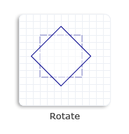

# D2D1\_MATRIX\_3X2\_F

Represents a 3-by-2 matrix.


```C++
typedef D2D_MATRIX_3X2_F D2D1_MATRIX_3X2_F;
```


## Remarks

**D2D1\_MATRIX\_3X2** is a new name for the [**D2D\_MATRIX\_3X2\_F**](/windows/desktop/api/dcommon/ns-dcommon-d2d_matrix_3x2_f) structure. For a list of fields provided by the matrix, see [**D2D\_MATRIX\_3X2\_F**](/windows/desktop/api/dcommon/ns-dcommon-d2d_matrix_3x2_f).

To simplify common matrix operations, Direct2D provides the [**D2D1::Matrix3x2F**](/windows/win32/api/d2d1helper/nl-d2d1helper-matrix3x2f) class, which is derived from the [**D2D1\_MATRIX\_3X2**](/windows/desktop/api/dcommon/ns-dcommon-d2d_matrix_3x2_f) structure. The **Matrix3x2F** class provides a set of helper methods for performing common tasks, such as creating a translation or skew matrix.

## Examples

The following example uses the [**D2D1::Matrix3x2F::Rotation**](/windows/win32/api/d2d1helper/nf-d2d1helper-matrix3x2f-rotation) method to create a rotation matrix that rotates a square clockwise 45 degrees about the center of the square and passes the matrix to the [**SetTransform**](/windows/win32/api/d2d1/nf-d2d1-id2d1brush-settransform(constd2d1_matrix_3x2_f_)) method of the render target (*m\_pRenderTarget*).

The following illustration shows the effect of applying the preceding rotation transformation to the square. The original square is a dotted outline, and the rotated square is a solid outline.




```C++
    // Create a rectangle.
    D2D1_RECT_F rectangle = D2D1::Rect(438.0f, 301.5f, 498.0f, 361.5f);

    // Draw the rectangle.
    m_pRenderTarget->DrawRectangle(
        rectangle,
        m_pOriginalShapeBrush,
        1.0f,
        m_pStrokeStyleDash
        );

    // Apply the rotation transform to the render target.
    m_pRenderTarget->SetTransform(
        D2D1::Matrix3x2F::Rotation(
            45.0f,
            D2D1::Point2F(468.0f, 331.5f))
        );

    // Fill the rectangle.
    m_pRenderTarget->FillRectangle(rectangle, m_pFillBrush);

    // Draw the transformed rectangle.
    m_pRenderTarget->DrawRectangle(rectangle, m_pTransformedShapeBrush);

```


Code has been omitted from this example. For more information about transforms, see the [Transforms Overview](direct2d-transforms-overview.md).

## Requirements


| Requirement | Value |
|-------------------------------------|------------------------------------------------------------------------------------------------------------------------------------------|
| Minimum supported client<br/> | Windows 7, Windows Vista with SP2 and Platform Update for Windows Vista \[desktop apps \| UWP apps\]<br/>                          |
| Minimum supported server<br/> | Windows Server 2008 R2, Windows Server 2008 with SP2 and Platform Update for Windows Server 2008 \[desktop apps \| UWP apps\]<br/> |
| Minimum supported phone<br/>  | Windows Phone 8.1 \[Windows Phone Silverlight 8.1 and Windows Runtime apps\]<br/>                                                  |
| Header<br/>                   | <dl> <dt>D2d1.h</dt> </dl>                                                        |


## See also

<dl> <dt>

[**D2D1::Matrix3x2F**](/windows/win32/api/d2d1helper/nl-d2d1helper-matrix3x2f)
</dt> <dt>

[Transforms Overview](direct2d-transforms-overview.md)
</dt> <dt>

[How to Rotate an Object](how-to-rotate.md)
</dt> <dt>

[How to Scale an Object](how-to-scale.md)
</dt> <dt>

[How to Skew an Object](how-to-skew.md)
</dt> <dt>

[How to Translate an Object](how-to-translate.md)
</dt> <dt>

[**D2D\_MATRIX\_3X2\_F**](/windows/desktop/api/dcommon/ns-dcommon-d2d_matrix_3x2_f)
</dt> </dl>

 

