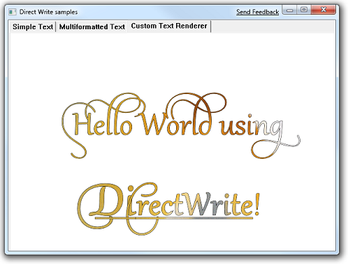

# Text Rendering with Direct2D and DirectWrite

Unlike other APIs, such as [GDI](/windows/desktop/gdi/windows-gdi), GDI+ or WPF, [Direct2D](./direct2d-portal.md) interoperates with another API, [DirectWrite](/windows/desktop/DirectWrite/direct-write-portal), to manipulate and render text. This topic describes the benefits and interoperation of these separate components.

This topic contains the following sections.

-   [Direct2D Enables Incremental Adoption](#direct2d-enables-incremental-adoption)
-   [Text Services versus Text Rendering](#text-services-versus-text-rendering)
-   [Glyphs versus Text](#glyphs-versus-text)
-   [DirectWrite and Direct2D](#directwrite-and-direct2d)
    -   [DrawText](#drawtextlayout)
    -   [DrawTextLayout](#drawtextlayout)
    -   [DrawGlyphRun](#drawglyphrun)
-   [Glyph Rendering](#glyph-rendering)
-   [Conclusion](#conclusion)

## Direct2D Enables Incremental Adoption

Moving an application from one graphics API to another can be difficult or not what you want for various reasons. This might be because you have to support plug-ins that still take the older interfaces, because the application itself is too large to port over to a new API in one release or because some part of the newer API is desirable but the older API is working well enough for other parts of the application.

Because [Direct2D](./direct2d-portal.md) and [DirectWrite](/windows/desktop/DirectWrite/direct-write-portal) are implemented as separate components, you can upgrade your whole 2D graphics system or just the text part of it. For example, you could update an application to use DirectWrite for text but still use [GDI](/windows/desktop/gdi/windows-gdi) or GDI+ for rendering.

## Text Services versus Text Rendering

As applications have evolved, their text processing requirements have grown increasingly complex. At first, text was generally confined to statically laid-out UI, and the text was rendered in a well-defined box, such as a button. As applications began to be available in a growing number of languages, this approach became more difficult to sustain because both the width and height of the translated text can vary significantly between languages. To adapt, applications started to dynamically lay out their UI to depend on the actual rendered size of the text, instead of the other way around.

To help applications complete this task, [DirectWrite](/windows/desktop/DirectWrite/direct-write-portal) provides the [**IDWriteTextLayout**](/windows/desktop/api/dwrite/nn-dwrite-idwritetextlayout) interface. This API enables an application to specify a piece of text with complex characteristics such as different fonts and font sizes, underlines, strikethroughs, bi-directional text, effects, ellipsis and even embedded non-glyph characters (such as a bitmap emoticon or an icon). The application can then change various characteristics of the text as it iteratively determines its UI layout. The [DirectWrite Hello World Sample](/samples/browse/?redirectedfrom=MSDN-samples), which is shown in the following illustration and in the [Tutorial: Getting Started with DirectWrite](/windows/desktop/DirectWrite/getting-started-with-directwrite) topic, shows many of these effects.



The layout can either position the glyphs ideally based on their widths (as WPF does), or it can snap the glyphs to the nearest pixel positions (as [GDI](/windows/desktop/gdi/windows-gdi) does).

In addition to obtaining text measurements, the application can hit test various parts of the text. For example, it might want to know that a hyperlink in the text is clicked. (For more information about hit testing, see the [How to Perform Hit Testing on a Text Layout](/windows/desktop/DirectWrite/how-to-perform-hit-testing-on-a-text-layout) topic.)

The text layout interface is decoupled from the rendering API that the application uses, as the following diagram shows:


This separation is possible because DirectWrite provides a rendering interface ([**IDWriteTextRenderer**](/windows/desktop/api/dwrite/nn-dwrite-idwritetextrenderer)) that applications can implement to render text by using whatever graphics API you want. The application implemented [**IDWriteTextRenderer::DrawGlyphRun**](/windows/desktop/api/dwrite/nf-dwrite-idwritetextrenderer-drawglyphrun) callback method is called by DirectWrite when rendering a text layout. It is the responsibility of this method to perform the drawing operations or pass them along.

For drawing glyphs, [Direct2D](./direct2d-portal.md) provides [**ID2D1RenderTarget::DrawGlyphRun**](/windows/win32/api/d2d1/nf-d2d1-id2d1rendertarget-drawglyphrun) for drawing to a Direct2D surface and [DirectWrite](/windows/desktop/DirectWrite/direct-write-portal) provides [**IDWriteBitmapRenderTarget::DrawGlyphRun**](/windows/desktop/api/dwrite/nf-dwrite-idwritebitmaprendertarget-drawglyphrun) for drawing to a GDI surface that can then be transferred to a window by using GDI. Conveniently, **DrawGlyphRun** in both Direct2D and DirectWrite have exactly compatible parameters to the [**DrawGlyphRun**](/windows/desktop/api/dwrite/nf-dwrite-idwritetextrenderer-drawglyphrun) method that the application implements on [**IDWriteTextRenderer**](/windows/desktop/api/dwrite/nn-dwrite-idwritetextrenderer).

Following a similar separation, text-specific features (such as font enumeration and management, glyph analysis, and so on) are handled by [DirectWrite](/windows/desktop/DirectWrite/direct-write-portal) instead of [Direct2D](./direct2d-portal.md). The DirectWrite objects are accepted directly by Direct2D. To help existing GDI applications to take advantage of DirectWrite, it provides the [**IDWriteGdiInterop**](/windows/desktop/api/dwrite/nn-dwrite-idwritegdiinterop) method interface with methods to do the following:

-   Create a [DirectWrite](/windows/desktop/DirectWrite/direct-write-portal) Font from a [GDI](/windows/desktop/gdi/windows-gdi) Logical Font ([**CreateFontFromLOGFONT**](/windows/desktop/api/dwrite/nf-dwrite-idwritegdiinterop-createfontfromlogfont)).
-   Convert from a [DirectWrite](/windows/desktop/DirectWrite/direct-write-portal) Font Face to a [GDI](/windows/desktop/gdi/windows-gdi) Logical Font ([**ConvertFontFaceToLOGFONT**](/windows/desktop/api/dwrite/nf-dwrite-idwritegdiinterop-convertfontfacetologfont)).
-   Retrieve the [DirectWrite](/windows/desktop/DirectWrite/direct-write-portal) Font Face from the one that is selected into an HDC. ([**CreateFontFaceFromHdc**](/windows/desktop/api/dwrite/nf-dwrite-idwritegdiinterop-createfontfacefromhdc))
-   Create a [DirectWrite](/windows/desktop/DirectWrite/direct-write-portal) [**bitmap render target**](/windows/desktop/api/dwrite/nn-dwrite-idwritebitmaprendertarget) in system memory ([**CreateBitmapRenderTarget**](/windows/desktop/api/dwrite/nf-dwrite-idwritegdiinterop-createbitmaprendertarget)).

## Glyphs versus Text

Text is a set of Unicode code points (characters), with various stylistic modifiers (fonts, weights, underlines, strikethroughs, and so on) that is laid out in a rectangle. A glyph, in contrast, is a particular index into a particular font file. A glyph defines a set of curves which can be rendered, but, it doesn't have any textual meaning. There is potentially a many-to-many mapping between glyphs and characters. A sequence of glyphs that come from the same Font Face and that are laid-out sequentially on a baseline is called a [GlyphRun](/windows/desktop/DirectWrite/glyphs-and-glyph-runs). Both [DirectWrite](/windows/desktop/DirectWrite/direct-write-portal) and [Direct2D](./direct2d-portal.md) call their most precise glyph rendering API [**DrawGlyphRun**](/windows/win32/api/d2d1/nf-d2d1-id2d1rendertarget-drawglyphrun) and they have very similar signatures. The following is from [**ID2D1RenderTarget**](/windows/win32/api/d2d1/nn-d2d1-id2d1rendertarget) in Direct2D:


```
STDMETHOD_(void, DrawGlyphRun)(
        D2D1_POINT_2F baselineOrigin,
        __in CONST DWRITE_GLYPH_RUN *glyphRun,
        __in ID2D1Brush *foregroundBrush,
        DWRITE_MEASURING_MODE measuringMode = DWRITE_MEASURING_MODE_NATURAL 
        ) PURE;
```


And this method is from [**IDWriteBitmapRenderTarget**](/windows/desktop/api/dwrite/nn-dwrite-idwritebitmaprendertarget) in [DirectWrite](/windows/desktop/DirectWrite/direct-write-portal):


```
STDMETHOD(DrawGlyphRun)(
        FLOAT baselineOriginX,
        FLOAT baselineOriginY,
        DWRITE_MEASURING_MODE measuringMode,
        __in DWRITE_GLYPH_RUN const* glyphRun,
        IDWriteRenderingParams* renderingParams,
        COLORREF textColor,
        __out_opt RECT* blackBoxRect = NULL
        ) PURE;
```


The [DirectWrite](/windows/desktop/DirectWrite/direct-write-portal) version keeps the baseline origin, measuring mode and the glyph run parameters and includes additional parameters.

[DirectWrite](/windows/desktop/DirectWrite/direct-write-portal) also enables you to use a custom renderer for glyphs by implementing the [**IDWriteTextRenderer**](/windows/desktop/api/dwrite/nn-dwrite-idwritetextrenderer) interface. This interface also has a **DrawGlyphRun** method, as the following code example shows.


```
STDMETHOD(DrawGlyphRun)(
        __maybenull void* clientDrawingContext,
        FLOAT baselineOriginX,
        FLOAT baselineOriginY,
        DWRITE_MEASURING_MODE measuringMode,
        __in DWRITE_GLYPH_RUN const* glyphRun,
        __in DWRITE_GLYPH_RUN_DESCRIPTION const* glyphRunDescription,
        __maybenull IUnknown* clientDrawingEffect
        ) PURE;
```


This version includes more parameters that are useful when you implement a [custom text renderer](/windows/desktop/DirectWrite/how-to-implement-a-custom-text-renderer). The final parameter is used for application-implemented custom drawing effects. (For more information about client drawing effects see [How to Add Client Drawing Effects to a Text Layout](/windows/desktop/DirectWrite/how-to-add-custom-drawing-efffects-to-a-text-layout).

Each glyph run starts at an origin and is put on a line starting from this origin. The glyphs are changed by the current world transform and the selected text rendering settings on the associated render target. This API is generally called directly only by applications that do their own layout (For example a Word Processor) or by an application that has implemented the [**IDWriteTextRenderer**](/windows/desktop/api/dwrite/nn-dwrite-idwritetextrenderer) interface.

## DirectWrite and Direct2D

[Direct2D](./direct2d-portal.md) provides glyph level rendering services through [**DrawGlyphRun**](/windows/win32/api/d2d1/nf-d2d1-id2d1rendertarget-drawglyphrun). However, this requires the application to implement the details of rendering, which basically reproduces the functionality of the [**DrawText**](/windows/desktop/api/winuser/nf-winuser-drawtext) API from GDI on its own.

Therefore, [Direct2D](./direct2d-portal.md) provides APIs that accept text instead of glyphs: [**ID2D1RenderTarget::DrawTextLayout**](/windows/win32/api/d2d1/nf-d2d1-id2d1rendertarget-drawtextlayout) and [**ID2D1RenderTarget::DrawText**](/windows/win32/api/d2d1/nf-d2d1-id2d1rendertarget-drawtext(constwchar_uint32_idwritetextformat_constd2d1_rect_f__id2d1brush_d2d1_draw_text_options_dwrite_measuring_mode)). Both methods render to a Direct2D surface. To render to a GDI surface, [**IDWriteBitmapRenderTarget::DrawGlyphRun**](/windows/desktop/api/dwrite/nf-dwrite-idwritebitmaprendertarget-drawglyphrun) is provided. But this method requires a custom text renderer to be implemented by the application. (For more information, see the [Render to a GDI Surface](/windows/desktop/DirectWrite/render-to-a-gdi-surface) topic.)

An application's usage of text typically starts simple: put **OK** or **Cancel** on a fixed-layout button, for example. However, over time, it becomes more complex as internationalization and other features are added. Eventually many applications will have to use [DirectWrite's](/windows/desktop/DirectWrite/direct-write-portal) text layout objects and implement the text renderer.

Therefore, [Direct2D](./direct2d-portal.md) provides layered APIs that enable an application to start simply and grow more sophisticated without having to back-track or abandon their working code. A simplified view is shown in the following diagram:


### DrawText

[**DrawText**](/windows/win32/api/d2d1/nf-d2d1-id2d1rendertarget-drawtext(constwchar_uint32_idwritetextformat_constd2d1_rect_f__id2d1brush_d2d1_draw_text_options_dwrite_measuring_mode)) is the simplest of the APIs to use. It takes a Unicode string, a foreground brush, a single format object and a destination rectangle. It will lay out and render the whole string within the layout rectangle, and optionally clip it. This is useful when you put a simple piece of text in a piece of fixed-layout UI.

### DrawTextLayout

By creating an [**IDWriteTextLayout**](/windows/desktop/api/dwrite/nn-dwrite-idwritetextlayout) object, an application can start measuring and arranging the text and other UI elements, and support multiple fonts, styles, underlines and strikethroughs. [Direct2D](./direct2d-portal.md) provides the [**DrawTextLayout**](/windows/win32/api/d2d1/nf-d2d1-id2d1rendertarget-drawtextlayout) API that directly accepts this object and renders the text at a given point. (The width and height are provided by the layout object). In addition to implementing all the expected text layout features, Direct2D will interpret any effect object as a brush and apply that brush to the selected range of glyphs. It will also call any inline objects. An application can then insert non-glyph characters (icons) into the text if it wishes. Another advantage of using a text layout object is that the glyph positions are cached in it. Therefore, a large performance gain is possible by reusing the same layout object for multiple draw calls and avoiding recalculating the glyph positions for each call. This capability is not present for GDI's [**DrawText**](/windows/win32/api/d2d1/nf-d2d1-id2d1rendertarget-drawtext(constwchar_uint32_idwritetextformat_constd2d1_rect_f__id2d1brush_d2d1_draw_text_options_dwrite_measuring_mode)).

### DrawGlyphRun

Finally, the application can implement the [**IDWriteTextRenderer**](/windows/desktop/api/dwrite/nn-dwrite-idwritetextrenderer) interface itself and call [**DrawGlyphRun**](/windows/win32/api/d2d1/nf-d2d1-id2d1rendertarget-drawglyphrun) and [**FillRectangle**](/windows/win32/api/d2d1/nf-d2d1-id2d1rendertarget-fillrectangle(constd2d1_rect_f_id2d1brush)) itself, or any other rendering API. All the existing interaction with the Text Layout object will remain unchanged.

For an example of how to implement a custom text renderer see the [Render Using a Custom Text Renderer](/windows/desktop/DirectWrite/how-to-implement-a-custom-text-renderer) topic.

## Glyph Rendering

Adding [DirectWrite](/windows/desktop/DirectWrite/direct-write-portal) to an existing GDI application enables the application to use the [**IDWriteBitmapRenderTarget**](/windows/desktop/api/dwrite/nn-dwrite-idwritebitmaprendertarget) API to render glyphs. The [**IDWriteBitmapRenderTarget::DrawGlyphRun**](/windows/desktop/api/dwrite/nf-dwrite-idwritebitmaprendertarget-drawglyphrun) method that DirectWrite provides will render in solid color to a memory DC without requiring any additional APIs, such as [Direct2D](./direct2d-portal.md).

This enables the application to obtain advanced text rendering features such as the following:

-   Sub-pixel ClearType enables an application to put glyphs on sub-pixel positions to allow for both sharp glyph rendering and glyph layout.
-   Y-direction antialiasing enables smoother rendering of curves on larger glyphs.

An application moving to [Direct2D](./direct2d-portal.md) will also obtain the following features:

-   Hardware acceleration.
-   The ability to fill text with an arbitrary [Direct2D](./direct2d-portal.md) brush, such as radial gradients, linear gradients, and bitmaps.
-   More support for layering and clipping through the [**PushAxisAlignedClip**](/windows/win32/api/d2d1/nf-d2d1-id2d1rendertarget-pushaxisalignedclip(constd2d1_rect_f__d2d1_antialias_mode)), [**PushLayer**](/windows/win32/api/d2d1/nf-d2d1-id2d1rendertarget-pushlayer(constd2d1_layer_parameters__id2d1layer)) and [**CreateCompatibleRenderTarget**](/windows/desktop/api/d2d1/nf-d2d1-id2d1rendertarget-createcompatiblerendertarget(id2d1bitmaprendertarget)) APIs.
-   The ability to support Grayscale text rendering. This correctly populates the destination alpha channel according to both the text brush opacity and the antialiasing of the text.

To efficiently support hardware acceleration, [Direct2D](./direct2d-portal.md) uses a slightly different approximation to Gamma correction called *alpha correction*. This does not require Direct2D to inspect the render target color pixel when rendering text.

## Conclusion

This topic explains the differences and similarities between [Direct2D](./direct2d-portal.md) and [DirectWrite](/windows/desktop/DirectWrite/direct-write-portal) and the architectural motivations for providing them as separate, cooperative APIs.

 

 