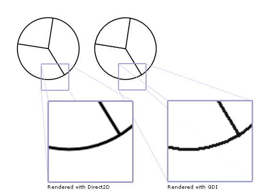
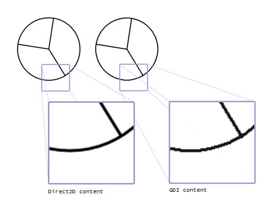

# Direct2D and GDI Interoperability Overview

This topic describes how to use Direct2D and [GDI](/windows/desktop/gdi/windows-gdi) together. There are two ways to combine Direct2D with GDI: you can write GDI content to a Direct2D GDI-compatible render target, or you can write Direct2D content to a [GDI Device Context (DC)](/windows/desktop/gdi/device-contexts).

This topic contains the following sections.

-   [Prerequisites](#prerequisites)
-   [Draw Direct2D Content to a GDI Device Context](#draw-direct2d-content-to-a-gdi-device-context)
-   [ID2D1DCRenderTargets, GDI Transforms, and Right-to-Left Language Builds of Windows](#id2d1dcrendertargets-gdi-transforms-and-right-to-left-language-builds-of-windows)
-   [Draw GDI Content to a Direct2D GDI-Compatible Render Target](#draw-gdi-content-to-a-direct2d-gdi-compatible-render-target)
-   [Related topics](#related-topics)

## Prerequisites

This overview assumes that you are familiar with basic Direct2D drawing operations. For a tutorial, see the [Direct2D QuickStart](direct2d-quickstart.md). It also assumes that you are familiar with GDI drawing operations.

## Draw Direct2D Content to a GDI Device Context

To draw Direct2D content to a GDI DC, you use an [**ID2D1DCRenderTarget**](/windows/win32/api/d2d1/nn-d2d1-id2d1dcrendertarget). To create a DC render target, you use the [**ID2D1Factory::CreateDCRenderTarget**](/windows/win32/api/d2d1/nf-d2d1-id2d1factory-createdcrendertarget) method. This method takes two parameters.

The first parameter, a [**D2D1\_RENDER\_TARGET\_PROPERTIES**](/windows/desktop/api/d2d1/ns-d2d1-d2d1_render_target_properties) structure, specifies rendering, remoting, DPI, pixel format, and usage information. To enable the DC render target to work with GDI, set the DXGI format to [DXGI\_FORMAT\_B8G8R8A8\_UNORM](/windows/win32/api/dxgiformat/ne-dxgiformat-dxgi_format) and the alpha mode to [**D2D1\_ALPHA\_MODE\_PREMULTIPLIED**](/windows/desktop/api/dcommon/ne-dcommon-d2d1_alpha_mode) or **D2D1\_ALPHA\_MODE\_IGNORE**.

The second parameter is the address of the pointer that receive the DC render target reference.

The following code creates a DC render target.


```C++
// Create a DC render target.
D2D1_RENDER_TARGET_PROPERTIES props = D2D1::RenderTargetProperties(
    D2D1_RENDER_TARGET_TYPE_DEFAULT,
    D2D1::PixelFormat(
        DXGI_FORMAT_B8G8R8A8_UNORM,
        D2D1_ALPHA_MODE_IGNORE),
    0,
    0,
    D2D1_RENDER_TARGET_USAGE_NONE,
    D2D1_FEATURE_LEVEL_DEFAULT
    );

hr = m_pD2DFactory->CreateDCRenderTarget(&props, &m_pDCRT);
```


In the preceding code, *m\_pD2DFactory* is a pointer to an [**ID2D1Factory**](/windows/win32/api/d2d1/nn-d2d1-id2d1factory), and *m\_pDCRT* is a pointer to an [**ID2D1DCRenderTarget**](/windows/win32/api/d2d1/nn-d2d1-id2d1dcrendertarget).

Before you can render with the DC render target, you must use its [**BindDC**](/windows/win32/api/d2d1/nf-d2d1-id2d1dcrendertarget-binddc) method to associate it with a GDI DC. You do this each time you use a different DC, or the size of the area you want to draw to changes.

The [**BindDC**](/windows/win32/api/d2d1/nf-d2d1-id2d1dcrendertarget-binddc) method takes two parameters, *hDC* and *pSubRect*. The *hDC* parameter provides a handle to the device context that receives the output of the render target. The *pSubRect* parameter is a rectangle that describes the portion of the device context to which content is rendered. The DC render target updates its size to match the device context area described by *pSubRect*, should it change size.

The following code binds a DC to a DC render target.


```C++
HRESULT DemoApp::OnRender(const PAINTSTRUCT &ps)
{


// Get the dimensions of the client drawing area.
GetClientRect(m_hwnd, &rc);
```


<table>
<colgroup>
<col  />
</colgroup>
<thead>
<tr class="header">
<th>C++</th>
</tr>
</thead>
<tbody>
<tr class="odd">
<td><pre><code>// Bind the DC to the DC render target.
hr = m_pDCRT->BindDC(ps.hdc, &rc);</code></pre></td>
</tr>
</tbody>
</table>


After you associate the DC render target with a DC, you can use it to draw. The following code draws Direct2D and GDI content using a DC.


```C++
HRESULT DemoApp::OnRender(const PAINTSTRUCT &ps)
{

    HRESULT hr;
    RECT rc;

    // Get the dimensions of the client drawing area.
    GetClientRect(m_hwnd, &rc);

    //
    // Draw the pie chart with Direct2D.
    //

    // Create the DC render target.
    hr = CreateDeviceResources();

    if (SUCCEEDED(hr))
    {
        // Bind the DC to the DC render target.
        hr = m_pDCRT->BindDC(ps.hdc, &rc);

        m_pDCRT->BeginDraw();

        m_pDCRT->SetTransform(D2D1::Matrix3x2F::Identity());

        m_pDCRT->Clear(D2D1::ColorF(D2D1::ColorF::White));

        m_pDCRT->DrawEllipse(
            D2D1::Ellipse(
                D2D1::Point2F(150.0f, 150.0f),
                100.0f,
                100.0f),
            m_pBlackBrush,
            3.0
            );

        m_pDCRT->DrawLine(
            D2D1::Point2F(150.0f, 150.0f),
            D2D1::Point2F(
                (150.0f + 100.0f * 0.15425f),
                (150.0f - 100.0f * 0.988f)),
            m_pBlackBrush,
            3.0
            );

        m_pDCRT->DrawLine(
            D2D1::Point2F(150.0f, 150.0f),
            D2D1::Point2F(
                (150.0f + 100.0f * 0.525f),
                (150.0f + 100.0f * 0.8509f)),
            m_pBlackBrush,
            3.0
            );

        m_pDCRT->DrawLine(
            D2D1::Point2F(150.0f, 150.0f),
            D2D1::Point2F(
                (150.0f - 100.0f * 0.988f),
                (150.0f - 100.0f * 0.15425f)),
            m_pBlackBrush,
            3.0
            );

        hr = m_pDCRT->EndDraw();
        if (SUCCEEDED(hr))
        {
            //
            // Draw the pie chart with GDI.
            //

            // Save the original object.
            HGDIOBJ original = NULL;
            original = SelectObject(
                ps.hdc,
                GetStockObject(DC_PEN)
                );

            HPEN blackPen = CreatePen(PS_SOLID, 3, 0);
            SelectObject(ps.hdc, blackPen);

            Ellipse(ps.hdc, 300, 50, 500, 250);

            POINT pntArray1[2];
            pntArray1[0].x = 400;
            pntArray1[0].y = 150;
            pntArray1[1].x = static_cast<LONG>(400 + 100 * 0.15425);
            pntArray1[1].y = static_cast<LONG>(150 - 100 * 0.9885);

            POINT pntArray2[2];
            pntArray2[0].x = 400;
            pntArray2[0].y = 150;
            pntArray2[1].x = static_cast<LONG>(400 + 100 * 0.525);
            pntArray2[1].y = static_cast<LONG>(150 + 100 * 0.8509);


            POINT pntArray3[2];
            pntArray3[0].x = 400;
            pntArray3[0].y = 150;
            pntArray3[1].x = static_cast<LONG>(400 - 100 * 0.988);
            pntArray3[1].y = static_cast<LONG>(150 - 100 * 0.15425);

            Polyline(ps.hdc, pntArray1, 2);
            Polyline(ps.hdc, pntArray2, 2);
            Polyline(ps.hdc, pntArray3, 2);

            DeleteObject(blackPen);

            // Restore the original object.
            SelectObject(ps.hdc, original);
        }
    }

    if (hr == D2DERR_RECREATE_TARGET)
    {
        hr = S_OK;
        DiscardDeviceResources();
    }

    return hr;
}
```


This code produces outputs as shown in the following illustration (callouts have been added to highlight the difference between Direct2D and GDI rendering.)



## ID2D1DCRenderTargets, GDI Transforms, and Right-to-Left Language Builds of Windows

When you use an [**ID2D1DCRenderTarget**](/windows/win32/api/d2d1/nn-d2d1-id2d1dcrendertarget), it renders Direct2D content to an internal bitmap, and then renders the bitmap to the DC with GDI.

It's possible for GDI to apply a GDI transform (through the [**SetWorldTransform**](/windows/desktop/api/wingdi/nf-wingdi-setworldtransform) method) or other effect to the same DC used by the render target, in which case GDI transforms the bitmap produced by Direct2D. Using a GDI transform to transform the Direct2D content has the potential to degrade the visual quality of the output, because you're transforming a bitmap for which antialiasing and subpixel positioning have already been calculated.

For example, suppose you use the render target to draw a scene that contains antialiased geometries and text. If you use a GDI transform to apply a scale transform to the DC and scale the scene so that it's 10 times larger, you'll see pixelization and jagged edges. (If, however, you applied a similar transform using Direct2D, the visual quality of the scene would not be degraded.)

In some cases, it might not be obvious that GDI is performing additional processing that might degrade the quality of the Direct2D content. For example, on a right-to-left (RTL) build of Windows, content rendered by an [**ID2D1DCRenderTarget**](/windows/win32/api/d2d1/nn-d2d1-id2d1dcrendertarget) might be horizontally inverted when GDI copies it to its destination. Whether the content is actually inverted depends on the current settings of the DC.

Depending on the type of content being rendered, you might want to prevent the inversion. If the Direct2D content includes ClearType text, this inversion will degrade the quality of the text.

You can control RTL rendering behavior by using the [**SetLayout**](/windows/desktop/api/wingdi/nf-wingdi-setlayout) GDI function. To prevent the mirroring, call the **SetLayout** GDI function and specify **LAYOUT\_BITMAPORIENTATIONPRESERVED** as the only value for the second parameter (do not combine it with **LAYOUT\_RTL**), as shown in the following example:


```C++
SetLayout(m_hwnd, LAYOUT_BITMAPORIENTATIONPRESERVED);
```


## Draw GDI Content to a Direct2D GDI-Compatible Render Target

The previous section describes how to write Direct2D content to a GDI DC. You can also write GDI content to a Direct2D GDI-compatible render target. This approach is useful for applications that primarily render with Direct2D but have an extensibility model or other legacy content that requires the ability to render with GDI.

To render GDI content to a Direct2D GDI-compatible render target, use an [**ID2D1GdiInteropRenderTarget**](/windows/win32/api/d2d1/nn-d2d1-id2d1gdiinteroprendertarget), which provides access to a device context that can accept GDI draw calls. Unlike other interfaces, an **ID2D1GdiInteropRenderTarget** object is not created directly. Instead, use the [**QueryInterface**](/windows/win32/api/unknwn/nf-unknwn-iunknown-queryinterface(q)) method of an existing render target instance. The following code shows how to do this:


```C++
        D2D1_RENDER_TARGET_PROPERTIES rtProps = D2D1::RenderTargetProperties();
        rtProps.usage =  D2D1_RENDER_TARGET_USAGE_GDI_COMPATIBLE;

        // Create a GDI compatible Hwnd render target.
        hr = m_pD2DFactory->CreateHwndRenderTarget(
            rtProps,
            D2D1::HwndRenderTargetProperties(m_hwnd, size),
            &m_pRenderTarget
            );


        if (SUCCEEDED(hr))
        {
            hr = m_pRenderTarget->QueryInterface(__uuidof(ID2D1GdiInteropRenderTarget), (void**)&m_pGDIRT); 
        }
```


In the preceding code, *m\_pD2DFactory* is a pointer to an [**ID2D1Factory**](/windows/win32/api/d2d1/nn-d2d1-id2d1factory), and *m\_pGDIRT* is a pointer to an [**ID2D1GdiInteropRenderTarget**](/windows/win32/api/d2d1/nn-d2d1-id2d1gdiinteroprendertarget).

Notice that the[**D2D1\_RENDER\_TARGET\_USAGE\_GDI\_COMPATIBLE**](/windows/desktop/api/d2d1/ne-d2d1-d2d1_render_target_usage) flag is specified when creating the Hwnd GDI-compatible render target. If a pixel format is required, use [DXGI\_FORMAT\_B8G8R8A8\_UNORM](/windows/win32/api/dxgiformat/ne-dxgiformat-dxgi_format). If an alpha mode is required, use [**D2D1\_ALPHA\_MODE\_PREMULTIPLIED**](/windows/desktop/api/dcommon/ne-dcommon-d2d1_alpha_mode) or **D2D1\_ALPHA\_MODE\_IGNORE**.

Note that the [**QueryInterface**](/windows/win32/api/unknwn/nf-unknwn-iunknown-queryinterface(q)) method always succeeds. To test whether the [**ID2D1GdiInteropRenderTarget**](/windows/win32/api/d2d1/nn-d2d1-id2d1gdiinteroprendertarget) interface's methods will work for a given render target, create a [**D2D1\_RENDER\_TARGET\_PROPERTIES**](/windows/desktop/api/d2d1/ns-d2d1-d2d1_render_target_properties) that specifies GDI compatibility and the appropriate pixel format, and then call the render target's [**IsSupported**](/windows/win32/api/d2d1/nf-d2d1-id2d1rendertarget-issupported(constd2d1_render_target_properties)) method to see whether the render target is GDI-compatible.

The following example shows how to draw a pie chart (GDI content) to the Hwnd GDI-compatible render target.


```C++
        HDC hDC = NULL;
        hr = m_pGDIRT->GetDC(D2D1_DC_INITIALIZE_MODE_COPY, &hDC);

        if (SUCCEEDED(hr))
        {
            // Draw the pie chart to the GDI render target associated with the Hwnd render target.
            HGDIOBJ original = NULL;
            original = SelectObject(
                hDC,
                GetStockObject(DC_PEN)
                );

            HPEN blackPen = CreatePen(PS_SOLID, 3, 0);
            SelectObject(hDC, blackPen);

            Ellipse(hDC, 300, 50, 500, 250);

            POINT pntArray1[2];
            pntArray1[0].x = 400;
            pntArray1[0].y = 150;
            pntArray1[1].x = static_cast<LONG>(400 + 100 * 0.15425);
            pntArray1[1].y = static_cast<LONG>(150 - 100 * 0.9885);

            POINT pntArray2[2];
            pntArray2[0].x = 400;
            pntArray2[0].y = 150;
            pntArray2[1].x = static_cast<LONG>(400 + 100 * 0.525);
            pntArray2[1].y = static_cast<LONG>(150 + 100 * 0.8509);

            POINT pntArray3[2];
            pntArray3[0].x = 400;
            pntArray3[0].y = 150;
            pntArray3[1].x = static_cast<LONG>(400 - 100 * 0.988);
            pntArray3[1].y = static_cast<LONG>(150 - 100 * 0.15425);

            Polyline(hDC, pntArray1, 2);
            Polyline(hDC, pntArray2, 2);
            Polyline(hDC, pntArray3, 2);

            DeleteObject(blackPen);

            // Restore the original object.
            SelectObject(hDC, original);

            m_pGDIRT->ReleaseDC(NULL);
        }

```


The code outputs charts as shown in the following illustration with callouts to highlight the rendering quality difference. The right pie chart (GDI content) has lower rendering quality than the left pie chart (Direct2D content). This is because Direct2D is capable of rendering with antialiasing



## Related topics

<dl> <dt>

[**ID2D1Factory::CreateDCRenderTarget**](/windows/win32/api/d2d1/nf-d2d1-id2d1factory-createdcrendertarget)
</dt> <dt>

[**ID2D1DCRenderTarget**](/windows/win32/api/d2d1/nn-d2d1-id2d1dcrendertarget)
</dt> <dt>

[**ID2D1GdiInteropRenderTarget**](/windows/win32/api/d2d1/nn-d2d1-id2d1gdiinteroprendertarget)
</dt> <dt>

[**D2D1\_RENDER\_TARGET\_PROPERTIES**](/windows/desktop/api/d2d1/ns-d2d1-d2d1_render_target_properties)
</dt> <dt>

[GDI Device Contexts](/windows/desktop/gdi/device-contexts)
</dt> <dt>

[GDI SDK](/windows/desktop/gdi/windows-gdi)
</dt> </dl>

 

 
