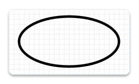
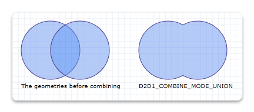

# Geometries overview

This overview describes how to create and use [**ID2D1Geometry**](/windows/win32/api/d2d1/nn-d2d1-id2d1geometry) objects to define and manipulate 2D figures. It contains the following sections.

## What is a Direct2D geometry?

A Direct2D geometry is an [**ID2D1Geometry**](/windows/win32/api/d2d1/nn-d2d1-id2d1geometry) object. This object can be a simple geometry ([**ID2D1RectangleGeometry**](/windows/win32/api/d2d1/nn-d2d1-id2d1rectanglegeometry), [**ID2D1RoundedRectangleGeometry**](/windows/win32/api/d2d1/nn-d2d1-id2d1roundedrectanglegeometry), or [**ID2D1EllipseGeometry**](/windows/win32/api/d2d1/nn-d2d1-id2d1ellipsegeometry)), a path geometry ([**ID2D1PathGeometry**](/windows/win32/api/d2d1/nn-d2d1-id2d1pathgeometry)), or a composite geometry ([**ID2D1GeometryGroup**](/windows/win32/api/d2d1/nn-d2d1-id2d1geometrygroup) and [**ID2D1TransformedGeometry**](/windows/win32/api/d2d1/nn-d2d1-id2d1transformedgeometry)).

Direct2D geometries enable you to describe two-dimensional figures and offer many uses, such as defining hit-test regions, clip regions, and even animation paths.

Direct2D geometries are immutable and device-independent resources created by [**ID2D1Factory**](/windows/win32/api/d2d1/nn-d2d1-id2d1factory). Generally, you should create geometries one time and keep them for the life of the application, or until they have to be changed. For more information about device-independent and device-dependent resources, see the [Resources Overview](resources-and-resource-domains.md).

The following sections describe the different kinds of geometries.

## Simple geometries

Simple geometries include [**ID2D1RectangleGeometry**](/windows/win32/api/d2d1/nn-d2d1-id2d1rectanglegeometry), [**ID2D1RoundedRectangleGeometry**](/windows/win32/api/d2d1/nn-d2d1-id2d1roundedrectanglegeometry), and [**ID2D1EllipseGeometry**](/windows/win32/api/d2d1/nn-d2d1-id2d1ellipsegeometry) objects, and can be used to create basic geometric figures, such as rectangles, rounded rectangles, circles, and ellipses.

To create a simple geometry, use one of the [**ID2D1Factory::Create<*geometryType*>Geometry**](/windows/win32/api/d2d1/nn-d2d1-id2d1factory) methods. These methods create an object of the specified type. For example, to create a rectangle, call [**ID2D1Factory::CreateRectangleGeometry**](/windows/win32/api/d2d1/nf-d2d1-id2d1factory-createrectanglegeometry(constd2d1_rect_f_id2d1rectanglegeometry)), which returns an [**ID2D1RectangleGeometry**](/windows/win32/api/d2d1/nn-d2d1-id2d1rectanglegeometry) object; to create a rounded rectangle, call [**ID2D1Factory::CreateRoundedRectangleGeometry**](/windows/desktop/api/d2d1/nf-d2d1-id2d1factory-createroundedrectanglegeometry(constd2d1_rounded_rect__id2d1roundedrectanglegeometry)), which returns an [**ID2D1RoundedRectangleGeometry**](/windows/win32/api/d2d1/nn-d2d1-id2d1roundedrectanglegeometry) object, and so on.

The following code example calls the [**CreateEllipseGeometry**](/windows/desktop/api/d2d1/nf-d2d1-id2d1factory-createellipsegeometry(constd2d1_ellipse__id2d1ellipsegeometry)) method, passing in an ellipse structure with the *center* set to (100, 100), *x-radius* to 100, and *y-radius* to 50. Then, it calls [**DrawGeometry**](/windows/win32/api/d2d1/nf-d2d1-id2d1rendertarget-drawgeometry), passing in the returned ellipse geometry, a pointer to a black [**ID2D1SolidColorBrush**](/windows/win32/api/d2d1/nn-d2d1-id2d1solidcolorbrush), and a stroke width of 5. The following illustration shows the output from the code example.




```C++
ID2D1EllipseGeometry *m_pEllipseGeometry;
```


```C++
if (SUCCEEDED(hr))
{
    hr = m_pD2DFactory->CreateEllipseGeometry(
        D2D1::Ellipse(D2D1::Point2F(100.f, 60.f), 100.f, 50.f),
        &m_pEllipseGeometry
        );
}
```


```C++
m_pRenderTarget->DrawGeometry(m_pEllipseGeometry, m_pBlackBrush, 5);
```


To draw the outline of any geometry, use the [**DrawGeometry**](/windows/win32/api/d2d1/nf-d2d1-id2d1rendertarget-drawgeometry) method. To paint its interior, use the [**FillGeometry**](/windows/win32/api/d2d1/nf-d2d1-id2d1rendertarget-fillgeometry) method.

## Path geometries

Path geometries are represented by the [**ID2D1PathGeometry**](/windows/win32/api/d2d1/nn-d2d1-id2d1pathgeometry) interface. These objects can be used to describe complex geometric figures composed of segments such as arcs, curves, and lines. The following illustration shows a drawing created by using path geometry.


For more information and examples, see the [Path Geometries Overview](path-geometries-overview.md).

## Composite geometries

A composite geometry is a geometry grouped or combined with another geometry object, or with a transform. Composite geometries include [**ID2D1TransformedGeometry**](/windows/win32/api/d2d1/nn-d2d1-id2d1transformedgeometry) and [**ID2D1GeometryGroup**](/windows/win32/api/d2d1/nn-d2d1-id2d1geometrygroup) objects.

### Geometry groups

Geometry groups are a convenient way to group several geometries at the same time so all figures of several distinct geometries are concatenated into one. To create a [**ID2D1GeometryGroup**](/windows/win32/api/d2d1/nn-d2d1-id2d1geometrygroup) object, call the [**CreateGeometryGroup**](/windows/win32/api/d2d1/nf-d2d1-id2d1factory-creategeometrygroup) method on the [**ID2D1Factory**](/windows/win32/api/d2d1/nn-d2d1-id2d1factory) object, passing in the *fillMode* with possible values of [**D2D1\_FILL\_MODE\_ALTERNATE**](/windows/desktop/api/d2d1/ne-d2d1-d2d1_fill_mode) (alternate) and **D2D1\_FILL\_MODE\_WINDING**, an array of geometry objects to add to the geometry group, and the number of elements in this array.

The following code example first declares an array of geometry objects. These objects are four concentric circles that have the following radii: 25, 50, 75, and 100. Then call the [**CreateGeometryGroup**](/windows/win32/api/d2d1/nf-d2d1-id2d1factory-creategeometrygroup) on the [**ID2D1Factory**](/windows/win32/api/d2d1/nn-d2d1-id2d1factory) object, passing in [**D2D1\_FILL\_MODE\_ALTERNATE**](/windows/desktop/api/d2d1/ne-d2d1-d2d1_fill_mode), an array of geometry objects to add to the geometry group, and the number of elements in this array.


```C++
ID2D1Geometry *ppGeometries[] =
{
    m_pEllipseGeometry1,
    m_pEllipseGeometry2,
    m_pEllipseGeometry3,
    m_pEllipseGeometry4
};

hr = m_pD2DFactory->CreateGeometryGroup(
    D2D1_FILL_MODE_ALTERNATE,
    ppGeometries,
    ARRAYSIZE(ppGeometries),
    &m_pGeoGroup_AlternateFill
    );

if (SUCCEEDED(hr))
{
    hr = m_pD2DFactory->CreateGeometryGroup(
        D2D1_FILL_MODE_WINDING,
        ppGeometries,
        ARRAYSIZE(ppGeometries),
        &m_pGeoGroup_WindingFill
        );
}
```

The following illustration shows the results of rendering the two group geometries from the example.


### Transformed geometries

There are multiple ways to transform a geometry. You can use the [**SetTransform**](/windows/win32/api/d2d1/nf-d2d1-id2d1brush-settransform(constd2d1_matrix_3x2_f_)) method of a render target to transform everything that the render target draws, or you can associate a transform directly with a geometry by using the [**CreateTransformedGeometry**](/windows/win32/api/d2d1/nf-d2d1-id2d1factory-createtransformedgeometry(id2d1geometry_constd2d1_matrix_3x2_f_id2d1transformedgeometry)) method to create an [**ID2D1TransformedGeometry**](/previous-versions/windows/desktop/legacy/dd371304(v=vs.85)).

The method that you should use depends on the effect that you want. When you use the render target to transform and then render a geometry, the transform affects everything about the geometry, including the width of any stroke that you have applied. On the other hand, when you use an [**ID2D1TransformedGeometry**](/windows/win32/api/d2d1/nn-d2d1-id2d1transformedgeometry), the transform affects only the coordinates that describe the shape. The transformation will not affect the stroke thickness when the geometry is drawn.

> [!Note]  
> Starting with Windows 8 the world transform will not affect the stroke thickness of strokes with [**D2D1\_STROKE\_TRANSFORM\_TYPE\_FIXED**](/windows/desktop/api/D2d1_1/ne-d2d1_1-d2d1_stroke_transform_type)or [**D2D1\_STROKE\_TRANSFORM\_TYPE\_HAIRLINE**](/windows/desktop/api/D2d1_1/ne-d2d1_1-d2d1_stroke_transform_type). You should use these transform types to achieve transform independent strokes

 

The following example creates an [**ID2D1RectangleGeometry**](/windows/win32/api/d2d1/nn-d2d1-id2d1rectanglegeometry), then draws it without transforming it. It produces the output shown in the following illustration.


```C++
hr = m_pD2DFactory->CreateRectangleGeometry(
    D2D1::RectF(150.f, 150.f, 200.f, 200.f),
    &m_pRectangleGeometry
    );
```


```C++
// Draw the untransformed rectangle geometry.
m_pRenderTarget->DrawGeometry(m_pRectangleGeometry, m_pBlackBrush, 1);
```


The next example uses the render target to scale the geometry by a factor of 3, then draws it. The following illustration shows the result of drawing the rectangle without the transform and with the transform. Notice that the stroke is thicker after the transform, even though the stroke thickness is 1.


```C++
// Transform the render target, then draw the rectangle geometry again.
m_pRenderTarget->SetTransform(
    D2D1::Matrix3x2F::Scale(
        D2D1::SizeF(3.f, 3.f),
        D2D1::Point2F(175.f, 175.f))
    );

m_pRenderTarget->DrawGeometry(m_pRectangleGeometry, m_pBlackBrush, 1);
```


The next example uses the [**CreateTransformedGeometry**](/windows/win32/api/d2d1/nf-d2d1-id2d1factory-createtransformedgeometry(id2d1geometry_constd2d1_matrix_3x2_f__id2d1transformedgeometry)) method to scale the geometry by a factor of 3, then draws it. It produces the output shown in the following illustration. Notice that, although the rectangle is larger, its stroke hasn't increased.


```C++
 // Create a geometry that is a scaled version
 // of m_pRectangleGeometry.
 // The new geometry is scaled by a factory of 3
 // from the center of the geometry, (35, 35).

 hr = m_pD2DFactory->CreateTransformedGeometry(
     m_pRectangleGeometry,
     D2D1::Matrix3x2F::Scale(
         D2D1::SizeF(3.f, 3.f),
         D2D1::Point2F(175.f, 175.f)),
     &m_pTransformedGeometry
     );
```


```C++
// Replace the previous render target transform.
m_pRenderTarget->SetTransform(D2D1::Matrix3x2F::Identity());

// Draw the transformed geometry.
m_pRenderTarget->DrawGeometry(m_pTransformedGeometry, m_pBlackBrush, 1);
```


## Geometries as masks

You can use an [**ID2D1Geometry**](/windows/win32/api/d2d1/nn-d2d1-id2d1geometry) object as a geometric mask when you call the [**PushLayer**](/windows/win32/api/d2d1/nf-d2d1-id2d1rendertarget-pushlayer(constd2d1_layer_parameters__id2d1layer)) method. The geometric mask specifies the area of the layer that is composited into the render target. For more information, see the Geometric Masks section of the [Layers Overview](direct2d-layers-overview.md).

## Geometric operations

The [**ID2D1Geometry**](/windows/win32/api/d2d1/nn-d2d1-id2d1geometry) interface provides several geometric operations that you can use to manipulate and measure geometric figures. For example, you can use them to calculate and return their bounds, compare to see how one geometry is spatially related to another (useful for hit testing), calculate the areas and lengths, and more. The following table describes the common geometric operations.


| Operation                                                   | Method                                                                                                                                                                     |
|-------------------------------------------------------------|----------------------------------------------------------------------------------------------------------------------------------------------------------------------------|
| Combine                                                     | [**CombineWithGeometry**](id2d1geometry-combinewithgeometry.md)                                                                                                           |
| Bounds/ Widened Bounds/Retrieve Bounds, Dirty Region update | [**Widen**](id2d1geometry-widen.md), [**GetBounds**](/windows/desktop/api/d2d1_1/nf-d2d1_1-id2d1gdimetafile-getbounds), [**GetWidenedBounds**](id2d1geometry-getwidenedbounds.md)                             |
| Hit Testing                                                 | [**FillContainsPoint**](id2d1geometry-fillcontainspoint.md), [**StrokeContainsPoint**](id2d1geometry-strokecontainspoint.md)                                             |
| Stroke                                                      | [**StrokeContainsPoint**](id2d1geometry-strokecontainspoint.md)                                                                                                           |
| Comparison                                                  | [**CompareWithGeometry**](id2d1geometry-comparewithgeometry.md)                                                                                                           |
| Simplification (removes arcs and quadratic Bezier curves)   | [**Simplify**](id2d1geometry-simplify.md)                                                                                                                                 |
| Tessellation                                                | [**Tessellate**](id2d1geometry-tessellate.md)                                                                                                                             |
| Outline (remove intersection)                               | [**Outline**](id2d1geometry-outline.md)                                                                                                                                   |
| Calculate the area or length of a geometry                  | [**ComputeArea**](id2d1geometry-computearea.md), [**ComputeLength**](id2d1geometry-computelength.md), [**ComputePointAtLength**](id2d1geometry-computepointatlength.md) |


 

> [!Note]  
> Starting in Windows 8, you can use the [**ComputePointAndSegmentAtLength**](/windows/win32/api/d2d1_1/nf-d2d1_1-id2d1pathgeometry1-computepointandsegmentatlength(float_uint32_constd2d1_matrix_3x2_f_float_d2d1_point_description)) method on the [**ID2D1PathGeometry1**](/windows/win32/api/d2d1_1/nn-d2d1_1-id2d1pathgeometry1) to calculate the area or length of a geometry.

 

### Combining geometries

To combine one geometry with another, call the [**ID2D1Geometry::CombineWithGeometry**](id2d1geometry-combinewithgeometry.md) method. When you combine the geometries, you specify one of the four ways to perform the combine operation: [**D2D1\_COMBINE\_MODE\_UNION**](/windows/desktop/api/d2d1/ne-d2d1-d2d1_combine_mode) (union), [**D2D1\_COMBINE\_MODE\_INTERSECT**](/windows/desktop/api/d2d1/ne-d2d1-d2d1_combine_mode) (intersect), [**D2D1\_COMBINE\_MODE\_XOR**](/windows/desktop/api/d2d1/ne-d2d1-d2d1_combine_mode) (xor), and [**D2D1\_COMBINE\_MODE\_EXCLUDE**](/windows/desktop/api/d2d1/ne-d2d1-d2d1_combine_mode) (exclude). The following code example shows two circles that are combined by using the union combine mode, where the first circle has the center point of (75, 75) and the radius of 50, and the second circle has the center point of (125, 75) and the radius of 50.


```C++
HRESULT hr = S_OK;
ID2D1GeometrySink *pGeometrySink = NULL;

// Create the first ellipse geometry to merge.
const D2D1_ELLIPSE circle1 = D2D1::Ellipse(
    D2D1::Point2F(75.0f, 75.0f),
    50.0f,
    50.0f
    );

hr = m_pD2DFactory->CreateEllipseGeometry(
    circle1,
    &m_pCircleGeometry1
    );

if (SUCCEEDED(hr))
{
    // Create the second ellipse geometry to merge.
    const D2D1_ELLIPSE circle2 = D2D1::Ellipse(
        D2D1::Point2F(125.0f, 75.0f),
        50.0f,
        50.0f
        );

    hr = m_pD2DFactory->CreateEllipseGeometry(circle2, &m_pCircleGeometry2);
}


if (SUCCEEDED(hr))
{
    //
    // Use D2D1_COMBINE_MODE_UNION to combine the geometries.
    //
    hr = m_pD2DFactory->CreatePathGeometry(&m_pPathGeometryUnion);

    if (SUCCEEDED(hr))
    {
        hr = m_pPathGeometryUnion->Open(&pGeometrySink);

        if (SUCCEEDED(hr))
        {
            hr = m_pCircleGeometry1->CombineWithGeometry(
                m_pCircleGeometry2,
                D2D1_COMBINE_MODE_UNION,
                NULL,
                NULL,
                pGeometrySink
                );
        }

        if (SUCCEEDED(hr))
        {
            hr = pGeometrySink->Close();
        }

        SafeRelease(&pGeometrySink);
    }
}
```


The following illustration shows two circles combined with a combine mode of union.



For illustrations of all the combine modes, see the [**D2D1\_COMBINE\_MODE enumeration**](/windows/desktop/api/d2d1/ne-d2d1-d2d1_combine_mode).

### Widen

The [**Widen**](id2d1geometry-widen.md) method generates a new geometry whose fill is equivalent to stroking the existing geometry, and then writes the result to the specified [**ID2D1SimplifiedGeometrySink**](/windows/win32/api/d2d1/nn-d2d1-id2d1simplifiedgeometrysink) object. The following code example calls [**Open**](/windows/win32/api/d2d1/nf-d2d1-id2d1pathgeometry-open) on the [**ID2D1PathGeometry**](/windows/win32/api/d2d1/nn-d2d1-id2d1pathgeometry) object. If **Open** succeeds, it calls **Widen** on the geometry object.


```C++
ID2D1GeometrySink *pGeometrySink = NULL;
hr = pPathGeometry->Open(&pGeometrySink);
if (SUCCEEDED(hr))
{
    hr = pGeometry->Widen(
            strokeWidth,
            pIStrokeStyle,
            pWorldTransform,
            pGeometrySink
            );
```


### Tessellate

The [**Tessellate**](id2d1geometry-tessellate.md) method creates a set of clockwise-wound triangles that cover the geometry after it is transformed by using the specified matrix and flattened by using the specified tolerance. The following code example uses **Tessellate** to create a list of triangles that represent *pPathGeometry*. The triangles are stored in an [**ID2D1Mesh**](/windows/win32/api/d2d1/nn-d2d1-id2d1mesh), *pMesh*, then transferred to a class member, *m\_pStrokeMesh*, for later use when rendering.


```C++
ID2D1Mesh *pMesh = NULL;
hr = m_pRT->CreateMesh(&pMesh);
if (SUCCEEDED(hr))
{
    ID2D1TessellationSink *pSink = NULL;
    hr = pMesh->Open(&pSink);
    if (SUCCEEDED(hr))
    {
        hr = pPathGeometry->Tessellate(
                NULL, // world transform (already handled in Widen)
                pSink
                );
        if (SUCCEEDED(hr))
        {
            hr = pSink->Close();
            if (SUCCEEDED(hr))
            {
                SafeReplace(&m_pStrokeMesh, pMesh);
            }
        }
        pSink->Release();
    }
    pMesh->Release();
}
```


### FillContainsPoint and StrokeContainsPoint

The [**FillContainsPoint**](id2d1geometry-fillcontainspoint.md) method indicates whether the area filled by the geometry contains the specified point. You can use this method to do hit testing. The following code example calls **FillContainsPoint** on an [**ID2D1EllipseGeometry**](/windows/win32/api/d2d1/nn-d2d1-id2d1ellipsegeometry) object, passing in a point at (0,0) and an [**Identity**](/windows/win32/api/d2d1helper/nf-d2d1helper-matrix3x2f-isidentity) matrix.


```C++
BOOL containsPoint1;
hr = m_pCircleGeometry1->FillContainsPoint(
    D2D1::Point2F(0,0),
    D2D1::Matrix3x2F::Identity(),
    &containsPoint1
    );

if (SUCCEEDED(hr))
{
    // Process containsPoint.
}
```


The [**StrokeContainsPoint**](id2d1geometry-strokecontainspoint.md) method determines whether the geometry's stroke contains the specified point. You can use this method to do hit testing. The following code example uses **StrokeContainsPoint**.


```C++
BOOL containsPoint;

hr = m_pCircleGeometry1->StrokeContainsPoint(
    D2D1::Point2F(0,0),
    10,     // stroke width
    NULL,   // stroke style
    NULL,   // world transform
    &containsPoint
    );

if (SUCCEEDED(hr))
{
    // Process containsPoint.
}
```


### Simplify

The [**Simplify**](id2d1geometry-simplify.md) method removes arcs and quadratic Bezier curves from a specified geometry. So, the resulting geometry contains only lines and, optionally, cubic Bezier curves. The following code example uses **Simplify** to transform a geometry with Bezier curves into a geometry that contains only line segments.


```C++
HRESULT D2DFlatten(
    ID2D1Geometry *pGeometry,
    float flatteningTolerance,
    ID2D1Geometry **ppGeometry
    )
{
    HRESULT hr;
    ID2D1Factory *pFactory = NULL;
    pGeometry->GetFactory(&pFactory);

    ID2D1PathGeometry *pPathGeometry = NULL;
    hr = pFactory->CreatePathGeometry(&pPathGeometry);

    if (SUCCEEDED(hr))
    {
        ID2D1GeometrySink *pSink = NULL;
        hr = pPathGeometry->Open(&pSink);

        if (SUCCEEDED(hr))
        {
            hr = pGeometry->Simplify(
                    D2D1_GEOMETRY_SIMPLIFICATION_OPTION_LINES,
                    NULL, // world transform
                    flatteningTolerance,
                    pSink
                    );

            if (SUCCEEDED(hr))
            {
                hr = pSink->Close();

                if (SUCCEEDED(hr))
                {
                    *ppGeometry = pPathGeometry;
                    (*ppGeometry)->AddRef();
                }
            }
            pSink->Release();
        }
        pPathGeometry->Release();
    }

    pFactory->Release();

    return hr;
}
```


### ComputeLength and ComputeArea

The [**ComputeLength**](id2d1geometry-computelength.md) method calculates the length of the specified geometry if each segment were unrolled into a line. This includes the implicit closing segment if the geometry is closed. The following code example uses **ComputeLength** to compute the length of a specified circle (**m\_pCircleGeometry1**).


```C++
float length;

// Compute the area of circle1
hr = m_pCircleGeometry1->ComputeLength(
    D2D1::IdentityMatrix(),
    &length
    );

if (SUCCEEDED(hr))
{
    // Process the length of the geometry.
}
```


The [**ComputeArea**](id2d1geometry-computearea.md) method calculates the area of the specified geometry. The following code example uses **ComputeArea** to compute the area of a specified circle (**m\_pCircleGeometry1**).


```C++
float area;

// Compute the area of circle1
hr = m_pCircleGeometry1->ComputeArea(
    D2D1::IdentityMatrix(),
    &area
    );
```


### CompareWithGeometry

The [**CompareWithGeometry**](id2d1geometry-comparewithgeometry.md) method describes the intersection between the geometry that calls this method and the specified geometry. The possible values for intersection include [**D2D1\_GEOMETRY\_RELATION\_DISJOINT**](/windows/desktop/api/d2d1/ne-d2d1-d2d1_geometry_relation) (disjoint), **D2D1\_GEOMETRY\_RELATION\_IS\_CONTAINED** (is contained), **D2D1\_GEOMETRY\_RELATION\_CONTAINS** (contains), and **D2D1\_GEOMETRY\_RELATION\_OVERLAP** (overlap). "disjoint" means that two geometry fills do not intersect at all. "is contained" means that the geometry is completely contained by the specified geometry. "contains" means that the geometry completely contains the specified geometry, and "overlap" means the two geometries overlap but neither completely contains the other.

The following code example shows how to compare two circles that have the same radius of 50 but are offset by 50.


```C++
HRESULT hr = S_OK;
ID2D1GeometrySink *pGeometrySink = NULL;

// Create the first ellipse geometry to merge.
const D2D1_ELLIPSE circle1 = D2D1::Ellipse(
    D2D1::Point2F(75.0f, 75.0f),
    50.0f,
    50.0f
    );

hr = m_pD2DFactory->CreateEllipseGeometry(
    circle1,
    &m_pCircleGeometry1
    );

if (SUCCEEDED(hr))
{
    // Create the second ellipse geometry to merge.
    const D2D1_ELLIPSE circle2 = D2D1::Ellipse(
        D2D1::Point2F(125.0f, 75.0f),
        50.0f,
        50.0f
        );

    hr = m_pD2DFactory->CreateEllipseGeometry(circle2, &m_pCircleGeometry2);
}

```


```C++
D2D1_GEOMETRY_RELATION result = D2D1_GEOMETRY_RELATION_UNKNOWN;

// Compare circle1 with circle2
hr = m_pCircleGeometry1->CompareWithGeometry(
    m_pCircleGeometry2,
    D2D1::IdentityMatrix(),
    0.1f,
    &result
    );

if (SUCCEEDED(hr))
{
    static const WCHAR szGeometryRelation[] = L"Two circles overlap.";
    m_pRenderTarget->SetTransform(D2D1::IdentityMatrix());
    if (result == D2D1_GEOMETRY_RELATION_OVERLAP)
    {
        m_pRenderTarget->DrawText(
            szGeometryRelation,
            ARRAYSIZE(szGeometryRelation) - 1,
            m_pTextFormat,
            D2D1::RectF(25.0f, 160.0f, 200.0f, 300.0f),
            m_pTextBrush
            );
    }
}
```


### Outline

The [**Outline**](id2d1geometry-outline.md) method computes the outline of the geometry (a version of the geometry in which no figure crosses itself or any other figure) and writes the result to an [**ID2D1SimplifiedGeometrySink**](/windows/win32/api/d2d1/nn-d2d1-id2d1simplifiedgeometrysink). The following code example uses **Outline** to construct an equivalent geometry without any self-intersections. It uses the default flattening tolerance.


```C++
HRESULT D2DOutline(
    ID2D1Geometry *pGeometry,
    ID2D1Geometry **ppGeometry
    )
{
    HRESULT hr;
    ID2D1Factory *pFactory = NULL;
    pGeometry->GetFactory(&pFactory);

    ID2D1PathGeometry *pPathGeometry = NULL;
    hr = pFactory->CreatePathGeometry(&pPathGeometry);

    if (SUCCEEDED(hr))
    {
        ID2D1GeometrySink *pSink = NULL;
        hr = pPathGeometry->Open(&pSink);

        if (SUCCEEDED(hr))
        {
            hr = pGeometry->Outline(NULL, pSink);

            if (SUCCEEDED(hr))
            {
                hr = pSink->Close();

                if (SUCCEEDED(hr))
                {
                    *ppGeometry = pPathGeometry;
                    (*ppGeometry)->AddRef();
                }
            }
            pSink->Release();
        }
        pPathGeometry->Release();
    }

    pFactory->Release();

    return hr;
}
```


### GetBounds and GetWidenedBounds

The [**GetBounds**](/windows/desktop/api/d2d1_1/nf-d2d1_1-id2d1gdimetafile-getbounds) method retrieves the bounds of the geometry. The following code example uses **GetBounds** to retrieve the bounds of a specified circle (**m\_pCircleGeometry1**).


```C++
D2D1_RECT_F bounds;

hr = m_pCircleGeometry1->GetBounds(
      D2D1::IdentityMatrix(),
      &bounds
     );

if (SUCCEEDED(hr))
{
    // Retrieve the bounds.
}
```


The [**GetWidenedBounds**](id2d1geometry-getwidenedbounds.md) method retrieves the bounds of the geometry after it is widened by the specified stroke width and style and transformed by the specified matrix. The following code example uses **GetWidenedBounds** to retrieve the bounds of a specified circle (**m\_pCircleGeometry1**) after it is widened by the specified stroke width.


```C++
float dashes[] = {1.f, 1.f, 2.f, 3.f, 5.f};

m_pD2DFactory->CreateStrokeStyle(
    D2D1::StrokeStyleProperties(
        D2D1_CAP_STYLE_FLAT,
        D2D1_CAP_STYLE_FLAT,
        D2D1_CAP_STYLE_ROUND,
        D2D1_LINE_JOIN_ROUND,   // lineJoin
        10.f,   //miterLimit
        D2D1_DASH_STYLE_CUSTOM,
        0.f     //dashOffset
        ),
     dashes,
     ARRAYSIZE(dashes)-1,
     &m_pStrokeStyle
     );
```


```C++
D2D1_RECT_F bounds1;
hr = m_pCircleGeometry1->GetWidenedBounds(
      5.0,
      m_pStrokeStyle,
      D2D1::IdentityMatrix(),
      &bounds1
     );
if (SUCCEEDED(hr))
{
    // Retrieve the widened bounds.
}
```


### ComputePointAtLength

The [**ComputePointAtLength**](id2d1geometry-computepointatlength.md) method calculates the point and tangent vector at the specified distance along the geometry. The following code example uses **ComputePointAtLength**.


```C++
D2D1_POINT_2F point;
D2D1_POINT_2F tangent;

hr = m_pCircleGeometry1->ComputePointAtLength(
    10, 
    NULL, 
    &point, 
    &tangent); 
```


## Related topics

<dl> <dt>

[Path Geometries Overview](path-geometries-overview.md)
</dt> <dt>

[Direct2D Reference](reference.md)
</dt> </dl>

 

 