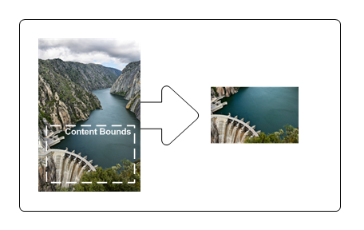

# Layers Overview

This overview describes the basics of using Direct2D layers. It contains the following sections.

-   [What Are Layers?](#what-are-layers)
-   [Layers in Windows 8 and later](#layers-in-windows-8-and-later)
    -   [ID2D1DeviceContext and PushLayer](#id2d1devicecontext-and-pushlayer)
    -   [D2D1\_LAYER\_PARAMETERS1 and D2D1\_LAYER\_OPTIONS1](/windows)
    -   [Blend Modes](#blend-modes)
    -   [Interoperation](#interoperation)
-   [Creating Layers](#creating-layers)
-   [Content Bounds](#content-bounds)
-   [Geometric Masks](#geometric-masks)
-   [Opacity Masks](#opacity-masks)
-   [Alternatives to Layers](#alternatives-to-layers)
-   [Clipping an arbitrary shape](#clipping-an-arbitrary-shape)
    -   [Axis aligned clips](#axis-aligned-clips)
-   [Related topics](#related-topics)

## What Are Layers?

Layers, represented by [**ID2D1Layer**](/windows/win32/api/d2d1/nn-d2d1-id2d1layer) objects, enable an application to manipulate a group of drawing operations. You use a layer by "pushing" it onto a render target. Subsequent drawing operations by the render target are directed to the layer. After you're finished with the layer, you "pop" the layer from the render target, which composites the layer's content back to the render target.

Like brushes, layers are device-dependent resources created by render targets. Layers can be used on any render target in the same resource domain that contains the render target that created it. However, a layer resource can only be used by one render target at a time. For more information about resources, see the [Resources Overview](resources-and-resource-domains.md).

Although layers offer a powerful rendering technique for producing interesting effects, excessive number of layers in an application can adversely affect its performance, because of the various costs associated with managing layers and layer resources. For example, there is the cost of filling or clearing the layer and then blending it back, especially on higher-end hardware. Then, there is the cost of managing the layer resources. If you reallocate these frequently, the resulting stalls against the GPU will be the most significant problem. When you design your application, try to maximize reusing layer resources.

## Layers in Windows 8 and later

Windows 8 introduced new layer related APIs that simplify, improve the performance of, and add features to layers.

### ID2D1DeviceContext and PushLayer

The [**ID2D1DeviceContext**](/windows/win32/api/d2d1_1/nn-d2d1_1-id2d1devicecontext) interface is derived from the [**ID2D1RenderTarget**](/windows/win32/api/d2d1/nn-d2d1-id2d1rendertarget) interface and is key to displaying Direct2D content in Windows 8, for more information about this interface see [Devices and Device Contexts](devices-and-device-contexts.md). With the device context interface, you can skip calling the [**CreateLayer**](/windows/desktop/api/d2d1/nf-d2d1-id2d1rendertarget-createlayer(id2d1layer)) method and then pass NULL to the [**ID2D1DeviceContext::PushLayer**](/windows/win32/api/d2d1_1/nf-d2d1_1-id2d1devicecontext-pushlayer(constd2d1_layer_parameters1_id2d1layer)) method. Direct2D automatically manages the layer resource and can share resources between layers and effect graphs.

### D2D1\_LAYER\_PARAMETERS1 and D2D1\_LAYER\_OPTIONS1

The [**D2D1\_LAYER\_PARAMETERS1**](/windows/desktop/api/d2d1_1/ns-d2d1_1-d2d1_layer_parameters1) structure is the same as [**D2D1\_LAYER\_PARAMETERS**](/windows/desktop/api/d2d1/ns-d2d1-d2d1_layer_parameters), except the final member of the structure is now a [**D2D1\_LAYER\_OPTIONS1**](/windows/desktop/api/d2d1_1/ne-d2d1_1-d2d1_layer_options1) enumeration.

[**D2D1\_LAYER\_OPTIONS1**](/windows/desktop/api/d2d1_1/ne-d2d1_1-d2d1_layer_options1) has no ClearType option and has two different options that you can use to improve performance:

-   [**D2D1\_LAYER\_OPTIONS1\_INITIALIZE\_FROM\_BACKGROUND**](/windows/desktop/api/d2d1_1/ne-d2d1_1-d2d1_layer_options1): Direct2D renders primitives to the layer without clearing it with transparent black. This is not the default, but in most cases results in better performance.

-   [**D2D1\_LAYER\_OPTIONS1\_IGNORE\_ALPHA**](/windows/desktop/api/d2d1_1/ne-d2d1_1-d2d1_layer_options1): if the underlying surface is set to [**D2D1\_ALPHA\_MODE\_IGNORE**](/windows/desktop/api/dcommon/ne-dcommon-d2d1_alpha_mode), this option lets Direct2D avoid modifying the alpha channel of the layer. Do not use this in other cases.

### Blend Modes

Starting in Windows 8, the device context has a [**primitive blend mode**](/windows/desktop/api/D2d1_1/ne-d2d1_1-d2d1_primitive_blend) that determines how each primitive is blended with the target surface. This mode also applies to layers when you call the [**PushLayer**](/windows/win32/api/d2d1_1/nf-d2d1_1-id2d1devicecontext-pushlayer(constd2d1_layer_parameters1_id2d1layer)) method.

For example, if you are using a layer to clip primitives with transparency set the [**D2D1\_PRIMITIVE\_BLEND\_COPY**](/windows/desktop/api/D2d1_1/ne-d2d1_1-d2d1_primitive_blend) mode on the device context for proper results. The copy mode makes the device context linear interpolate all 4 color channels, including the alpha channel, of each pixel with the contents of the target surface according to the geometric mask of the layer.

### Interoperation

Starting in Windows 8, Direct2D supports interoperation with Direct3D and GDI while a layer or clip is pushed. You call [**ID2D1GdiInteropRenderTarget::GetDC**](/windows/win32/api/d2d1/nf-d2d1-id2d1gdiinteroprendertarget-getdc) while a layer is pushed to interoperate with GDI. You call [**ID2D1DeviceContext::Flush**](/windows/win32/api/d2d1/nf-d2d1-id2d1rendertarget-flush) and then render to the underlying surface to interoperate with Direct3D. It is your responsibility to render inside the layer or clip with Direct3D or GDI. If you try to render outside the layer or clip the results are undefined.

## Creating Layers

Working with layers requires familiarity with the [**CreateLayer**](/windows/desktop/api/d2d1/nf-d2d1-id2d1rendertarget-createlayer(id2d1layer)), [**PushLayer**](/windows/win32/api/d2d1_1/nf-d2d1_1-id2d1devicecontext-pushlayer(constd2d1_layer_parameters1_id2d1layer)), and [**PopLayer**](/windows/win32/api/d2d1/nf-d2d1-id2d1rendertarget-poplayer) methods, and the [**D2D1\_LAYER\_PARAMETERS**](/windows/desktop/api/d2d1/ns-d2d1-d2d1_layer_parameters) structure, which contains a set of parametric data that defines how the layer can be used. The following list describes the methods and structure.

-   Call the [**CreateLayer**](/windows/desktop/api/d2d1/nf-d2d1-id2d1rendertarget-createlayer(id2d1layer)) method to create a layer resource.
    > [!Note]  
    > Starting in Windows 8, you can skip calling the [**CreateLayer**](/windows/desktop/api/d2d1/nf-d2d1-id2d1rendertarget-createlayer(id2d1layer)) method and then pass NULL to the [**PushLayer**](/windows/win32/api/d2d1_1/nf-d2d1_1-id2d1devicecontext-pushlayer(constd2d1_layer_parameters1_id2d1layer)) method on the [**ID2D1DeviceContext**](/windows/win32/api/d2d1_1/nn-d2d1_1-id2d1devicecontext) interface. This is simpler and allows Direct2D to automatically manage the layer resource and share resources between layers and effect graphs.

     

-   After render target has begun drawing (after its [**BeginDraw**](/windows/win32/api/d2d1/nf-d2d1-id2d1rendertarget-begindraw) method has been called), you can use the [**PushLayer**](/windows/win32/api/d2d1/nf-d2d1-id2d1rendertarget-pushlayer(constd2d1_layer_parameters__id2d1layer)) method. The **PushLayer** method adds the specified layer to the render target, so that the target receives all subsequent drawing operations until [**PopLayer**](/windows/win32/api/d2d1/nf-d2d1-id2d1rendertarget-poplayer) is called. This method takes an [**ID2D1Layer**](/windows/win32/api/d2d1/nn-d2d1-id2d1layer) object returned by calling [**CreateLayer**](/windows/desktop/api/d2d1/nf-d2d1-id2d1rendertarget-createlayer(id2d1layer)) and an *layerParameters* in the [**D2D1\_LAYER\_PARAMETERS**](/windows/desktop/api/d2d1/ns-d2d1-d2d1_layer_parameters) structure. The following table describes the fields of the structure. 

    | Field                 | Description|
    |-----------------------|-----------------------------------------------------------------------------------------------------------------------------------------------------------------------------------------------------------------------------------------------------------------------------|
    | **contentBounds**     | The content bounds of the layer. Content won't render outside these bounds. This parameter defaults to [**InfiniteRect**](/windows/desktop/api/d2d1Helper/nf-d2d1helper-infiniterect). When the default value is used, the content bounds are effectively taken to be the bounds of the render target. |
    | **geometricMask**     | (Optional) The area, defined by an [**ID2D1Geometry**](/windows/win32/api/d2d1/nn-d2d1-id2d1geometry), to which the layer should be clipped. Set to **NULL** if the layer shouldn't be clipped to a geometry. |
    | **maskAntialiasMode** | A value that specifies the antialiasing mode for the geometric mask specified by the **geometricMask** field. |
    | **maskTransform**     | A value that specifies the transform that is applied to the geometric mask when composing the layer. This is relative to the world transform.  |
    | **opacity**           | The opacity value of the layer. The opacity of each resource in the layer is multiplied with this value when compositing to the target.  |
    | **opacityBrush**      | (Optional) A brush that is used to modify the opacity of the layer. The brush is mapped to the layer, and the alpha channel of each mapped brush pixel is multiplied against the corresponding layer pixel. Set to **NULL** if the layer shouldn't have an opacity mask.   |
    | **layerOptions**      | A value that specifies whether the layer intends to render text with ClearType antialiasing. This parameter defaults to off. Turning it on enables ClearType to work correctly, but it results in slightly slower rendering speed.    |

    

     

    > [!Note]  
    > Starting in Windows 8, you cannot render with ClearType in a layer, so the **layerOptions** parameter should always be set to [**D2D1\_LAYER\_OPTIONS\_NONE**](/windows/desktop/api/d2d1/ne-d2d1-d2d1_layer_options)

     

    For convenience, Direct2D provides the [**D2D1::LayerParameters**](/windows/desktop/api/d2d1helper/nf-d2d1helper-layerparameters) method to help you create [**D2D1\_LAYER\_PARAMETERS**](/windows/desktop/api/d2d1/ns-d2d1-d2d1_layer_parameters) structures.

-   To composite the contents of the layer into the render target, call the [**PopLayer**](/windows/win32/api/d2d1/nf-d2d1-id2d1rendertarget-poplayer) method. You must call the **PopLayer** method before you call the [**EndDraw**](/windows/win32/api/d2d1/nf-d2d1-id2d1rendertarget-enddraw) method.

The following example shows how to use [**CreateLayer**](/windows/desktop/api/d2d1/nf-d2d1-id2d1rendertarget-createlayer(id2d1layer)), [**PushLayer**](/windows/win32/api/d2d1_1/nf-d2d1_1-id2d1devicecontext-pushlayer(constd2d1_layer_parameters1_id2d1layer)), and [**PopLayer**](/windows/win32/api/d2d1/nf-d2d1-id2d1rendertarget-poplayer). All fields in the [**D2D1\_LAYER\_PARAMETERS**](/windows/desktop/api/d2d1/ns-d2d1-d2d1_layer_parameters) structure are set to their defaults, except **opacityBrush**, which is set to an [**ID2D1RadialGradientBrush**](/windows/win32/api/d2d1/nn-d2d1-id2d1radialgradientbrush).


```C++
// Create a layer.
ID2D1Layer *pLayer = NULL;
hr = pRT->CreateLayer(NULL, &pLayer);

if (SUCCEEDED(hr))
{
    pRT->SetTransform(D2D1::Matrix3x2F::Translation(300, 250));

    // Push the layer with the content bounds.
    pRT->PushLayer(
        D2D1::LayerParameters(
            D2D1::InfiniteRect(),
            NULL,
            D2D1_ANTIALIAS_MODE_PER_PRIMITIVE,
            D2D1::IdentityMatrix(),
            1.0,
            m_pRadialGradientBrush,
            D2D1_LAYER_OPTIONS_NONE),
        pLayer
        );

    pRT->DrawBitmap(m_pBambooBitmap, D2D1::RectF(0, 0, 190, 127));

    pRT->FillRectangle(
        D2D1::RectF(25.f, 25.f, 50.f, 50.f), 
        m_pSolidColorBrush
        );
    pRT->FillRectangle(
        D2D1::RectF(50.f, 50.f, 75.f, 75.f),
        m_pSolidColorBrush
        ); 
    pRT->FillRectangle(
        D2D1::RectF(75.f, 75.f, 100.f, 100.f),
        m_pSolidColorBrush
        );    
 
    pRT->PopLayer();
}
SafeRelease(&pLayer);
```


Code has been omitted from this example.

Note that when you call [**PushLayer**](/windows/win32/api/d2d1_1/nf-d2d1_1-id2d1devicecontext-pushlayer(constd2d1_layer_parameters1_id2d1layer)) and [**PopLayer**](/windows/win32/api/d2d1/nf-d2d1-id2d1rendertarget-poplayer), ensure that each **PushLayer** has a matching **PopLayer** call. If there are more **PopLayer** calls than **PushLayer** calls, the render target is placed into an error state. If [**Flush**](/windows/win32/api/d2d1/nf-d2d1-id2d1rendertarget-flush) is called before all outstanding layers are popped, the render target is placed into an error state and returns an error. To clear the error state, use [**EndDraw**](/windows/win32/api/d2d1/nf-d2d1-id2d1rendertarget-enddraw).

## Content Bounds

The **contentBounds** sets the limit of what is to be drawn to the layer. Only those things within the content bounds are composited back to the render target.

The example that follows shows how to specify **contentBounds** so that the original image is clipped to the content bounds with the upper-left corner at (10, 108) and the lower-right corner at (121, 177). The following illustration shows the original image and the result of clipping the image to the content bounds.




```C++
HRESULT DemoApp::RenderWithLayerWithContentBounds(ID2D1RenderTarget *pRT)
{
    
    HRESULT hr = S_OK;

    // Create a layer.
    ID2D1Layer *pLayer = NULL;
    hr = pRT->CreateLayer(NULL, &pLayer);

    if (SUCCEEDED(hr))
    {
        pRT->SetTransform(D2D1::Matrix3x2F::Translation(300, 0));

        // Push the layer with the content bounds.
        pRT->PushLayer(
            D2D1::LayerParameters(D2D1::RectF(10, 108, 121, 177)),
            pLayer
            );

        pRT->DrawBitmap(m_pWaterBitmap, D2D1::RectF(0, 0, 128, 192));
        pRT->PopLayer();
    }

    SafeRelease(&pLayer);

    return hr;
    
}
```


Code has been omitted from this example.

> [!Note]
>
> The resulting clipped image is further affected if you specify a **geometricMask**. See the [Geometric Masks](#geometric-masks) section for more information.

 

## Geometric Masks

A geometric mask is a clip or a cutout, defined by an [**ID2D1Geometry**](/windows/win32/api/d2d1/nn-d2d1-id2d1geometry) object, that masks a layer when it is drawn by a render target. You can use the **geometricMask** field of the [**D2D1\_LAYER\_PARAMETERS**](/windows/desktop/api/d2d1/ns-d2d1-d2d1_layer_parameters) structure to mask the results to a geometry. For example, if you want to display an image masked by a block letter "A", you can first create a geometry representing the block letter "A" and use that geometry as a geometric mask for a layer. Then, after pushing the layer, you can draw the image. Popping the layer results in the image being clipped to the block letter "A" shape.

The example that follows shows how to create an [**ID2D1PathGeometry**](/windows/win32/api/d2d1/nn-d2d1-id2d1pathgeometry) containing a shape of a mountain and then pass the path geometry to the [**PushLayer**](/windows/win32/api/d2d1_1/nf-d2d1_1-id2d1devicecontext-pushlayer(constd2d1_layer_parameters1_id2d1layer)). It then draws a bitmap and squares. If there is only a bitmap in the layer to render, use [**FillGeometry**](/windows/win32/api/d2d1/nf-d2d1-id2d1rendertarget-fillgeometry) with a clamped bitmap brush for efficiency. The following illustration shows the output from the example.


The first example defines the geometry to be used as a mask.


```C++
hr = m_pD2DFactory->CreatePathGeometry(&m_pPathGeometry);
    
if(SUCCEEDED(hr))
{
    ID2D1GeometrySink *pSink = NULL;
    // Write to the path geometry using the geometry sink.
    hr = m_pPathGeometry->Open(&pSink);

    if (SUCCEEDED(hr))
    {
        pSink->SetFillMode(D2D1_FILL_MODE_WINDING);
        pSink->BeginFigure(
            D2D1::Point2F(0, 90),
            D2D1_FIGURE_BEGIN_FILLED
            );

        D2D1_POINT_2F points[7] = {
           D2D1::Point2F(35, 30),
           D2D1::Point2F(50, 50),
           D2D1::Point2F(70, 45),
           D2D1::Point2F(105, 90),
           D2D1::Point2F(130, 90),
           D2D1::Point2F(150, 60),
           D2D1::Point2F(170, 90)
           };

        pSink->AddLines(points, 7);
        pSink->EndFigure(D2D1_FIGURE_END_CLOSED);
        hr = pSink->Close();
    }
    SafeRelease(&pSink);
       }
```


The next example uses the geometry as a mask for the layer.


```C++
HRESULT DemoApp::RenderWithLayerWithGeometricMask(ID2D1RenderTarget *pRT)
{
    
    HRESULT hr;

    // Create a layer.
    ID2D1Layer *pLayer = NULL;
    hr = pRT->CreateLayer(NULL, &pLayer);

    if (SUCCEEDED(hr))
    {
        pRT->SetTransform(D2D1::Matrix3x2F::Translation(300, 450));

        pRT->PushLayer(
            D2D1::LayerParameters(D2D1::InfiniteRect(), m_pPathGeometry),
            pLayer
            );

        pRT->DrawBitmap(m_pLeafBitmap, D2D1::RectF(0, 0, 198, 132));

        pRT->FillRectangle(
            D2D1::RectF(50.f, 50.f, 75.f, 75.f), 
            m_pSolidColorBrush
            ); 
        pRT->FillRectangle(
            D2D1::RectF(75.f, 75.f, 100.f, 100.f),
            m_pSolidColorBrush
            );        

        pRT->PopLayer();
    }

    SafeRelease(&pLayer);

    return hr;
    
}
```


Code has been omitted from this example.

> [!Note]
>
> In general, if you specify a **geometricMask**, you can use the default value, [**InfiniteRect**](/windows/desktop/api/d2d1Helper/nf-d2d1helper-infiniterect), for the **contentBounds**.
>
> If **contentBounds** is NULL, and **geometricMask** is non-NULL, then the content bounds are effectively the bounds of the geometric mask after the mask transform is applied.
>
> If **contentBounds** is non-NULL, and **geometricMask** is non-NULL, then the transformed geometric mask is effectively clipped against content bounds and the content bounds are assumed to be infinite.

 

## Opacity Masks

An opacity mask is a mask, described by a brush or bitmap, that is applied to another object to make that object partially or completely transparent. It allows the use of the alpha channel of a brush to be used as a content mask. For example, you can define a radial gradient brush that varies from opaque to transparent to create a vignette effect.

The example that follows uses an [**ID2D1RadialGradientBrush**](/windows/win32/api/d2d1/nn-d2d1-id2d1radialgradientbrush) (*m\_pRadialGradientBrush*) as an opacity mask. It then draws a bitmap and squares. If there is only a bitmap in the layer to render, use [**FillGeometry**](/windows/win32/api/d2d1/nf-d2d1-id2d1rendertarget-fillgeometry) with a clamped bitmap brush for efficiency. The following illustration shows the output from this example.


```C++
HRESULT DemoApp::RenderWithLayerWithOpacityMask(ID2D1RenderTarget *pRT)
{   

    HRESULT hr = S_OK;

    // Create a layer.
    ID2D1Layer *pLayer = NULL;
    hr = pRT->CreateLayer(NULL, &pLayer);

    if (SUCCEEDED(hr))
    {
        pRT->SetTransform(D2D1::Matrix3x2F::Translation(300, 250));

        // Push the layer with the content bounds.
        pRT->PushLayer(
            D2D1::LayerParameters(
                D2D1::InfiniteRect(),
                NULL,
                D2D1_ANTIALIAS_MODE_PER_PRIMITIVE,
                D2D1::IdentityMatrix(),
                1.0,
                m_pRadialGradientBrush,
                D2D1_LAYER_OPTIONS_NONE),
            pLayer
            );

        pRT->DrawBitmap(m_pBambooBitmap, D2D1::RectF(0, 0, 190, 127));

        pRT->FillRectangle(
            D2D1::RectF(25.f, 25.f, 50.f, 50.f), 
            m_pSolidColorBrush
            );
        pRT->FillRectangle(
            D2D1::RectF(50.f, 50.f, 75.f, 75.f),
            m_pSolidColorBrush
            ); 
        pRT->FillRectangle(
            D2D1::RectF(75.f, 75.f, 100.f, 100.f),
            m_pSolidColorBrush
            );    
 
        pRT->PopLayer();
    }
    SafeRelease(&pLayer);
   
    return hr;
    
}
```


Code has been omitted from this example.

> [!Note]  
> This example uses a layer to apply an opacity mask to a single object to keep the example as simple as possible. When applying an opacity mask to a single object, its more efficient to use the [**FillOpacityMask**](id2d1rendertarget-fillopacitymask.md) or [**FillGeometry**](/windows/win32/api/d2d1/nf-d2d1-id2d1rendertarget-fillgeometry) methods, rather than a layer.

 

For instructions on how to apply an opacity mask without using a layer, see the [Opacity Masks Overview](opacity-masks-overview.md).

## Alternatives to Layers

As mentioned earlier, excessive number of layers can adversely affect the performance of your application. To improve performance, avoid using layers whenever possible; instead use their alternatives. The following code example shows how to use [**PushAxisAlignedClip**](/windows/win32/api/d2d1/nf-d2d1-id2d1rendertarget-pushaxisalignedclip(constd2d1_rect_f_d2d1_antialias_mode)) and [**PopAxisAlignedClip**](/windows/win32/api/d2d1/nf-d2d1-id2d1rendertarget-popaxisalignedclip) to clip a region, as an alternative to using a layer with content bounds.


```C++
pRT->PushAxisAlignedClip(
    D2D1::RectF(20, 20, 100, 100),
    D2D1_ANTIALIAS_MODE_PER_PRIMITIVE
    );

pRT->FillRectangle(D2D1::RectF(0, 0, 200, 133), m_pOriginalBitmapBrush);
pRT->PopAxisAlignedClip();
```


Similarly, use [**FillGeometry**](/windows/win32/api/d2d1/nf-d2d1-id2d1rendertarget-fillgeometry) with a clamped bitmap brush as an alternative to using a layer with an opacity mask when there is only one content in the layer to render, as shown in the following example.


```C++
        m_pRenderTarget->FillGeometry(
            m_pRectGeo, 
            m_pLinearFadeFlowersBitmapBrush, 
            m_pLinearGradientBrush
            );
```


As an alternative to using a layer with a geometric mask, consider using a bitmap mask to clip a region, as shown in the following example.


```C++
// D2D1_ANTIALIAS_MODE_ALIASED must be set for FillOpacityMask
// to function properly.
m_pRenderTarget->SetAntialiasMode(D2D1_ANTIALIAS_MODE_ALIASED);

m_pRenderTarget->FillOpacityMask(
    m_pBitmapMask,
    m_pOriginalBitmapBrush,
    D2D1_OPACITY_MASK_CONTENT_GRAPHICS,
    &rcBrushRect,
    NULL
    );

m_pRenderTarget->SetAntialiasMode(D2D1_ANTIALIAS_MODE_PER_PRIMITIVE);

```


Lastly, if you want to apply opacity to a single primitive, you should multiply the opacity into the into the brush color and then render the primitive. You do not need a layer or an opacity mask bitmap.


```C++
float opacity = 0.9f;

ID2D1SolidColorBrush *pBrush = NULL;
hr = pCompatibleRenderTarget->CreateSolidColorBrush(
    D2D1::ColorF(D2D1::ColorF(0.93f, 0.94f, 0.96f, 1.0f * opacity)),
    &pBrush
    );

m_pRenderTarget->FillRectangle(
    D2D1::RectF(50.0f, 50.0f, 75.0f, 75.0f), 
    pBrush
    ); 
```


## Clipping an arbitrary shape

The figure here shows the result of applying a clip to an image.


You can get this result by using layers with a geometry mask or the [**FillGeometry**](/windows/win32/api/d2d1/nf-d2d1-id2d1rendertarget-fillgeometry) method with an opacity brush.

Here's an example that uses a layer:


```C++
// Call PushLayer() and pass in the clipping geometry.
m_d2dContext->PushLayer(
    D2D1::LayerParameters(
        boundsRect,
        geometricMask));
```


Here's an example that uses the [**FillGeometry**](/windows/win32/api/d2d1/nf-d2d1-id2d1rendertarget-fillgeometry) method:


```C++
// Create an opacity bitmap and render content.
m_d2dContext->CreateBitmap(size, nullptr, 0,
    D2D1::BitmapProperties(
        D2D1_BITMAP_OPTIONS_TARGET,
        D2D1::PixelFormat(
            DXGI_FORMAT_A8_UNORM,
            D2D1_ALPHA_MODE_PREMULTIPLIED),
        dpiX, dpiY),
    &opacityBitmap);

m_d2dContext->SetTarget(opacityBitmap.Get());
m_d2dContext->BeginDraw();
…
m_d2dContext->EndDraw();

// Create an opacity brush from the opacity bitmap.
m_d2dContext->CreateBitmapBrush(opacityBitmap.Get(),
    D2D1::BitmapBrushProperties(),
    D2D1::BrushProperties(),
    &bitmapBrush);

// Call the FillGeometry method and pass in the clip geometry and the opacity brush
m_d2dContext->FillGeometry( 
    clipGeometry.Get(),
    brush.Get(),
    opacityBrush.Get()); 
```


In this code example, when you call the PushLayer method, you don't pass in an app created layer. Direct2D creates a layer for you. Direct2D is able to manage the allocation and destruction of this resource without any involvement from the app. This allows Direct2D to reuse layers internally and apply resource management optimizations.

> [!Note]  
> In Windows 8 many optimizations have been made to the usage of layers and we recommend you try using layer APIs instead of [**FillGeometry**](/windows/win32/api/d2d1/nf-d2d1-id2d1rendertarget-fillgeometry) whenever possible.

 

### Axis aligned clips

If the region to be clipped is aligned to the axis of the drawing surface, instead of arbitrary. This case is suited for using a clip rectangle instead of a layer. The performance gain is more for aliased geometry than antialiased geometry. For more info on axis aligned clips, see the [**PushAxisAlignedClip**](/windows/win32/api/d2d1/nf-d2d1-id2d1rendertarget-pushaxisalignedclip(constd2d1_rect_f__d2d1_antialias_mode)) topic.

## Related topics

<dl> <dt>

[Direct2D Reference](reference.md)
</dt> </dl>

 

 