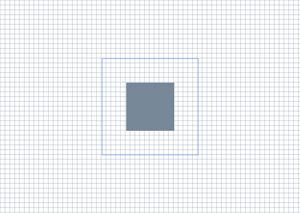

# Create a simple Direct2D application

This topic walks you through the process of creating the **DemoApp** class, which creates a window, and uses Direct2D to draw content. In this tutorial, you learn how to create Direct2D resources, and draw basic shapes. You also learn how to structure your application to enhance performance by minimizing resource creation.

To follow the tutorial, you can use Microsoft Visual Studio to create a Win32 project, and then replace the code in the main application header and `.cpp` file with the code described in this tutorial.

Also see the [Simple Direct2D application sample app on GitHub](https://github.com/microsoft/Windows-classic-samples/tree/main/Samples/Win7Samples/multimedia/Direct2D/SimpleDirect2DApplication).

> [!NOTE]
> If you want to create a Universal Windows Platform (UWP) app that uses Direct2D, then see the [Direct2D quickstart for Windows 8](direct2d-quickstart-with-device-context.md) topic.

For an overview of the interfaces that you can use to create Direct2D content, see the [Direct2D API overview](the-direct2d-api.md).

Upon completion of the tutorial, the **DemoApp** class produces the output shown in the following illustration.



## Part 1: Create the DemoApp Header

In this step, you set up your application to use Direct2D by adding the necessary headers and macros. You also declare the methods and data members that you'll use in later parts of this tutorial.

1.  In your application header file, include the following frequently-used headers.
    ```cpp
    // Windows Header Files:
    #include <windows.h>

    // C RunTime Header Files:
    #include <stdlib.h>
    #include <malloc.h>
    #include <memory.h>
    #include <wchar.h>
    #include <math.h>

    #include <d2d1.h>
    #include <d2d1helper.h>
    #include <dwrite.h>
    #include <wincodec.h>
    ```

2.  Declare additional functions for releasing interfaces, and macros for error-handling and retrieving the module's base address.
    ```cpp
    template<class Interface>
    inline void SafeRelease(
        Interface **ppInterfaceToRelease)
    {
        if (*ppInterfaceToRelease != NULL)
        {
            (*ppInterfaceToRelease)->Release();
            (*ppInterfaceToRelease) = NULL;
        }
    }

    #ifndef Assert
    #if defined( DEBUG ) || defined( _DEBUG )
    #define Assert(b) do {if (!(b)) {OutputDebugStringA("Assert: " #b "\n");}} while(0)
    #else
    #define Assert(b)
    #endif //DEBUG || _DEBUG
    #endif

    #ifndef HINST_THISCOMPONENT
    EXTERN_C IMAGE_DOS_HEADER __ImageBase;
    #define HINST_THISCOMPONENT ((HINSTANCE)&__ImageBase)
    #endif
    ```

3.  Declare methods for initializing the class, creating and discarding resources, handling the message loop, rendering content, and the windows procedure.
    ```cpp
    class DemoApp
    {
    public:
        DemoApp();
        ~DemoApp();

        // Register the window class and call methods for instantiating drawing resources
        HRESULT Initialize();

        // Process and dispatch messages
        void RunMessageLoop();

    private:
        // Initialize device-independent resources.
        HRESULT CreateDeviceIndependentResources();

        // Initialize device-dependent resources.
        HRESULT CreateDeviceResources();

        // Release device-dependent resource.
        void DiscardDeviceResources();

        // Draw content.
        HRESULT OnRender();

        // Resize the render target.
        void OnResize(
            UINT width,
            UINT height
            );

        // The windows procedure.
        static LRESULT CALLBACK WndProc(
            HWND hWnd,
            UINT message,
            WPARAM wParam,
            LPARAM lParam
            );
    };
    ```

4.  As class members, declare pointers for an [**ID2D1Factory**](/windows/win32/api/d2d1/nn-d2d1-id2d1factory) object, an [**ID2D1HwndRenderTarget**](/windows/win32/api/d2d1/nn-d2d1-id2d1hwndrendertarget) object, and two [**ID2D1SolidColorBrush**](/windows/win32/api/d2d1/nn-d2d1-id2d1solidcolorbrush) objects.
    ```cpp
    private:
    HWND m_hwnd;
    ID2D1Factory* m_pDirect2dFactory;
    ID2D1HwndRenderTarget* m_pRenderTarget;
    ID2D1SolidColorBrush* m_pLightSlateGrayBrush;
    ID2D1SolidColorBrush* m_pCornflowerBlueBrush;
    ```

## Part 2: Implement the class infrastructure

In this part, you implement the **DemoApp** constructor and destructor, its initialization and message looping methods, and the **WinMain** function. Most of these methods look the same as those found in any other Win32 application. The only exception is the **Initialize** method, which calls the **CreateDeviceIndependentResources** method (which you'll define in the next part), which creates several Direct2D resources.

1.  In the class implementation file, implement the class constructor and destructor. The constructor should initialize its members to `NULL`. The destructor should release any interfaces that are stored as class members.
    ```cpp
    DemoApp::DemoApp() :
        m_hwnd(NULL),
        m_pDirect2dFactory(NULL),
        m_pRenderTarget(NULL),
        m_pLightSlateGrayBrush(NULL),
        m_pCornflowerBlueBrush(NULL)
    {}
    
    DemoApp::~DemoApp()
    {
        SafeRelease(&m_pDirect2dFactory);
        SafeRelease(&m_pRenderTarget);
        SafeRelease(&m_pLightSlateGrayBrush);
        SafeRelease(&m_pCornflowerBlueBrush);
    }
    ```

2.  Implement the **DemoApp::RunMessageLoop** method, which translates and dispatches messages.
    ```cpp
    void DemoApp::RunMessageLoop()
    {
        MSG msg;

        while (GetMessage(&msg, NULL, 0, 0))
        {
            TranslateMessage(&msg);
            DispatchMessage(&msg);
        }
    }
    ```

3.  Implement the **Initialize** method, which creates the window, shows it, and calls the **DemoApp::CreateDeviceIndependentResources** method. You'll implement the **CreateDeviceIndependentResources** method in the next section.
    ```cpp
    HRESULT DemoApp::Initialize()
    {
        HRESULT hr;

        // Initialize device-indpendent resources, such
        // as the Direct2D factory.
        hr = CreateDeviceIndependentResources();

        if (SUCCEEDED(hr))
        {
            // Register the window class.
            WNDCLASSEX wcex = { sizeof(WNDCLASSEX) };
            wcex.style         = CS_HREDRAW | CS_VREDRAW;
            wcex.lpfnWndProc   = DemoApp::WndProc;
            wcex.cbClsExtra    = 0;
            wcex.cbWndExtra    = sizeof(LONG_PTR);
            wcex.hInstance     = HINST_THISCOMPONENT;
            wcex.hbrBackground = NULL;
            wcex.lpszMenuName  = NULL;
            wcex.hCursor       = LoadCursor(NULL, IDI_APPLICATION);
            wcex.lpszClassName = L"D2DDemoApp";

            RegisterClassEx(&wcex);

            // In terms of using the correct DPI, to create a window at a specific size
            // like this, the procedure is to first create the window hidden. Then we get
            // the actual DPI from the HWND (which will be assigned by whichever monitor
            // the window is created on). Then we use SetWindowPos to resize it to the
            // correct DPI-scaled size, then we use ShowWindow to show it.

            m_hwnd = CreateWindow(
                L"D2DDemoApp",
                L"Direct2D demo application",
                WS_OVERLAPPEDWINDOW,
                CW_USEDEFAULT,
                CW_USEDEFAULT,
                0,
                0,
                NULL,
                NULL,
                HINST_THISCOMPONENT,
                this);

            if (m_hwnd)
            {
                // Because the SetWindowPos function takes its size in pixels, we
                // obtain the window's DPI, and use it to scale the window size.
                float dpi = GetDpiForWindow(m_hwnd);

                SetWindowPos(
                    m_hwnd,
                    NULL,
                    NULL,
                    NULL,
                    static_cast<int>(ceil(640.f * dpi / 96.f)),
                    static_cast<int>(ceil(480.f * dpi / 96.f)),
                    SWP_NOMOVE);
                ShowWindow(m_hwnd, SW_SHOWNORMAL);
                UpdateWindow(m_hwnd);
            }
        }

        return hr;
    }
    ```

4.  Implement the **WinMain** method, which serves as the application entry point. Initialize an instance of the **DemoApp**, class and begin its message loop.
    ```cpp
    int WINAPI WinMain(
        HINSTANCE /* hInstance */,
        HINSTANCE /* hPrevInstance */,
        LPSTR /* lpCmdLine */,
        int /* nCmdShow */
        )
    {
        // Use HeapSetInformation to specify that the process should
        // terminate if the heap manager detects an error in any heap used
        // by the process.
        // The return value is ignored, because we want to continue running in the
        // unlikely event that HeapSetInformation fails.
        HeapSetInformation(NULL, HeapEnableTerminationOnCorruption, NULL, 0);

        if (SUCCEEDED(CoInitialize(NULL)))
        {
            {
                DemoApp app;

                if (SUCCEEDED(app.Initialize()))
                {
                    app.RunMessageLoop();
                }
            }
            CoUninitialize();
        }

        return 0;
    }
    ```

## Part 3: Create Direct2D resources

In this part, you create the Direct2D resources that you use to draw. Direct2D provides two types of resources&mdash;device-independent resources that can last for the duration of the application, and device-dependent resources. Device-dependent resources are associated with a particular rendering device, and will cease to function if that device is removed.

1.  Implement the **DemoApp::CreateDeviceIndependentResources** method. In the method, create an [**ID2D1Factory**](/windows/win32/api/d2d1/nn-d2d1-id2d1factory), which is a device-independent resource for creating other Direct2D resources. Use the `m_pDirect2DdFactory` class member to store the factory.
    ```cpp
    HRESULT DemoApp::CreateDeviceIndependentResources()
    {
        HRESULT hr = S_OK;

        // Create a Direct2D factory.
        hr = D2D1CreateFactory(D2D1_FACTORY_TYPE_SINGLE_THREADED, &m_pDirect2dFactory);

        return hr;
    }
    ```

2.  Implement the **DemoApp::CreateDeviceResources** method. This method creates the window's device-dependent resources, a render target, and two brushes. Retrieve the size of the client area and create an [**ID2D1HwndRenderTarget**](/windows/win32/api/d2d1/nn-d2d1-id2d1hwndrendertarget) of the same size that renders to the window's **HWND**. Store the render target in the `m_pRenderTarget` class member.
    ```cpp
    RECT rc;
    GetClientRect(m_hwnd, &rc);

    D2D1_SIZE_U size = D2D1::SizeU(
        rc.right - rc.left,
        rc.bottom - rc.top);

    // Create a Direct2D render target.
    hr = m_pDirect2dFactory->CreateHwndRenderTarget(
        D2D1::RenderTargetProperties(),
        D2D1::HwndRenderTargetProperties(m_hwnd, size),
        &m_pRenderTarget);
    ```

3.  Use the render target to create a gray [**ID2D1SolidColorBrush**](/windows/win32/api/d2d1/nn-d2d1-id2d1solidcolorbrush) and a cornflower blue **ID2D1SolidColorBrush**.
    ```cpp
    if (SUCCEEDED(hr))
    {
        // Create a gray brush.
        hr = m_pRenderTarget->CreateSolidColorBrush(
            D2D1::ColorF(D2D1::ColorF::LightSlateGray),
            &m_pLightSlateGrayBrush
            );
    }

    if (SUCCEEDED(hr))
    {
        // Create a blue brush.
        hr = m_pRenderTarget->CreateSolidColorBrush(
            D2D1::ColorF(D2D1::ColorF::CornflowerBlue),
            &m_pCornflowerBlueBrush
            );
    }
    ```

4.  Because this method will be called repeatedly, add an `if` statement to check whether the render target (`m_pRenderTarget`) already exists. The following code shows the complete **CreateDeviceResources** method.
    ```cpp
    HRESULT DemoApp::CreateDeviceResources()
    {
        HRESULT hr = S_OK;

        if (!m_pRenderTarget)
        {
            RECT rc;
            GetClientRect(m_hwnd, &rc);

            D2D1_SIZE_U size = D2D1::SizeU(
                rc.right - rc.left,
                rc.bottom - rc.top
                );

            // Create a Direct2D render target.
            hr = m_pDirect2dFactory->CreateHwndRenderTarget(
                D2D1::RenderTargetProperties(),
                D2D1::HwndRenderTargetProperties(m_hwnd, size),
                &m_pRenderTarget
                );

            if (SUCCEEDED(hr))
            {
                // Create a gray brush.
                hr = m_pRenderTarget->CreateSolidColorBrush(
                    D2D1::ColorF(D2D1::ColorF::LightSlateGray),
                    &m_pLightSlateGrayBrush
                    );
            }
            if (SUCCEEDED(hr))
            {
                // Create a blue brush.
                hr = m_pRenderTarget->CreateSolidColorBrush(
                    D2D1::ColorF(D2D1::ColorF::CornflowerBlue),
                    &m_pCornflowerBlueBrush
                    );
            }
        }

        return hr;
    }
    ```

5.  Implement the **DemoApp::DiscardDeviceResources** method. In this method, release the render target and the two brushes you created in the **DemoApp::CreateDeviceResources** method.
    ```cpp
    void DemoApp::DiscardDeviceResources()
    {
        SafeRelease(&m_pRenderTarget);
        SafeRelease(&m_pLightSlateGrayBrush);
        SafeRelease(&m_pCornflowerBlueBrush);
    }
    ```

## Part 4: Render Direct2D content

In this part, you implement the windows procedure, the **OnRender** method (which paints content), and the **OnResize** method (which adjusts the size of the render target when the window is resized).

1.  Implement the **DemoApp::WndProc** method to handle window messages. For the [**WM_SIZE**](../winmsg/wm-size.md) message, call the **DemoApp::OnResize** method, and pass it the new width and height. For the [**WM_PAINT**](/windows/win32/gdi/wm-paint) and [**WM_DISPLAYCHANGE**](/windows/win32/gdi/wm-displaychange) messages, call the **DemoApp::OnRender** method to paint the window. You'll implement the **OnRender** and **OnResize** methods in the steps that follow.
    ```cpp
    LRESULT CALLBACK DemoApp::WndProc(HWND hwnd, UINT message, WPARAM wParam, LPARAM lParam)
    {
        LRESULT result = 0;

        if (message == WM_CREATE)
        {
            LPCREATESTRUCT pcs = (LPCREATESTRUCT)lParam;
            DemoApp *pDemoApp = (DemoApp *)pcs->lpCreateParams;

            ::SetWindowLongPtrW(
                hwnd,
                GWLP_USERDATA,
                reinterpret_cast<LONG_PTR>(pDemoApp)
                );

            result = 1;
        }
        else
        {
            DemoApp *pDemoApp = reinterpret_cast<DemoApp *>(static_cast<LONG_PTR>(
                ::GetWindowLongPtrW(
                    hwnd,
                    GWLP_USERDATA
                    )));

            bool wasHandled = false;

            if (pDemoApp)
            {
                switch (message)
                {
                case WM_SIZE:
                    {
                        UINT width = LOWORD(lParam);
                        UINT height = HIWORD(lParam);
                        pDemoApp->OnResize(width, height);
                    }
                    result = 0;
                    wasHandled = true;
                    break;

                case WM_DISPLAYCHANGE:
                    {
                        InvalidateRect(hwnd, NULL, FALSE);
                    }
                    result = 0;
                    wasHandled = true;
                    break;

                case WM_PAINT:
                    {
                        pDemoApp->OnRender();
                        ValidateRect(hwnd, NULL);
                    }
                    result = 0;
                    wasHandled = true;
                    break;

                case WM_DESTROY:
                    {
                        PostQuitMessage(0);
                    }
                    result = 1;
                    wasHandled = true;
                    break;
                }
            }

            if (!wasHandled)
            {
                result = DefWindowProc(hwnd, message, wParam, lParam);
            }
        }

        return result;
    }
    ```

2.  Implement the **DemoApp::OnRender** method. First, define an **HRESULT**. Then call the **CreateDeviceResource** method. That method is called every time the window is painted. Recall that, in step 4 of Part 3, you added an `if` statement to prevent the method from doing any work if the render target already exists.
    ```cpp
    HRESULT DemoApp::OnRender()
    {
        HRESULT hr = S_OK;

        hr = CreateDeviceResources();
    ```

3.  Verify that the **CreateDeviceResource** method succeeded. If it didn't, then don't perform any drawing.
    ```cpp
    if (SUCCEEDED(hr))
    {
    ```

4.  Inside the `if` statement that you just added, initiate drawing by calling the render target's **BeginDraw** method. Set the render target's transform to the identity matrix, and clear the window.
    ```cpp
    m_pRenderTarget->BeginDraw();
    m_pRenderTarget->SetTransform(D2D1::Matrix3x2F::Identity());
    m_pRenderTarget->Clear(D2D1::ColorF(D2D1::ColorF::White));
    ```

5.  Retrieve the size of the drawing area.
    ```cpp
    D2D1_SIZE_F rtSize = m_pRenderTarget->GetSize();
    ```

6.  Draw a grid background by using a `for` loop and the render target's [**DrawLine**](/windows/win32/api/d2d1/nf-d2d1-id2d1rendertarget-drawline) method to draw a series of lines.
    ```cpp
    // Draw a grid background.
    int width = static_cast<int>(rtSize.width);
    int height = static_cast<int>(rtSize.height);

    for (int x = 0; x < width; x += 10)
    {
        m_pRenderTarget->DrawLine(
            D2D1::Point2F(static_cast<FLOAT>(x), 0.0f),
            D2D1::Point2F(static_cast<FLOAT>(x), rtSize.height),
            m_pLightSlateGrayBrush,
            0.5f
            );
    }

    for (int y = 0; y < height; y += 10)
    {
        m_pRenderTarget->DrawLine(
            D2D1::Point2F(0.0f, static_cast<FLOAT>(y)),
            D2D1::Point2F(rtSize.width, static_cast<FLOAT>(y)),
            m_pLightSlateGrayBrush,
            0.5f
            );
    }
    ```

7.  Create two rectangle primitives that are centered on the screen.
    ```cpp
    // Draw two rectangles.
    D2D1_RECT_F rectangle1 = D2D1::RectF(
        rtSize.width/2 - 50.0f,
        rtSize.height/2 - 50.0f,
        rtSize.width/2 + 50.0f,
        rtSize.height/2 + 50.0f
        );

    D2D1_RECT_F rectangle2 = D2D1::RectF(
        rtSize.width/2 - 100.0f,
        rtSize.height/2 - 100.0f,
        rtSize.width/2 + 100.0f,
        rtSize.height/2 + 100.0f
        );
    ```

8.  Use the render target's [**FillRectangle**](/windows/win32/api/d2d1/nf-d2d1-id2d1rendertarget-fillrectangle(constd2d1_rect_f__id2d1brush)) method to paint the interior of the first rectangle with the gray brush.
    ```cpp
    // Draw a filled rectangle.
    m_pRenderTarget->FillRectangle(&rectangle1, m_pLightSlateGrayBrush);
    ```

9.  Use the render target's [**DrawRectangle**](/windows/win32/api/d2d1/nf-d2d1-id2d1rendertarget-drawrectangle(constd2d1_rect_f__id2d1brush_float_id2d1strokestyle)) method to paint the outline of the second rectangle with the cornflower blue brush.
    ```cpp
    // Draw the outline of a rectangle.
    m_pRenderTarget->DrawRectangle(&rectangle2, m_pCornflowerBlueBrush);
    ```

10. Call the render target's [**EndDraw**](/windows/win32/api/d2d1/nf-d2d1-id2d1rendertarget-enddraw) method. The **EndDraw** method returns an **HRESULT** to indicate whether the drawing operations were successful. Close the scope of the `if` statement that you began in Step 3.
    ```cpp
        hr = m_pRenderTarget->EndDraw();
    }
    ```

11. Check the **HRESULT** returned by [**EndDraw**](/windows/win32/api/d2d1/nf-d2d1-id2d1rendertarget-enddraw). If it indicates that the render target needs to be recreated, then call the **DemoApp::DiscardDeviceResources** method to release it; it will be recreated the next time the window receives a [**WM_PAINT**](/windows/win32/gdi/wm-paint) or [**WM_DISPLAYCHANGE**](/windows/win32/gdi/wm-displaychange) message.
    ```cpp
    if (hr == D2DERR_RECREATE_TARGET)
    {
        hr = S_OK;
        DiscardDeviceResources();
    }
    ```

12. Return the **HRESULT**, and close the method's scope.
    ```cpp
        return hr;
    }
    ```

13. Implement the **DemoApp::OnResize** method so that it resizes the render target to the new size of the window.
    ```cpp
    void DemoApp::OnResize(UINT width, UINT height)
    {
        if (m_pRenderTarget)
        {
            // Note: This method can fail, but it's okay to ignore the
            // error here, because the error will be returned again
            // the next time EndDraw is called.
            m_pRenderTarget->Resize(D2D1::SizeU(width, height));
        }
    }
    ```

You've now completed the tutorial.

> [!NOTE]  
> To use Direct2D, ensure that your application includes the `d2d1.h` header file, and compiles against the `d2d1.lib` library. You can find `d2d1.h` and `d2d1.lib` in the [Windows SDK](https://developer.microsoft.com/en-us/windows/downloads/windows-sdk/).

## Summary

In this tutorial, you learned how to create Direct2D resources, and draw basic shapes. You also learned how to structure your application to enhance performance by minimizing resource creation.

## Related topics

* [Direct2D API Overview](the-direct2d-api.md)
* [Improving the Performance of Direct2D](improving-direct2d-performance.md)
* [Simple Direct2D application sample app on GitHub](https://github.com/microsoft/Windows-classic-samples/tree/main/Samples/Win7Samples/multimedia/Direct2D/SimpleDirect2DApplication)

