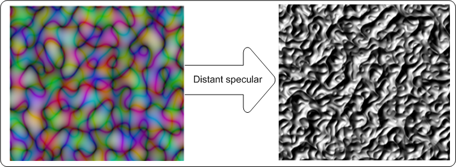
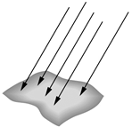

# Distant-specular lighting effect

Use the distant-specular lighting effect to create an image that appears to be a reflective surface where the light source appears to be coming from a long distance (like the sun or overhead lights). This effect uses the alpha channel as a height map and lights the image with a distant light source.

The color of the output bitmap is a result of light color, light position, and the surface geometry. The alpha channel output for each pixel with specular lighting is the maximum of the red, green, and blue channel outputs for that pixel.

The CLSID for this effect is CLSID\_D2D1DistantSpecular.

-   [Example image](#example-image)
-   [Distant light source](#distant-light-source)
-   [Effect properties](#effect-properties)
-   [Scale modes](#scale-modes)
-   [Requirements](#requirements)
-   [Related topics](#related-topics)

## Example image

The example here shows the input and output images of the distant-specular lighting effect.

The final output bitmap can be calculated using the following equations.

where <dl> k? = specular lighting constant.  
= surface normal unit vector.  
= "halfway" unit vector between eye unit vector and light unit vector.  
Cr, Cg, Cb = the light color in RGB components.  
</dl>

## Distant light source

The image here shows an example of the direction of light from a distant light source.

The effect uses the azimuth and elevation parameters to calculate the light vector  using the following equations:

where Light?, Lighty, and Lightz are the input light position values.

## Effect properties

| Display name and index enumeration                                                       | Description                                                                                                                                                                                                                                                                                                                                                                                                                                     |
|------------------------------------------------------------------------------------------|-------------------------------------------------------------------------------------------------------------------------------------------------------------------------------------------------------------------------------------------------------------------------------------------------------------------------------------------------------------------------------------------------------------------------------------------------|
| Azimuth  D2D1\_DISTANTSPECULAR\_PROP\_AZIMUTH                        | The direction angle of the light source in the XY plane relative to the X-axis in the counter clock wise direction. The units are in degrees and must be between 0 and 360 degrees.  The type is FLOAT.  The default value is 0.0f.                                                                                                                                                                               |
| Elevation  D2D1\_DISTANTSPECULAR\_PROP\_ELEVATION                    | The direction angle of the light source in the YZ plane relative to the Y-axis in the counter clock wise direction. The units are in degrees and must be between 0 and 360 degrees.   The type is FLOAT.  The default value is 0.0f.                                                                                                                                                                              |
| SpecularExponent  D2D1\_DISTANTSPECULAR\_PROP\_SPECULAR\_EXPONENT    | The exponent for the specular term in the Phong lighting equation. A larger value corresponds to a more reflective surface. The value is unitless and must be between 1.0 and 128. The type is FLOAT.  The default value is 1.0f.                                                                                                                                                                                           |
| SpecularConstant  D2D1\_DISTANTSPECULAR\_PROP\_SPECULAR\_CONSTANT    | The ratio of specular reflection to the incoming light. The value is unitless and must be between 0 and 10,000. The type is FLOAT.  The default value is 1.0f.                                                                                                                                                                                                                                                              |
| SurfaceScale  D2D1\_DISTANTSPECULAR\_PROP\_SURFACE\_SCALE            | The scale factor in the Z direction. The value is unitless and must be between 0 and 10,000. The type is FLOAT.  The default value is 1.0f.                                                                                                                                                                                                                                                                                 |
| Color  D2D1\_DISTANTSPECULAR\_PROP\_COLOR                            | The color of the incoming light. This property is exposed as a D2D1\_VECTOR\_3F   (R, G, B) and used to compute LR, LG, LB. The type is D2D1\_VECTOR\_3F.  The default value is {1.0f, 1.0f, 1.0f}.                                                                                                                                                                                        |
| KernelUnitLength  D2D1\_DISTANTSPECULAR\_PROP\_KERNEL\_UNIT\_LENGTH  | The size of an element in the Sobel kernel used to generate the surface normal in the X and Y direction. This property is a D2D1\_VECTOR\_2F (Kernel Unit Length X, Kernel Unit Length Y) and is defined in (device-independent pixels (DIPs)/Kernel Unit). The effect uses bilinear interpolation to scale the bitmap to match size of kernel elements. The type is D2D1\_VECTOR\_2F.  The default value is {1.0f, 1.0f}.  |
| ScaleMode  D2D1\_DISTANTSPECULAR\_PROP\_SCALE\_MODE                  | The interpolation mode the effect uses to scale the image to the corresponding kernel unit length. There are six scale modes that range in quality and speed.  The type is D2D1\_DISTANTSPECULAR\_SCALE\_MODE.  The default value is D2D1\_DISTANTSPECULAR\_SCALE\_MODE\_LINEAR.                                                                                                                                  |

 

## Scale modes

| Enumeration                                               | Description                                                                                                                                                                                          |
|-----------------------------------------------------------|------------------------------------------------------------------------------------------------------------------------------------------------------------------------------------------------------|
| D2D1\_DISTANTSPECULAR\_SCALE\_MODE\_NEAREST\_NEIGHBOR     | Samples the nearest single point and uses that. This mode uses less processing time, but outputs the lowest quality image.                                                                           |
| D2D1\_DISTANTSPECULAR\_SCALE\_MODE\_LINEAR                | Uses a four point sample and linear interpolation. This mode outputs a higher quality image than nearest neighbor.                                                                                   |
| D2D1\_DISTANTSPECULAR\_SCALE\_MODE\_CUBIC                 | Uses a 16 sample cubic kernel for interpolation. This mode uses the most processing time, but outputs a higher quality image.                                                                        |
| D2D1\_DISTANTSPECULAR\_SCALE\_MODE\_MULTI\_SAMPLE\_LINEAR | Uses 4 linear samples within a single pixel for good edge anti-aliasing. This mode is good for scaling down by small amounts on images with few pixels.                                              |
| D2D1\_DISTANTSPECULAR\_SCALE\_MODE\_ANISOTROPIC           | Uses anisotropic filtering to sample a pattern according to the transformed shape of the bitmap.                                                                                                     |
| D2D1\_DISTANTSPECULAR\_SCALE\_MODE\_HIGH\_QUALITY\_CUBIC  | Uses a variable size high quality cubic kernel to perform a pre-downscale the image if downscaling is involved in the transform matrix. Then uses the cubic interpolation mode for the final output. |

 

> [!Note]  
> If you don't select a mode, the effect defaults to D2D1\_DISTANTSPECULAR\_SCALE\_MODE\_LINEAR.

## Requirements

| Requirement | Value |
|--------------------------|------------------------------------------------------------------------------------|
| Minimum supported client | Windows 8 and Platform Update for Windows 7 \[desktop apps \| Windows Store apps\] |
| Minimum supported server | Windows 8 and Platform Update for Windows 7 \[desktop apps \| Windows Store apps\] |
| Header                   | d2d1effects.h                                                                      |
| Library                  | d2d1.lib, dxguid.lib                                                               |

 

## Related topics

<dl> <dt>

[**ID2D1Effect**](/windows/win32/api/d2d1_1/nn-d2d1_1-id2d1effect)
</dt> </dl>

 

