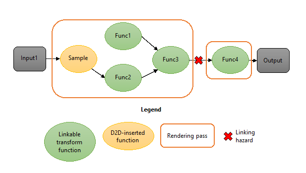
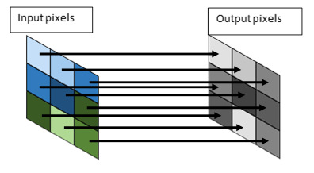
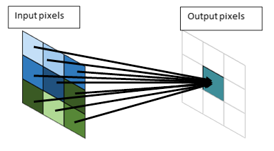

# Effect Shader Linking

Direct2D uses an optimization called effect shader linking which combines multiple effect graph rendering passes into a single pass.

-   [Overview of Effect Shader Linking](#overview-of-effect-shader-linking)
-   [Using Effect Shader Linking](#using-effect-shader-linking)
-   [Authoring a shader linking-compatible custom effect](#authoring-a-shader-linking-compatible-custom-effect)
-   [Example linking-compatible effect shader](#example-linking-compatible-effect-shader)
-   [Compiling a linking compatible-shader](#compiling-a-linking-compatible-shader)
    -   [Step 1: Compile the export function](#step-1-compile-the-export-function)
    -   [Step 2: Compile the full shader and embed the export function](#step-2-compile-the-full-shader-and-embed-the-export-function)
-   [Export function specifications](#export-function-specifications)
-   [Related topics](#related-topics)

## Overview of Effect Shader Linking

The effect shader linking optimizations builds on top of HLSL shader linking, a Direct3D 11.2 feature that allows pixel and vertex shaders to be generated at runtime by linking pre-compiled shader functions. The following figures illustrate the concept of effect shader linking in an effect graph. The first figure shows a typical Direct2D effect graph with four rendering transforms. Without shader linking, each transform consumes a rendering pass and requires an intermediate surface; in total, this graph requires 4 passes and 3 intermediates.


The second figure shows the same effect graph where each rendering transform has been replaced with a linkable function version. Direct2D is able link the entire graph and execute it in one pass without requiring any intermediates. This can provide a significant decrease in GPU execution time and reduction in peak GPU memory consumption.


 

Effect shader linking operates on individual transforms within an effect; this means that even a graph with a single effect may benefit from shader linking if that effect has multiple valid transforms.

## Using Effect Shader Linking

If you are building a Direct2D application that uses effects, you don’t need to do anything to take advantage of effect shader linking. Direct2D automatically analyzes the effect graph to determine the most optimal way to link each transform.

Effect authors are responsible for implementing their effect in a way that supports effect shader linking; for more information, see the [Authoring a shader linking-compatible custom effect](#authoring-a-shader-linking-compatible-custom-effect) section below. All of the built-in effects support shader linking.

Direct2D will only link adjacent rendering transforms in situations where it is beneficial. It takes into account multiple factors when determining whether to link two transforms. For example, shader linking is not performed if one of the transforms uses vertex or compute shaders, as only pixel shaders can be linked. Also, if an effect was not authored to be compatible with shader linking, then surrounding transforms will not be linked with it.

In the case that such a linking hazard exists, Direct2D will not link any transforms adjacent to the hazard, but will still attempt to link the remainder of the graph.



## Authoring a shader linking-compatible custom effect

If you are authoring your own custom Direct2D effect, you need to ensure that its transforms supports effect shader linking. This requires some minor changes from how previous custom effects were implemented. If a transform within your custom effect does not support shader linking, then Direct2D will not link it with any transforms adjacent to it in the effect graph.

As a custom effect author, you should be aware of several key concepts and requirements:

-   **No changes to effect interface implementations**

    You do not need to modify any code implementing the various effect interfaces such as [ID2D1DrawTransform](/windows/win32/api/d2d1effectauthor/nn-d2d1effectauthor-id2d1drawtransform).

-   **Provide both a full and export function version of shaders**

    You must provide an export function version of your effect’s shaders which are linkable by Direct2D. In addition, you must also continue to provide the original, full shader; this is because Direct2D selects at runtime the right shader version depending on whether shader linking is to be applied to a particular link in the graph.

    If a transform only provides the full pixel shader blob (via [ID2D1EffectContext::LoadPixelShader](/windows/win32/api/d2d1effectauthor/nf-d2d1effectauthor-id2d1effectcontext-loadpixelshader)), it will not be linked to adjacent transforms.

- **Helper functions**

    Direct2D provides [HLSL helper functions](hlsl-helpers.md) and macros that will automatically generate both the full and export function versions of a shader. These helpers can be found in d2d1effecthelpers.hlsli. In addition, the HLSL compiler (FXC) lets you insert the export function shader into a private field in the full shader. In this way, you only need to author a shader once and pass both versions to Direct2D simultaneously. Both d2d1effecthelpers.hlsli and the FXC compiler are included as part of the Windows SDK.

    The helper functions:

  - [D2DGetInput](d2dgetinput.md)  
  - [D2DSampleInput](d2dsampleinput.md)  
  - [D2DSampleInputAtOffset](d2dsampleinputatoffset.md)  
  - [D2DSampleInputAtPosition](d2dsampleinputatposition.md)  
  - [D2DGetInputCoordinate](d2dgetinputcoordinate.md)  
  - [D2DGetScenePosition](d2dgetsceneposition.md)  
  - [D2D\_PS\_ENTRY](d2d-ps-entry.md)  

  You can also manually author two versions of each shader and compile them twice, as long as the specifications described below in [Export function specifications](#export-function-specifications) are met.

-   **Pixel shaders only**

    Direct2D does not support linking compute or vertex shaders. However, if your effect uses both a vertex and pixel shader, the output of the pixel shader can still be linked.

-   **Simple versus complex sampling**

    Shader function linking works by connecting the output of one pixel shader pass to the input of a subsequent pixel shader pass. This is only possible when the consuming pixel shader requires only a single input value to perform its computation; this value would normally come from sampling an input texture at the texture coordinate emitted by the vertex shader. Such a pixel shader is said to perform simple sampling.

    

    Some pixel shaders, such as a Gaussian blur, compute their output from multiple input samples rather than just a single sample. Such a pixel shader is said to perform complex sampling.

    

    

    
    Only shader functions with simple inputs can have their input provided by another shader function. Shader functions with complex inputs must be provided with an input texture to sample. This means that Direct2D will not link a shader with complex inputs to its predecessor.

    When using the [Direct2D HLSL helpers](hlsl-helpers.md), you must indicate in the HLSL whether a shader uses complex or simple inputs.

## Example linking-compatible effect shader

Using the D2D helpers, the following code snippet represents a simple linking-compatible effect shader:

```syntax
#define D2D_INPUT_COUNT 1
#define D2D_INPUT0_SIMPLE
#include “d2d1effecthelpers.hlsli”

D2D_PS_ENTRY(LinkingCompatiblePixelShader)
{
    float4 input = D2DGetInput(0);
    input.rgb *= input.a;
    return input;
}          
```

In this short example note that no function parameters are declared, that the number of inputs and type of each input is declared before the entry function, the input is retrieved by calling [D2DGetInput](d2dgetinput.md), and that preprocessor directives must be defined before the helper file is included.

A linking-compatible shader must provide both a regular single-pass pixel shader and an export shader function. The [D2D\_PS\_ENTRY](d2d-ps-entry.md) macro allows each of these to be generated from the same code, when used in conjunction with the shader compilation script.

When compiling a full shader, the macros are expanded into the following code, which has a D2D Effects-compatible input signature.

```syntax
Texture2D<float4> InputTexture0;
SamplerState InputSampler0;

float4 LinkingCompatiblePixelShader(
    float4 pos   : SV_POSITION,
    float4 posScene : SCENE_POSITION,
    float4 uv0  : TEXCOORD0
    ) : SV_Target
    {
        float4 input = InputTexture0.Sample(InputSampler0, uv0.xy);
        input.rgb *= input.a;
        return input;
    }    
```

When compiling an export function version of the same code, the following code is generated:

```syntax
// Shader function version
export float4 LinkingCompatiblePixelShader_Function(
    float4 input0 : INPUT0)
    {
        input.rgb *= input.a;
        return input;
    }      
```

Note that the texture input, normally retrieved by sampling a Texture2D, has been replaced with a function input (input0).

To see a full, step by step description of what you need to do to write a linking-compatible effect, see the [Custom effects tutorial](custom-effects.md) and the [Direct2D custom image effects sample](https://github.com/microsoft/Windows-universal-samples/tree/master/Samples/D2DCustomEffects).

## Compiling a linking compatible-shader

To be linkable, the pixel shader blob passed to D2D must contain both the full and export function versions of the shader. This is accomplished by embedding the compiled export function into the D3D\_BLOB\_PRIVATE\_DATA area.

When the shaders are authored with the D2D helper functions, a D2D compilation target must be defined at compilation time. The compilation target types are D2D\_FULL\_SHADER and D2D\_FUNCTION.

Compiling a linking-compatible effect shader is a two-step process:

-   [Compile the export function](#step-1-compile-the-export-function)
-   [Compile the full shader and embed the export function](#step-2-compile-the-full-shader-and-embed-the-export-function)

> [!Note]  
> When compiling an effect using Visual Studio, you should create a batch file that executes both FXC commands and run this batch file as a custom build step that runs before the compile step.

 

### Step 1: Compile the export function

```syntax
fxc /T <shadermodel> <MyShaderFile>.hlsl /D D2D_FUNCTION /D D2D_ENTRY=<entry> /Fl <MyShaderFile>.fxlib           
```

To compile the export function version of your shader, you must pass the following flags to FXC.


|    Flag                            |    Description                       |
|--------------------------------|-----------------------------------------------------------------------------------------------------------------------------------------------------------------------------------------------------------------------------------------------------------|
| /T &lt;ShaderModel&gt;         | Set &lt;ShaderModel&gt; to the appropriate pixel shader profile as defined in [FXC Syntax](/windows/desktop/direct3dtools/dx-graphics-tools-fxc-syntax). This must be one of the profiles listed under “HLSL shader linking”. |
| &lt;MyShaderFile&gt;.hlsl      | Set &lt;MyShaderFile&gt; to the name of the HLSL file.                                                                                                                                                                                                    |
| /D D2D\_FUNCTION               | This definition instructs FXC to compile the export function version of the shader.                                                                                                                                                                       |
| /D D2D\_ENTRY=&lt;entry&gt;    | Set &lt;entry&gt; to the name of the HLSL entry point you defined inside the [D2D\_PS\_ENTRY](d2d-ps-entry.md) macro.                                                                                                                                    |
| /Fl &lt;MyShaderFile&gt;.fxlib | Set &lt;MyShaderfile&gt; to where you want to store the export function version of the shader. Note the .fxlib extension is only for ease of identification.                                                                                              |

### Step 2: Compile the full shader and embed the export function

```syntax
fxc /T ps_<shadermodel> <MyShaderFile>.hlsl /D D2D_FULL_SHADER /D D2D_ENTRY=<entry> /E <entry> /setprivate <MyShaderFile>.fxlib /Fo <MyShader>.cso /Fh <MyShader>.h           
```

To compile the full version of your shader with embedded export version, you must pass the following flags to FXC.


|    Flag                                    |    Description                     |
|----------------------------------------|--------------------------------------------------------------------------------------------------------------------------------------------------------------------------------------------------------------------------------------------------------------------------------------|
| /T &lt;ShaderModel&gt;                 | Set &lt;ShaderModel&gt; to the appropriate pixel shader profile as defined in [FXC Syntax](/windows/desktop/direct3dtools/dx-graphics-tools-fxc-syntax). This must be the pixel shader profile corresponding to the linking profile specified in Step 1. |
| &lt;MyShaderFile&gt;.hlsl              | Set &lt;MyShaderFile&gt; to the name of the HLSL file.                                                                                                                                                                                                                               |
| /D D2D\_FULL\_SHADER                   | This definition instructs FXC to compile the full version of the shader.                                                                                                                                                                                                             |
| /D D2D\_ENTRY=&lt;entry&gt;            | Set &lt;entry&gt; to the name of the HLSL entry point you defined inside the D2D\_PS\_ENTRY() macro.                                                                                                                                                                                 |
| /E &lt;entry&gt;                       | Set &lt;entry&gt; to the name of the HLSL entry point you defined inside the D2D\_PS\_ENTRY() macro.                                                                                                                                                                                 |
| /setprivate &lt;MyShaderFile&gt;.fxlib | This argument instructs FXC to embed the export function shader generated in step 1 into the D3D\_BLOB\_PRIVATE\_DATA area.                                                                                                                                                          |
| /Fo &lt;MyShader&gt;.cso               | Set &lt;MyShader&gt; to where you want to store the final, combined compiled shader.                                                                                                                                                                                                 |
| /Fh &lt;MyShader&gt;.h                 | Set &lt;MyShader&gt; to where you want to store the final, combined header.                                                                                                                                                                                                          |

## Export function specifications

It is possible – though not recommended – to author a compatible effect shader without using the D2D-provided helpers. Care must be taken to ensure that both the full shader and export function input signatures conform to D2D specifications.

The specifications for full shaders are the same as earlier Windows versions. Briefly, the pixel shader input parameters must be SV\_POSITION, SCENE\_POSITION, and one TEXCOORD per effect input.

For the export function, the function must return a float4 and its inputs must be one of the following types:

-   Simple input

    ```syntax
    float4 d2d_inputN : INPUTN         
    ```

    For simple inputs, D2D will either insert a Sample function between the input texture and shader function, or the input will be provided by the output of another shader function.

-   Complex input

    ```syntax
    float4 d2d_uvN  : TEXCOORDN                
    ```

    For complex inputs, D2D will only pass a texture coordinate as described in Windows 8 documentation.

-   Output location

    ```syntax
    float4 d2d_posScene : SCENE_POSITION                
    ```

    Only one SCENE\_POSITION input can be defined. This parameter should only be included when necessary, since only one function per linked shader can utilize this parameter.

The semantics must be defined as above, as D2D will inspect the semantics to decide how to link functions together. If any function input does not match one of the above types, the function will be rejected for shader linking.

## Related topics

<dl> <dt>

[HLSL Helpers](hlsl-helpers.md)
</dt> <dt>

[ID3D11Linker interface](/windows/desktop/api/d3d11shader/nn-d3d11shader-id3d11linker)
</dt> <dt>

[ID3D11FunctionLinkingGraph interface](/windows/desktop/api/d3d11shader/nn-d3d11shader-id3d11functionlinkinggraph)
</dt> </dl>

 

 
