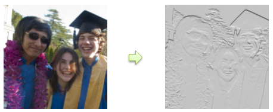

# Emboss effect

Creates a grayscale version of the image that appears as though it has been stamped into paper.

The CLSID for this effect is CLSID\_D2D1Emboss.

-   [Example Image](#example-image)
-   [Sample Code](#sample-code)
-   [Effect Properties](#effect-properties)
-   [Requirements](#requirements)
-   [Related topics](#related-topics)

## Example image



## Sample code

```cpp
ComPtr<ID2D1Effect> embossEffect;
m_d2dContext->CreateEffect(CLSID_D2D1Emboss, &embossEffect);
 
embossEffect->SetInput(0, bitmap);
embossEffect->SetValue(D2D1_EMBOSS_PROP_HEIGHT, 1.0f);
embossEffect->SetValue(D2D1_EMBOSS_PROP_DIRECTION, 0.0f);
 
m_d2dContext->BeginDraw();
m_d2dContext->DrawImage(embossEffect.Get());
m_d2dContext->EndDraw();
```

## Effect properties

The properties for the emboss effect are defined by the [**D2D1\_EMBOSS\_PROP**](/windows/desktop/api/d2d1effects_2/ne-d2d1effects_2-d2d1_emboss_prop) enumeration.

## Requirements


| Requirement | Value |
|--------------------------|---------------------------------------------------|
| Minimum supported client | Windows 10 \[desktop apps \| Windows Store apps\] |
| Minimum supported server | Windows 10 \[desktop apps \| Windows Store apps\] |
| Header                   | d2d1effects\_2.h                                  |
| Library                  | d2d1.lib, dxguid.lib                              |

## Related topics

* [ID2D1Effect interface](/windows/desktop/api/d2d1_1/nn-d2d1_1-id2d1effect)
