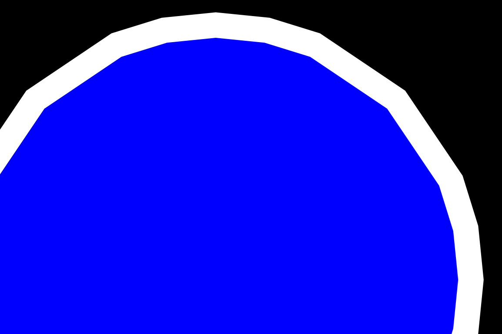

# Geometry Realizations Overview

This topic describes how to use [Direct2D](direct2d-portal.md) geometry realizations to improve your app’s geometry rendering performance in certain scenarios.

It contains the following sections:

-   [What are geometry realizations?](#what-are-geometry-realizations)
-   [Why use geometry realizations?](#why-use-geometry-realizations)
-   [When to use geometry realizations](#when-to-use-geometry-realizations)
-   [Creating geometry realizations](#creating-geometry-realizations)
-   [Drawing geometry realizations](#drawing-geometry-realizations)
-   [Scaling geometry realizations](#scaling-geometry-realizations)
    -   [Using geometry realizations in apps that do not scale](#using-geometry-realizations-in-apps-that-do-not-scale)
    -   [Using geometry realizations in apps that scale by a small amount](#using-geometry-realizations-in-apps-that-scale-by-a-small-amount)
    -   [Using geometry realizations in apps that scale by a large amount](#using-geometry-realizations-in-apps-that-scale-by-a-large-amount)
-   [Related topics](#related-topics)

## What are geometry realizations?

Geometry realizations, introduced in Windows 8.1, are a new type of drawing primitive that make it easy for [Direct2D](direct2d-portal.md) apps to improve geometry rendering performance in certain cases. Geometry realizations are represented by the [**ID2D1GeometryRealization**](/windows/win32/api/d2d1_2/nn-d2d1_2-id2d1geometryrealization) interface.

## Why use geometry realizations?

When [Direct2D](direct2d-portal.md) renders an [**ID2D1Geometry**](/windows/win32/api/d2d1/nn-d2d1-id2d1geometry) object, it must convert that geometry to a form the graphics hardware understands through a process called tessellation. Typically, Direct2D must tessellate geometry every frame it is drawn, even if the geometry does not change. If your app renders the same geometry every frame, then the repeated re-tessellation represents wasted computational effort. It is more computationally efficient to cache the tessellation, or even the full rasterization, of the geometry, and to draw that cached representation each frame instead of repeatedly re-tessellating.

A common way that developers solve this problem is to cache the full rasterization of the geometry. In particular, it is common to create a new bitmap, rasterize the geometry to that bitmap, and then draw that bitmap to the scene as needed. (This approach is described in the [Geometry rendering](improving-direct2d-performance.md) section of Improving the performance of Direct2D apps.) While this approach is very computationally efficient, it has some drawbacks:

-   The cached bitmap is sensitive to changes in the transform applied to the scene. For example, scaling the rasterization can result in a noticeable scaling artifacts. Mitigating these artifacts with high-quality scaling algorithms can be computationally expensive.
-   The cached bitmap consumes a significant amount of memory, especially if it is rasterized at a high resolution.

Geometry realizations provide an alternative way to cache geometry that avoids the above drawbacks. Geometry realizations are represented not by pixels (as is the case with a full rasterization) but instead by points on a mathematical plane. For this reason they are less sensitive than full rasterizations to scaling and other manipulation, and they consume significantly less memory.

## When to use geometry realizations

Consider using geometry realizations when your app renders complex geometries whose shapes change infrequently but which may be subject to changing transforms.

For example, consider a mapping application that shows a static map but which allows the user to zoom in and out. This app can benefit from using geometry realizations. Since the geometries being rendered remain static, it is useful to cache them in order to save tessellation work. But because the maps are scaled when the user zooms, caching a full rasterization is not ideal, due to scaling artifacts. Caching geometry realizations would allow the app to avoid re-tessellation work while maintaining high visual quality during scaling.

On the other hand, consider a kaleidoscope app with animated geometry that continually changes. This app would probably not benefit from using geometry realizations. Since the shapes themselves change from frame to frame, it is not useful to cache their tessellations. The best approach for this app is to draw [**ID2D1Geometry**](/windows/win32/api/d2d1/nn-d2d1-id2d1geometry) objects directly.

## Creating geometry realizations

An [**ID2D1GeometryRealization**](/windows/win32/api/d2d1_2/nn-d2d1_2-id2d1geometryrealization) object must be created from an existing [**ID2D1Geometry**](/windows/win32/api/d2d1/nn-d2d1-id2d1geometry) object. To create a geometry realization, call the [**CreateFilledGeometryRealization**](/windows/win32/api/d2d1_2/nf-d2d1_2-id2d1devicecontext1-createfilledgeometryrealization) method or the [**CreateStrokedGeometryRealization**](/windows/win32/api/d2d1_2/nf-d2d1_2-id2d1devicecontext1-createstrokedgeometryrealization) method and pass in the **ID2D1Geometry** to be realized.

-   [**CreateFilledGeometryRealization**](/windows/win32/api/d2d1_2/nf-d2d1_2-id2d1devicecontext1-createfilledgeometryrealization) creates a realization of the interior of the shape: the region that would be drawn by calling [**FillGeometry**](/windows/win32/api/d2d1/nf-d2d1-id2d1rendertarget-fillgeometry).
-   [**CreateStrokedGeometryRealization**](/windows/win32/api/d2d1_2/nf-d2d1_2-id2d1devicecontext1-createstrokedgeometryrealization) creates a realization of the stroke of the shape: the region that would be drawn by calling [**DrawGeometry**](/windows/win32/api/d2d1/nf-d2d1-id2d1rendertarget-drawgeometry).

Both kinds of geometry realization are represented by the [**ID2D1GeometryRealization**](/windows/win32/api/d2d1_2/nn-d2d1_2-id2d1geometryrealization) interface.

When creating a geometry realization, [Direct2D](direct2d-portal.md) must flatten any curves in the provided geometry to polygonal approximations. You must provide a flattening tolerance parameter to the creation method—this specifies the maximum distance, in device-independent pixels (DIPs), between the geometry’s true curve and its polygonal approximation. The lower the flattening tolerance you provide, the higher the fidelity of the resulting geometry realization object. Similarly, providing a higher flattening tolerance yields a lower-fidelity geometry realization. Note that higher-fidelity geometry realizations are more expensive to draw than lower-fidelity ones, but they can be scaled further before introducing visible artifacts. For guidance on using flattening tolerances, see [Scaling geometry realizations](#scaling-geometry-realizations) below.

> [!Note]  
> Geometry realization objects are associated with a particular graphics device: they are device-dependent resources.

 

## Drawing geometry realizations

Drawing geometry realizations is similar to drawing other [Direct2D](direct2d-portal.md) primitives, like bitmaps. To do so, call the [**DrawGeometryRealization**](/windows/win32/api/d2d1_2/nf-d2d1_2-id2d1devicecontext1-drawgeometryrealization) method and pass it the geometry realization object to be drawn and the brush to use. As with other Direct2D drawing methods, you must call **DrawGeometryRealization** between calls to [**BeginDraw**](/windows/win32/api/d2d1/nf-d2d1-id2d1rendertarget-begindraw) and [**EndDraw**](/windows/win32/api/d2d1/nf-d2d1-id2d1rendertarget-enddraw).

## Scaling geometry realizations

Geometry realizations, like other [Direct2D](direct2d-portal.md) primitives, respect the transform set on the device context. Although translation and rotation transforms have no effect on the visual quality of geometry realizations, scale transforms can produce visual artifacts.

In particular, applying a large enough scale to any geometry realization can reveal the polygonal approximation of the true curves. The image here shows a pair of elliptical geometry realizations (fill and stroke) that have been scaled up too far. Curve-flattening artifacts are visible.



Apps that are sensitive to visual quality should take measures to ensure this does not happen. How you handle scaling depends on the needs of your app. Following are several recommended approaches for several different types of app.

### Using geometry realizations in apps that do not scale

If your app does not perform any scaling on the geometry realizations, then it is safe to create the realizations only once, using a single flattening tolerance. (Non-scaling transforms do not affect the visual quality of rendered geometry realizations.) Use the [**ComputeFlatteningTolerance**](/previous-versions/windows/desktop/legacy/dn280327(v=vs.85)) function to calculate the appropriate flattening tolerance for the DPI:


```C++
    float dpiX, dpiY;
    deviceContext->GetDpi(&dpiX, &dpiY);

    float flatteningTolerance = D2D1::ComputeFlatteningTolerance(
        D2D1::Matrix3x2F::Identity(),   // apply no additional scaling transform
        dpiX,                           // horizontal DPI
        dpiY                            // vertical DPI
        );
```


### Using geometry realizations in apps that scale by a small amount

If your app can scale a geometry realization up by only a small amount (for example, up to 2x or 3x), then it may be appropriate simply to create the geometry realization once, at a proportionally lower flattening tolerance than the default. This creates a higher-fidelity realization that can be scaled up significantly before incurring scaling artifacts; the trade-off is that drawing the higher-fidelity realization requires more work.

For example, suppose you know that your app will never scale a geometry realization by more than 2x. Your app can create the geometry realization using a flattening tolerance that’s half the default value and simply scale the realization as needed, up to 2x. Use the [**ComputeFlatteningTolerance**](/previous-versions/windows/desktop/legacy/dn280327(v=vs.85)) function to calculate the appropriate flattening tolerance by passing 2.0 as the *maxZoomFactor* parameter:


```C++
    float dpiX, dpiY;
    deviceContext->GetDpi(&dpiX, &dpiY);
    
    float flatteningTolerance = D2D1::ComputeFlatteningTolerance(
        D2D1::Matrix3x2F::Identity(),   // apply no additional scaling transform
        dpiX,                           // horizontal DPI
        dpiY,                           // vertical DPI
        2.0f                            // realization can be scaled by an additional 2x
        );
```


### Using geometry realizations in apps that scale by a large amount

If your app can scale a geometry realization up or down by large amounts (for example, by 10x or more), then handling scaling appropriately is more complicated.

For most of these apps, the recommended approach is to recreate the geometry realization at progressively lower flattening tolerances as the scene is scaled up, in order to maintain visual fidelity and avoid scaling artifacts. Similarly, as the scene is scaled down, the app should recreate the geometry realizations at progressively higher flattening tolerances, in order to avoid wastefully rendering details that aren’t visible. The app shouldn’t recreate the geometry realizations every time the scale changes, because doing so defeats the purpose of caching the tessellation work. Instead, the app should recreate the geometry realizations less frequently: for example, after every 2x increase or decrease in scale.

Each time the scale changes in an app in response to user interaction, the app could compare the new scale against the scale at which the geometry realizations were last created (stored, for example, in an **m\_lastScale** member). If the two values are close (in this case, within a factor of 2), then no further action is taken. But if the two values are not close, then the geometry realizations are re-created. The [**ComputeFlatteningTolerance**](/previous-versions/windows/desktop/legacy/dn280327(v=vs.85)) function is used to compute a flattening tolerance appropriate for the new scale, and **m\_lastScale** is updated to the new scale.

In addition, the app always creates realizations using a smaller tolerance than what would normally be used for the new scale, by passing a value of 2 as the *maxZoomFactor* parameter to [**ComputeFlatteningTolerance**](/previous-versions/windows/desktop/legacy/dn280327(v=vs.85)). This allows the new geometry realizations to be scaled up by an additional factor of 2 without incurring scaling artifacts.

> [!Note]  
> The approach described here may not be appropriate for all apps. For example, if your app allows the scene to be scaled by very large factors very quickly (for example, if it contains a “zoom” slider that can be moved from 100% to 1,000,000% in the span of a few frames) then this approach may result in excess work by recreating the geometry realizations every frame. An alternative approach is to recreate the geometry realizations only after each manipulation of the scene’s scale has been completed (for example, after the user has completed a pinch gesture).

 

## Related topics

[Geometries Overview](direct2d-geometries-overview.md)

[Improving the performance of Direct2D apps](improving-direct2d-performance.md)

[General guidelines for rendering complex static content](improving-direct2d-performance.md)

[**ID2D1DeviceContext1**](/windows/win32/api/d2d1_2/nn-d2d1_2-id2d1devicecontext1)

[**ID2D1GeometryRealization**](/windows/win32/api/d2d1_2/nn-d2d1_2-id2d1geometryrealization)

[**ComputeFlatteningTolerance function**](/previous-versions/windows/desktop/legacy/dn280327(v=vs.85))