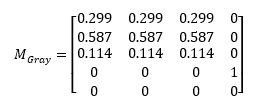

# Grayscale effect

Converts an image to monochromatic gray.

Grayscale uses the color matrix effect to convert to grayscale, using the following matrix:

The CLSID for this effect is CLSID\_D2D1Grayscale.

-   [Example Image](#example-image)
-   [Effect Properties](#effect-properties)
-   [Requirements](#requirements)
-   [Related topics](#related-topics)

## Example image

## Effect properties

This effect has no properties.

## Requirements

| Requirement | Value |
|--------------------------|---------------------------------------------------|
| Minimum supported client | Windows 10 \[desktop apps \| Windows Store apps\] |
| Minimum supported server | Windows 10 \[desktop apps \| Windows Store apps\] |
| Header                   | d2d1effects\_2.h                                  |
| Library                  | d2d1.lib, dxguid.lib                              |

## Related topics

* [ID2D1Effect interface](/windows/desktop/api/d2d1_1/nn-d2d1_1-id2d1effect)
