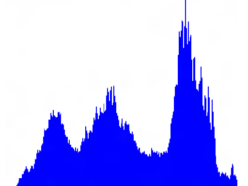
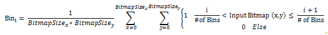

# Histogram effect

Use the histogram effect to generate a histogram for the input bitmap based on the specified number of bins.

The CLSID for this effect is CLSID\_D2D1Histogram.

-   [Example](#example)
-   [Effect properties](#effect-properties)
-   [Channel selectors](#channel-selectors)
-   [Data output](#data-output)
-   [Remarks](#remarks)
-   [Requirements](#requirements)
-   [Related topics](#related-topics)

## Example


| Before                                                     |
|------------------------------------------------------------|
|  |
| Graph of the histogram output data                         |
|  |


 


```C++
ComPtr<ID2D1Effect> histogramEffect;
m_d2dContext->CreateEffect(CLSID_D2D1Histogram, &histogramEffect);

histogramEffect->SetInputEffect(0, m_2DAffineTransformEffectRight.Get());
histogramEffect->SetValue(D2D1_HISTOGRAM_PROP_CHANNEL_SELECT, D2D1_CHANNEL_SELECTOR_G);

m_d2dContext->BeginDraw();
m_d2dContext->DrawImage(histogramEffect.Get());
m_d2dContext->EndDraw();

// The histogram data is only available once the effect has been 'drawn'.
int histogramBinCount;

HRESULT hr = histogramEffect->GetValue(D2D1_HISTOGRAM_PROP_NUM_BINS, &histogramBinCount);

float *histogramData = new float[histogramBinCount];
hr = histogramEffect->GetValue(D2D1_HISTOGRAM_PROP_HISTOGRAM_OUTPUT, 
                               reinterpret_cast<BYTE*>(histogramData), 
                               histogramBinCount * sizeof(float));
```


## Effect properties

Here's the equation to generate the output.



*i* is evaluated from 0 to the number of bins. The effect generates a histogram for pixel values between 0 and 1. Values outside of this range are clamped to the range. The range of a particular bucket depends on the number of buckets. This effect works on straight bitmap pixels. The color channels of the input bitmap are divided by the alpha channel to compute this effect.


| Display name and index enumeration                                             | Type and default value                                                   | Description                                                                                                                                                                                   |
|--------------------------------------------------------------------------------|--------------------------------------------------------------------------|-----------------------------------------------------------------------------------------------------------------------------------------------------------------------------------------------|
| NumBins<br/> D2D1\_HISTOGRAM\_PROP\_NUM\_BINS<br/>                 | UINT32<br/> 256<br/>                                         | Specifies the number of bins used for the histogram. The range of intensity values that fall into a particular bucket depend on the number of specified buckets.                              |
| ChannelSelect<br/> D2D1\_HISTOGRAM\_PROP\_CHANNEL\_SELECT<br/>     | D2D1\_CHANNEL\_SELECTOR<br/> D2D1\_CHANNEL\_SELECTOR\_R<br/> | Specifies the channel used to generate the histogram. This effect has a single data output corresponding to the specified channel. See [Channel selectors](#channel-selectors) for more info. |
| HistogramOutput<br/> D2D1\_HISTOGRAM\_PROP\_HISTOGRAM\_OUTPUT<br/> | FLOAT\[\]<br/> Output property only.<br/>                    | The output array.                                                                                                                                                                             |


 

## Channel selectors


| Enumeration                | Description                                                           |
|----------------------------|-----------------------------------------------------------------------|
| D2D1\_CHANNEL\_SELECTOR\_R | The effect generates the histogram output based on the red channel.   |
| D2D1\_CHANNEL\_SELECTOR\_G | The effect generates the histogram output based on the green channel. |
| D2D1\_CHANNEL\_SELECTOR\_B | The effect generates the histogram output based on the blue channel.  |
| D2D1\_CHANNEL\_SELECTOR\_A | The effect generates the histogram output based on the alpha channel. |


 

## Data output

This effect outputs a FLOAT\[\], with the number of elements corresponding to the number of specified bins. Each element in the FLOAT\[\] is a float. The value of the element corresponds to the number of elements in that bin.

## Remarks

> [!Note]  
> The [**CreateEffect**](/windows/win32/api/d2d1_1/nf-d2d1_1-id2d1devicecontext-createeffect) method fails if the device doesn't support DirectCompute and returns HRESULT = D2DERR\_INSUFFICIENT\_DEVICE\_CAPABILITIES. All DirectX11 cards and DirectX10 cards that support DirectCompute can use the effect.

 

## Requirements


| Requirement | Value |
|--------------------------|------------------------------------------------------------------------------------|
| Minimum supported client | Windows 8 and Platform Update for Windows 7 \[desktop apps \| Windows Store apps\] |
| Minimum supported server | Windows 8 and Platform Update for Windows 7 \[desktop apps \| Windows Store apps\] |
| Header                   | d2d1effects.h                                                                      |
| Library                  | d2d1.lib, dxguid.lib                                                               |


 

## Related topics

<dl> <dt>

[**ID2D1Effect**](/windows/win32/api/d2d1_1/nn-d2d1_1-id2d1effect)
</dt> </dl>

 

