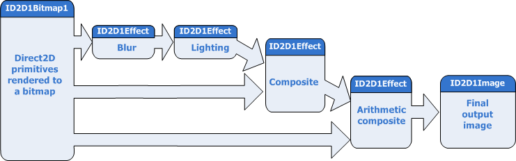

# How to Apply Effects to Primitives

This topic shows how to apply a series of effect to [Direct2D](./direct2d-portal.md) and [DirectWrite](direct2d-and-directwrite.md) primitives.

You can use the [Direct2D effects API](effects-overview.md) to apply effect graphs to primitives rendered by [Direct2D](./direct2d-portal.md) to an image. The example here has two rounded rectangles and the text "Direct2D". Use Direct2D to draw the rectangles and [DirectWrite](direct2d-and-directwrite.md) to draw the text.


Using [Direct2D effects](effects-overview.md), you can make this image look like the next image. Apply the [Gaussian Blur](gaussian-blur.md), [Point Specular Lighting](specular-lighting.md), [Arithmetic Composite](arithmetic-composite.md), and [Composite](composite.md) effects to the 2D primitives to create the image here.


After you render the rectangles and text to a intermediate surface, you can use this as input for [**ID2D1Effect**](/windows/win32/api/d2d1_1/nn-d2d1_1-id2d1effect) objects in the image graph.

In this example, set the original image as the input to the [Gaussian Blur effect](gaussian-blur.md) and then set the output of the blur as the input for the [Point Specular Lighting effect](specular-lighting.md). The result of this effect is then composited with the original image twice to get the final image that is rendered to the window.

Here is a diagram of the image graph.



This effect graph consists of four [**ID2D1Effect**](/windows/win32/api/d2d1_1/nn-d2d1_1-id2d1effect) objects, each representing a different built-in effect. You can create and connect custom effects in the same way, after you register them using [**ID1D1Factory1::RegisterEffect**](/windows/win32/api/d2d1_1/nf-d2d1_1-id2d1factory1-registereffectfromstring). The code here creates the effects, sets the properties, and connects the effect graph shown earlier.

1.  Create the [Gaussian blur](gaussian-blur.md) effect using the [**ID2D1DeviceContext::CreateEffect**](/windows/win32/api/d2d1_1/nf-d2d1_1-id2d1devicecontext-createeffect) method and specifying the proper CLSID. The CLSIDs for the built-in effects are defined in d2d1effects.h. You then set the standard deviation of the blur using the [**ID2D1Effect::SetValue**](/windows/win32/api/d2d1_1/nf-d2d1_1-id2d1properties-setvalue(uint32_constbyte_uint32)) method.

    ```C++
    // Create the Gaussian Blur Effect
    DX::ThrowIfFailed(
        m_d2dContext->CreateEffect(CLSID_D2D1GaussianBlur, &gaussianBlurEffect)
        );

    // Set the blur amount
    DX::ThrowIfFailed(
        gaussianBlurEffect->SetValue(D2D1_GAUSSIANBLUR_PROP_STANDARD_DEVIATION, sc_gaussianBlurStDev)
        );
    ```

    

    The [Gaussian blur](gaussian-blur.md) effect blurs all of the channels of the image, including the alpha channel.

2.  Create the [specular lighting](point-specular.md) effect and set the properties. The position of the light is a vector of 3 floating point values, so you must declare it as a separate variable and pass it to the [**SetValue**](/windows/win32/api/d2d1_1/nf-d2d1_1-id2d1properties-setvalue(uint32_constbyte_uint32)) method.

    ```C++
    // Create the Specular Lighting Effect
    DX::ThrowIfFailed(
        m_d2dContext->CreateEffect(CLSID_D2D1PointSpecular, &specularLightingEffect)
        );

    DX::ThrowIfFailed(
        specularLightingEffect->SetValue(D2D1_POINTSPECULAR_PROP_LIGHT_POSITION, sc_specularLightPosition)
        );

    DX::ThrowIfFailed(
        specularLightingEffect->SetValue(D2D1_POINTSPECULAR_PROP_SPECULAR_EXPONENT, sc_specularExponent)
        );

    DX::ThrowIfFailed(
        specularLightingEffect->SetValue(D2D1_POINTSPECULAR_PROP_SURFACE_SCALE, sc_specularSurfaceScale)
        );

    DX::ThrowIfFailed(
        specularLightingEffect->SetValue(D2D1_POINTSPECULAR_PROP_SPECULAR_CONSTANT, sc_specularConstant)
        );
    ```

    

    The [specular lighting](point-specular.md) effect uses the alpha channel of the input to create a height map for the lighting.

3.  There are two different composite effects that you can use the [composite](composite.md) effect and the [arithmetic composite](arithmetic-composite.md). This effect graph uses both.

    Create the [composite](composite.md) effect and set the mode to D2D1\_COMPOSITE\_MODE\_SOURCE\_IN, which outputs the intersection of the source and destination images.

    The [arithmetic composite](arithmetic-composite.md) effect composes the two input images based on a formula defined by the World Wide Web Consortium (W3C) for the Scalable Vector Graphics (SVG) standard. Create arithmetic composite and set the coefficients for the formula.

    ```C++
    // Create the Composite Effects
    DX::ThrowIfFailed(
        m_d2dContext->CreateEffect(CLSID_D2D1Composite, &compositeEffect)
        );

    DX::ThrowIfFailed(
        compositeEffect->SetValue(D2D1_COMPOSITE_PROP_MODE, D2D1_COMPOSITE_MODE_SOURCE_IN)
        );

    DX::ThrowIfFailed(
        m_d2dContext->CreateEffect(CLSID_D2D1ArithmeticComposite, &m_arithmeticCompositeEffect)
        );

    DX::ThrowIfFailed(
        m_arithmeticCompositeEffect->SetValue(D2D1_ARITHMETICCOMPOSITE_PROP_COEFFICIENTS, sc_arithmeticCoefficients)
        );
    ```

    

    The coefficients for the [arithmetic composite](arithmetic-composite.md) effect are shown here.

    ```C++
    D2D1_VECTOR_4F sc_arithmeticCoefficients   = D2D1::Vector4F(0.0f, 1.0f, 1.0f, 0.0f);
    ```

    

    In this effect graph, both of the composite effects take the output of the other effects and the intermediate surface as inputs and composites them.

4.  Finally, you connect the effects to form the graph by setting the inputs to the proper images and bitmaps.

    The first effect, [Gaussian blur](gaussian-blur.md), receives its input from the intermediate surface that you rendered the primitives to. You set the input using the [**ID2D1Effect::SetInput**](/windows/win32/api/d2d1_1/nf-d2d1_1-id2d1effect-setinput) method and specifying the index of an [**ID2D1Image**](/windows/win32/api/d2d1/nn-d2d1-id2d1image) object. The Gaussian blur and [specular lighting](point-specular.md) effects have only a single input. The specular lighting effect uses the blurred alpha channel of the Gaussian blur

    The [composite](composite.md) and [arithmetic composite](arithmetic-composite.md) effects have multiple inputs. To make sure the images are put together in the right order, you must specify the correct index for each input image.

    ```C++
    // Connect the graph.
    // Apply a blur effect to the original image.
    gaussianBlurEffect->SetInput(0, m_inputImage.Get());

    // Apply a specular lighting effect to the result.
    specularLightingEffect->SetInputEffect(0, gaussianBlurEffect.Get());

    // Compose the original bitmap under the output from lighting and blur.
    compositeEffect->SetInput(0, m_inputImage.Get());
    compositeEffect->SetInputEffect(1, specularLightingEffect.Get());

    // Compose the original bitmap under the output from lighting and blur.
    m_arithmeticCompositeEffect->SetInput(0, m_inputImage.Get());
    m_arithmeticCompositeEffect->SetInputEffect(1, compositeEffect.Get());
    ```

    

5.  Pass the [arithmetic composite](arithmetic-composite.md) effect object into the [**ID2DDeviceContext::DrawImage**](/windows/win32/api/d2d1_1/nf-d2d1_1-id2d1devicecontext-drawimage(id2d1image_constd2d1_point_2f_constd2d1_rect_f_d2d1_interpolation_mode_d2d1_composite_mode)) method and it processes and draws the output of the graph.

    ```C++
        // Draw the output of the effects graph.
        m_d2dContext->DrawImage(
            m_arithmeticCompositeEffect.Get(),
            D2D1::Point2F(
                (size.width - sc_inputBitmapSize.width) / 2,
                (size.height - sc_inputBitmapSize.height) / 2 + sc_offset
                )
            );
    ```

    

 

 