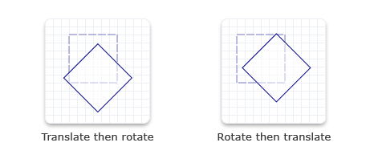

# How to Apply Multiple Transforms to an Object

To perform multiple transforms on an object means to combine several transforms into one. That is, taking the output from each transformation matrix and using it as the input for the next, thereby getting the cumulative effects of all the matrix transformations.

Suppose two transformation matrices, rotation and translation, are multiplied together. The result is a new matrix that performs the functions of both rotation and translation. Because matrix multiplication is not commutative, a rotation transformation multiplied by a translation transformation is different from the translation transformation multiplied by the rotation transformation.

The following code examples show how to apply rotation followed by translation, and then translation followed by rotation. Notice that the rendering results are different.


```C++
D2D1_RECT_F rectangle = D2D1::RectF(300.0f, 40.0f, 360.0f, 100.0f);

// Draw the rectangle before transforming the render target.

m_pRenderTarget->DrawRectangle(
    rectangle,
    m_pOriginalShapeBrush,
    1.0f,
    m_pStrokeStyleDash
    );

D2D1_MATRIX_3X2_F rotation = D2D1::Matrix3x2F::Rotation(
    45.0f,
    D2D1::Point2F(330.0f, 70.0f)
    );


D2D1_MATRIX_3X2_F translation = D2D1::Matrix3x2F::Translation(20.0f, 10.0f);

// First rotate about the center of the square and then move
// 20 pixels to the right along the x-axis
// and 10 pixels downward along the y-axis.
m_pRenderTarget->SetTransform(rotation* translation);

// Draw the rectangle in the transformed space.
m_pRenderTarget->FillRectangle(rectangle, m_pFillBrush);
m_pRenderTarget->DrawRectangle(rectangle, m_pTransformedShapeBrush, 1.0f);
```


```C++
D2D1_RECT_F rectangle = D2D1::Rect(40.0f, 40.0f, 100.0f, 100.0f);

// Draw a rectangle without transforming it.
m_pRenderTarget->DrawRectangle(
    rectangle,
    m_pOriginalShapeBrush,
    1.0f,
    m_pStrokeStyleDash
    );

D2D1_MATRIX_3X2_F translation = D2D1::Matrix3x2F::Translation(20.0f, 10.0f);

m_pRenderTarget->SetTransform(translation);

D2D1_MATRIX_3X2_F rotation = D2D1::Matrix3x2F::Rotation(
    45.0f,
    D2D1::Point2F(70.0f, 70.0f)
    );

// First move 20 pixels to the right along the x-axis and
// 10 pixels downward along the y-axis,
// and then rotate about the center of the original square.
m_pRenderTarget->SetTransform(translation * rotation);

// Draw the rectangle in the transformed space.
m_pRenderTarget->FillRectangle(rectangle, m_pFillBrush);
m_pRenderTarget->DrawRectangle(rectangle, m_pTransformedShapeBrush);
```


The code produces the output shown in the following illustration.



## Related topics

<dl> <dt>

[Direct2D Reference](reference.md)
</dt> <dt>

[Direct2D Transforms Overview](direct2d-transforms-overview.md)
</dt> </dl>

 

 


