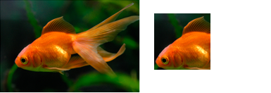

# How to Clip with an Axis-Aligned Clip Rectangle

This topic describes how to clip an image with an axis-aligned clip rectangle. This approach produces only rectangular clips, because the content bounds are aligned to the axis of the rectangle. This approach is more efficient than using layers with the content bounds. For more information, see[Layers Overview](direct2d-layers-overview.md).

**To clip with an axis-aligned clip rectangle**

1.  Load the original image from a resource. For information on how to load a bitmap, see [How to Load a Bitmap from a Resource](how-to-load-a-bitmap-from-a-resource.md).
2.  Call [**ID2D1RenderTarget::PushAxisAlignedClip**](/windows/win32/api/d2d1/nf-d2d1-id2d1rendertarget-pushaxisalignedclip(constd2d1_rect_f__d2d1_antialias_mode)) to specify a rectangle. The rendering commands are clipped to the rectangle.

3.  Paint the original image.
4.  Call [**ID2D1RenderTarget::PopAxisAlignedClip**](/windows/win32/api/d2d1/nf-d2d1-id2d1rendertarget-popaxisalignedclip) to remove the last axis-aligned clip from the render target.

For example, in the following illustration, the original bitmap on the left is 200\*130 pixels. The bitmap on the right is the original bitmap clipped to the axis-aligned clip rectangle. The dimensions are (20, 20) to (100, 100).



To create the clipped image, create a rectangle structure as the clipping area. Call [**PushAxisAlignedClip**](/windows/win32/api/d2d1/nf-d2d1-id2d1rendertarget-pushaxisalignedclip(constd2d1_rect_f__d2d1_antialias_mode)) with the clipping area and paint the original image. Call [**PopAxisAlignedClip**](/windows/win32/api/d2d1/nf-d2d1-id2d1rendertarget-popaxisalignedclip) to remove the clip from the render target. The following code shows how to do this.


```C++
pRT->PushAxisAlignedClip(
    D2D1::RectF(20, 20, 100, 100),
    D2D1_ANTIALIAS_MODE_PER_PRIMITIVE
    );

pRT->FillRectangle(D2D1::RectF(0, 0, 200, 133), m_pOriginalBitmapBrush);
pRT->PopAxisAlignedClip();
```


## Related topics

<dl> <dt>

[Direct2D Reference](reference.md)
</dt> </dl>

 

 