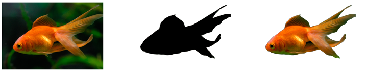

# How to Use a Bitmap as an Opacity Mask

This topic describes how to use a bitmap as an opacty mask by calling the [**ID2D1Factory::FillOpacityMask**](/windows/win32/api/d2d1/nf-d2d1-id2d1rendertarget-fillopacitymask(id2d1bitmap_id2d1brush_d2d1_opacity_mask_content_constd2d1_rect_f__constd2d1_rect_f_)) method. The opacity mask is a bitmap that supplies the coverage information that is represented by the alpha channel, which controls the transparency of the content that is rendered. This approach is more efficient than using layers with an opacity mask. For more information, see [Layers Overview](direct2d-layers-overview.md).

**To clip a region**

1.  Load the original bitmap from a resource. For information on how to load a bitmap, see [How to Load a Bitmap from a Resource](how-to-load-a-bitmap-from-a-resource.md).
2.  Load the bitmap mask from a resource.
3.  Create a bitmap brush with the original bitmap. For information on how to create a bitmap brush, see [How to Create a Bitmap Brush](how-to-create-a-bitmap-brush.md).
4.  Call [**ID2D1Factory::SetAntialiasMode**](/windows/win32/api/d2d1/nf-d2d1-id2d1rendertarget-setantialiasmode) to set antialias mode on the render target to D2D1\_ANTIALIAS\_MODE\_ALIASED for [**ID2D1Factory::FillOpacityMask**](id2d1rendertarget-fillopacitymask.md) to work.
5.  Call [**FillOpacityMask**](/windows/win32/api/d2d1/nf-d2d1-id2d1rendertarget-fillopacitymask(id2d1bitmap_id2d1brush_d2d1_opacity_mask_content_constd2d1_rect_f__constd2d1_rect_f_)) with the bitmap mask and the bitmap brush on the render target to fill the clip.

The following illustration shows the original bitmap on the left, the bitmap mask in the center, and the bitmap clipped to the mask on the right.



The following code shows how to clip the region with the mask shown in the preceding illustration. It first loads the original bitmap and the bitmap mask. And then creates a bitmap brush with the original bitmap.


```C++
// Create the bitmap to be used by the bitmap brush
if (SUCCEEDED(hr))
{
    hr = LoadResourceBitmap(
        m_pRenderTarget,
        m_pWICFactory,
        L"GoldFish",
        L"Image",
        &m_pOrigBitmap
        );
}

if (SUCCEEDED(hr))
{
    hr = LoadResourceBitmap(
        m_pRenderTarget,
        m_pWICFactory,
        L"GoldFishMask",
        L"Image",
        &m_pBitmapMask
        );
}

if (SUCCEEDED(hr))
{
    D2D1_BITMAP_BRUSH_PROPERTIES propertiesXClampYClamp = D2D1::BitmapBrushProperties(
        D2D1_EXTEND_MODE_CLAMP,
        D2D1_EXTEND_MODE_CLAMP,
        D2D1_BITMAP_INTERPOLATION_MODE_NEAREST_NEIGHBOR
        );

    hr = m_pRenderTarget->CreateBitmapBrush(
        m_pOrigBitmap,
        propertiesXClampYClamp,
        &m_pOriginalBitmapBrush
        );

    if (SUCCEEDED(hr))
    {
        hr = m_pRenderTarget->CreateBitmapBrush(
            m_pBitmapMask,
            propertiesXClampYClamp,
            &m_pBitmapMaskBrush
            );
    }
}
```


It then calls [**SetAntialiasMode**](/windows/win32/api/d2d1/nf-d2d1-id2d1rendertarget-setantialiasmode) to set the antialias mode. Call [**FillOpacityMask**](/windows/win32/api/d2d1/nf-d2d1-id2d1rendertarget-fillopacitymask(id2d1bitmap_id2d1brush_d2d1_opacity_mask_content_constd2d1_rect_f__constd2d1_rect_f_)) to use a bitmap mask to clip the original bitmap.


```C++
// D2D1_ANTIALIAS_MODE_ALIASED must be set for FillOpacityMask
// to function properly.
m_pRenderTarget->SetAntialiasMode(D2D1_ANTIALIAS_MODE_ALIASED);

m_pRenderTarget->FillOpacityMask(
    m_pBitmapMask,
    m_pOriginalBitmapBrush,
    D2D1_OPACITY_MASK_CONTENT_GRAPHICS,
    &rcBrushRect,
    NULL
    );

m_pRenderTarget->SetAntialiasMode(D2D1_ANTIALIAS_MODE_PER_PRIMITIVE);

```


For more information about opacity masks, see the [Opacity Masks Overview](opacity-masks-overview.md).

## Related topics

<dl> <dt>

[Direct2D Reference](reference.md)
</dt> </dl>

 

 