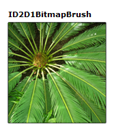

# How to Create a Bitmap Brush

To create a bitmap brush, use the [**ID2D1RenderTarget::CreateBitmapBrush**](id2d1rendertarget-createbitmapbrush.md) method and specify the bitmap brush properties. Some overloads enable you to specify the brush properties. The following code shows how to create a bitmap brush to fill a square, and a solid black brush to draw the outline of the square. The code produces the output shown in the following screen shot.

> [!Note]  
> Starting with Windows 8, you can use the [**CreateBitmapBrush**](/windows/win32/api/d2d1_1/nf-d2d1_1-id2d1devicecontext-createbitmapbrush(id2d1bitmap_constd2d1_bitmap_brush_properties1_constd2d1_brush_properties_id2d1bitmapbrush1)) method on the [**ID2D1DeviceContext**](/windows/win32/api/d2d1_1/nn-d2d1_1-id2d1devicecontext) interface to create a [**ID2D1BitmapBrush1**](/windows/win32/api/d2d1_1/nn-d2d1_1-id2d1bitmapbrush1) instead of a **ID2D1BitmapBrush**. **ID2D1BitmapBrush1** adds high-quality scaling modes to the bitmap brush.

 



1.  Declare a variable of type [**ID2D1BitmapBrush**](/windows/win32/api/d2d1/nn-d2d1-id2d1bitmapbrush).
    ```C++
        ID2D1BitmapBrush *m_pBitmapBrush;
    ```

    

2.  Load a bitmap from a resource. For more information, see [How to Load a Bitmap from a Resource](how-to-load-a-bitmap-from-a-resource.md).
    ```C++
    // Create the bitmap to be used by the bitmap brush.
    if (SUCCEEDED(hr))
    {
        hr = LoadResourceBitmap(
            m_pRenderTarget,
            m_pWICFactory,
            L"FERN",
            L"Image",
            &m_pBitmap
            );
    ```

    

3.  Choose the extend modes ([**D2D1\_EXTEND\_MODE**](/windows/desktop/api/d2d1/ne-d2d1-d2d1_extend_mode)) and interpolation mode ([**D2D1\_BITMAP\_INTERPOLATION\_MODE**](/windows/desktop/api/d2d1/ne-d2d1-d2d1_bitmap_interpolation_mode)) of the bitmap brush and then call the [**CreateBitmapBrush**](id2d1rendertarget-createbitmapbrush.md) method to create a brush, as shown in the following code.
    ```C++
    hr = m_pRenderTarget->CreateBitmapBrush(
        m_pBitmap,
        &m_pBitmapBrush
        );
    ```

    

## Related topics

<dl> <dt>

[Direct2D Reference](reference.md)
</dt> </dl>

 

 