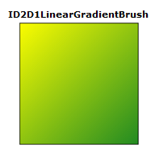

# How to Create a Linear Gradient Brush

To create a linear gradient brush, use the [**CreateLinearGradientBrush**](/windows/win32/api/d2d1/nf-d2d1-id2d1rendertarget-createlineargradientbrush(constd2d1_linear_gradient_brush_properties__id2d1gradientstopcollection_id2d1lineargradientbrush)) method and specify the linear gradient brush properties and the gradient stop collection. Some overloads enable you to specify the brush properties. The following code shows how to create a linear gradient brush to fill a square, and a solid black brush to draw the outline of the square.

The code produces the output shown in the following illustration.



1.  Declare a variable of type [**ID2D1LinearGradientBrush**](/windows/win32/api/d2d1/nn-d2d1-id2d1lineargradientbrush).
    ```C++
        ID2D1LinearGradientBrush *m_pLinearGradientBrush;
    ```

    

2.  Use the [**ID2D1RenderTarget::CreateGradientStopCollection**](/windows/win32/api/d2d1/nf-d2d1-id2d1rendertarget-creategradientstopcollection(constd2d1_gradient_stop_uint32_id2d1gradientstopcollection)) method to create the [**ID2D1GradientStopCollection**](/windows/win32/api/d2d1/nn-d2d1-id2d1gradientstopcollection) collection with a declared array of [**D2D1\_GRADIENT\_STOP**](/windows/desktop/api/d2d1/ns-d2d1-d2d1_gradient_stop) structures, as shown in the following code.
    > [!Note]  
    > Starting with Windows 8, you can use the [**ID2D1DeviceContext::CreateGradientStopCollection**](/windows/win32/api/d2d1_1/nf-d2d1_1-id2d1devicecontext-creategradientstopcollection) method to create a [**ID2D1GradientStopCollection1**](/windows/win32/api/d2d1_1/nn-d2d1_1-id2d1gradientstopcollection1) collection instead. This interface adds high-color gradients and the interpolation of gradients in either straight or prmultiplied colors. See the **ID2DDeviceContext::CreateGradientStopCollection** page for more information.

     

    ```C++
    // Create an array of gradient stops to put in the gradient stop
    // collection that will be used in the gradient brush.
    ID2D1GradientStopCollection *pGradientStops = NULL;

    D2D1_GRADIENT_STOP gradientStops[2];
    gradientStops[0].color = D2D1::ColorF(D2D1::ColorF::Yellow, 1);
    gradientStops[0].position = 0.0f;
    gradientStops[1].color = D2D1::ColorF(D2D1::ColorF::ForestGreen, 1);
    gradientStops[1].position = 1.0f;
    // Create the ID2D1GradientStopCollection from a previously
    // declared array of D2D1_GRADIENT_STOP structs.
    hr = m_pRenderTarget->CreateGradientStopCollection(
        gradientStops,
        2,
        D2D1_GAMMA_2_2,
        D2D1_EXTEND_MODE_CLAMP,
        &pGradientStops
        );
    ```

    

3.  Use the [**ID2D1RenderTarget::CreateLinearGradientBrush**](/windows/desktop/api/d2d1/nf-d2d1-id2d1rendertarget-createlineargradientbrush(constd2d1_linear_gradient_brush_properties__constd2d1_brush_properties__id2d1gradientstopcollection_id2d1lineargradientbrush)) to create a linear gradient brush, fill the square with the brush, and draw the square with the black color brush.
    ```C++
    // The line that determines the direction of the gradient starts at
    // the upper-left corner of the square and ends at the lower-right corner.

    if (SUCCEEDED(hr))
    {
        hr = m_pRenderTarget->CreateLinearGradientBrush(
            D2D1::LinearGradientBrushProperties(
                D2D1::Point2F(0, 0),
                D2D1::Point2F(150, 150)),
            pGradientStops,
            &m_pLinearGradientBrush
            );
    }
    ```

    

    ```C++
    m_pRenderTarget->FillRectangle(&rcBrushRect, m_pLinearGradientBrush);
    m_pRenderTarget->DrawRectangle(&rcBrushRect, m_pBlackBrush, 1, NULL);
    ```

    

## Related topics

<dl> <dt>

[Direct2D Reference](reference.md)
</dt> </dl>

 

 
