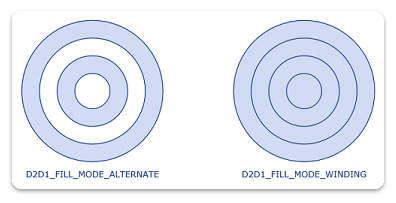

# How to Create Geometry Groups

This topic describes how to create geometry groups.

To create a geometry group, call the [**ID2D1Factory::CreateGeometryGroup**](/windows/win32/api/d2d1/nf-d2d1-id2d1factory-creategeometrygroup) method and specify an array of geometries and a fill mode.

When you combine geometries into a geometry group, ensure that the geometries are similarly oriented. If you are unsure of the orientation of the geometries, call [**ID2D1Geometry::Outline**](/windows/win32/api/d2d1/nf-d2d1-id2d1geometry-outline(constd2d1_matrix_3x2_f__float_id2d1simplifiedgeometrysink)) on each of them individually, and then insert the resulting geometries into the geometry group.

The following code example shows the creation of four concentric circles: the first circle has a radius of 25, the second 50, the third 75, and the fourth 100. The code also shows the instantiation of an array of geometries, as well as the two calls to [**CreateGeometryGroup**](/windows/win32/api/d2d1/nf-d2d1-id2d1factory-creategeometrygroup).


```C++
HRESULT DemoApp::CreateGeometryResources()
{
    HRESULT hr;

    const D2D1_ELLIPSE ellipse1 = D2D1::Ellipse(
        D2D1::Point2F(105.0f, 105.0f),
        25.0f,
        25.0f
        );

    hr = m_pD2DFactory->CreateEllipseGeometry(
        ellipse1,
        &m_pEllipseGeometry1
        );

    if (SUCCEEDED(hr))
    {
        const D2D1_ELLIPSE ellipse2 = D2D1::Ellipse(
            D2D1::Point2F(105.0f, 105.0f),
            50.0f,
            50.0f
            );

        hr = m_pD2DFactory->CreateEllipseGeometry(
            ellipse2,
            &m_pEllipseGeometry2
            );
    }

    if (SUCCEEDED(hr))
    {

        const D2D1_ELLIPSE ellipse3 = D2D1::Ellipse(
            D2D1::Point2F(105.0f, 105.0f),
            75.0f,
            75.0f
            );

        hr = m_pD2DFactory->CreateEllipseGeometry(
            ellipse3,
            &m_pEllipseGeometry3
            );
    }

    if (SUCCEEDED(hr))
    {
        const D2D1_ELLIPSE ellipse4 = D2D1::Ellipse(
            D2D1::Point2F(105.0f, 105.0f),
            100.0f,
            100.0f
            );

        hr = m_pD2DFactory->CreateEllipseGeometry(
            ellipse4,
            &m_pEllipseGeometry4
            );
    }

    if (SUCCEEDED(hr))
    {
        ID2D1Geometry *ppGeometries[] =
        {
            m_pEllipseGeometry1,
            m_pEllipseGeometry2,
            m_pEllipseGeometry3,
            m_pEllipseGeometry4
        };

        hr = m_pD2DFactory->CreateGeometryGroup(
            D2D1_FILL_MODE_ALTERNATE,
            ppGeometries,
            ARRAYSIZE(ppGeometries),
            &m_pGeoGroup_AlternateFill
            );

        if (SUCCEEDED(hr))
        {
            hr = m_pD2DFactory->CreateGeometryGroup(
                D2D1_FILL_MODE_WINDING,
                ppGeometries,
                ARRAYSIZE(ppGeometries),
                &m_pGeoGroup_WindingFill
                );
        }

    }
    return hr;
}
```


## Drawing and Filling of Geometry Groups

To draw and fill a geometry group, use the [**ID2D1RenderTarget::FillGeometry**](/windows/win32/api/d2d1/nf-d2d1-id2d1rendertarget-fillgeometry) and [**ID2D1RenderTarget::DrawGeometry**](/windows/win32/api/d2d1/nf-d2d1-id2d1rendertarget-drawgeometry) methods. The following code example shows how to draw and fill a geometry group.


```C++
HRESULT DemoApp::OnRender()
{
    HRESULT hr = CreateDeviceResources();

    if (SUCCEEDED(hr))
    {
        static const WCHAR sc_fillModeAlternateText[] = L"D2D1_FILL_MODE_ALTERNATE";
        static const WCHAR sc_fillModeWindingText[] = L"D2D1_FILL_MODE_WINDING";

        m_pRenderTarget->BeginDraw();

        m_pRenderTarget->SetTransform(D2D1::Matrix3x2F::Identity());

        m_pRenderTarget->Clear(D2D1::ColorF(D2D1::ColorF::White));

        D2D1_SIZE_F rtSize = m_pRenderTarget->GetSize();
        m_pRenderTarget->FillRectangle(
            D2D1::RectF(0.0f, 0.0f, rtSize.width, rtSize.height),
            m_pGridPatternBitmapBrush
            );

        // Centers the text in a layout rectangle.
        hr = m_pTextFormat->SetTextAlignment(DWRITE_TEXT_ALIGNMENT_CENTER);

        if (SUCCEEDED(hr))
        {
            // Fill the geometry group with D2D1_FILL_MODE_ALTERNATE and
            // then draw the geometries in the group.
            m_pRenderTarget->FillGeometry(m_pGeoGroup_AlternateFill, m_pFillBrush);
            m_pRenderTarget->DrawGeometry(m_pGeoGroup_AlternateFill, m_pStrokeBrush, 1.0f);

            m_pRenderTarget->DrawText(
                sc_fillModeAlternateText,
                ARRAYSIZE(sc_fillModeAlternateText) - 1,
                m_pTextFormat,
                D2D1::RectF(5, 215, 205, 240),
                m_pStrokeBrush,
                D2D1_DRAW_TEXT_OPTIONS_NONE,
                DWRITE_MEASURING_MODE_NATURAL
                );

            m_pRenderTarget->SetTransform(D2D1::Matrix3x2F::Translation(300, 0));

            // Fill the geometry group with D2D1_FILL_MODE_WINDING and
            // then draw the geometries in the group.
            m_pRenderTarget->FillGeometry(m_pGeoGroup_WindingFill, m_pFillBrush);
            m_pRenderTarget->DrawGeometry(m_pGeoGroup_WindingFill, m_pStrokeBrush, 1.0f);

            m_pRenderTarget->DrawText(
                sc_fillModeWindingText,
                ARRAYSIZE(sc_fillModeWindingText) - 1,
                m_pTextFormat,
                D2D1::RectF(5, 215, 205, 240),
                m_pStrokeBrush,
                D2D1_DRAW_TEXT_OPTIONS_NONE,
                DWRITE_MEASURING_MODE_NATURAL
                );

            hr = m_pRenderTarget->EndDraw();

            if (hr == D2DERR_RECREATE_TARGET)
            {
                hr = S_OK;
                DiscardDeviceResources();
            }
        }
    }
    return hr;
}
```


The code produces the output shown in the following illustration.



 

 