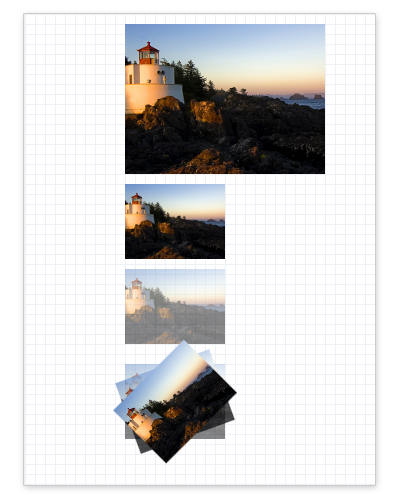

# How to Draw a Bitmap

To render a bitmap, use the [**ID2D1RenderTarget::DrawBitmap**](id2d1rendertarget-drawbitmap.md) method. The following example shows how to use the **DrawBitmap** method to draw an [**ID2D1Bitmap**](/windows/win32/api/d2d1/nn-d2d1-id2d1bitmap). It creates the output shown in the following illustration.



First, create an [**ID2D1Bitmap**](/windows/win32/api/d2d1/nn-d2d1-id2d1bitmap). The following example loads a bitmap from the application's resource file and stores it as *m\_pBitmap*. (To see how the `LoadResourceBitmap` method is implemented, refer to [How to Load a Bitmap from a Resource](how-to-load-a-bitmap-from-a-resource.md).)


```C++
// Create a bitmap from an application resource.
hr = LoadResourceBitmap(
    m_pRenderTarget,
    m_pWICFactory,
    L"SampleImage",
    L"Image",
    200,
    0,
    &m_pBitmap
    );
```


Create the [**ID2D1Bitmap**](/windows/win32/api/d2d1/nn-d2d1-id2d1bitmap) in the same method where you created the render target that you will use to draw the bitmap, and release the bitmap when the render target is released.

Once the bitmap is created, render it. The following example uses the [**DrawBitmap**](/windows/win32/api/d2d1/nf-d2d1-id2d1rendertarget-drawbitmap(id2d1bitmap_constd2d1_rect_f_float_d2d1_bitmap_interpolation_mode_constd2d1_rect_f)) method to render a bitmap several times using different size and opacity settings.


```C++
HRESULT DrawBitmapExample::OnRender()
{
    HRESULT hr;

    hr = CreateDeviceResources();

    if (SUCCEEDED(hr))
    {
        // Retrieve the size of the render target.
        D2D1_SIZE_F renderTargetSize = m_pRenderTarget->GetSize();

        m_pRenderTarget->BeginDraw();
        m_pRenderTarget->SetTransform(D2D1::Matrix3x2F::Identity());
        m_pRenderTarget->Clear(D2D1::ColorF(D2D1::ColorF::White));

        // Paint a grid background.
        m_pRenderTarget->FillRectangle(
            D2D1::RectF(0.0f, 0.0f, renderTargetSize.width, renderTargetSize.height),
            m_pGridPatternBitmapBrush
            );

        // Retrieve the size of the bitmap.
        D2D1_SIZE_F size = m_pBitmap->GetSize();

        D2D1_POINT_2F upperLeftCorner = D2D1::Point2F(100.f, 10.f);

        // Draw a bitmap.
        m_pRenderTarget->DrawBitmap(
            m_pBitmap,
            D2D1::RectF(
                upperLeftCorner.x,
                upperLeftCorner.y,
                upperLeftCorner.x + size.width,
                upperLeftCorner.y + size.height)
            );

        // Draw the next bitmap below the first one.
        upperLeftCorner.y = upperLeftCorner.y + size.height + 10.f;

        // Scale the bitmap to half its size using the linear
        // interoplation mode and draw it.
        float scaledWidth = size.width / 2.f;
        float scaledHeight = size.height / 2.f;
        m_pRenderTarget->DrawBitmap(
            m_pBitmap,
            D2D1::RectF(
                upperLeftCorner.x,
                upperLeftCorner.y,
                upperLeftCorner.x + scaledWidth,
                upperLeftCorner.y + scaledHeight),
            1.0,
            D2D1_BITMAP_INTERPOLATION_MODE_LINEAR
            );

        // Draw the bitmap at half its size and half its opacity.
        upperLeftCorner.y = upperLeftCorner.y + size.height / 2.f + 10.f;
        m_pRenderTarget->DrawBitmap(
            m_pBitmap,
            D2D1::RectF(
                upperLeftCorner.x,
                upperLeftCorner.y,
                upperLeftCorner.x + scaledWidth,
                upperLeftCorner.y + scaledHeight),
            0.5,
            D2D1_BITMAP_INTERPOLATION_MODE_LINEAR
            );

        // Draw a series of bitmaps with different opacity and
        // rotation angles.
        upperLeftCorner.y = upperLeftCorner.y + scaledHeight + 20.f;
        m_pRenderTarget->DrawBitmap(
            m_pBitmap,
            D2D1::RectF(
                upperLeftCorner.x,
                upperLeftCorner.y,
                upperLeftCorner.x + scaledWidth,
                upperLeftCorner.y + scaledHeight),
            0.5,
            D2D1_BITMAP_INTERPOLATION_MODE_LINEAR
            );

        D2D1_POINT_2F lowerLeftCorner = D2D1::Point2F(upperLeftCorner.x, upperLeftCorner.y + scaledHeight);
        D2D1_POINT_2F imageCenter = D2D1::Point2F(
            upperLeftCorner.x + scaledWidth / 2,
            upperLeftCorner.y + scaledHeight / 2
            );

        // Rotate the next bitmap by -20 degrees.
        m_pRenderTarget->SetTransform(
            D2D1::Matrix3x2F::Rotation(-20, imageCenter)
            );

        m_pRenderTarget->DrawBitmap(
            m_pBitmap,
            D2D1::RectF(
                upperLeftCorner.x,
                upperLeftCorner.y,
                upperLeftCorner.x + scaledWidth,
                upperLeftCorner.y + scaledHeight),
            0.75,
            D2D1_BITMAP_INTERPOLATION_MODE_LINEAR
            );

        m_pRenderTarget->SetTransform(
            D2D1::Matrix3x2F::Rotation(-45, imageCenter)
            );

        // Make the last bitmap fully opaque.
        m_pRenderTarget->DrawBitmap(
            m_pBitmap,
            D2D1::RectF(
                upperLeftCorner.x,
                upperLeftCorner.y,
                upperLeftCorner.x + scaledWidth,
                upperLeftCorner.y + scaledHeight),
            1.0,
            D2D1_BITMAP_INTERPOLATION_MODE_LINEAR
            );

        hr = m_pRenderTarget->EndDraw();

        if (hr == D2DERR_RECREATE_TARGET)
        {
            hr = S_OK;
            DiscardDeviceResources();
        }
    }

    return hr;
}
```


The [**DrawBitmap**](id2d1rendertarget-drawbitmap.md) method does not return an error code if it fails. To determine whether a drawing operation (such as **DrawBitmap**) failed, check the result returned by the [**ID2D1RenderTarget::EndDraw**](/windows/win32/api/d2d1/nf-d2d1-id2d1rendertarget-enddraw) method, as shown in the following example.


```C++
hr = m_pRenderTarget->EndDraw();
```


Code has been omitted from this example.

## Related topics

<dl> <dt>

[**DrawBitmap**](id2d1rendertarget-drawbitmap.md)
</dt> <dt>

[**ID2D1Bitmap**](/windows/win32/api/d2d1/nn-d2d1-id2d1bitmap)
</dt> <dt>

[How to Load a Bitmap from a Resource](how-to-load-a-bitmap-from-a-resource.md)
</dt> </dl>

 

 