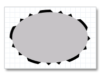

# How to Draw and Fill a Basic Shape

This topic describes how to draw a basic shape. The [**ID2D1RenderTarget**](/windows/win32/api/d2d1/nn-d2d1-id2d1rendertarget) interface provides methods for outlining and filling ellipses, rectangles, and lines. The following examples show how to create and draw an ellipse.

This topic contains the following sections:

-   [Draw the Outline of an Ellipse with a Solid Stroke](#draw-the-outline-of-an-ellipse-with-a-solid-stroke)
-   [Draw an Ellipse with a Dashed Stroke](#draw-an-ellipse-with-a-dashed-stroke)
-   [Draw and Fill an Ellipse](#draw-and-fill-an-ellipse)
-   [Drawing More Complex Shapes](#drawing-more-complex-shapes)
-   [Related topics](#related-topics)

## Draw the Outline of an Ellipse with a Solid Stroke

To draw the outline of an ellipse, you define a brush (such as a [**ID2D1SolidColorBrush**](/windows/win32/api/d2d1/nn-d2d1-id2d1solidcolorbrush) or [**ID2D1LinearGradientBrush**](/windows/win32/api/d2d1/nn-d2d1-id2d1lineargradientbrush)) for painting the outline and a [**D2D1\_ELLIPSE**](/windows/desktop/api/d2d1/ns-d2d1-d2d1_ellipse) for describing the ellipse's position and dimensions, then pass these objects to the [**ID2D1RenderTarget::DrawEllipse**](/windows/desktop/api/d2d1/nf-d2d1-id2d1rendertarget-drawellipse(constd2d1_ellipse__id2d1brush_float_id2d1strokestyle)) method. The following example creates a black solid color brush and stores it in the m\_spBlackBrush class member.


```C++
hr = m_pRenderTarget->CreateSolidColorBrush(
    D2D1::ColorF(D2D1::ColorF::Black),
    &m_pBlackBrush
    );
```


The next example defines an [**D2D1\_ELLIPSE**](/windows/desktop/api/d2d1/ns-d2d1-d2d1_ellipse) and uses it with the brush defined in the previous example to draw the outline of an ellipse. This example produces the output shown in the following illustration.


```C++
D2D1_ELLIPSE ellipse = D2D1::Ellipse(
    D2D1::Point2F(100.f, 100.f),
    75.f,
    50.f
    );

m_pRenderTarget->DrawEllipse(ellipse, m_pBlackBrush, 10.f);
```


## Draw an Ellipse with a Dashed Stroke

The preceding example used a plain stroke. You can modify the look of a stroke in several ways by creating an [**ID2D1StrokeStyle**](/windows/win32/api/d2d1/nn-d2d1-id2d1strokestyle). The **ID2D1StrokeStyle** lets you specify the shape at the beginning and end of a stroke, whether it has a dash pattern, and so on. The following example creates an **ID2D1StrokeStyle** that describes a dashed stroke. This example uses a predefined dash pattern, [**D2D1\_DASH\_STYLE\_DASH\_DOT\_DOT**](/windows/desktop/api/d2d1/ne-d2d1-d2d1_dash_style), but you can also specify your own.


```C++
D2D1_STROKE_STYLE_PROPERTIES strokeStyleProperties = D2D1::StrokeStyleProperties(
    D2D1_CAP_STYLE_FLAT,  // The start cap.
    D2D1_CAP_STYLE_FLAT,  // The end cap.
    D2D1_CAP_STYLE_TRIANGLE, // The dash cap.
    D2D1_LINE_JOIN_MITER, // The line join.
    10.0f, // The miter limit.
    D2D1_DASH_STYLE_DASH_DOT_DOT, // The dash style.
    0.0f // The dash offset.
    );

hr = m_pDirect2dFactory->CreateStrokeStyle(strokeStyleProperties, NULL, 0, &m_pStrokeStyle);

```


The next example uses the stroke style with the [**DrawEllipse**](/windows/desktop/api/d2d1/nf-d2d1-id2d1rendertarget-drawellipse(constd2d1_ellipse__id2d1brush_float_id2d1strokestyle)) method. This example produces the output shown in the following illustration.


```C++
m_pRenderTarget->DrawEllipse(ellipse, m_pBlackBrush, 10.f, m_pStrokeStyle);
```


## Draw and Fill an Ellipse

To paint the interior of an ellipse, you use the [**FillEllipse**](/windows/desktop/api/d2d1/nf-d2d1-id2d1rendertarget-fillellipse(constd2d1_ellipse__id2d1brush)) method. The following example uses the [**DrawEllipse**](/windows/desktop/api/d2d1/nf-d2d1-id2d1rendertarget-drawellipse(constd2d1_ellipse__id2d1brush_float_id2d1strokestyle)) method to outline the ellipse, then uses the **FillEllipse** method to paint its interior. This example produces the output shown in the following illustration.




```C++
m_pRenderTarget->DrawEllipse(ellipse, m_pBlackBrush, 10.f, m_pStrokeStyle);
m_pRenderTarget->FillEllipse(ellipse, m_pSilverBrush);
```


The next example fills the ellipse first, then draws its outline. This example produces the output shown in the following illustration.


```C++
m_pRenderTarget->FillEllipse(ellipse, m_pSilverBrush);
m_pRenderTarget->DrawEllipse(ellipse, m_pBlackBrush, 10.f, m_pStrokeStyle);
```


Code has been omitted from these examples.

## Drawing More Complex Shapes

To draw more complex shapes, you define ID2D1Geometry objects and use them with the [**DrawGeometry**](/windows/win32/api/d2d1/nf-d2d1-id2d1rendertarget-drawgeometry) and [**FillGeometry**](/windows/win32/api/d2d1/nf-d2d1-id2d1rendertarget-fillgeometry) methods. For more information, see the [Geometries Overview](direct2d-geometries-overview.md).

## Related topics

<dl> <dt>

[Geometries Overview](direct2d-geometries-overview.md)
</dt> <dt>

[Brushes Overview](direct2d-brushes-overview.md)
</dt> </dl>

 

 
