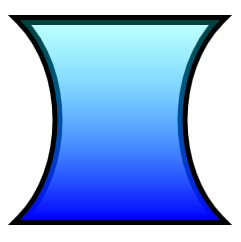

# How to Draw and Fill a Complex Shape

Direct2D provides the [**ID2D1PathGeometry**](/windows/desktop/api/d2d1/) interface for describing complex shapes that can contain curves, arcs, and lines. This topic describes how to define and render a path geometry.

To define a path geometry, first use the [**ID2D1Factory::CreatePathGeometry**](/windows/desktop/api/d2d1/) method to create the path geometry, then use the path geometry's [**Open**](/windows/desktop/api/d2d1/) method to retrieve an [**ID2D1GeometrySink**](/windows/desktop/api/d2d1/). You can then add lines, curves, and arcs by calling the sink's various Add methods.

The following example creates an [**ID2D1PathGeometry**](/windows/desktop/api/d2d1/), retrieves a sink, and uses it to define an hourglass shape.


```C++
ID2D1GeometrySink *pSink = NULL;

```

<span codelanguage="ManagedCPlusPlus"></span>

<table>
<colgroup>
<col style="width: 100%" />
</colgroup>
<thead>
<tr class="header">
<th>C++</th>
</tr>
</thead>
<tbody>
<tr class="odd">
<td><pre><code>// Create a path geometry.
if (SUCCEEDED(hr))
{
    hr = m_pD2DFactory-&gt;CreatePathGeometry(&amp;m_pPathGeometry);

    if (SUCCEEDED(hr))
    {
        // Write to the path geometry using the geometry sink.
        hr = m_pPathGeometry-&gt;Open(&amp;pSink);

        if (SUCCEEDED(hr))
        {
            pSink-&gt;BeginFigure(
                D2D1::Point2F(0, 0),
                D2D1_FIGURE_BEGIN_FILLED
                );

            pSink-&gt;AddLine(D2D1::Point2F(200, 0));

            pSink-&gt;AddBezier(
                D2D1::BezierSegment(
                    D2D1::Point2F(150, 50),
                    D2D1::Point2F(150, 150),
                    D2D1::Point2F(200, 200))
                );

            pSink-&gt;AddLine(D2D1::Point2F(0, 200));

            pSink-&gt;AddBezier(
                D2D1::BezierSegment(
                    D2D1::Point2F(50, 150),
                    D2D1::Point2F(50, 50),
                    D2D1::Point2F(0, 0))
                );

            pSink-&gt;EndFigure(D2D1_FIGURE_END_CLOSED);

            hr = pSink-&gt;Close();
        }
        SafeRelease(&amp;pSink);
    }
}</code></pre></td>
</tr>
</tbody>
</table>


Note that an [**ID2D1PathGeometry**](/windows/desktop/api/d2d1/) is a device-independent resource and can, therefore, be created once and retained for the life of the application. (For more information about different types of resources, see the [Resources Overview](resources-and-resource-domains.md).)

The next example creates two brushes that will be used to paint the path geometry's outline and fill.


```C++
if (SUCCEEDED(hr))
{
    // Create a black brush.
    hr = m_pRenderTarget->CreateSolidColorBrush(
        D2D1::ColorF(D2D1::ColorF::Black),
        &amp;m_pBlackBrush
        );
}
```

<span codelanguage="ManagedCPlusPlus"></span>

<table>
<colgroup>
<col style="width: 100%" />
</colgroup>
<thead>
<tr class="header">
<th>C++</th>
</tr>
</thead>
<tbody>
<tr class="odd">
<td><pre><code>if (SUCCEEDED(hr))
{
    // Create a linear gradient.
    static const D2D1_GRADIENT_STOP stops[] =
    {
        {   0.f,  { 0.f, 1.f, 1.f, 0.25f }  },
        {   1.f,  { 0.f, 0.f, 1.f, 1.f }  },
    };

    hr = m_pRenderTarget-&gt;CreateGradientStopCollection(
        stops,
        ARRAYSIZE(stops),
        &amp;pGradientStops
        );

    if (SUCCEEDED(hr))
    {
        hr = m_pRenderTarget-&gt;CreateLinearGradientBrush(
            D2D1::LinearGradientBrushProperties(
                D2D1::Point2F(100, 0),
                D2D1::Point2F(100, 200)),
            D2D1::BrushProperties(),
            pGradientStops,
            &amp;m_pLGBrush
            );
    }

    SafeRelease(&amp;pGradientStops);
}</code></pre></td>
</tr>
</tbody>
</table>


The final example uses the [**DrawGeometry**](/windows/desktop/api/d2d1/) and [**FillGeometry**](/windows/desktop/api/d2d1/) methods to paint the geometry's outline and interior. This example produces the output shown in the following illustration.




```C++
void DemoApp::RenderGeometryExample()
{
```

<span codelanguage="ManagedCPlusPlus"></span>

<table>
<colgroup>
<col style="width: 100%" />
</colgroup>
<thead>
<tr class="header">
<th>C++</th>
</tr>
</thead>
<tbody>
<tr class="odd">
<td><pre><code>    // Translate subsequent drawings by 20 device-independent pixels.
    m_pRenderTarget-&gt;SetTransform(
        D2D1::Matrix3x2F::Translation(20.f, 20.f)
        );

    // Draw the hour glass geometry at the upper left corner of the client area.
    m_pRenderTarget-&gt;DrawGeometry(m_pPathGeometry, m_pBlackBrush, 10.f);
    m_pRenderTarget-&gt;FillGeometry(m_pPathGeometry, m_pLGBrush);</code></pre></td>
</tr>
</tbody>
</table>

<span codelanguage="ManagedCPlusPlus"></span>

<table>
<colgroup>
<col style="width: 100%" />
</colgroup>
<thead>
<tr class="header">
<th>C++</th>
</tr>
</thead>
<tbody>
<tr class="odd">
<td><pre><code>}</code></pre></td>
</tr>
</tbody>
</table>


Code has been omitted from this example. For more information about geometries, see the [Geometries Overview](direct2d-geometries-overview.md).

 

 


