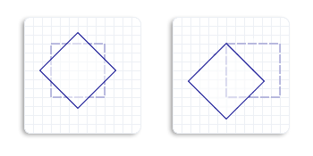

# How to Rotate an Object

This topic describes how to rotate an object about a specified point. To rotate an object, call [**Matrix3x2F::Rotation**](/windows/win32/api/d2d1helper/nf-d2d1helper-matrix3x2f-rotation) method. This method takes two parameters, the specified angle and the center point. The angle is a clockwise rotation angle in degrees, and the center point is the point about which the object rotates. The center point is expressed in the coordinate system of the object that is transformed.

For example, the following code rotates a square clockwise 45 degrees about the center of the square.


```C++
    // Create a rectangle.
    D2D1_RECT_F rectangle = D2D1::Rect(438.0f, 301.5f, 498.0f, 361.5f);

    // Draw the rectangle.
    m_pRenderTarget->DrawRectangle(
        rectangle,
        m_pOriginalShapeBrush,
        1.0f,
        m_pStrokeStyleDash
        );

    // Apply the rotation transform to the render target.
    m_pRenderTarget->SetTransform(
        D2D1::Matrix3x2F::Rotation(
            45.0f,
            D2D1::Point2F(468.0f, 331.5f))
        );

    // Fill the rectangle.
    m_pRenderTarget->FillRectangle(rectangle, m_pFillBrush);

    // Draw the transformed rectangle.
    m_pRenderTarget->DrawRectangle(rectangle, m_pTransformedShapeBrush);

```


The following illustration shows the effect of applying the preceding rotation transformation to the square. The original square is a dotted outline, and the rotated square is a solid outline.


The following illustration shows the effect of rotating by the same angle about a different center point. Notice that the rotated objects are in different positions relative to the original. The left outlined square is the result of rotating about the center of the original square, and the right outlined square is the result of rotating about the upper-left corner of the original square.



## Related topics

<dl> <dt>

[Direct2D Reference](reference.md)
</dt> <dt>

[Direct2D Transforms Overview](direct2d-transforms-overview.md)
</dt> </dl>

 

 