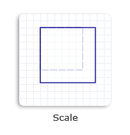

# How to Scale an Object

This topic describes how to scale an object by using the [**Matrix3x2F**](/windows/win32/api/d2d1helper/nl-d2d1helper-matrix3x2f) class. To scale an object means to make the object larger or smaller. You can call one of the following two methods to scale an object.

-   **Matrix3x2F::Scale(D2D1\_SIZE\_F scalefactor, D2D1\_POINT\_2F centerpoint)**
-   **Matrix3x2F::Scale(float scalex, float scaley, D2D1\_POINT\_2F centerpoint)**

The first method stores *scalex* and *scaley* as an ordered pair of floating-point values in the [**D2D1\_SIZE\_F**](/windows/desktop/Direct2D/d2d1-size-f) structure. The second method defines *scalex* and *scaley* as individual parameters.

Regardless of which method that you use, you must specify both *scalex* and *scaley* factors. The *scalex* value is the scale factor in the x direction. For example, a *scalex* value of 1.5 stretches the object to 150 percent along the x-axis. Similarly, the *scaley* value is the scale factor in the y direction. For example, a *scaley* value of 0.5 shrinks the height of the object by 50 percent along the y-axis.

To specify a point as the center of the scaling operation, use the *centerpoint* parameter. By default, an object is centered about its origin (0,0).

The following example code creates a scale transformation to increase the size of a square to 130% of its original size. The *centerpoint* is set to be the upper-left corner of the original square.


```C++
    // Create a rectangle.
    D2D1_RECT_F rectangle = D2D1::Rect(438.0f, 80.5f, 498.0f, 140.5f);

    // Draw the outline of the rectangle.
    m_pRenderTarget->DrawRectangle(
        rectangle,
        m_pOriginalShapeBrush,
        1.0f,
        m_pStrokeStyleDash
        );

    // Apply the scale transform to the render target.
    m_pRenderTarget->SetTransform(
        D2D1::Matrix3x2F::Scale(
            D2D1::Size(1.3f, 1.3f),
            D2D1::Point2F(438.0f, 80.5f))
        );

    // Paint the rectangle's interior.
    m_pRenderTarget->FillRectangle(rectangle, m_pFillBrush);

    // Draw the outline of the rectangle.
    m_pRenderTarget->DrawRectangle(rectangle, m_pTransformedShapeBrush);

```


The following illustration shows the effect of applying the scale transformation to the square. The original square is a dotted outline and the scaled square is a solid outline.



## Related topics

<dl> <dt>

[Direct2D Transforms Overview](direct2d-transforms-overview.md)
</dt> <dt>

[Direct2D Reference](reference.md)
</dt> </dl>

 

 