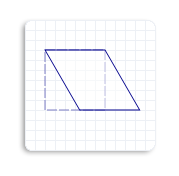
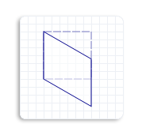
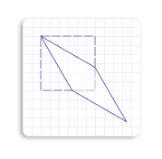

# How to Skew an Object

To skew (or shear) an object means to distort an object by a specified angle from the x-axis, the y-axis, or both. For example, when you skew a square, it becomes a parallelogram.

The [**Matrix3x2F::Skew**](/windows/win32/api/d2d1helper/nf-d2d1helper-matrix3x2f-skew) method takes 3 parameters:

-   *angleX*: The x-axis skew angle, which is measured in degrees counterclockwise from the y-axis.
-   *angleY*: The y-axis skew angle, which is measured in degrees clockwise from the x-axis.
-   *centerPoint*: The point about which the skew is performed.

To predict the effect of a skew transformation, consider that *angleX* is the skew angle measured in degrees counterclockwise from the y-axis. For example, if *angleX* is set to 30, the object skews 30 degrees counterclockwise along the y-axis about the *centerPoint*. The following illustration shows a square skewed horizontally 30 degrees about the upper-left corner of the square.



Similarly, *angleY* is a skew angle measured in degrees clockwise from the x-axis. For example, if *angleY* is set to 30, the object skews 30 degrees clockwise along the x-axis about the *centerPoint*. The following illustration shows a square skewed vertically 30 degrees about the upper-left corner of the square.



If you set both *angleX* and *angleY* to 30 degrees, and the *centerPoint* to the upper-left corner of the square, you will see the following skewed square (solid outlined). Notice that the skewed square is skewed 30 degrees counterclockwise from the y-axis and 30 degrees clockwise from the x-axis.



The following code example skews the square 45 degrees horizontally about the upper-left corner of the square.


```C++
    // Create a rectangle.
    D2D1_RECT_F rectangle = D2D1::Rect(126.0f, 301.5f, 186.0f, 361.5f);

    // Draw the outline of the rectangle.
    m_pRenderTarget->DrawRectangle(
        rectangle,
        m_pOriginalShapeBrush,
        1.0f,
        m_pStrokeStyleDash
        );

    // Apply the skew transform to the render target.
    m_pRenderTarget->SetTransform(
        D2D1::Matrix3x2F::Skew(
            45.0f,
            0.0f,
            D2D1::Point2F(126.0f, 301.5f))
        );

    // Paint the interior of the rectangle.
    m_pRenderTarget->FillRectangle(rectangle, m_pFillBrush);

    // Draw the outline of the rectangle.
    m_pRenderTarget->DrawRectangle(rectangle, m_pTransformedShapeBrush);
```


The following illustration shows the effect of applying the skew transformation to the square, where the original square is a dotted outline and the skewed object (parallelogram) is a solid outline. Notice that the skew angle is 45 degrees counterclockwise from the y-axis.


## Related topics

<dl> <dt>

[Direct2D Transforms Overview](direct2d-transforms-overview.md)
</dt> <dt>

[Direct2D Reference](reference.md)
</dt> </dl>

 

 