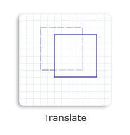

# How to Translate an Object

To translate a 2-D object is to move the object along the x-axis, the y-axis, or both. You can call either one of the following two methods to create a translation transformation.

-   [**Translation(D2D1\_SIZE\_F size)**](/windows/win32/api/d2d1helper/nf-d2d1helper-matrix3x2f-translation(d2d1_size_f)): takes an ordered pair that defines the distance to translate along the x-axis and the y-axis.
-   [**Translation(float x, float y)**](/windows/win32/api/d2d1helper/nf-d2d1helper-matrix3x2f-translation(float_float)): takes the distance to translate along the x-axis and the distance to translate along the y-axis.

The following code creates a translation transformation matrix that moves the square 20 units to the right along the x-axis and 10 units downward along the y-axis.


```C++
    // Create a rectangle.
    D2D1_RECT_F rectangle = D2D1::Rect(126.0f, 80.5f, 186.0f, 140.5f);

    // Draw the outline of the rectangle.
    m_pRenderTarget->DrawRectangle(
        rectangle,
        m_pOriginalShapeBrush,
        1.0f,
        m_pStrokeStyleDash
        );

    // Apply the translation transform to the render target.
    m_pRenderTarget->SetTransform(D2D1::Matrix3x2F::Translation(20, 10));

    // Paint the interior of the rectangle.
    m_pRenderTarget->FillRectangle(rectangle, m_pFillBrush);

    // Draw the outline of the rectangle.
    m_pRenderTarget->DrawRectangle(rectangle, m_pTransformedShapeBrush);
```


The following illustration shows the effect of applying the translation transformation to the square, where the original square is a dotted outline and the translated square is a solid outline.



## Related topics

<dl> <dt>

[Direct2D Reference](reference.md)
</dt> <dt>

[Direct2D Transforms Overview](direct2d-transforms-overview.md)
</dt> </dl>

 

 