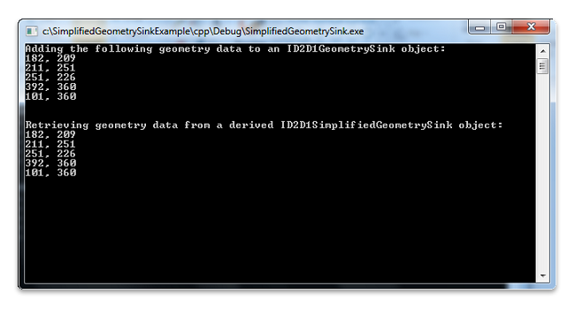

# How to Retrieve Geometry Data by Extending ID2D1SimplifiedGeometrySink

While an [**ID2D1Geometry**](/windows/win32/api/d2d1/nn-d2d1-id2d1geometry) object is immutable, there are cases where you need to manipulate the geometry data in a path geometry object. Direct2D enables you to do so by providing an extendable interface named [**ID2D1SimplifiedGeometrySink**](/windows/win32/api/d2d1/nn-d2d1-id2d1simplifiedgeometrysink). For concept illustration, this topic describes how to extend this interface to retrieve the geometry data from a path geometry object.

**To Extend the ID2D1SimplifiedGeometrySink interface**

1.  Implement a class that inherits from [**ID2D1SimplifiedGeometrySink**](/windows/win32/api/d2d1/nn-d2d1-id2d1simplifiedgeometrysink).
2.  Create an instance of that class and pass it to [**ID2D1Geometry::Simplify**](id2d1geometry-simplify.md).

The following code example shows how to implement a class named SpecializedSink that inherits from the [**ID2D1SimplifiedGeometrySink**](/windows/win32/api/d2d1/nn-d2d1-id2d1simplifiedgeometrysink) interface. For the simplicity of concept illustration, the extended **AddLines** method retrieves the geometry data and then displays it on the console window; you can customize this method to meet your specific data needs.


```C++
class SpecializedSink : public ID2D1SimplifiedGeometrySink
{
    public:
        SpecializedSink()
            : m_cRef(1)
        {
        }

        STDMETHOD_(ULONG, AddRef)(THIS)
        {
            return InterlockedIncrement(reinterpret_cast<LONG volatile *>(&m_cRef));
        }

        STDMETHOD_(ULONG, Release)(THIS)
        {
            ULONG cRef = static_cast<ULONG>(
            InterlockedDecrement(reinterpret_cast<LONG volatile *>(&m_cRef)));

            if(0 == cRef)
            {
                delete this;
            }

            return cRef;
        }

        STDMETHOD(QueryInterface)(THIS_ REFIID iid, void** ppvObject)
        {
            HRESULT hr = S_OK;

            if (__uuidof(IUnknown) == iid)
            {
                *ppvObject = static_cast<IUnknown*>(this);
                AddRef();
            }
            else if (__uuidof(ID2D1SimplifiedGeometrySink) == iid)
            {
                *ppvObject = static_cast<ID2D1SimplifiedGeometrySink*>(this);
                AddRef();
            }
            else
            {
                *ppvObject = NULL;
                hr = E_NOINTERFACE;
            }

            return hr;
        }

        STDMETHOD_(void, AddBeziers)(const D2D1_BEZIER_SEGMENT * /*beziers*/,
                                     UINT /*beziersCount*/)
        {
            // Customize this method to meet your specific data needs.
        }

        STDMETHOD_(void, AddLines)(const D2D1_POINT_2F *points, UINT pointsCount)
        {
            // Customize this method to meet your specific data needs.
            printf("\n\nRetrieving geometry data from a derived ID2D1SimplifiedGeometrySink object:\n");
            for (UINT i = 0; i < pointsCount; ++i)
            {
                printf("%.0f, %.0f\n", points[i].x, points[i].y);
            }
        }

        STDMETHOD_(void, BeginFigure)(D2D1_POINT_2F startPoint,
                                      D2D1_FIGURE_BEGIN figureBegin)
        {
        }

        STDMETHOD_(void, EndFigure)(D2D1_FIGURE_END figureEnd)
        {
        }

        STDMETHOD_(void, SetFillMode)(D2D1_FILL_MODE fillMode)
        {
        }

        STDMETHOD_(void, SetSegmentFlags)(D2D1_PATH_SEGMENT vertexFlags)
        {
        }

        STDMETHOD(Close)()
        {
            return S_OK;
        }

    private:
        UINT m_cRef;
};
```


The example then uses a set of data (182, 209), (211, 251), (251, 226), (392, 360), and (101, 360) to create a populated path geometry (**m\_pGeometry**) where data can be retrieved.


```C++
hr = m_pD2DFactory->CreatePathGeometry(&m_pGeometry);
if(SUCCEEDED(hr))
{
    ID2D1GeometrySink *pSink = NULL;

    hr = m_pGeometry->Open(&pSink);
    if (SUCCEEDED(hr))
    {
        pSink->SetFillMode(D2D1_FILL_MODE_WINDING);

        pSink->BeginFigure(
            D2D1::Point2F(101,360),
            D2D1_FIGURE_BEGIN_FILLED
            );
        D2D1_POINT_2F points[5] = {
           D2D1::Point2F(182,209),
           D2D1::Point2F(211,251),
           D2D1::Point2F(251,226),
           D2D1::Point2F(392,360),
           D2D1::Point2F(101,360),
           };

        printf("Adding the following geometry data to an ID2D1GeometrySink object:\n");
        printf("182, 209\n");
        printf("211, 251\n");
        printf("251, 226\n");
        printf("392, 360\n");
        printf("101, 360\n");

        pSink->AddLines(points, ARRAYSIZE(points));
        pSink->EndFigure(D2D1_FIGURE_END_CLOSED);
        hr = pSink->Close();
        pSink->Release();
```


Finally, the example creates a SpecializedSink object, and then calls the [**ID2D1Geometry::Simplify**](id2d1geometry-simplify.md) method, passing in the SpecializedSink object and the [**D2D1\_GEOMETRY\_SIMPLIFICATION\_OPTION\_LINES**](/windows/desktop/api/d2d1/ne-d2d1-d2d1_geometry_simplification_option) parameter, which causes any curves to be flattened into line segments.


```C++
        SpecializedSink *pSpecializedSink = NULL;

        if (SUCCEEDED(hr))
        {
            pSpecializedSink = new SpecializedSink();
            if (!pSpecializedSink)
            {
                hr = E_OUTOFMEMORY;
            }
        }

        if (SUCCEEDED(hr))
        {
            hr = m_pGeometry->Simplify(
                    D2D1_GEOMETRY_SIMPLIFICATION_OPTION_LINES, // This causes any curves to be flattened into line segments.
                    NULL, // world transform
                    pSpecializedSink
                    );


            if (SUCCEEDED(hr))
            {
                hr = pSpecializedSink->Close();
            }

            pSpecializedSink->Release();
        }
```


The program creates outputs as shown in the following screen shot.



## Related topics

<dl> <dt>

[Direct2D Reference](reference.md)
</dt> </dl>

 

 