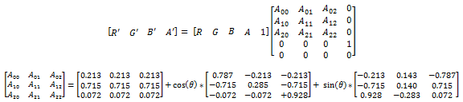

# Hue rotatation effect

Use the hue rotate effect to alter the hue of an image by applying a color matrix based on the rotation angle.

The CLSID for this effect is CLSID\_D2D1HueRotation.

-   [Example image](#example-image)
-   [Effect properties](#effect-properties)
-   [Output bitmap](#output-bitmap)
-   [Requirements](#requirements)
-   [Related topics](#related-topics)

## Example image

The example here shows the input and output images of the hue rotate effect with a rotation angle of 270 degrees.


| Before                                                       |
|--------------------------------------------------------------|
|    |
| After                                                        |
|  |


 


```C++
ComPtr<ID2D1Effect> hueRotationEffect;
m_d2dContext->CreateEffect(CLSID_D2D1HueRotation, &hueRotationEffect);

hueRotationEffect->SetInput(0, bitmap);
hueRotationEffect->SetValue(D2D1_HUEROTATION_PROP_ANGLE, 270.0f);

m_d2dContext->BeginDraw();
m_d2dContext->DrawImage(hueRotationEffect.Get());
m_d2dContext->EndDraw();
```


The effect calculates a color matrix based on the rotation angle (*?*) you specify with the D2D1\_HUEROTATION\_PROP\_ANGLE property. Here are the matrix equations.



The matrix created depends only on the rotation angle. You can use the [color matrix](color-matrix.md) effect if you need a specific matrix.

## Effect properties


| Display name and index enumeration                         | Type and default value           | Description                              |
|------------------------------------------------------------|----------------------------------|------------------------------------------|
| Angle<br/> D2D1\_HUEROTATION\_PROP\_ANGLE<br/> | FLOAT<br/> 0.0f<br/> | The angle to rotate the hue, in degrees. |


 

## Output bitmap

The output bitmap size is the same as the input bitmap size.

## Requirements


| Requirement | Value |
|--------------------------|------------------------------------------------------------------------------------|
| Minimum supported client | Windows 8 and Platform Update for Windows 7 \[desktop apps \| Windows Store apps\] |
| Minimum supported server | Windows 8 and Platform Update for Windows 7 \[desktop apps \| Windows Store apps\] |
| Header                   | d2d1effects.h                                                                      |
| Library                  | d2d1.lib, dxguid.lib                                                               |


 

## Related topics

<dl> <dt>

[**ID2D1Effect**](/windows/win32/api/d2d1_1/nn-d2d1_1-id2d1effect)
</dt> </dl>

 

